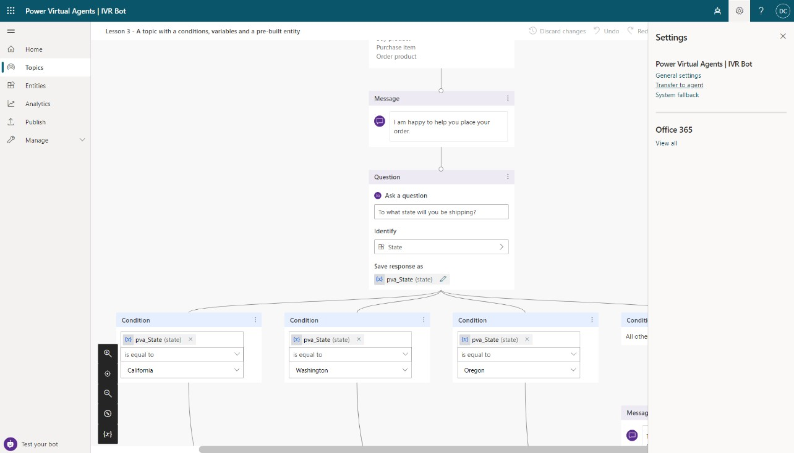
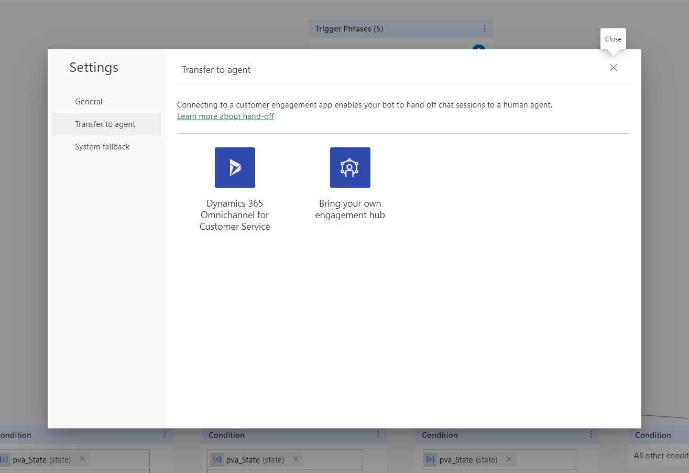
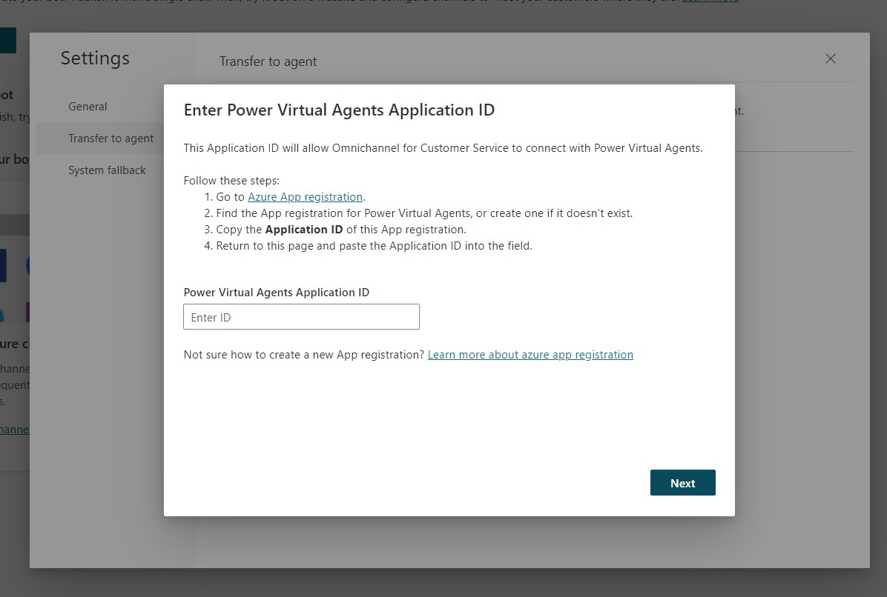
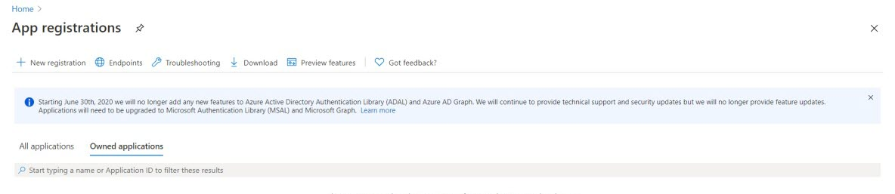
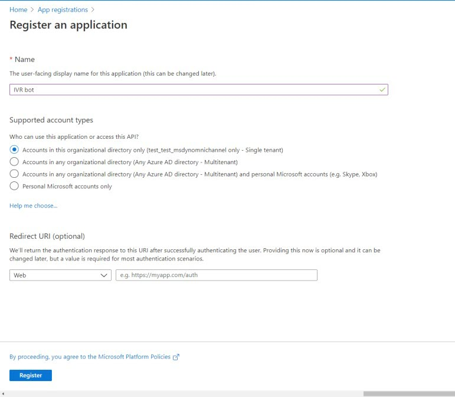
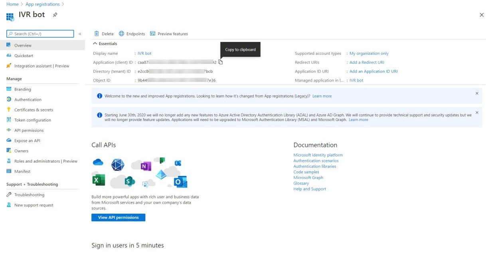
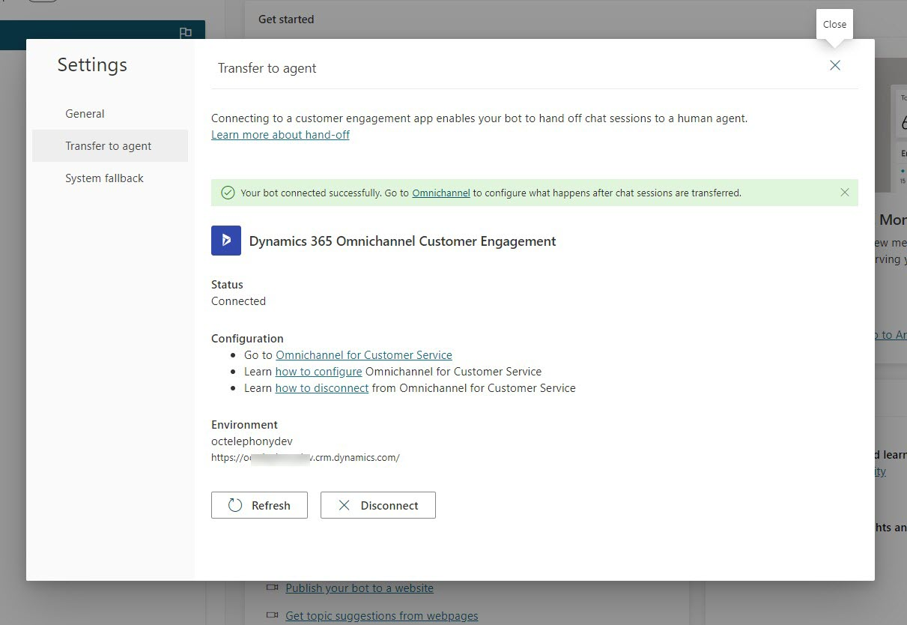

# Preview: Add conversational IVR with Power Virtual Agents

[!INCLUDE[cc-use-with-omnichannel](../includes/cc-use-with-omnichannel.md)]

> [!IMPORTANT]
> [!INCLUDE[cc-preview-feature](../includes/cc-preview-feature.md)]
>
> [!INCLUDE[cc-preview-features-definition](../includes/cc-preview-features-definition.md)]
>
> [!INCLUDE[cc-preview-features-expect-changes](../includes/cc-preview-features-expect-changes.md)]
>
> [!INCLUDE[cc-preview-features-no-ms-support](../includes/cc-preview-features-no-ms-support.md)]
>
> [!INCLUDE[cc-preview-features-send-us-feedback](../includes/cc-preview-features-send-us-feedback.md)]

## Introduction

Conversational IVR bots speak to customers when they call in to route their call to the best department, diagnose issues, collect information, and give recommendations. Using Power Virtual Agents makes it easy to author IVR bots and you can use the same bots for other channels, like chat and voice.

## Prerequisites

A bot is configured in Power Virtual Agents, published, and with the Transfer to Agent configured. More information: [Configure seamless and contextual hand-off to Omnichannel for Customer Service](/power-virtual-agents/configuration-hand-off-omnichannel)

You might need to sign into [Power Virtual Agents](https://powerva.microsoft.com/environments) and select the right environment. More information: [Create a bot in an existing environment](/power-virtual-agents/environments-first-run-experience#create-a-bot-in-an-existing-environment).

> [!IMPORTANT]
> The bot must be created in the same Dynamics 365 environment in which you are configuring the voice channel for the bot to have speech capabilities.

    

## Configure a bot for voice

Perform the following steps to add and configure a bot in Omnichannel for Customer Service.

1. In the **Omnichannel admin center (preview)** app, go to the workstream you created for the voice channel, and then in the **Bot section,** select **Add Bot**.

1. On the **Add Bot** pane, select a bot from the **Name** box.

   > 

1. Select **Save and close**. The bot is added to the workstream.

   > 

More information:

- [Author template topics in Power Virtual Agents](/power-virtual-agents/authoring-template-topics)

- [Create topics and test your bot](https://go.microsoft.com/fwlink/?linkid=2062988)

## Additional notes

### Configure handoff from Power Virtual Agents to Omnichannel for Customer Service

To configure the handoff between Power Virtual Agents bot to Omnichannel for Customer Service:

1. In Power Virtual Agents, go to **Settings** and select **Transfer to agent**.

    

1. Connect to **Dynamics 365 Omnichannel for Customer Service**.

    

1. Select **Azure App Registration**.

    

1. Select **New registration**.

    

1. Enter the name of your bot, and then select **Register**.

    

1.  Copy the **Application ID** to the clipboard.

    

1.  Return to the Power Virtual Agents, paste the application ID into the field, and then select **Next**.

    

### See also

[Overview of the voice channel](voice-channel.md)  

[!INCLUDE[footer-include](../includes/footer-banner.md)]
