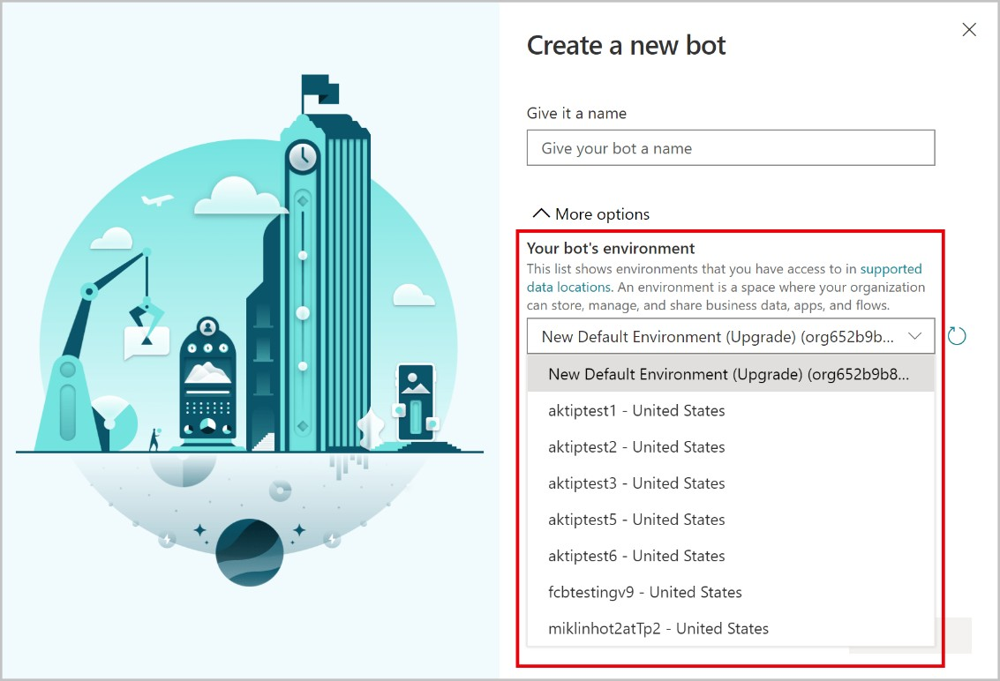
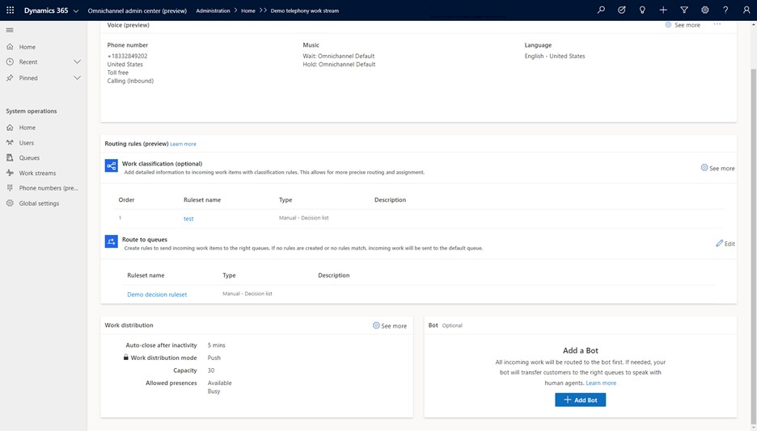
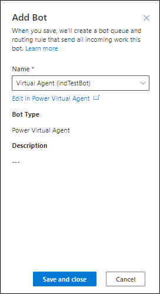
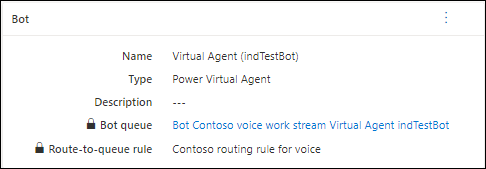

# Add conversational IVR with Power Virtual Agents

Conversational IVR bots speak to customers when they call in to route their call to the best department, diagnose issues, collect information, and give recommendations. Using Power Virtual Agents makes it easy to author IVR bots and you can use the same bots for other channels, like chat, for voice too!

## Prerequisites

A bot is configured in Power Virtual Agents, published, and with the Transfer to Agent configured. More information: Appendix C.

You might need to sign into [*Power Virtual Agents*](https://powerva.microsoft.com/environments) and select the right environment. More information: [*Create a bot in an existing environment*](https://docs.microsoft.com/en-us/power-virtual-agents/environments-first-run-experience#create-a-bot-in-an-existing-environment).

**IMPORTANT:** The bot must be created in the same Dynamics 365 environment in which you are configuring the voice channel. Creating the bot in a different environment will not allow the bot to have speech capabilities.

## Configure a bot for voice

Perform the following steps to add and configure a bot in Omnichannel for Customer Service.

1.  In the **Omnichannel admin center (preview)** app, go to the work stream you created for the voice channel, and then in the **Bot section,** select **Add Bot**.

1.  On the **Add Bot** pane, select a bot from the **Name** box.

1.  Select **Save and close**. The bot is added to the work stream.

More information:

-   [*https://docs.microsoft.com/power-virtual-agents/authoring-template-topics*](https://docs.microsoft.com/power-virtual-agents/authoring-template-topics)

-   [*Create topics and test your bot*](https://go.microsoft.com/fwlink/?linkid=2062988)

-   [*Configure hand-off to Omnichannel for Customer Service - Power Virtual Agents | Microsoft*](https://docs.microsoft.com/en-us/power-virtual-agents/configuration-hand-off-omnichannel) [*Docs*](https://docs.microsoft.com/en-us/power-virtual-agents/configuration-hand-off-omnichannel) (See [*Appendix C*](#_bookmark42)).

-   See [*Appendix B*](#_bookmark40) for known limitations and workarounds with using Power Virtual Agents as IVR.