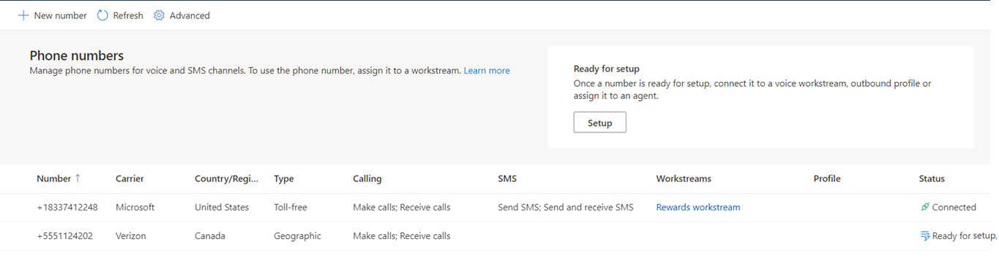
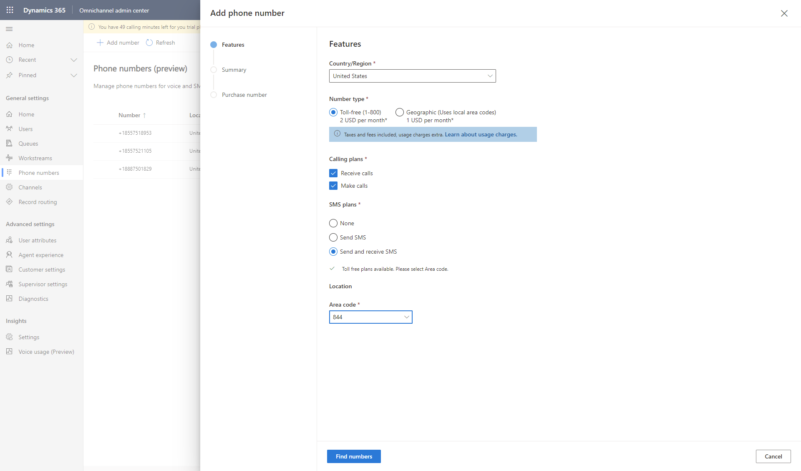
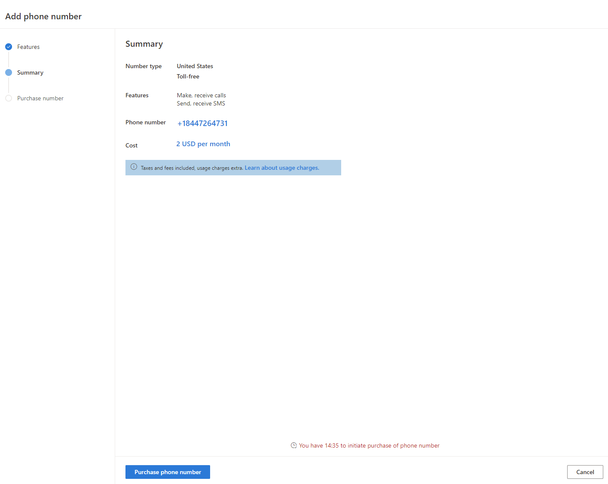

# Manage phone numbers

[!INCLUDE[cc-use-with-omnichannel](../includes/cc-use-with-omnichannel.md)]

Omnichannel for Customer Service lets you enable and use voice and SMS services seamlessly within Dynamics 365. The voice channel comes with trial phone numbers with limited free calling time. More information: [Use trial phone numbers](voice-channel-trial-phone-numbers.md)

As an administrator, you can purchase phone numbers and calling plans, decide whether you want to avail calling and SMS services, and whether you'd like to set up inbound and outbound calling options for your business. You can also bring your own phone number via Azure direct routing. More information: [Bring your own carrier](voice-channel-bring-your-own-number.md)

## Prerequisites

- Check for the following criteria:
  - [Azure subscriptions eligibility](/azure/communication-services/concepts/telephony/plan-solution#azure-subscriptions-eligibility)
  - [Service limits for Azure Communication Services](/azure/communication-services/concepts/service-limits#acquiring-phone-numbers)
  - [Country or region availability](/azure/communication-services/concepts/telephony/plan-solution#countryregion-availability)
- [Deploy the voice channel in Omnichannel for Customer Service](voice-channel-install.md).
- [Connect to Azure Communication Services using an existing or new Azure resource](voice-channel-acs-resource.md), and then deploy the resource through Dynamics 365.
- Verify that you have permissions on the secure columns. More information: [Configure permissions to access secure columns](add-users-assign-roles.md#configure-permissions-to-access-secure-columns)

> [!IMPORTANT]
> You can purchase one phone number per tenant for Azure Communication Services via the Azure Portal. However, if you'd like to acquire numbers in bulk or request a specific phone number, follow the instructions to create a special number request order [here](https://github.com/Azure/Communication/blob/master/special-order-numbers.md).

## View phone numbers

1. To view the available phone numbers in your organization, go to one of the apps in Dynamics 365, and do the following:

      ### [Customer Service admin center](#tab/customerserviceadmincenter)

      1. In the site map, select **Channels** in **Customer support**. The **Channels** page appears.
    
      2. Select **Manage** for **Phone numbers**.

      ### [Omnichannel admin center](#tab/omnichanneladmincenter)

      - In the site map, select **Phone numbers** in **General settings**.

You'll see a list of all available phone numbers together with their carrier name, calling plan details, associated workstream, connection status, and other details.

   > [!div class="mx-imgBorder"]
   > 

If you don't have any phone numbers set up for your business, see **Acquire new phone numbers** to learn how you can purchase new numbers.

   > [!NOTE]
   > If your direct routing phone number is in the inactive state, delete the number and add it again.

## Acquire new phone numbers

You can purchase new phone numbers for your organization after you've checked for the prerequisites, installed the voice channel, and have successfully connected to an Azure Communication Services resource.

1. In Dynamics 365, go to one of the apps, and perform the following steps.
   
   ### [Customer Service admin center](#tab/customerserviceadmincenter)

   1. In the site map, select **Channels** in **Customer support**. The **Channels** page appears.
    
   2. Select **Manage** for **Phone numbers**.

   ### [Omnichannel admin center](#tab/omnichanneladmincenter)

   - In the site map, select **Phone numbers** in **General settings**.
    
1. On the **Phone numbers** page, select **New number**. The **Add phone number** dialog opens.

1. On the **Features** page, do the following:

   a. Select **Country/Region** from the dropdown list. The list of available plans for the selected country or region appears.

   b. Select the **Number type**, whether **Toll-free** or **Geographic**. More information: [Number types and features](/azure/communication-services/concepts/telephony/plan-solution#azure-subscriptions-eligibility)

   c. Select the **Calling plans**&mdash;**Receive calls**, **Make calls**, or both.

   d. Select any one of the **SMS plans**&mdash;**None**, **Send SMS**, or **Send and receive SMS**. SMS facility is currently available only on toll-free numbers.

   e. In **Location**, select the area or state code from the dropdown lists.

   f. Then, select **Find numbers** to search for available numbers in your area.
   
    > [!div class="mx-imgBorder"]
    > 

   A **Summary** with the newly allotted phone number and its details is displayed.
1. On the **Summary** page, select **Purchase phone number**. Your new phone number will be displayed after purchase and you can select **Done** to get back to the **Phone numbers** page.

    > [!div class="mx-imgBorder"]
    > 
  
   The new phone number is displayed in the numbers list with the status **Ready for setup**.

   > [!NOTE]
   >
   >  - After you're allotted a new phone number, you must purchase it within the next 15 minutes. If the time elapses, you'll have to try purchasing again.
   >  - After you select **Purchase phone number**, you can select **Close** and return to the **Phone numbers** page. The purchase happens in the background and the new phone number appears in the phone numbers list with the **Ready for setup** status.
1. (Optional) Select **Setup Workstream** to [add the phone number to a voice workstream](#add-a-phone-number-to-a-voice-workstream).

1. Select **Done** to go back to the **Phone numbers** page where you can view details of the phone number that you just acquired.

 > [!NOTE]
 > - To port your phone number into an Azure Communication Services resource, see [Port a phone number](/azure/communication-services/quickstarts/telephony/port-phone-number).  
 > - You can port your Teams number in regions where Azure Communication Services is available. Use the information in [Create a Special Order for Telephone Numbers](https://github.com/Azure/Communication/blob/master/special-order-numbers.md).

## Add a phone number to a voice workstream

After you've acquired a phone number, you must add it to a voice workstream to be able to use it. You can associate a phone number with only one voice workstream.

1. In Customer Service admin center or Omnichannel admin center, go to the **Phone numbers** page, and then select the phone number that's marked **Ready for setup** in the **Status** column.
2. Select **Setup workstream**. The **Workstreams** page with a list of all workstreams is displayed.
3. If you want to create a new workstream, select **New workstream**, and then follow the steps to [set up a voice workstream](voice-channel-inbound-calling.md#set-up-a-voice-workstream).
4. Select an existing workstream from the list.
5. Follow the steps to [configure a voice channel](voice-channel-inbound-calling.md#configure-a-voice-channel).

   The phone number is added to the workstream, and you can view the **Connected** status for the phone number on the **Phone numbers** page.

## Configure phone numbers for outbound calling

After you've purchased phone numbers and associated them with voice workstreams, you can configure them for outbound calls so your agents can actually make calls to customers. More information: [Configure the phone number for outbound calling](voice-channel-outbound-calling.md#configure-phone-numbers-for-outbound-calling)

## Configure voice channel for inbound calling

You can also enable your agents to receive customer calls, create queues for the voice channel, and set up routing rules. More information: [Set up workstreams and queues for the voice channel](voice-channel-inbound-calling.md)

## Assign phone numbers to agents

You can also assign personal phone numbers to agents, so they're able to make and/or receive calls exclusively on that number. More information: [Assign personal phone numbers to agents](voice-channel-outbound-calling.md#assign-personal-phone-numbers-to-agents)

## Edit phone numbers

If you want to change the calling plan, or upgrade the calling or SMS plans on a particular number, you can do so by editing the phone number. For example, if you hadn't selected any SMS plans, you can upgrade to the **Send SMS** or **Send and receive SMS** plans; if you had selected only the **Send SMS** option, you can now upgrade to the **Send and receive SMS** plans.

1. In Customer Service admin center or Omnichannel admin center, go to the **Phone numbers** page. The list of the available phone numbers for your business is displayed.
1. Select a phone number and then select **Edit**. The **Edit phone number** dialog with the current plan type, calling plan, and SMS plan is displayed.
1. Make any changes to your call or SMS plans, and select **Save and Close**.

> [!IMPORTANT]
>
> - You can't upgrade a phone number or change your call or SMS plans, after it's connected to a workstream.
> - You can't remove features once granted to a phone number, but you can upgrade phone number features. For example, if you chose both **Make calls** and **Receive calls** options in your calling plans, you can't change it. However, if you selected **None** for SMS plans, you can upgrade to **Send SMS** or **Send and receive SMS** plan.

## Release phone numbers

If you no longer need a phone number, you can release it from your organization's phone number list. However, before you plan to remove the phone number from your business, you must remove the number from any associated workstreams or outbound profiles. Also, if the number is assigned as a personal number to any agent, you must disable the number, and then try releasing it again.

> [!IMPORTANT]
>
> When you release a phone number, you actually delete it from Dynamics 365, so release a number only if you're sure that you don't need it at all.
> To disconnect phone numbers from an Azure Communication Services resource, see [Disconnect from Azure Communication Services resource](voice-channel-disconnect-from-acs.md).

1. In Customer Service admin center or Omnichannel admin center, go to the **Phone numbers** page. The list of the available phone numbers for your business is displayed.
2. Select a phone number and select **Release number**. The **Release number** dialog requesting you to confirm the number deletion is displayed.
3. Select **OK** if you're sure you don't need the number. The phone number is removed from your organization and is no longer displayed in the **Phone numbers** list.

## Next steps

[Set up outbound calling](voice-channel-outbound-calling.md)  
[Set up inbound calling](voice-channel-inbound-calling.md)  

### See also

[Overview of the voice channel](voice-channel.md)  
[Connect to Azure Communication Services](voice-channel-acs-resource.md)  
[Import phone numbers](voice-channel-sync-from-acs.md)  
[Disconnect from Azure Communication Services](voice-channel-disconnect-from-acs.md)  
[Block spam numbers](voice-channel-block-number.md)  
[Bring your own carrier](voice-channel-bring-your-own-number.md)  
[Integrate a third-party IVR system with voice channel](voice-channel-contextual-transfer-external-ivr.md)  
[Port a phone number](/azure/communication-services/quickstarts/telephony/port-phone-number)  
[Use trial phone numbers](voice-channel-trial-phone-numbers.md)  

[!INCLUDE[footer-include](../includes/footer-banner.md)]
