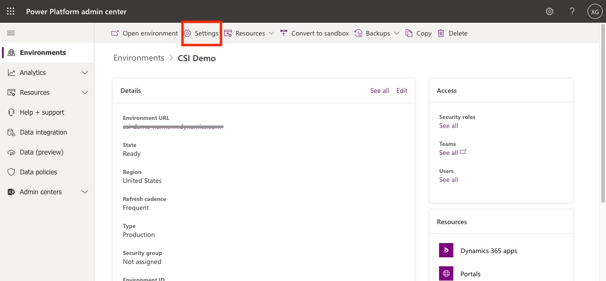
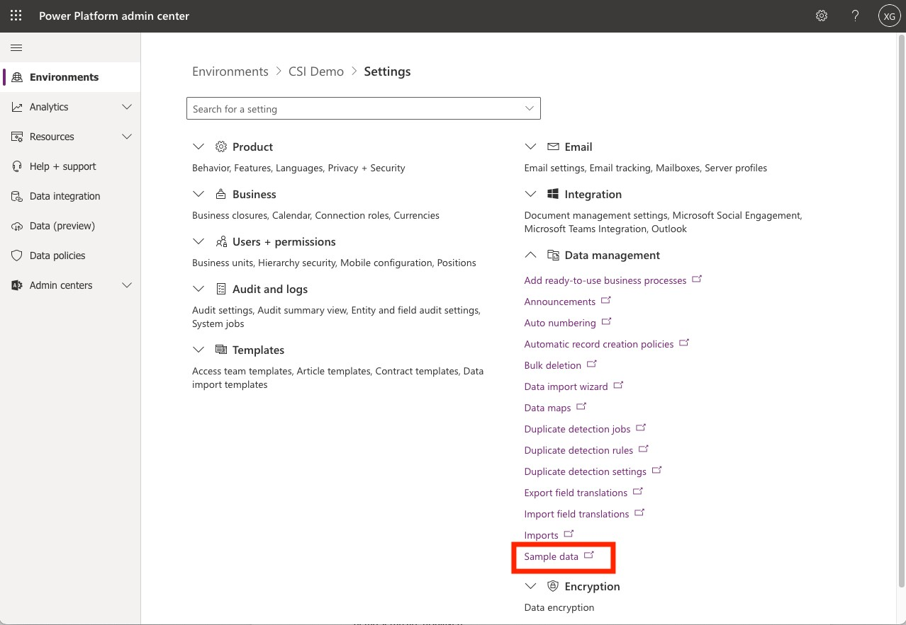
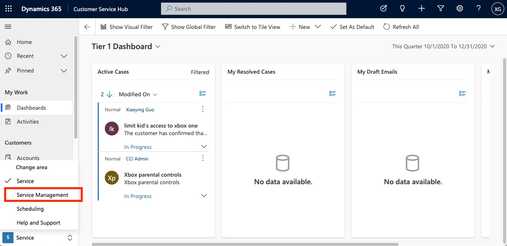
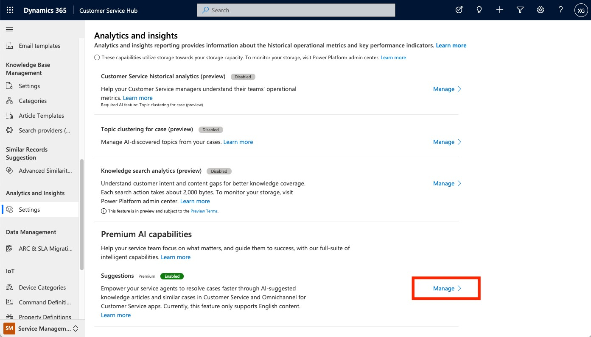
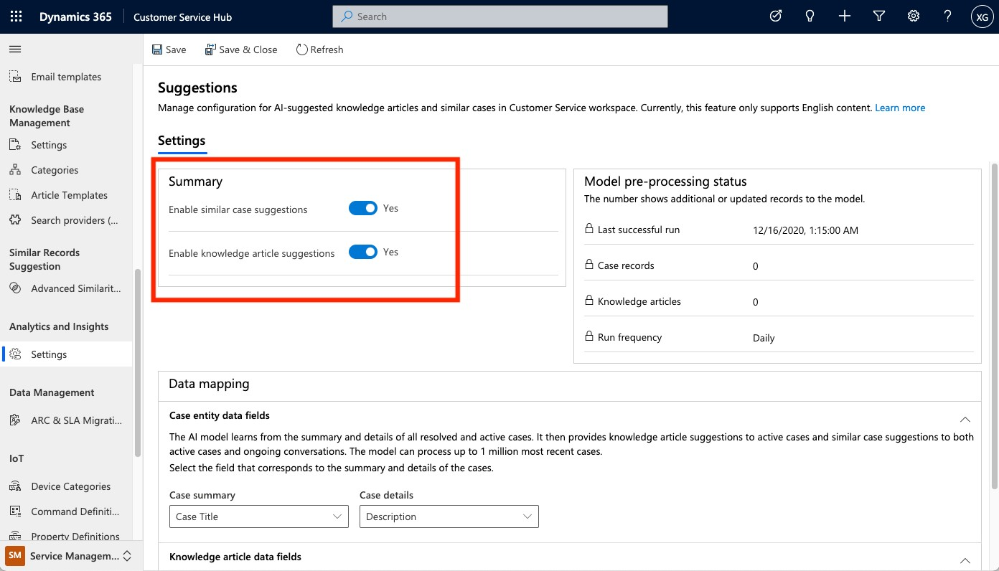

# Set up AI suggestions for similar cases and knowledge articles

With the use of AI, agents can get real-time suggestions about similar cases that were previously resolved successfully and knowledge articles that are relevant to the context of conversations. It helps agents to find the right solutions quickly, increase agent productivity, and provide better and faster service to customers. The tasks in this section take you through the steps to set up and test AI suggestions.

**Note:** AI suggestions is generally available for other channels and cases as well[.](https://docs.microsoft.com/power-virtual-agents/environments-first-run-experience) More details about this feature can be found in [*Enable AI suggestions for similar cases and knowledge articles*](https://docs.microsoft.com/en-us/dynamics365/customer-service/csw-enable-ai-suggested-cases-knowledge-articles).

## Prepare the data to serve as suggestions

To get real-time suggestions, your environment needs a few resolved cases and published knowledge articles. Use the following steps to install sample data to try out, if you don't have any data in your environment yet.

1.  Make sure you have the System Administrator security role in the environment.

2.  Sign into the **Power Platform admin center** (https://admin.powerplatform.microsoft.com/).

3.  Select **Environments** in the left navigation pane, select your environment, and then select

**Settings** on the top menu bar.

1.  Select **Data management** to expand the category, and then select **Sample data**.

1.  If sample data hasn't been installed yet, select **Install Sample Data**, and then select **Close**.

## Enable AI suggestions

1.  Sign in to Dynamics 365.

2.  On the Apps page, select **Customer Service Hub** app.

3.  In the **Change area**, select **Service Management**.

1.  Select **Analytics and Insights** &gt; **Settings**. The **Analytics and insights settings** page appears.

2.  In the **Premium AI capabilities** section, select **Manage** under **Suggestions**. The **Suggestions**

page appears.

1.  In the **Settings** &gt; **Summary** area, set the toggles to **Yes** for **Enable similar case suggestions** and

#### Enable knowledge article suggestions.

1.  Select **Save**.

## Test AI suggestions

**Note:** After you enable the settings, it might take up to 24 hours for the models to process data and complete the first-time setup.

1.  Follow the steps in **Try out voice** section to start a call.

2.  In the **Omnichannel for Customer Service** app, when the call comes in, select **Accept** on the incoming phone call to receive the call as an agent.

3.  Try the following transcript to mimic the conversation between agent and your customer:

**Agent**: "Hi, how can I assist you today?"

**Consumer**: "I want to check the shipping info. I ordered a package last week. It's supposed to be delivered this week, but I still haven't received it."

**Agent**: "Sure, I can help you with that."

1.  During the conversation, AI suggestions appear in the **Smart assist** pane when the conversation is going on.