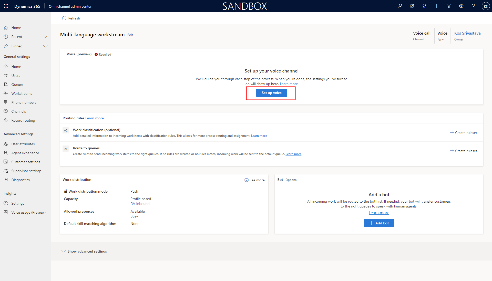

# Allow customers to choose a language

// Video: https://msit.microsoftstream.com/video/a8a20840-98dc-b561-c6c3-f1ebd85972a9

Contact centers are increasingly serving global and diverse customers that speak multiple languages.​

The tools they use need to be flexible in working across languages.

In this article we will show how to configure a phone number in a workstream allow customer to choose the language they speak and the language of the bot

## Prerequisites
- Have a phone number set up. See topic on [Number management](voice-channel-number-management.md)

> [!div class="mx-imgBorder"]
> 

- Create Queues for your business needs. For the example scenario in this article we have two Queues, English Queue and SPanish Queue based on the language fo the customer.

> [!div class="mx-imgBorder"]
> 

## Add phone number to workstream

> [!div class="mx-imgBorder"]
> 

> [!div class="mx-imgBorder"]
> 

## Select languages in phone number in workstream

Primary language is the first language the bot greets the customer in. this allows your organization to have 1 phone numebr that services multiple languages rather than having multiple phone numbers, each with one language and asking customers to call the right number.

> [!div class="mx-imgBorder"]
> 

> [!div class="mx-imgBorder"]
> 

> [!div class="mx-imgBorder"]
> 

> [!div class="mx-imgBorder"]
> 

> [!div class="mx-imgBorder"]
> 

> [!Note]
> Different music for different languages

## Create language specific routing rules

> [!div class="mx-imgBorder"]
> 

## Create a multi-language IVR bot with Azure Bot Framework

https://azure.microsoft.com/en-us/services/bot-services/

### Sample code for multi-language IVR bot

> [!Note]
> Bot author needs to set the va_CustomerLocale context variable field during IVR handoff with the Locale Code for the language they want to support. See supported Locale codes at the end of this document. 

        // Copyright (c) Microsoft Corporation. All rights reserved.
        // Licensed under the MIT License.
        using System.Collections.Generic;
        using System.Threading;
        using System.Threading.Tasks;
        using Microsoft.Bot.Builder;
        using Microsoft.Bot.Schema;

        namespace Microsoft.BotBuilderSamples.Bots
                {
                    public class EchoBot : ActivityHandler
                    {
                        // Method executed when input from a participant is received (such as someone speaking or pressing a number on their keypad)
                        protected override async Task OnMessageActivityAsync(ITurnContext<IMessageActivity> turnContext, CancellationToken cancellationToken)
                        {
                            if (turnContext.Activity.Text.Contains("agent") || turnContext.Activity.Text.Contains("Agent") || turnContext.Activity.Text.Contains("0"))
                            {
                                await turnContext.SendActivityAsync("Transferring to an agent who can help you with this.");

                                Dictionary<string, object> handOffContext = new Dictionary<string, object>()
                                {
                                    { "va_AgentMessage", "Customer wants to speak with an agent." }
                                };

                                var handoffevent = EventFactory.CreateHandoffInitiation(turnContext, handOffContext);

                                await turnContext.SendActivityAsync(handoffevent);
                            } else if (turnContext.Activity.Text.Contains("2"))
                            {
                                await turnContext.SendActivityAsync(MessageFactory.Text(spanishSelected, spanishSelectedSSML), cancellationToken);

                                Dictionary<string, object> handOffContext = new Dictionary<string, object>()
                                {
                                    { "va_CustomerLocale", "es-ES" }
                                };

                                var handoffevent = EventFactory.CreateHandoffInitiation(turnContext, handOffContext);

                            } else {
                                var english = "I didn't catch that. To speak with an agent, say agent at any time or press zero.";
                                var englishSSML = "<speak xmlns=\"http://www.w3.org/2001/10/synthesis\" xmlns:mstts=\"http://www.w3.org/2001/mstts\" xmlns:emo=\"http://www.w3.org/2009/10/emotionml\" version=\"1.0\" xml:lang=\"en-US\"><voice name=\"en-US-JennyNeural\"><prosody rate=\"0%\" pitch=\"0%\">I didn&apos;t catch that. To speak with an agent, say agent at any time or press zero.</prosody></voice></speak>";

                                var spanishGreeting = "Para Español, oprema dos."; // For Spanish press 2
                                var spanishGreetingSSML = "<speak xmlns=\"http://www.w3.org/2001/10/synthesis\" xmlns:mstts=\"http://www.w3.org/2001/mstts\" xmlns:emo=\"http://www.w3.org/2009/10/emotionml\" version=\"1.0\" xml:lang=\"es-ES\"><voice name=\"es-MX-DaliaNeural\"><prosody rate=\"0%\" pitch=\"0%\">Para Espa\u00F1ol, oprema dos.</prosody></voice></speak>";

                                await turnContext.SendActivityAsync(MessageFactory.Text(english, englishSSML), cancellationToken);
                                await turnContext.SendActivityAsync(MessageFactory.Text(spanishGreeting, spanishGreetingSSML), cancellationToken);
                            }
                        }

                        // Method executed when a participant is added. The is the inital greeting.
                        protected override async Task OnMembersAddedAsync(IList<ChannelAccount> membersAdded, ITurnContext<IConversationUpdateActivity> turnContext, CancellationToken cancellationToken)
                        {
                            var welcomeText = "Hello and welcome! To speak with an agent, say agent at any time or press zero.";
                            var welcomeSSML = "<speak xmlns=\"http://www.w3.org/2001/10/synthesis\" xmlns:mstts=\"http://www.w3.org/2001/mstts\" xmlns:emo=\"http://www.w3.org/2009/10/emotionml\" version=\"1.0\" xml:lang=\"en-US\"><voice name=\"en-US-JennyNeural\"><prosody rate=\"0%\" pitch=\"0%\">Hello and welcome! To speak with an agent, say agent at any time or press zero.</prosody></voice></speak>";

                            var spanishGreeting = "Para Español, oprema dos."; // For Spanish press 2
                            var spanishGreetingSSML = "<speak xmlns=\"http://www.w3.org/2001/10/synthesis\" xmlns:mstts=\"http://www.w3.org/2001/mstts\" xmlns:emo=\"http://www.w3.org/2009/10/emotionml\" version=\"1.0\" xml:lang=\"es-ES\"><voice name=\"es-MX-DaliaNeural\"><prosody rate=\"0%\" pitch=\"0%\">Para Espa\u00F1ol, oprema dos.</prosody></voice></speak>";

                            await turnContext.SendActivityAsync(MessageFactory.Text(welcomeText, welcomeSSML), cancellationToken);
                            await turnContext.SendActivityAsync(MessageFactory.Text(spanishGreeting, spanishGreetingSSML), cancellationToken);
                        }
                    }
                }

## Add your bot to the workstream

https://docs.microsoft.com/en-us/dynamics365/customer-service/configure-bot

> [!div class="mx-imgBorder"]
> 

## Supported locations and locale codes

| Language Name |	Locale Code |
| ---- | ---- |
| Arabic - Saudi Arabia	| ar-SA  |
| Basque - Spain | 	eu-ES  |
| Bulgarian - Bulgaria | 	bg-BG  |
| Catalan - Spain	| ca-ES  |
| Chinese - China	| zh-CN  |
| Chinese - Hong Kong | 	zh-HK  |
| Chinese - Taiwan	| zh-TW  |
| Croatian - Croatia | 	hr-HR  |
| Czech - Czech Republic	| cs-CZ  |
| Danish - Denmark	| da-DK  |
| Dutch - Netherlands | 	nl-NL  |
| English - United States | 	en-US  |
| Estonian - Estonia	| et-EE  |
| Finnish - Finland	| fi-FI  |
| French - France	| fr-FR  |
| Galician - Spain	| gl-ES  |
| German - Germany	| de-DE  |
| Greek - Greece	| el-GR  |
| Hebrew - Israel	| he-IL  |
| Hindi - India	| hi-IN  |
| Hungarian - Hungary	| hu-HU  |
| Indonesian - Indonesia	| id-ID  |
| Italian - Italy	| it-IT  |
| Japanese - Japan	| ja-JP  |
| Kazakh - Kazakhstan	| kk-KZ  |
| Korean - Korea	| ko-KR  |
| Latvian - Latvia	| lv-LV  |
| Lithuanian - Lithuania	| lt-LT  |
| Malay - Malaysia	| ms-MY  |
| Norwegian Bokmal - Norway	| nb-NO  |
| Polish - Poland	| pl-PL  |
| Portuguese - Brazil	| pt-BR  |
| Portuguese - Portugal	| pt-PT  |
| Romanian - Romania	| ro-RO  |
| Russian - Russia	| ru-RU  |
| Serbian (Cyrillic) - Serbia	| sr-Cyrl-CS  |
| Serbian (Latin) - Serbia	| sr-Latn-CS  |
| Slovak - Slovakia	| sk-SK  |
| Slovenian - Slovenia	| sl-SI  |
| Spanish - Spain	| es-ES  |
| Swedish - Sweden	| sv-SE  |
| Thai - Thailand	| th-TH  |
| Turkish - Turkey	| tr-TR  |
| Ukrainian - Ukraine	| uk-UA  |
| Vietnamese - Vietnam	| vi-VN | 

## Configuration considerations

The Azure bot should repsect the primary language of the workstream. As an example, if the primary language is English, the Azure bot should initially greet the customer in English.

## Additional Notes

### See also

[Azure cognitive services - speech to text](https://azure.microsoft.com/en-us/services/cognitive-services/text-to-speech/#features)