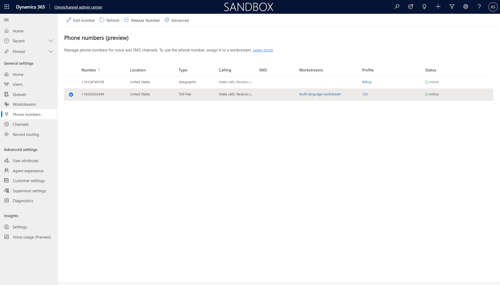
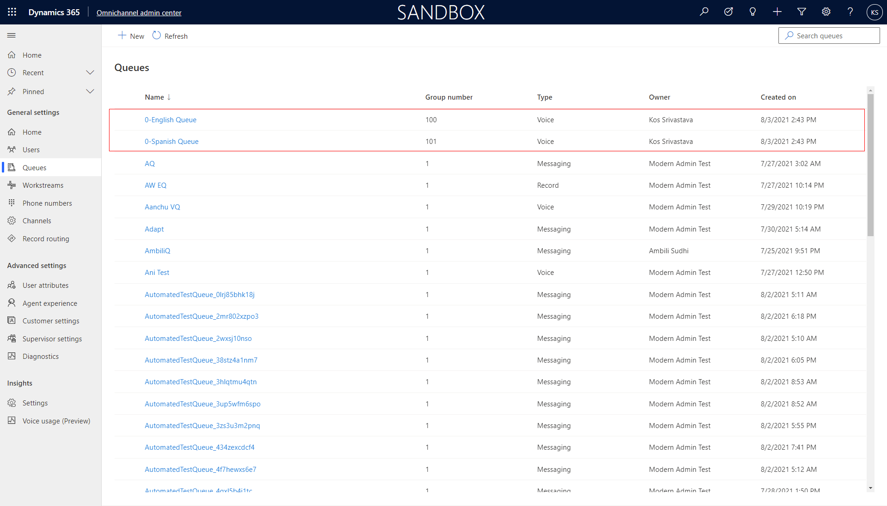
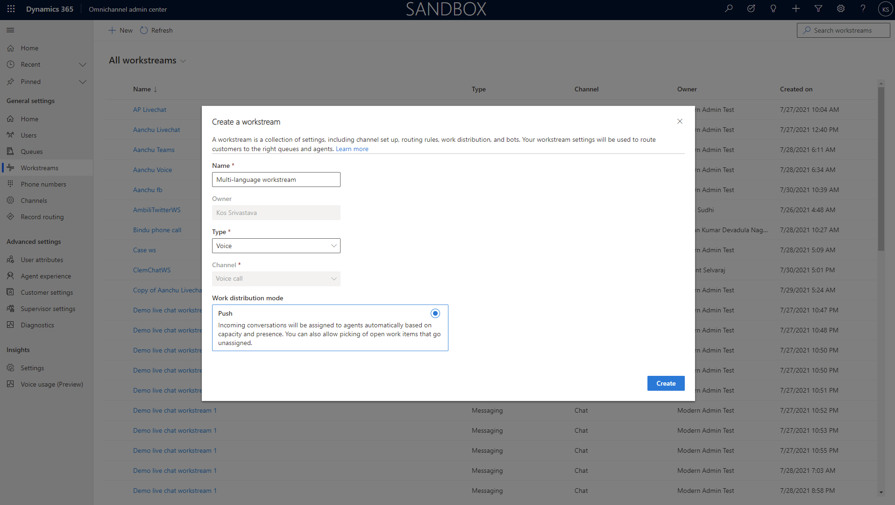
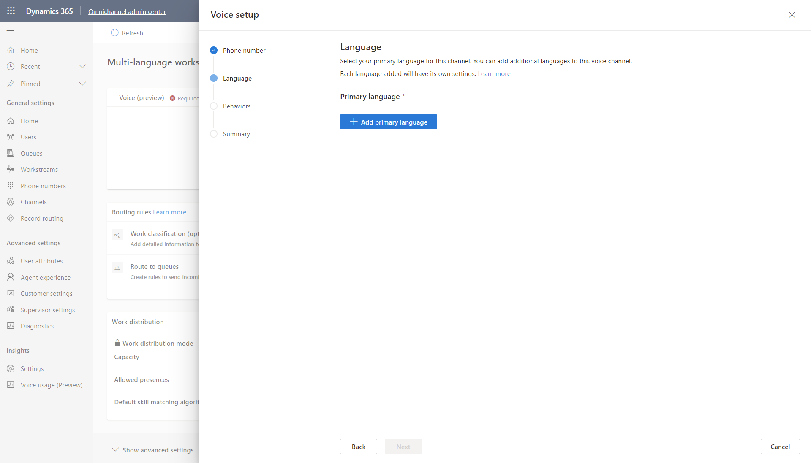
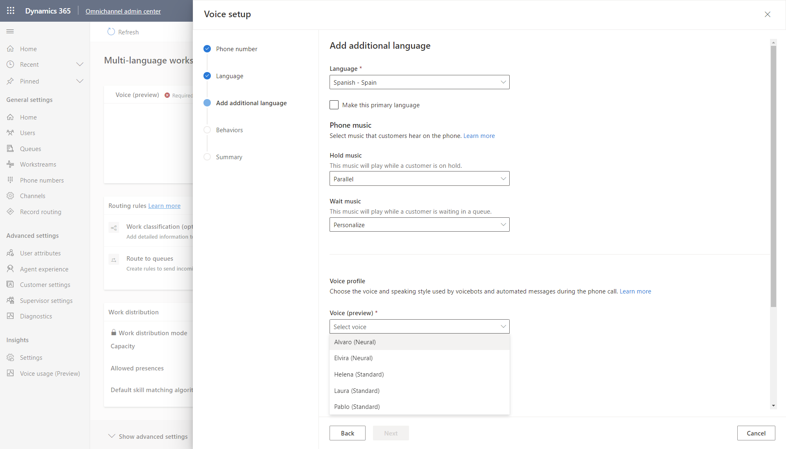
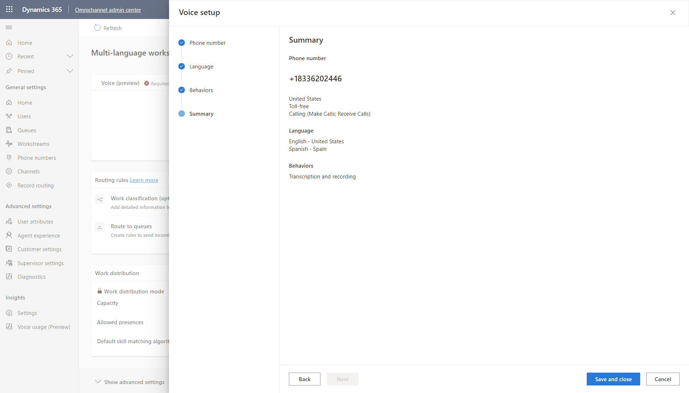
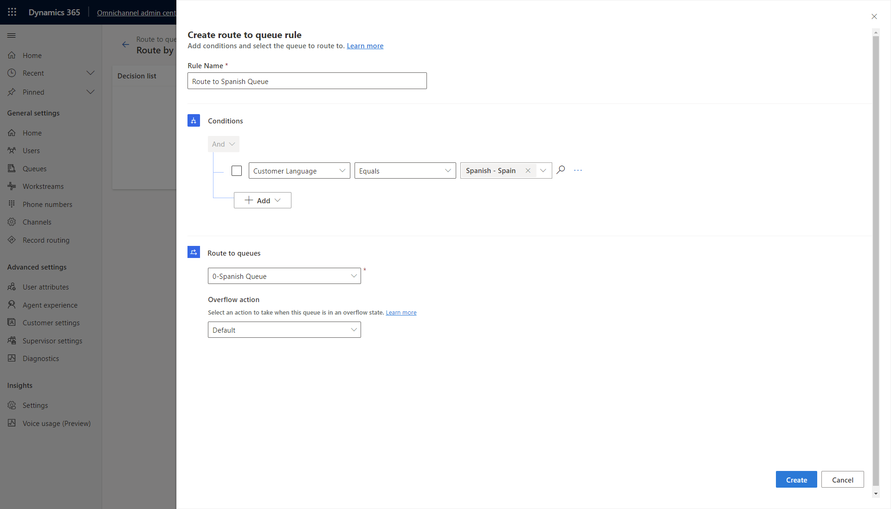
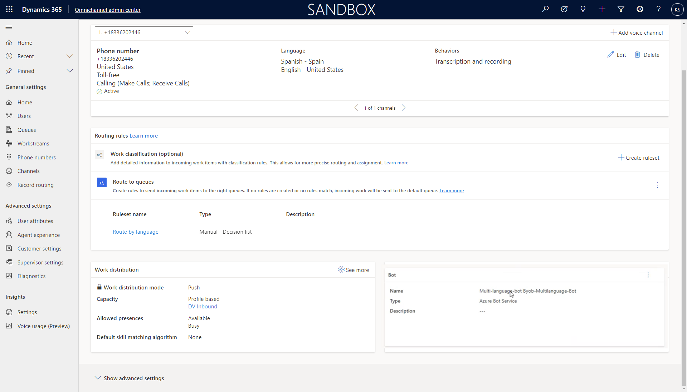

# Allow customers to choose a language

Agents are increasingly serving global and diverse customers who speak multiple languages, so it's important that the communication tools they use be able to work across languages.

You can configure a phone number in a workstream that allows the customer to choose the language in which they speak, as well as choose the language of the bot.

## Prerequisites

- Set up a phone number. More information: [Number management](voice-channel-number-management.md)

   > [!div class="mx-imgBorder"]
   > 

- Create the queues you need for your business. This example scenario shows two queues (one for English and the other for Spanish), based on the customer's language. More information: [Create and manage queues](queues-omnichannel.md)

   > [!div class="mx-imgBorder"]
   > 

- Create a workstream. For the **Type**, select **Voice**. More information: [Create and manage workstreams](create-workstreams.md)
   > [!div class="mx-imgBorder"]
   > 

## Add a phone number to the workstream

1. In Omnichannel admin center, select **Workstreams** on the sitemap, and then select the name of the workstream you want to add the phone number to. 
2. Select **Edit**, and then add the number to the workstream.

## Select languages for phone number in the workstream

The Primary language is the first language the bot greets the customer in. This allows your organization to have one phone numebr that services multiple languages, rather than have multiple phone numbers, each with one language, and then ask customers to call the right number.

In each language setting, there are options for you to select the type of wait and hold music you want the customer to hear. For example, for the primary language, you might always want to use a certain type of hold music, but for a secondary language, you might choose a different type of music.

You can also choose the voice style for the bot.

> [!div class="mx-imgBorder"]
> 

> [!div class="mx-imgBorder"]
> 

> [!div class="mx-imgBorder"]
> 

> [!div class="mx-imgBorder"]
> 

> [!div class="mx-imgBorder"]
> 

> [!Note]
> Different music for different languages

## Create language-specific routing rules

> [!div class="mx-imgBorder"]
> 

## Create a multi-language IVR bot with Azure Bot Framework

Create the bot. More information [Azure Bot Service](https://azure.microsoft.com/services/bot-services/)

### Sample code for multi-language IVR bot

> [!Note]
> Bot author needs to set the va_CustomerLocale context variable field during IVR handoff with the Locale Code for the language they want to support. See supported Locale codes at the end of this document. 

        // Copyright (c) Microsoft Corporation. All rights reserved.
        // Licensed under the MIT License.
        using System.Collections.Generic;
        using System.Threading;
        using System.Threading.Tasks;
        using Microsoft.Bot.Builder;
        using Microsoft.Bot.Schema;

        namespace Microsoft.BotBuilderSamples.Bots
                {
                    public class EchoBot : ActivityHandler
                    {
                        // Method executed when input from a participant is received (such as someone speaking or pressing a number on their keypad)
                        protected override async Task OnMessageActivityAsync(ITurnContext<IMessageActivity> turnContext, CancellationToken cancellationToken)
                        {
                            if (turnContext.Activity.Text.Contains("agent") || turnContext.Activity.Text.Contains("Agent") || turnContext.Activity.Text.Contains("0"))
                            {
                                await turnContext.SendActivityAsync("Transferring to an agent who can help you with this.");

                                Dictionary<string, object> handOffContext = new Dictionary<string, object>()
                                {
                                    { "va_AgentMessage", "Customer wants to speak with an agent." }
                                };

                                var handoffevent = EventFactory.CreateHandoffInitiation(turnContext, handOffContext);

                                await turnContext.SendActivityAsync(handoffevent);
                            } else if (turnContext.Activity.Text.Contains("2"))
                            {
                                await turnContext.SendActivityAsync(MessageFactory.Text(spanishSelected, spanishSelectedSSML), cancellationToken);

                                Dictionary<string, object> handOffContext = new Dictionary<string, object>()
                                {
                                    { "va_CustomerLocale", "es-ES" }
                                };

                                var handoffevent = EventFactory.CreateHandoffInitiation(turnContext, handOffContext);

                            } else {
                                var english = "I didn't catch that. To speak with an agent, say agent at any time or press zero.";
                                var englishSSML = "<speak xmlns=\"http://www.w3.org/2001/10/synthesis\" xmlns:mstts=\"http://www.w3.org/2001/mstts\" xmlns:emo=\"http://www.w3.org/2009/10/emotionml\" version=\"1.0\" xml:lang=\"en-US\"><voice name=\"en-US-JennyNeural\"><prosody rate=\"0%\" pitch=\"0%\">I didn&apos;t catch that. To speak with an agent, say agent at any time or press zero.</prosody></voice></speak>";

                                var spanishGreeting = "Para Español, oprema dos."; // For Spanish press 2
                                var spanishGreetingSSML = "<speak xmlns=\"http://www.w3.org/2001/10/synthesis\" xmlns:mstts=\"http://www.w3.org/2001/mstts\" xmlns:emo=\"http://www.w3.org/2009/10/emotionml\" version=\"1.0\" xml:lang=\"es-ES\"><voice name=\"es-MX-DaliaNeural\"><prosody rate=\"0%\" pitch=\"0%\">Para Espa\u00F1ol, oprema dos.</prosody></voice></speak>";

                                await turnContext.SendActivityAsync(MessageFactory.Text(english, englishSSML), cancellationToken);
                                await turnContext.SendActivityAsync(MessageFactory.Text(spanishGreeting, spanishGreetingSSML), cancellationToken);
                            }
                        }

                        // Method executed when a participant is added. The is the inital greeting.
                        protected override async Task OnMembersAddedAsync(IList<ChannelAccount> membersAdded, ITurnContext<IConversationUpdateActivity> turnContext, CancellationToken cancellationToken)
                        {
                            var welcomeText = "Hello and welcome! To speak with an agent, say agent at any time or press zero.";
                            var welcomeSSML = "<speak xmlns=\"http://www.w3.org/2001/10/synthesis\" xmlns:mstts=\"http://www.w3.org/2001/mstts\" xmlns:emo=\"http://www.w3.org/2009/10/emotionml\" version=\"1.0\" xml:lang=\"en-US\"><voice name=\"en-US-JennyNeural\"><prosody rate=\"0%\" pitch=\"0%\">Hello and welcome! To speak with an agent, say agent at any time or press zero.</prosody></voice></speak>";

                            var spanishGreeting = "Para Español, oprema dos."; // For Spanish press 2
                            var spanishGreetingSSML = "<speak xmlns=\"http://www.w3.org/2001/10/synthesis\" xmlns:mstts=\"http://www.w3.org/2001/mstts\" xmlns:emo=\"http://www.w3.org/2009/10/emotionml\" version=\"1.0\" xml:lang=\"es-ES\"><voice name=\"es-MX-DaliaNeural\"><prosody rate=\"0%\" pitch=\"0%\">Para Espa\u00F1ol, oprema dos.</prosody></voice></speak>";

                            await turnContext.SendActivityAsync(MessageFactory.Text(welcomeText, welcomeSSML), cancellationToken);
                            await turnContext.SendActivityAsync(MessageFactory.Text(spanishGreeting, spanishGreetingSSML), cancellationToken);
                        }
                    }
                }

## Add your bot to the workstream

Add the bot as an IVR bot to the workstream. More information: [Integrate an Azure bot](configure-bot.md)

> [!div class="mx-imgBorder"]
> 

## Supported locations and locale codes

| Language Name |	Locale Code |
| ---- | ---- |
| Arabic - Saudi Arabia	| ar-SA  |
| Basque - Spain | 	eu-ES  |
| Bulgarian - Bulgaria | 	bg-BG  |
| Catalan - Spain	| ca-ES  |
| Chinese - China	| zh-CN  |
| Chinese - Hong Kong | 	zh-HK  |
| Chinese - Taiwan	| zh-TW  |
| Croatian - Croatia | 	hr-HR  |
| Czech - Czech Republic	| cs-CZ  |
| Danish - Denmark	| da-DK  |
| Dutch - Netherlands | 	nl-NL  |
| English - United States | 	en-US  |
| Estonian - Estonia	| et-EE  |
| Finnish - Finland	| fi-FI  |
| French - France	| fr-FR  |
| Galician - Spain	| gl-ES  |
| German - Germany	| de-DE  |
| Greek - Greece	| el-GR  |
| Hebrew - Israel	| he-IL  |
| Hindi - India	| hi-IN  |
| Hungarian - Hungary	| hu-HU  |
| Indonesian - Indonesia	| id-ID  |
| Italian - Italy	| it-IT  |
| Japanese - Japan	| ja-JP  |
| Kazakh - Kazakhstan	| kk-KZ  |
| Korean - Korea	| ko-KR  |
| Latvian - Latvia	| lv-LV  |
| Lithuanian - Lithuania	| lt-LT  |
| Malay - Malaysia	| ms-MY  |
| Norwegian Bokmal - Norway	| nb-NO  |
| Polish - Poland	| pl-PL  |
| Portuguese - Brazil	| pt-BR  |
| Portuguese - Portugal	| pt-PT  |
| Romanian - Romania	| ro-RO  |
| Russian - Russia	| ru-RU  |
| Serbian (Cyrillic) - Serbia	| sr-Cyrl-CS  |
| Serbian (Latin) - Serbia	| sr-Latn-CS  |
| Slovak - Slovakia	| sk-SK  |
| Slovenian - Slovenia	| sl-SI  |
| Spanish - Spain	| es-ES  |
| Swedish - Sweden	| sv-SE  |
| Thai - Thailand	| th-TH  |
| Turkish - Turkey	| tr-TR  |
| Ukrainian - Ukraine	| uk-UA  |
| Vietnamese - Vietnam	| vi-VN | 

## Configuration considerations

The Azure bot should respect the primary language of the workstream. For example, if the primary language is English, the Azure bot should initially greet the customer in English.

### See also

[Introduction to the voice channel](voice-channel.md)
[Azure cognitive services - speech to text](https://azure.microsoft.com/en-us/services/cognitive-services/text-to-speech/#features)

[!INCLUDE[footer-include](../includes/footer-banner.md)]
