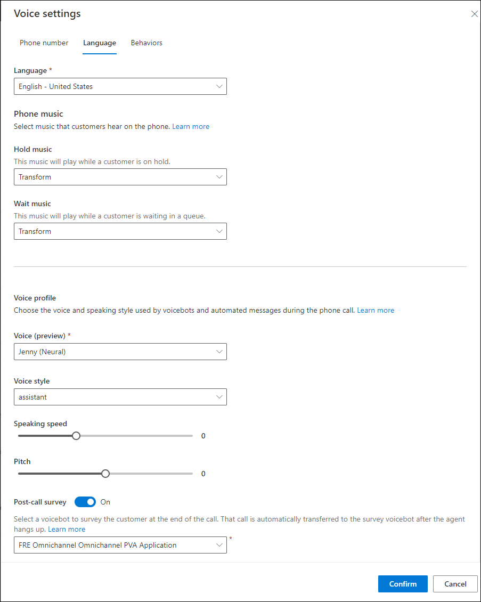

# Set up a multilingual contact center

[!INCLUDE[cc-use-with-omnichannel](../includes/cc-use-with-omnichannel.md)]

Agents are increasingly serving global and diverse customers who speak multiple languages, so it's important that the communication tools they use be able to work across languages.

You can configure a phone number in a workstream that allows the customer to choose the language in which they speak, as well as choose the language of the bot.

## Prerequisites

- Set up a phone number. More information: [Manage phone numbers](voice-channel-manage-phone-numbers.md)
  
- Create the queues you need for your business, based on the customer's language. For the **Type**, select **Voice**. More information: [Create and manage queues](queues-omnichannel.md)

- Create a workstream. For the **Type**, select **Voice**. More information: [Create and manage workstreams](create-workstreams.md)
   
## Add a phone number to the workstream and configure language settings

1. In Customer Service admin center or Omnichannel admin center, go to the voice workstreams, and then select the workstream to configure the phone number.

1. Select **Edit** next to the pencil icon, and then on the **Voice settings** page, select the number to add to the workstream, and then select **Next**.

1. On the **Language** tab, select **Add primary language**. A language page is displayed, where you set the primary language for the channel. You can add additional languages to this voice channel, and each language added will have its own settings.
   The **Primary language** is the first language the bot uses to greet the customer. This allows your organization to have one phone number that services multiple languages, rather than have multiple phone numbers, each with one language, and then ask customers to call the right number.

1. Select the type of hold and wait music you want the customer to hear.

1. In **Voice profile**, select a voice, voice style, speaking speed, and pitch for the bot.

1. Turn on the **Post-call survey** toggle if you want the bot to present a survey to the customer at the end of the call. If this feature is turned on, the call will automatically get transferred to the survey bot after the agent hangs up.

1. When you've finished configuring the settings, select **Confirm**.

   > 

## Create language-specific routing rules

Define the language-based routing rules. More information: [Configure work classification rulesets for unified routing](configure-work-classification.md)

## Considerations

Here are a few things to consider when you configure your bots for multilingual contact center.
- The language of the bot must be the same as that of the voice workstream to which the bot will be attached. 
- You can configure different geographic locales for the bot and voice workstream. For example, you can set English-UK in the voice profile and English-US in the bot.
- The bot's accuracy depends on the similarities between locales. However, if you configure different locales, the preconfigured entities for the bot, such as zipcode, might not be accurate. 

### See also

[Introduction to the voice channel](voice-channel.md)  
[Azure cognitive services - speech to text](https://azure.microsoft.com/services/cognitive-services/text-to-speech/#features)  
[Set up a multilingual bot in Power Virtual Agents](set-up-multilingual-pva-bot.md)  

[!INCLUDE[footer-include](../includes/footer-banner.md)]
