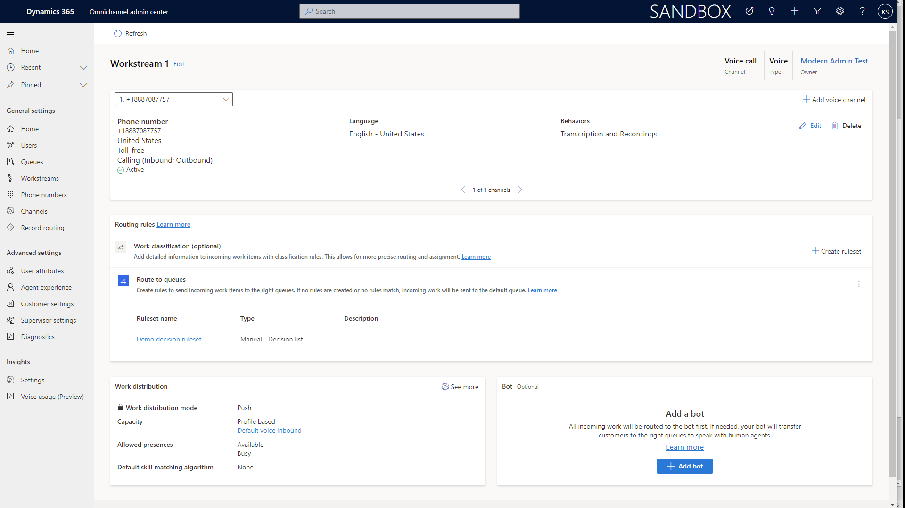
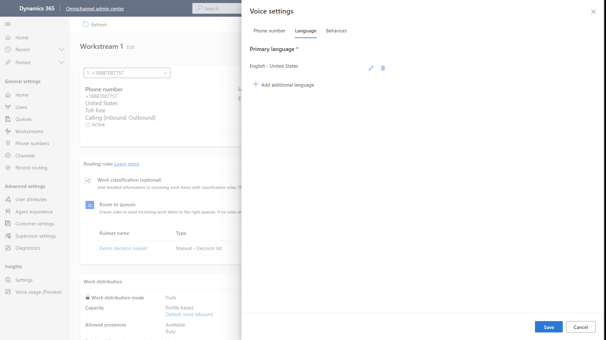
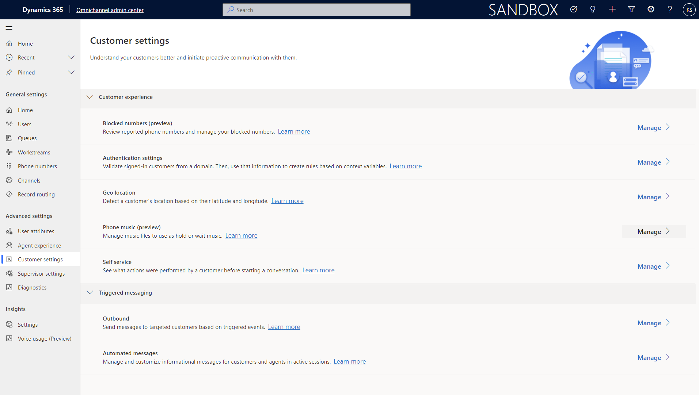
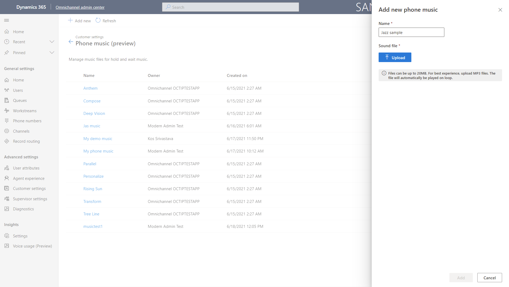

# Manage Music

## Prerequisites
> [!Note]
>

>[!TIP] 
> 

## Step 1:

> [!div class="mx-imgBorder"]
> 

> [!div class="mx-imgBorder"]
> 

> [!div class="mx-imgBorder"]
> 

> [!div class="mx-imgBorder"]
> 

> [!div class="mx-imgBorder"]
> 

## Step 2:

## Configuration considerations
## Additional Notes