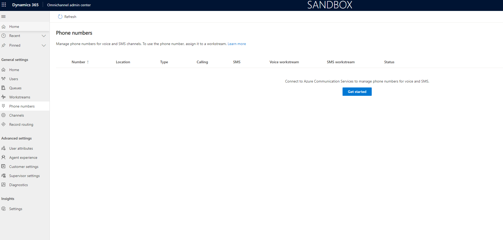
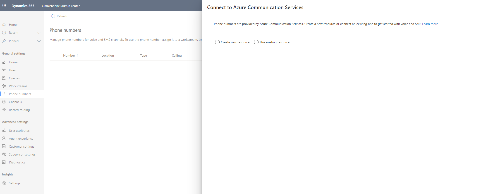
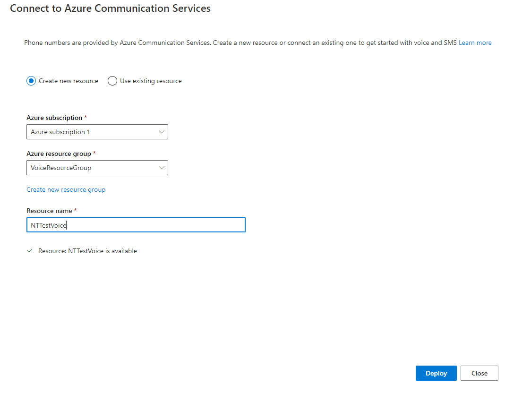
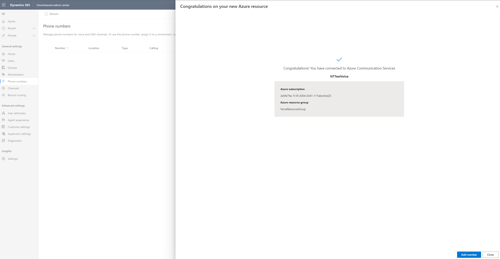

<!--
Neema Tikoo - Talks about how you can purchase numbers from within Dynamics 365. - 
Uses the "Create a new resource option"
//Video 1: https://msit.microsoftstream.com/video/08ba0840-98dc-b561-3805-f1ebd1855239

Nael Haddad/David Clarke - talks about how we simplify acquiring numbers, a one-stop shop for business admins to get new numbers, release numbers, etc using ACS.
//Video 2: https://msit.microsoftstream.com/video/dd07a1ff-0400-b564-49f4-f1eb6cbe2392

Naresh/Abhiney/Sudarshan - discusses how to use an existing resource (say you have unlinked a phone number and want to reuse it now).
Video 3: https://msit.microsoftstream.com/video/8bfc99ff-0300-b561-3feb-f1ebe379b30a
-->

# Number management

Omnichannel for Customer Services helps you enable and use voice and SMS services in a seamless, integrated way within Dynamics 365. As an administrator, you can purchase phone numbers and call plans, decide whether you want to avail call and/or SMS services, or whether you'd like to set up inbound or outbound calling options for your business.

## Use number included with the Voice Channel

The Voice channel includes a trial phone number that comes with 60 minutes of free calling. With this trial number, you don't need to connect to Azure Communication Services.
However, after the 60 minutes of free calling time elapses, you must purchase a new number based on your own Azure subscription, and cannot purchase the trial number.
## Prerequisites

- A valid Azure subscription

## Create a new phone number

To add new phone numbers to your business, you must do the following:
- Create a resource or using an existing one to connect to Azure Communication Services.
- Deploy the resource through Dynamics.
- Add a new phone number.

**To add a new phone number**

1. Open Omnichannel admin center. Under **General Settings**, select **Phone numbers**, and then select **Get started**. 
   The **Connect to Azure Communication Services** dialog opens.

2. Select **Create new resource** or **Use existing resource**.
   a. If you selected the option to create a new resource, then enter the following details:
   - Azure subscription: 
   - Azure resource group: 
   - Resource name: 
   b. If you wish to use an existing resource, see [Use existing resource](#use-existing-resource) to connect to Azure Communication Services.

3. Select **Deploy** to deploy the resource through Dynamics 365 and then select **Add number**.
   The **Add phone number** dialog opens.

4. In the **Features** section, select your country or region from the dropdown list.
   The list of available plans for that specific country or region appears.

5. *(If you selected United States as the country)* Select the Number type, whether **Toll-free** or **Geographic**.

6. Select the **Calling plans**&mdash;**Receive calls**, **Make calls**, or both.

7. Select any one of the **SMS plans**&mdash;**None**, **Send SMS**, or **Send and receive SMS**.

8. In **Location**, select the area code from the **Area** dropdown list. Then, select **Find numbers** to search for available numbers in your area.
   A summary page with the new phone number and its details is displayed.

9. Select **Purchase phone number**. Your new phone number will be displayed after purchase.

10. After you select to purchase a phone number, you can select Close

### Connect to Azure Communication Services

You can either [create a new resource](#create-a-new-resource) or [use an existing one](#use-existing-resource) to connect to Azure Communication Services. You can also use a resource that you previously disconnected or unlinked from Azure Communication Services, and reuse it now.

> [!div class="mx-imgBorder"]
> 

Say, you already have an Azure Communication Services resource that you'd like to use to connect with voice or SMS, you can use the **Use existing resource** option to connect to Azure Communication Services. Also, if you had previously unlinked a resource and wish to use it now, you can do so using this option. You can use an existing resource from any of your Azure subscriptions, available under *any* tenant. 

To create a new phone number, you need the following:
- A valid Azure subscription that's in the same tenant as your Dynamics 365 account. 
- At least contributor-level permissions to the Azure subscription. To check your role, open your subscription and view the **My role** column of your subscription on the Azure portal.

<!--
Otherwise, select the [**Use existing resource**](#use-existing-resource) option and copy and paste the relevant information from your Azure subscription. 
-->

> [!div class="mx-imgBorder"]
> 

### Create a new resource

**To create a new resource**

1. Open Omnichannel admin center. Under **General Settings**, select **Phone numbers**, and then select **Get started**.
   The **Connect to Azure Communication Services** dialog opens.

2. Select **Create new resource** or **Use existing resource**.

3. If you selected **Create new resource**, enter the following details:
   - Azure subscription: .
   - Azure resource group:
   - Resource name

4.

5.

> [!div class="mx-imgBorder"]
> 

> [!div class="mx-imgBorder"]
> 

> [!NOTE]
> The resource group name should be unique within a given subscription.

### Use existing resource

Say, you already have an Azure Communication Services resource that you'd like to use to connect with voice or SMS, you can use the **Use existing resource** option to connect to Azure Communication Services. Also, if you had previously unlinked a resource and wish to use it now, you can do so using this option. You can use an existing resource from any of your Azure subscriptions, available under *any* tenant. 

Before you proceed with adding an existing resource to Azure Communication Services, open your existing resource from the Azure portal in a new window or tab.  Select **Settings** > **Properties**, and get ready to copy the resource values (using the Copy to clipboard button) from this resource to Omnichannel admin center.

**To use an existing resource**

1. Open Omnichannel admin center. Under **General Settings**, select **Phone numbers**, and then select **Get started**. 
   The **Connect to Azure Communication Services** dialog opens. 

2. Select **Use existing resource** and enter the following details:
   - ACS Resource Name: Copy the name from your existing resource here.
   - ACS Resource ID
   - Connection String
   - Event grip app ID
   - Event grip app tenant ID

3.

4.

5.

### Add a phone number 

Features

> [!div class="mx-imgBorder"]
> 

You cannot remove feature once granted to a phone number, but you can upgrade phone number features.

Summary

> [!div class="mx-imgBorder"]
> 

Purchase Number

## Add a phone number to a workstream

You can associate a phone number with one workstream. 

**To add a workstream to a phone number**

## Edit a number

Select a phone number, click on Edit, upgrade a plan

Reasons to upgrade:
- enable Outbound
- enable SMS

You cannot remove feature once granted to a phone number, but you can upgrade phone number features.

## Release a number

Releasing a number will delete a number

## Configuration considerations

### Import existing numbers from Azure Communication Services

### Unlink resources

## Additional notes

You can only use 1 ACS resource for number management
