# Outbound calling

// Video: https://msit.microsoftstream.com/video/78a80840-98dc-b561-710e-f1ebd538f986
IT admin perspective

- You need a profile to set up an outbound profile
- outbound profile (Advanced Settings > Agent experience > Outbound profiles (preview)), you cannot delete it, you can only change it.
- Create an outbound profile - Select **Create a profile**

## Prerequisites
> [!Note]
>

## Configure a phone number for outbound calling

- Enable Make calls

> [!div class="mx-imgBorder"]
> 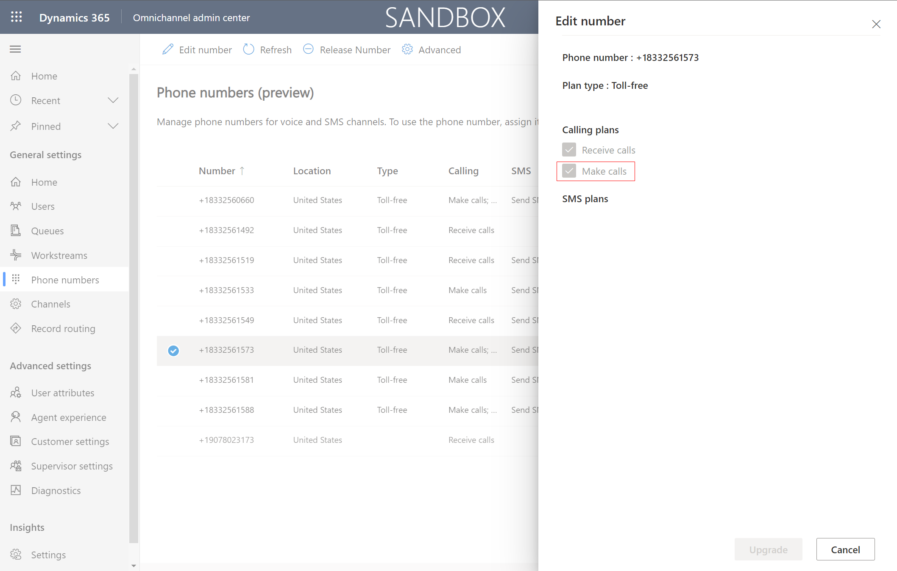

## Create a queue

- must be "voice" type queue

> [!div class="mx-imgBorder"]
> 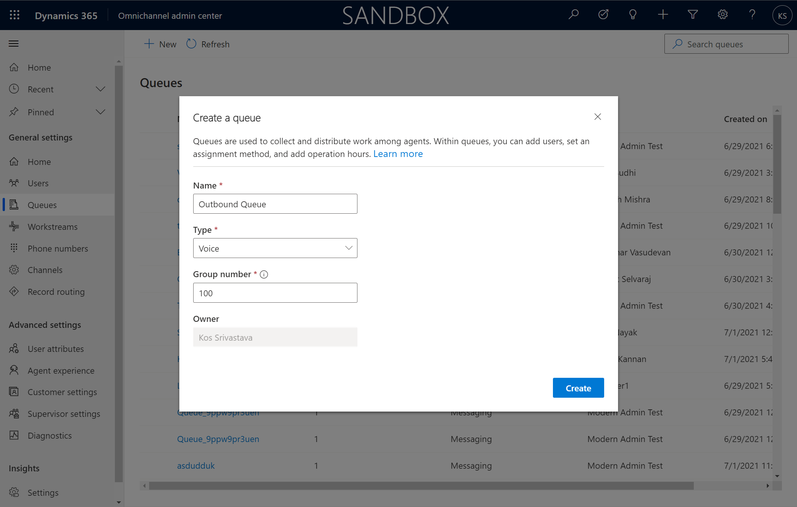

>[!TIP] 
> It it recommended to create a queue specifically for outbound calling. This helps with monitoring and reporting like outbound specific sentiment. Though it is supported for a queue to be both inbound and outbound. 

## Add a user to the queue

> [!div class="mx-imgBorder"]
> 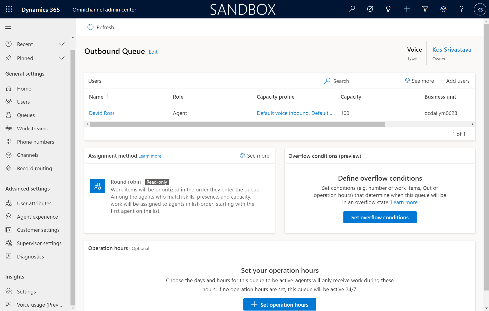

## Create a capacity profile 
- number of outbound calls a person can make at one time

> [!div class="mx-imgBorder"]
> 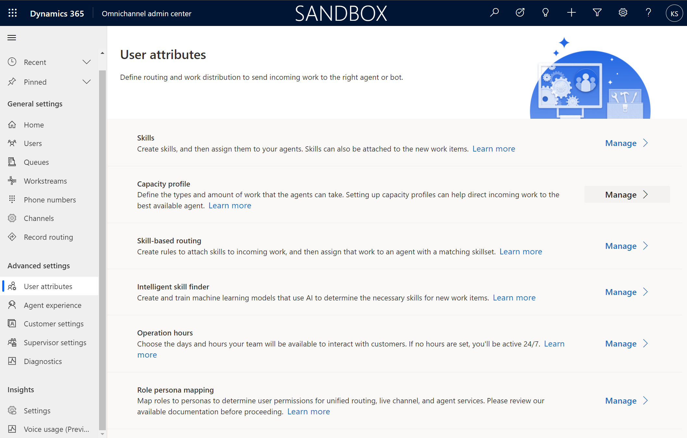

> [!div class="mx-imgBorder"]
> 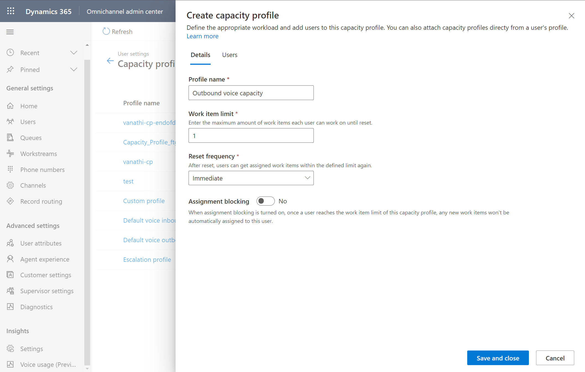

## Assign a user the capacity profile 

> [!div class="mx-imgBorder"]
> 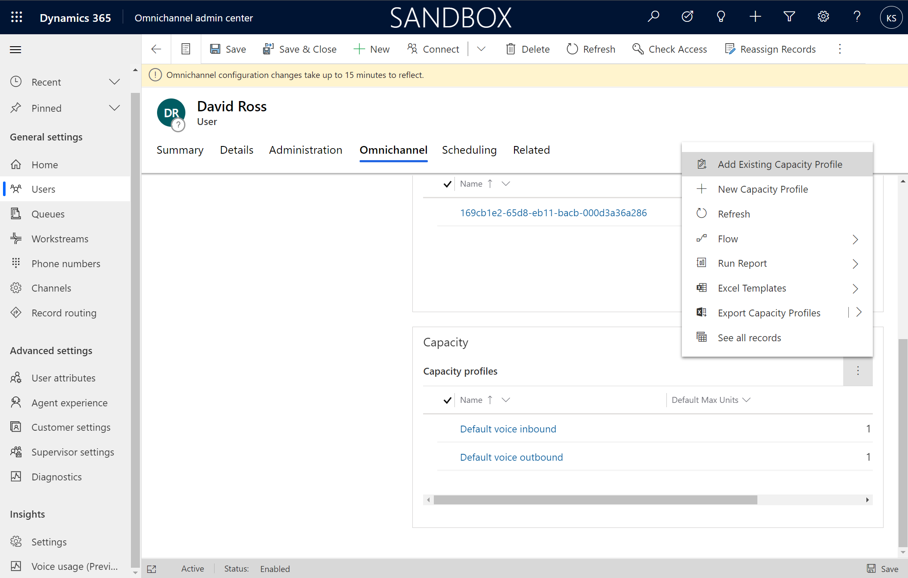

> [!div class="mx-imgBorder"]
> 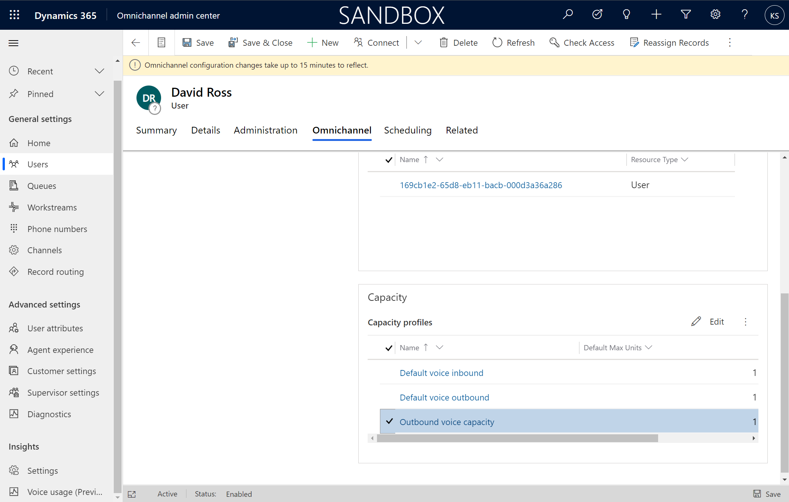

## Create an Outbound profile

> [!div class="mx-imgBorder"]
> 

- The first run experience create an outbound profile by default. Only 1 outbound profile can be created and cannot be deleted. 

> [!div class="mx-imgBorder"]
> 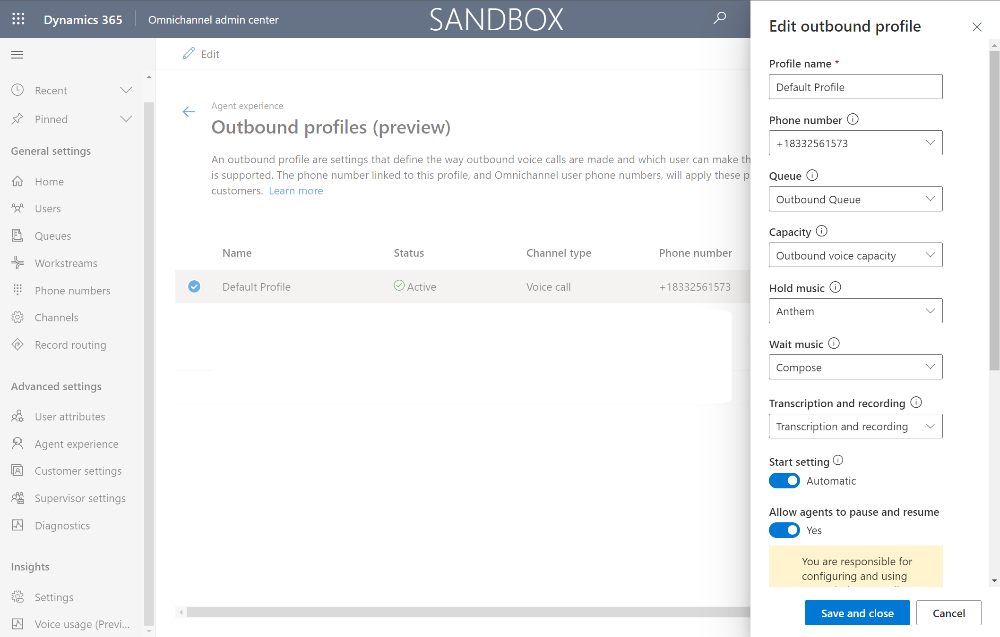

Profile Name
Phone Number - use outbound calling phone number. shows in caller ID.
Queue
Capacity
Hold Music
Wait music
Transcription and recording
Start setting
Allow agents to pause and resume

Advanced Settings

Session-default

Notification-consult

Notification - transfer

See the topic on [Message session templates](https://docs.microsoft.com/dynamics365/app-profile-manager/session-templates) for more details.

## Call a customer

> [!div class="mx-imgBorder"]
> 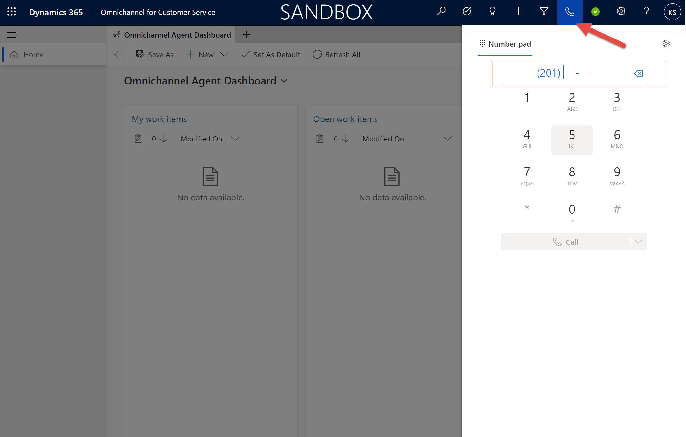

> [!div class="mx-imgBorder"]
> 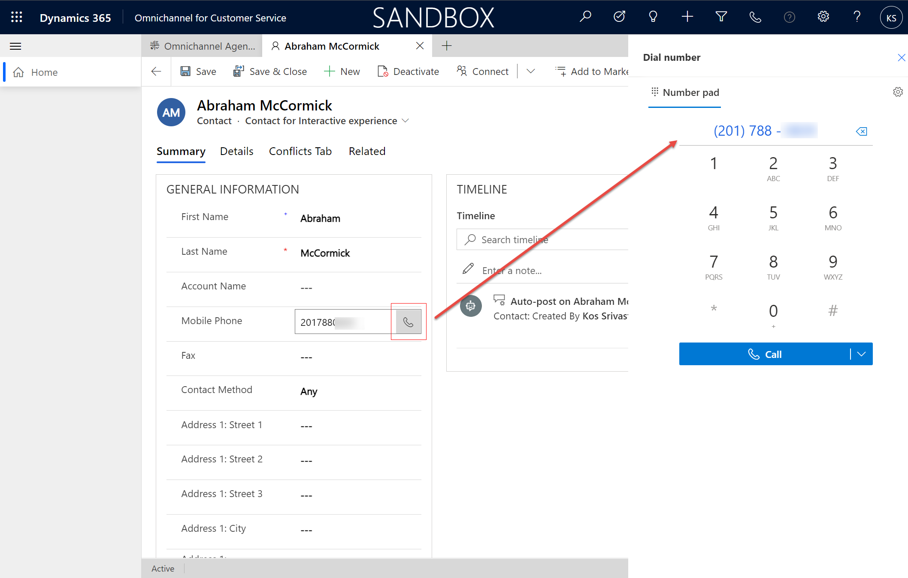

## Configuration considerations

### Call backs

Oftentimes agents need to call customers back at a later time. It is recommended to create a phone call activity with direction set to Outbound as a reminder for the agent. 

> [!div class="mx-imgBorder"]
> 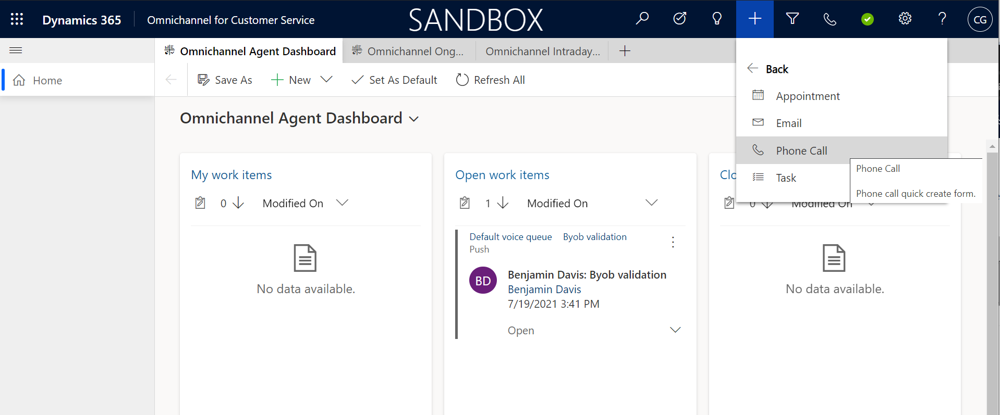

> [!div class="mx-imgBorder"]
> 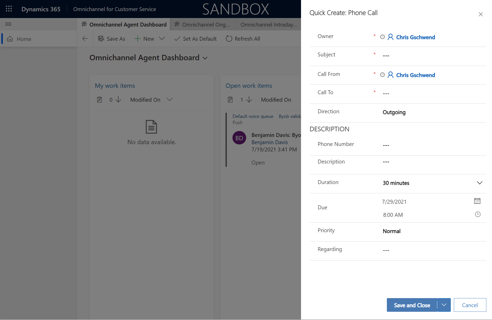

> [!div class="mx-imgBorder"]
> 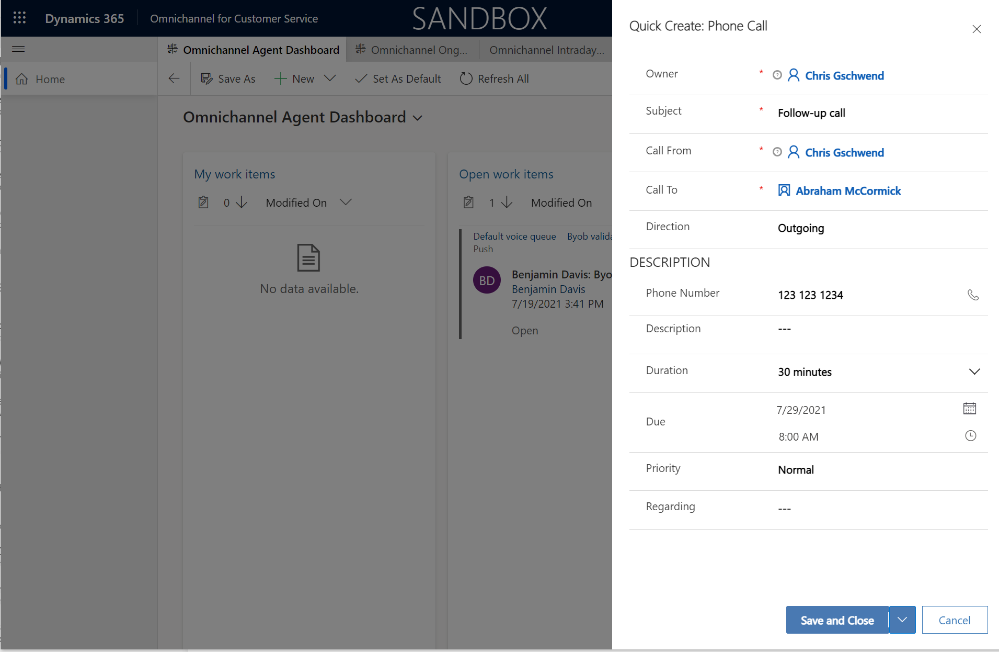

> [!div class="mx-imgBorder"]
> 

> [!div class="mx-imgBorder"]
> 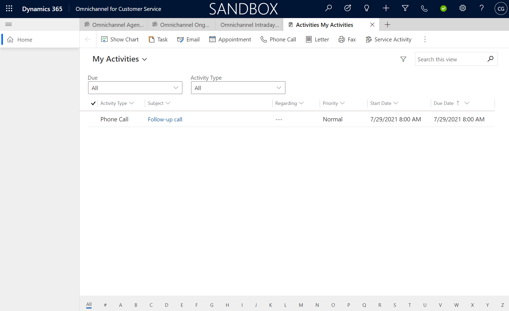

> [!div class="mx-imgBorder"]
> 

## Additional Notes

### Understanding outbound queues

By creating an outbound queue, this allows managers to see outbound calls in the Omnichannel Ongoing Conversations Dashboard. Not used for capacity planning, used for monitoring and reporting. 