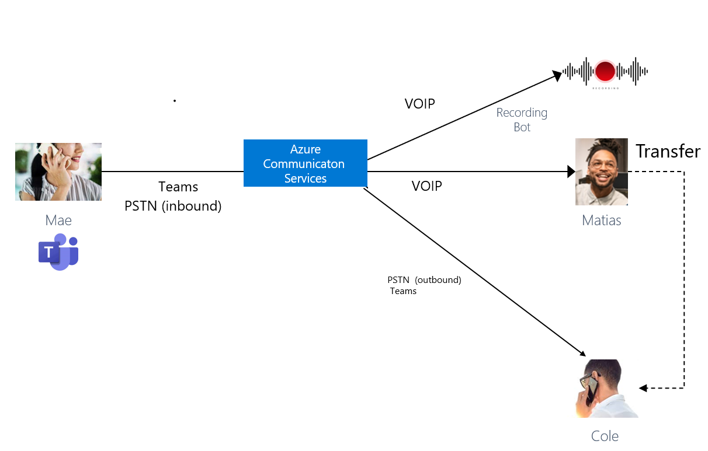
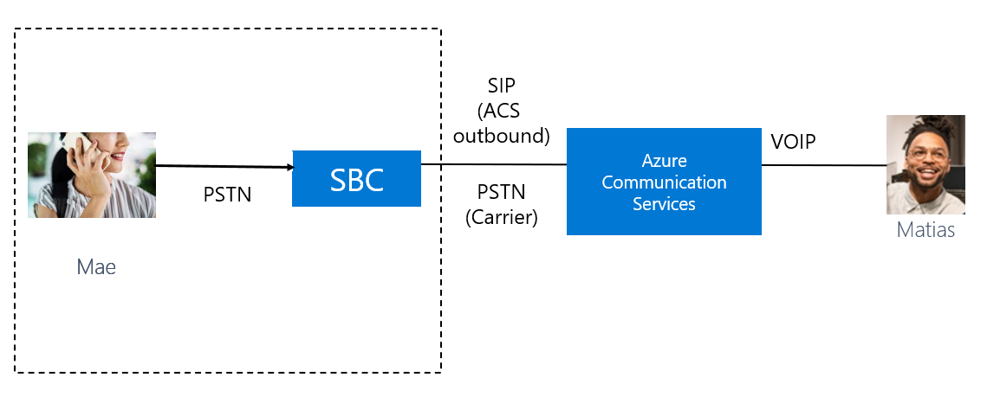

# Voice calling pricing scenarios

With the voice channel, Customer Service provides agents with the ability to receive and make public switched telephone network (PSTN) calls through a native calling experience.

As you plan to configure and use the voice channel for your business needs you'd want to understand the pricing and billing models, so you can optimize your costs. The voice channel is built over Azure Communication Services. Azure Communication Services allows you to use phone numbers to make voice calls and send SMS messages with the PSTN.

Prices for Azure Communication Services are based on a pay-as-you-go model. Each participant of the call counts in billing for each minute they're connected to the call, irrespective of the call being a video call, voice call, or screen-sharing.

Calling and screen-sharing services are charged on a per minute per participant basis at $0.004 per participant per minute for group calls. Azure Communication Services doesn't charge for data egress. To understand the various call flows that are possible, see: [Call flow basics](/azure/communication-services/concepts/call-flows)

For more information about licenses and pricing, see: [Dynamics 365 licensing guide](https://go.microsoft.com/fwlink/p/?LinkId=866544).

## Pricing scenarios

### Inbound: Customer calls from a mobile, call is escalated to a human agent from an IVR bot

Mae calls your US toll-free number (acquired from Azure Communication Services) from her mobile. The call is routed to a Power Virtual Agents IVR bot. Mae interacts with the bot for two minutes. The bot then escalates the call to a human agent, Matias. The call lasts for eight minutes.

   > [!div class=mx-imgBorder]
   > 

**Cost calculations**

- One participant on PSTN (inbound from Mae)x 10 minutes x 0.022 per participant per minute = $0.22
- One participant on VOIP (inbound to Power Virtual Agents bot) X 2 x $ 0.004 per minute = $0.008
  > [!NOTE]
  > The VOIP call to the Power Virtual Agents bot is not covered by the intelligent voice bot minutes included in the Voice Channel for Dynamics 365 Customer Service license.
- One participant on VOIP (inbound to Matias)x 8 x 0.004 per participant per minute= $0.032

**Total cost for the call**: $0.22 + $0.008 + $ 0.032+ $0.04= $0.26

### Inbound: Customer calls an agent from Microsoft Teams

Mae is a customer and calls your US toll-free number (acquired from Communication Services) from Microsoft Teams. The call is routed to an agent, Matias. He accepts the incoming call from Mae, and the call lasts for 20 minutes.

   > [!div class=mx-imgBorder]
   > 

**Cost calculations**

- One participant on Microsoft Teams (Inbound from Mae)x 20 minutes x rate per participant per minute*.
- One participant on the PSTN (inbound from Mae) x 20 minutes x 0.022 per participant per minute = $0.44
- One participant on VOIP (inbound to Matias) x 20 x 0.004 per participant per minute= $0.08

*Mae's participation is covered by her Teams license

**Total cost for the call**: $0.44 + $0.08 = $0.52 + applicable Teams charges

### Inbound: Customer calls through Microsoft Teams, Supervisor joins the call to monitor the conversation

Mae calls your US toll-free number (acquired from Azure Communication Services) from Teams. The call is routed to an agent, Matias. He accepts the incoming call from Mae and starts recording. Gaby, Matias's supervisor decides to join in to monitor the conversation. The call lasts for 10 minutes. The recording stops when the call ends.

  > [!div class=mx-imgBorder]
   > 

**Cost calculations**

- One participant on Microsoft Teams (from Mae) x 10 minutes x rate per participant per minute*.
- One participant on PSTN (inbound from Mae) x 10 minutes x 0.022 per participant per minute = $0.22
- One participant on the VOIP (inbound to Matias) x 10 x 0.004 per participant per minute= $0.04
- One participant on the VOIP (Gaby joins to monitor) x 10 x 0.004 per participant per minute= $0.04
  > [!NOTE]
  > This section is charged only when Gaby joins the call.
- Cost to record= 10 x $0.002 per minute = $0.02
- Omnichannel for Customer Service recording bot doesn't introduce extra Azure Communication Services VOIP charges.

*Mae's participation is charged based on her Teams license.

**Total cost for the call**: $0.22 + $0.04 + $ 0.04 + $0.02+ applicable Teams charges = $0.32+ applicable Teams charges

### Inbound: Customer calls from a mobile, the Supervisor is invited to consult the conversation

Mae calls your US toll-free number from Teams. The application routes the call landing to an agent, Matias. He accepts the incoming call from Mae and starts the recording. Matias invites his supervisor Gaby to join in to consult. The call lasts for 20 minutes. The recording stops when the call ends.

  > [!div class=mx-imgBorder]
   > 

**Cost calculations**

- One participant on the PSTN section (inbound from Mae) x 20 minutes x 0.022 per participant per minute = $0.44
- One participant on the VOIP section (inbound to Matias)x 20 x 0.004 per participant per minute= $0.08
- One participant on the VOIP section (Gaby joins to consult) x 10 x 0.004 per participant per minute= $0.04
    > [!NOTE]
    > This section is charged only when Gaby joins the call.
- Cost to record= 20 x $0.002 per minute = $0.04
- Omnichannel for Customer Service recording bot doesn't introduce extra Azure Communication Services VOIP charges.

**Total cost for the call**: $0.44 + $0.08 + $0.04 + $0.04 = $0.60

### Inbound: Customer calls from Microsoft Teams, call is transferred to an agent through Teams PSTN

Mae calls your US toll-free number (acquired from Azure Communication Services) from Microsoft Teams. The call is routed to an agent, Matias. He accepts the incoming call from Mae and starts the recording. Matias talks to Mae for five minutes and then transfers the call to product expert, Cole, on his Teams PSTN number. Cole speaks to Mae for another five minutes and ends the call. The recording stops when the call ends.

  > [!div class=mx-imgBorder]
   > 

**Cost calculations**

- One participant on Microsoft Teams (from Mae)x 10 minutes x rate per participant per minute*.
- One participant on the PSTN section (inbound from Mae) x 10 minutes x 0.022 per participant per minute = $0.22
- One participant on the VOIP section (inbound to Matias) x 5 x 0.004 per participant per minute= $0.02
- One participant on the PSTN section (outbound to Cole) x 5 x 0.013 per participant per minute= $0.065
- One participant on Microsoft Teams (to Cole) x 5 minutes x rate per participant per minute*.
- Cost to record= 10 x $0.002 per minute = $0.02
- Omnichannel for Customer Service recording bot doesn't incur extra Azure Communication Services VOIP charges.

*Mae's participation is charged based on her Teams license.
*Cole's participation is charged based on his Teams license.
 
**Total cost for the call**: $0.22 + $0.02 + $0.065 + $0.02 + applicable Teams charges = $0.325  + applicable Teams charges

### Outbound: Agent calls the customer

Matias is a contact center agent and makes an outbound call from Omnichannel for Customer Service to a telephone number (Mae). Matias talks to Mae for two minutes, puts her on hold to consult with his supervisor, Gaby. Matias talks to Gaby for five minutes, ends his consult, and resumes his call with Mae. The call lasts for another three minutes.

  > [!div class=mx-imgBorder]
   > 

**Cost calculations**

- One participant on the PSTN section (outbound from Matias) x 10 x 0.013 = $0.013. 
   > [!NOTE]
   > The call continues to be charged even when Matias puts it on hold.
- One participant on the VOIP section (Matias to Azure Communication Services) x 10 x 0.004 = $0.04
- One participant on the VOIP section (Matias to Gaby) x 5 x 0.004 = $0.02

**Total cost for the call**: $0.13 + $0.04 + $0.02= $0.19 

### Inbound: Azure direct routing

Mae calls your toll-free number (used in [Azure direct routing](/azure/communication-services/concepts/telephony/telephony-concept#azure-direct-routing)) from her mobile. The call is routed to an agent, Matias. Matias accepts the incoming call from Mae, and talks to her for 10 minutes. 

- Matias uses Omnichannel for Customer Service client application.
- Call goes to a Session Border Controller (SBC) connected through Communication Services direct routing 
- Omnichannel for Customer Service bot adds Matias to a call by escalating the direct routing call to a group call.
- The call lasts 10 minutes.

  > [!div class=mx-imgBorder]
   > 

**Cost calculations**

- One participant on the PSTN section (inbound from Mae)x 10 x rate per the contract with carrier;
- One participant on the PSTN section (SBC to Azure Communication Services) x 10 x rate per the contract with carrier 
- One participant on the SIP section (SBC to Azure Communication Services) x 10 x 0.004 per participant per minute= $0.04 
- One participant on the VOIP section (Inbound to Matias) x 10 x 0.004 per participant per minute= $0.04 

**Total cost for the call**: $0.04 + $0.04 + applicable carrier charges = $0.08 + applicable carrier charges 

### Outbound: Azure direct routing

Matias is a Dynamics 365 contact center agent. He makes an outbound call from Omnichannel for Customer Service to a telephone number (Mae) through Azure direct routing.

- Matias uses Omnichannel for Customer Service client application
- Omnichannel for Customer Service bot starts new outgoing call through direct routing
- Call goes to a Session Border Controller (SBC) connected through Communication Services direct routing
- Dynamics 365 Omnichannel for Customer Service bot adds Mae to a call by escalating the direct routing call to a group call 
- The call lasts 10 minutes.

  > [!div class=mx-imgBorder]
   > 

**Cost calculations**

- One participant on the PSTN section (outbound from Matias)x 10 x rate per the contract with carrier 
- One participant on the PSTN section (SBC to Azure Communication Services) x 10 x rate per the contract with carrier
- One participant on the SIP section (SBC to Azure Communication Services) x 10 x 0.004 per participant per minute= $0.04
- One participant on the VOIP section (Outbound from Matias) x 10 x 0.004 per participant per minute= $0.04

**Total cost for the call**: $0.04 + $0.04 + applicable carrier charges = $0.08  + applicable carrier charges

### See also

[Introduction to the voice channel](voice-channel.md)
[Set up outbound calling in the voice channel](voice-channel-outbound-calling.md)  
[Set up inbound calling in the voice channel](voice-channel-inbound-calling.md)  

[!INCLUDE[footer-include](../includes/footer-banner.md)]

