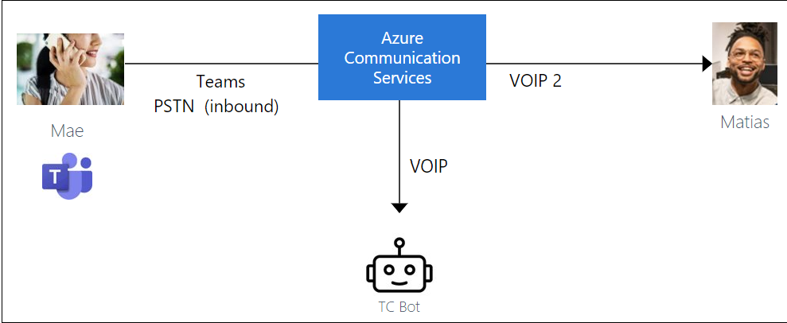
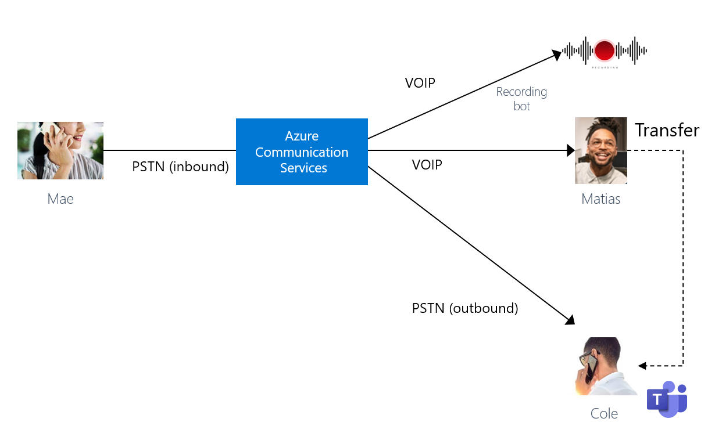
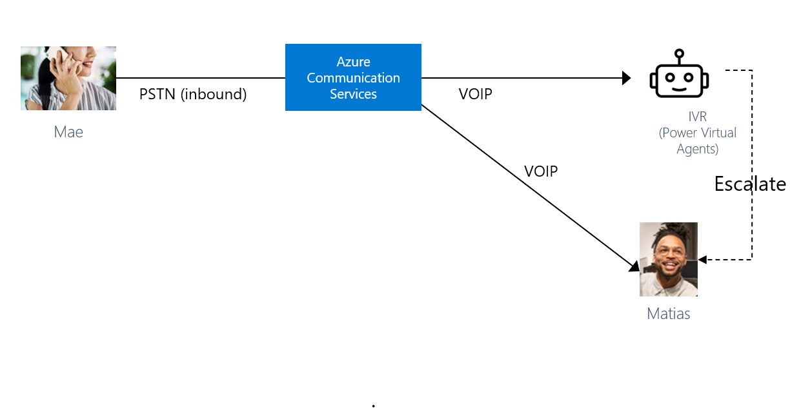
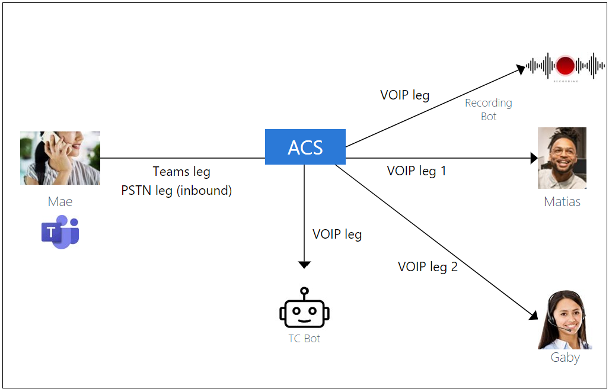
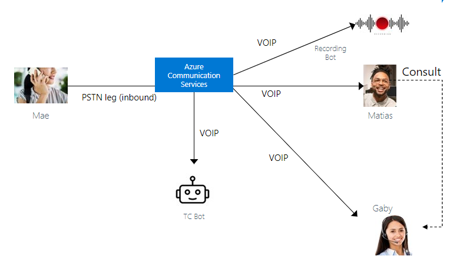
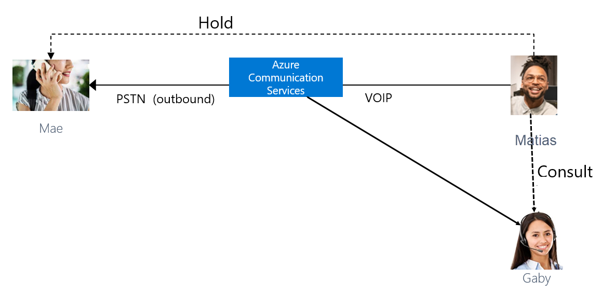

# Pricing Scenario

Voice Channel for Dynamics 365 Customer Service is an add-in application for Customer Service Enterprise licenses and brings 1st party telephony to Customer Service and is licensed per user. 

The voice channel in Omnichannel for Customer Service is built over Azure Communication Services. Prices for Azure Communication Services are based on a pay-as-you-go model. The prices in the following examples are for illustrative purposes and may not reflect the latest Azure pricing.

## Pricing

Calling and screen-sharing services are charged on a per minute per participant basis at $0.004 per participant per minute for group calls. Azure Communication Services doesn't charge for data egress. To understand the various call flows that are possible, see: [Call flow basics](/azure/communication-services/concepts/call-flows)

With the voice channel, Customer Service provides agents with the ability to receive and make public switched telephone network (PSTN) calls through a native calling experience in Dynamics 365. Each participant of the call will count in billing for each minute they're connected to the call. This holds true regardless of whether the user is video calling, voice calling, or screen-sharing.

Billing considerations also include:

- Teams meeting organizer's license covers the usage generated by Teams users joining Teams meetings and participating in calls via built-in experience in Teams web, desktop, and mobile client. The Teams license does not cover the usage generated in third-party Teams extensions and Teams apps. 

- PSTN call pricing, based on the type of number and location in which a call is terminated (destination), with few scenarios having rates based on origination location.

### Pricing example: Inbound audio call from the customer via Microsoft Teams

Mae is a customer and calls your US toll-free number (acquired from Communication Services) from Microsoft Teams. Customer Service routes the call landing on the Azure Communication Services to the agent, Matias. Matias accepts the incoming call from Mae, and the call lasts for 20 minutes.

   > [!div class=mx-imgBorder]
   > 

**Cost calculations**

- One participant on Microsoft Teams (Inbound from Mae)x 20 minutes x rate per participant per minute*.
- One participant on the PSTN (inbound from Mae)x 20 minutes x 0.022 per participant per minute = $0.44
- One participant on VOIP (inbound to Matias)x20 x 0.004 per participant per minute= $0.08
- Customer Service bot does not introduce additional ACS charges.

* Mae's participation is covered by her Teams license

**Total cost for the call**: $0.44 + $0.08 = $0.52 

### Pricing example: Customer calls through Microsoft Teams is transferred from one agent to another a phone call

Mae is a customer and calls your US toll-free number (acquired from Communication Services) from Microsoft Teams. Customer Service routes the call landing on the Azure Communication Services to the agent, Matias. Matias accepts the incoming call from Mae and starts the recording. They speak for 10 minutes after which Matias transfers the call to product expert, Cole's mobile. Cole accepts the call and talks to Mae for another 10 minutes. The recording ends after Cole ends the call.

   > [!div class=mx-imgBorder]
   > 

**Cost calculations**

- One participant on Microsoft Teams (inbound call from Mae)x 20 minutes x rate per participant per minute*.
- One participant on PSTN (inbound from Mae)x 20 minutes x 0.022 per participant per minute = $0.44
- One participant on VOIP (inbound to Matias)x 10 x 0.004 per participant per minute= $0.04
- One participant on PSTN (inbound to Cole)x 10 x 0.013 per participant per minute= $0.13
- Cost to record= 20 x $0.002 per minute = $0.04
- Omnichannel for Customer Service bot does not introduce additional ACS charges.

* Mae's participation is is charged based on her Teams license.

**Total cost for the call**: $0.44 + $0.04 + $0.04+ $ 0.13 + applicable Teams charges = $0.65 + applicable Teams charges

### Pricing example: Inbound call from the customer through a phonecall, call is escalated to a human agent from an IVR bot

Mae calls your US toll-free number (acquired from Communication Services) from her mobile. Customer Service routes the call landing on the Azure Communication Services to a Power Virtual Agents IVR bot. Mae interacts with the bot for 2 minutes. The bot then escalates the call to a human agent, Matias. The call lasts for 8 minutes.

   > [!div class=mx-imgBorder]
   > 

**Cost calculations**

- One participant on PSTN (inbound from Mae)x 10 minutes x 0.022 per participant per minute = $0.22
- One participant on VOIP (inbound to Power Virtual Agents bot) X 2 x $ 0.004 per minute = $0.008
- One participant on VOIP (inbound to Matias )x 8 x 0.004 per participant per minute= $0.032
- Omnichannel for Customer Service bot does not introduce additional ACS charges. The VOIP section to the Power Virtual Agents bot is not charged.

**Total cost for the call**: $0.22 + $0.008 + $ 0.032+ $0.04= $0.26

### Pricing example: Customer calls through Microsoft Teams, Supervisor joins the call to monitor the conversation

Mae calls your US toll-free number (acquired from Communication Services) from Teams. Customer Service routes the call landing on the Azure Communication Services to an agent, Matias. Matias accepts the incoming call from Mae and starts recording. Gaby, Matias's supervisor decides to join in to monitor the conversation. The call last for 10 minutes. The recording stops when the call ends. 

  > [!div class=mx-imgBorder]
   > 

**Cost calculations**

- One participant on Microsoft Teams (from Mae)x 10 minutes x rate per participant per minute*.
- One participant on PSTN (inbound from Mae)x 10 minutes x 0.022 per participant per minute = $0.22
- One participant on the VOIP (inbound to Matias)x 10 x 0.004 per participant per minute= $0.04
- One participant on the VOIP (Gaby joins to consult)x 10 x 0.004 per participant per minute= $0.04
  Note: This lsection is charged only when Gaby joins the call.
- Cost to record= 10 x $0.002 per minute = $0.02
- Omnichannel for Customer Service bot does not introduce additional ACS charges.

* Mae's participation is charged based on her Teams license.

**Total cost for the call**: $0.22 + $0.04 + $ 0.04 + $0.02+ applicable Teams charges = $0.32+ applicable Teams charges

### Pricing example: Customer calls from a mobile, Supervisor is invited to consult the conversation

Mae calls your US toll-free number (acquired from Communication Services) from Teams. Omnichannel for Customer Service routes the call landing on the Azure Communication Services to an agent, Matias. Matias accepts the incoming call from Mae and start the recording. Gaby, Matias's supervisor decides to join in to monitor the conversation. The call lasts for 10 minutes. The recording stops when the call ends.

  > [!div class=mx-imgBorder]
   > 

**Cost calculations**

- One participant on the PSTN section (inbound from Mae)x 20 minutes x 0.022 per participant per minute = $0.44
- One participant on the VOIP section (inbound to Matias)x 20 x 0.004 per participant per minute= $0.08
- One participant on the VOIP section (Gaby joins to consult)x 10 x 0.004 per participant per minute= $0.04
  Note: This section is charged only when Gaby joins the call.
- Cost to record= 20 x $0.002 per minute = $0.04
- Omnichannel for Customer Service bot does not introduce additional ACS charges.

**Total cost for the call**: $0.44 + $0.08 + $0.04 + $0.04 = $0.60

### Pricing example: Customer calls from a Teams account, call is transferred to an agent through Teams PSTN

Mae calls your US toll-free number (acquired from Communication Services) from her Teams. Omnichannel for Customer Service routes the call landing on the Azure Communication Services to an agent, Matias. Matias accepts the incoming call from Mae and starts the recording. Matias talks to Mae for 10 minutes and then transfers the call to product expert, Cole, on his Teams PSTN number. Cole speaks to Mae for another 5 minutes and ends the call. The recording stops when the call ends.

  > [!div class=mx-imgBorder]
   > 

**Cost calculations**

- One participant on Microsoft Teams (from Mae)x 10 minutes x rate per participant per minute*.
- One participant on the PSTN section (inbound from Mae)x 10 minutes x 0.022 per participant per minute = $0.22
- One participant on the VOIP section (inbound to Matias)x 5 x 0.004 per participant per minute= $0.02
- One participant on the PSTN section (inbound to Cole)x 5 x 0.013 per participant per minute= $0.065
- One participant on Microsoft Teams (to Cole)x 5 minutes x rate per participant per minute*.
- Cost to record= 10 x $0.002 per minute = $0.02
- Omnichannel for Customer Service bot does not introduce additional ACS charges.

* Mae's participation is charged based on her Teams license.
* Cole's participation is charged based on his Teams license.
 
**Total cost for the call**: $0.22 + $0.02 + $0.065 + $0.02  + applicable Teams charges = $0.325  + applicable Teams charges

### Pricing example: Customer calls from a Teams account, call is transferred to an agent through Teams PSTN

Matias is a Dynamics 365 contact center agent, who makes an outbound call from Omnichannel for Customer Service to a telephone number (Mae) via Azure Communication Services direct routing.

- Matias uses Omnichannel for Customer Service client application
- Omnichannel for Customer Service bot starts new outgoing call via direct routing
- Call goes to a Session Border Controller (SBC) connected via Communication Services direct routing
- Dynamics 365 Omnichannel for Customer Service bot adds Matias to a call by escalating the direct routing call to a group call 
- The call lasts 10 minutes.

  > [!div class=mx-imgBorder]
   > 

**Cost calculations**

- One participant on the PSTN section (outbound from Matias )x 10 x rate per the contract with carrier 
- One participant on the PSTN section (SBC to ACS)x 10 x rate per the contract with carrier
- One participant on the SIP section (SBC to ACS)x 10 x 0.004 per participant per minute= $0.04
- One participant on the VOIP section (Outbound from Matias) x 10 x 0.004 per participant per minute= $0.04
- Omnichannel for Customer Service bot does not introduce additional ACS charges.

**Total cost for the call**: $0.04 + $0.04 + applicable carrier charges = $0.08  + applicable carrier charges

### Pricing example: Agent calls the customer

Matias is a Dynamics 365 contact center agent, who makes an outbound call from Omnichannel for Customer Service to a telephone number (Mae) via Azure Communication Services direct routing. Matias adds Gaby to the call and puts Mae on hold. Matias removes Mae from hold and resumes the call.

  > [!div class=mx-imgBorder]
   > 

**Cost calculations**

- One participant on the PSTN section (outbound from Matias)x 10 x 0.013 = $0.013
- One participant on the VOIP section (Matias to ACS) 10 x 0.004 = $0.04
- One participant on the VOIP section (Matias to Gaby) 5 x 0.004 = $0.02
- Omnichannel for Customer Service bot does not introduce additional ACS charges.

**Total cost for the call**: $0.13 + $0.04 + $0.02= $0.19 