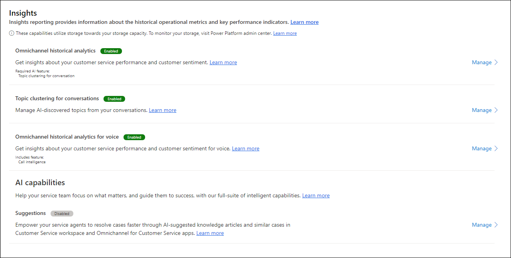

# Preview: Voice channel analytics, reports, and call insights

[!INCLUDE[cc-use-with-omnichannel](../includes/cc-use-with-omnichannel.md)]

> [!IMPORTANT]
> [!INCLUDE[cc-preview-feature](../includes/cc-preview-feature.md)]
>
> [!INCLUDE[cc-preview-features-definition](../includes/cc-preview-features-definition.md)]
>
> [!INCLUDE[cc-preview-features-expect-changes](../includes/cc-preview-features-expect-changes.md)]
>
> [!INCLUDE[cc-preview-features-no-ms-support](../includes/cc-preview-features-no-ms-support.md)]
>
> [!INCLUDE[cc-preview-features-send-us-feedback](../includes/cc-preview-features-send-us-feedback.md)]
> 
> This feature is intended to help customer service managers or supervisors enhance their team's performance and improve customer satisfaction. This feature is not intended for use in making, and should not be used to make, decisions that affect the employment of an employee or group of employees, including compensation, rewards, seniority, or other rights or entitlements. Customers are solely responsible for using Dynamics 365 Customer Service, this feature, and any associated feature or service in compliance with all applicable laws, including laws relating to accessing individual employee analytics and monitoring, recording, and storing communications with end users. This also includes adequately notifying end users that their communications with agents may be monitored, recorded, or stored and, as required by applicable laws, obtaining consent from end users before using the feature with them. Customers are also encouraged to have a mechanism in place to inform their agents that their communications with end users may be monitored, recorded, or stored.

## Overview

The Omnichannel historical analytics dashboard provides KPIs and trends for supervisors to understand the overall state of the Omnichannel for Customer Service support experience at a glance. It also provides insights on the customer sentiments derived using support-specific machine learning algorithms with an ability to slice through different levels in the organizational hierarchy, which supervisors can rely on to improve the overall customer support experience. Omnichannel historical analytics is currently in private preview as an embedded experience within Omnichannel for customer service app which helps supervisors to view the reports without leaving the Omnichannel app.

## Prerequisites

To view the rich analytics and insights for your organization, you must enable **Omnichannel historical analytics** in the Omnichannel admin center app.

1. In Omnichannel admin center, under **Insights** on the site map, select **Settings**.

2. For **Omnichannel historical analytics for voice**, select **Manage**.

3. Under **Summary**, set the **Status** toggle to **Enabled**. This enables data to be synced to Azure from Microsoft Dataverse, and provides rich analytics and insights on the data that are visualized in the Power BI report. It takes 24 hours for the reports to be provisioned for the first time. The refresh runs on a 24-hour schedule.

  > 

## View Omnichannel historical analytics dashboard for voice

After your administrator provisions analytics and insights in your organization, supervisor will be able to access the **Omnichannel historical analytics - insights** report in the Omnichannel for Customer Service app. This helps supervisors to monitor the KPIs and metrics natively in the omnichannel app.

To access the report, in the Omnichannel for Customer Service app, on the **Home** page, select the plus (**+**) icon, and then select Omnichannel historical analytics.

   > 

The report is displayed.

> [!div class="mx-imgBorder"]
> 

Omnichannel historical analytics reports provide comprehensive information on how overall support is performing across channels. The reports provide administrators and supervisors with a visualization and ability to filter across channels, queues, agents, and date ranges to help better understand performance and troubleshoot problem areas.

| Metric | Definition (historical)  |
|----------------|---------------------|
| Incoming conversation  | Number of conversations initiated by the customer and can be presented to a human agent. |
| Engaged conversations  | Offered conversations that are engaged by an agent. Customer-to-agent communication can begin at this point. |
| Abandon Rate | Percentage of conversations that are not engaged by agents. 
| Average wait time | Average time customers waited before connecting to agents. Similar to "speed to answer", but includes time waited on each session within a conversation. |
| Average Speed to answer | Average time customers waited in the queue before connecting to an agent (the time for acceptance). |
| Avg. CSAT | The average of customer satisfaction ratings provided by customers. Only available if customer voice is being configured as a post-conversation survey tool. |
| Avg. Conversation sentiment | Average sentiment score based on the verbatims provided in customer voice survey. |
| Avg. handle time | Average time that an agent spent on a conversation.  |
| Transfer rate | Percentage of times a conversation was transferred from one agent to another agent. |
| Avg. customer effort | Time customer spent on a conversation to get their issue resolved. |
| Avg. sessions per conversation | Average sessions created and engaged for each conversation engaged. |

This report includes conversation intelligence, which uses analytics and data science to gather data from agent call recordings and Omnichannel for Customer Service. Conversation intelligence analyzes the data to provide you with the information and insights to intelligently manage your support team and proactively coach agents.

| Metrics  | Definition  |
|----------------|------------|
| Talk to listen ratio | Specifies the average listen and talk ratio of agent in conversations with customers.  |
| Talking speed (WPM) | Displays the average number of words used per minute by agent. |
| Switches per conversation | Displays the average switches between a agent and customer in a conversation, meaning the number of times the conversation switched from one person to another. This is a sign of engagement during conversations. |
| Pause before speaking (sec)  | Displays how many milliseconds an agent paused before responding to customer queries; this is a signal of patience by the agent. |                       
| Longest customer monologue (sec)  | Displays the longest length of speech without a break by the customer with an agent in seconds; this is a signal that agent are asking good questions and showing understanding of customer needs. |

## View call insights

Supervisors can look into each topic and the CSAT and sentiment across each of them to see if there are any coaching opportunities. Supervisors can view details of a conversation to see what happened by drilling through the topics and selecting a conversation title.

Supervisors can see entire transcripts to further understand and get precise verbatims used and the conversation style so they can make more informed decisions if there are any training opportunities for the agent.

> [!div class="mx-imgBorder"]
> 

### See also

[Introduction to the voice channel](voice-channel.md)  
[Provision and set up the voice channel](voice-channel-install.md)  
[View voice calls usage](voice-channel-usage.md)  

[!INCLUDE[footer-include](../includes/footer-banner.md)]

