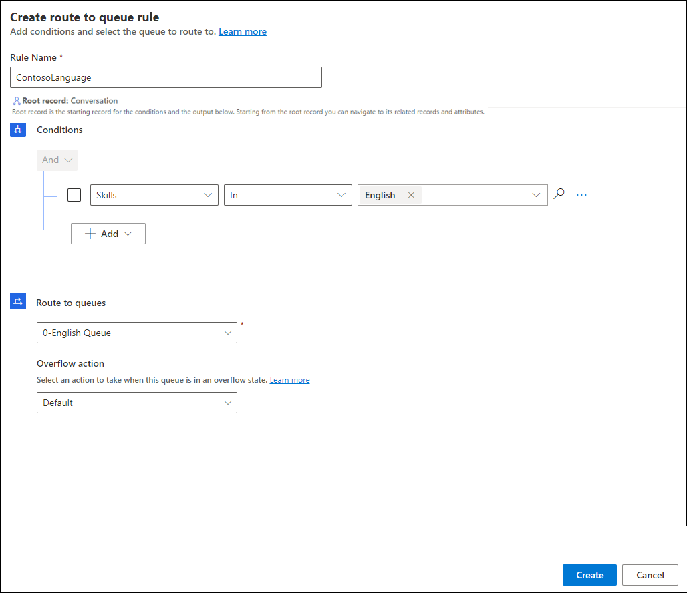

# Preview: Set up workstreams and queues for the voice channel using unified routing

[!INCLUDE[cc-use-with-omnichannel](../includes/cc-use-with-omnichannel.md)]

> [!IMPORTANT]
> [!INCLUDE[cc-preview-feature](../includes/cc-preview-feature.md)]
>
> [!INCLUDE[cc-preview-features-definition](../includes/cc-preview-features-definition.md)]
>
> [!INCLUDE[cc-preview-features-expect-changes](../includes/cc-preview-features-expect-changes.md)]
>
> [!INCLUDE[cc-preview-features-no-ms-support](../includes/cc-preview-features-no-ms-support.md)]
>
> [!INCLUDE[cc-preview-features-send-us-feedback](../includes/cc-preview-features-send-us-feedback.md)]

## Introduction

A workstream is a container to enrich, route, and assign work items. The workstream can be associated with a channel, such as live chat and voice.

You'll perform the steps mentioned in this article in the Omnichannel admin center app.

## Set up a voice workstream

Do the following to configure a workstream for voice:

1. On the left pane, select **Workstreams**, and then on the **Create a workstream** dialog, enter the following.

2. Enter the following details for the work stream:

    - **Name:** An intuitive name, such as Contoso voice workstream.
    - **Type:** Select **Voice**.

    > [!Note]
    > By default, **Owner** and **Channel** are predefined and unavailable, and only push is available for work distribution mode.

3. Select **Create**. The workstream that you created is displayed.

    

## Configure a voice channel

To configure the voice channel, you'll need to associate the workstream with a phone number for routing the calls. You can view the list of available phone numbers by selecting **Phone numbers** in the left pane. To acquire a new number, you can select **Add number** on the **Phone numbers** page. More information: [Acquire a phone number](#acquire-a-phone-number).

To configure the voice channel:

1. Go to the workstream that you created, and on the page that appears, select **Set up voice**.

2. On the **Phone number** page, select a number from the list, and select **Next**.

    > [!NOTE]
    > Only those numbers are displayed that have inbound calls enabled and are not already associated with any other workstream. Use the steps in [Acquire a phone number](#acquire-a-phone-number) if you want to configure a new number.

    

3. On the **Music** page, select **Next** again. In private preview, the option to select the audio for ring tone is not available.

4. On the **Language** page, select **Next**. In private preview, only English is supported.

5. On the **Summary** page, select **Save and close**.

    

The phone number is associated with the workstream.

    

## Acquire a phone number

You can acquire additional phone numbers on the **Phone numbers** page. The following conditions are applicable:

- Only three phone numbers are available in one org.

- Only U.S. numbers, and toll-free numbers.

- Inbound calling must be enabled on the phone number.

- If you are adding a number, before you can use it, it must be in the **Ready** state.

> [!Note]
> If you acquire new numbers in private preview, you will not be charged for the new phone numbers. After preview, you will be charged per phone number. All rates are subject to change.

To acquire a phone number:

1. Select **Add number**.

    

2. Select **Next**.

3. On the page that appears, select United States in **Country/Region**, and Toll free for **Number type**.

4. Make sure that you select the options for inbound and outbound.

    

5. Select **Next**.

6. On the **Summary** page, review the details and select **Purchase phone number**. It takes a few minutes for the new phone number to be added, so don't close the page immediately. After a few seconds, a prompt will appear to indicate that you can either close the page or continue to wait until the purchase information is displayed. At this point, the number provisioning will start and will continue the process even if you close the page.

    

7. Select **Close**.

    

## Create queues for voice channels

In Customer Service, work items are assigned to a queue and agent with the help of unified routing. Unified routing is an intelligent, scalable, and enterprise grade routing and assignment capability that can assign the incoming work item to the best suited queue and agent while adhering to work item requirements and matching them with the agent's capabilities using round robin routing. More information: [Overview of unified routing](overview-unified-routing.md)

In this section, we'll cover information on how to create a queue for the voice channel and routing rules to evaluate conditions and assign work items.

### Create a queue for the voice channel

In the left pane, select **Queues**, and then complete the following steps to create a queue for the voice channel:

1. On the **Queues** page, select **New**, and on **Create a queue** dialog, enter the following details:

    - **Name**: Specify a name.
    - **Type**: Select **Voice**.
    - **Group number**: Enter a number.

2. Select **Create**. The queue is created.
3. On the queue page, select **Add users**, and on the **Add users** flyout menu that appears, select the users and select **Add**.

   > [!NOTE]
   > You can add only those users who are configured for unified routing.

   

### Configure call overflow for the voice queue

With call overflow, you can reduce long wait times for customer calls by setting options for voice queues.

### Assignment rules for a queue

By default, the assignment method for a voice queue is round robin. In the round robin method, work items will be prioritized in the order they enter the queue. Among the agents who match skills, presence, and capacity, work will be assigned to agents in the order they are listed, which means that the agent listed on the top is assigned first. You can also choose hightest capacity or create custom assignment methods. More information: [Assigment methods](assignment-methods.md).

For a simple and quick voice call routing, you'll not need to set up any rules for unified routing. By default, all the incoming voice calls will get routed to the "default voice queue" and will get assigned to the agents with the round robin assignment methodology.

## Configure routing rules for the voice workstream

Navigate to the workstream for which you have configured the voice channel and perform the following steps:

1. In the **Routing rules** area, in the **Route to queues** option, select **Create ruleset**.

2. On the **Create route-to-queues ruleset** dialog, provide a name and description, and then select **Create**.

3. On the page that appears, select **Create rule**.

4. On the **Create rule** page, enter a rule name, and in **Conditions**, define the set of conditions using the conversation entity and related entity attributes.

5. In **Route to queues**, select the queue that you created and to which the voice call must be routed when the conditions specified are met.

    

6. In **Overflow action**, select one of the following options:
   - **Default**: Specify if the work item should remain in the queue to be routed to the next available agent.
   - **End call**: Specify to end the call if no agent will be available to take the call, for example an operating hour is configured and the overflow action was triggered on account of it.
   - **Transfer to external number**: Set this option and specify a number to which the call should be routed if the work item should be handled on priority.

    > ![Note]
    > Make sure that you configure overflow condition for the queue for the action to be run.

7. Select **Create**. The rule is created and appears in the list of rules.

8. Create as many rules as your business requires.

## Configure work classification rules

You can configure work classification rules for the voice workstream to add detailed information to incoming work items. This information can be used to route the calls optimally. More information: [Configure work classification](configure-work-classification.md)

### See also

[Overview of voice channel in Omnichannel for Customer Service](voice-channel.md)  
[Overview of unified routing](overview-unified-routing.md)  
[Assignment methods](assignment-methods.md)  
