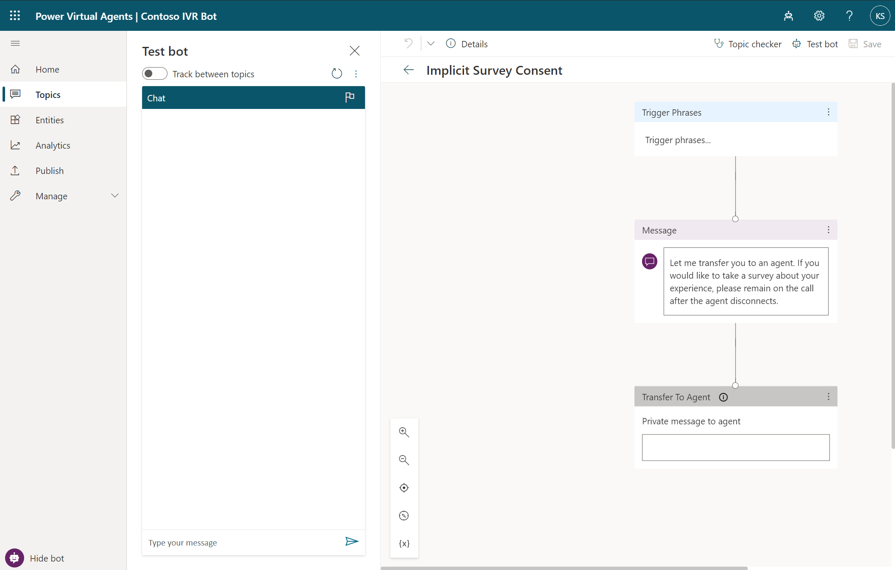
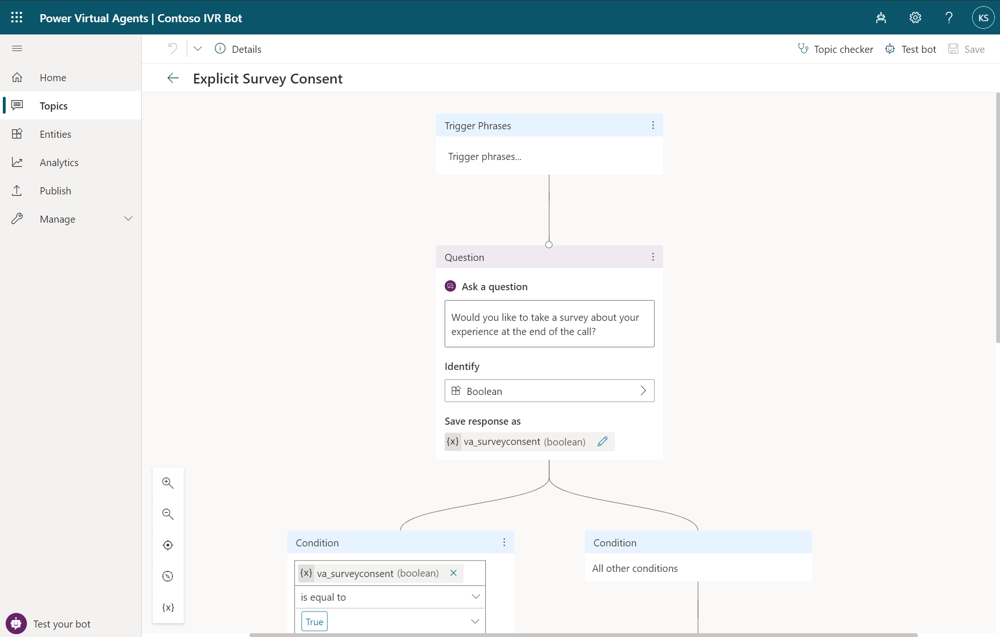
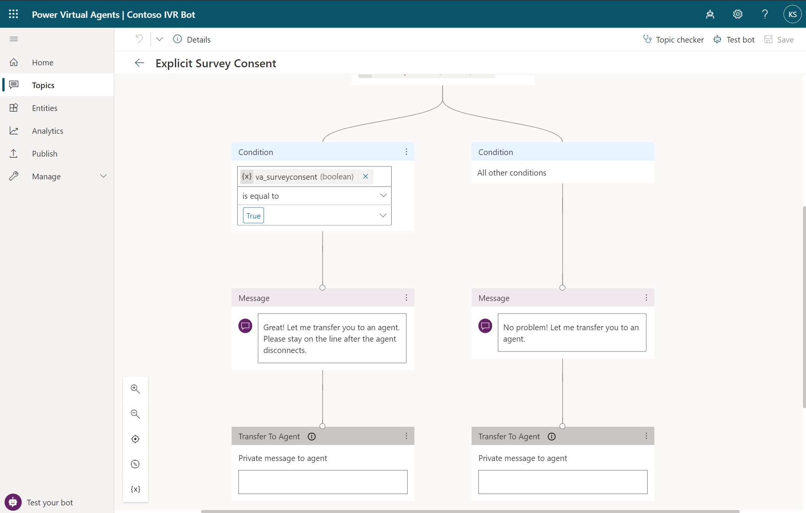
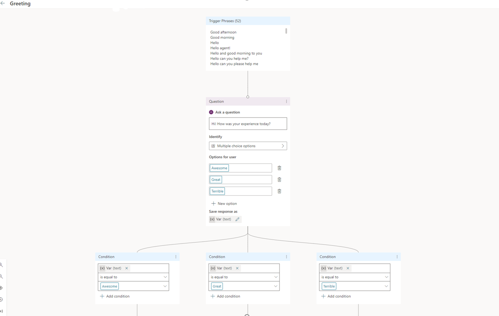
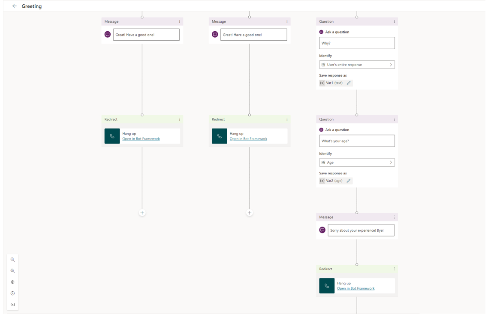
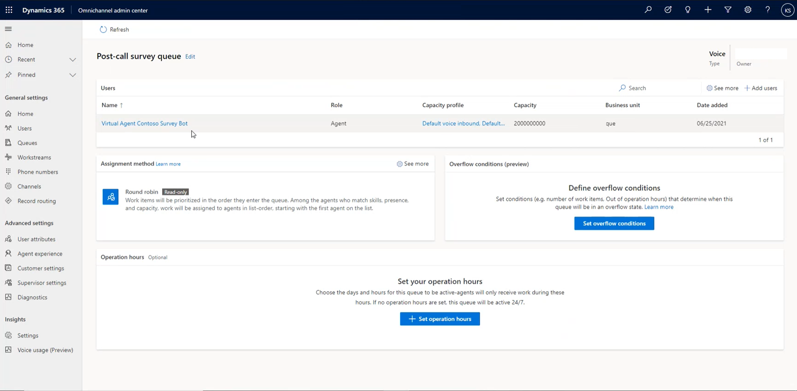
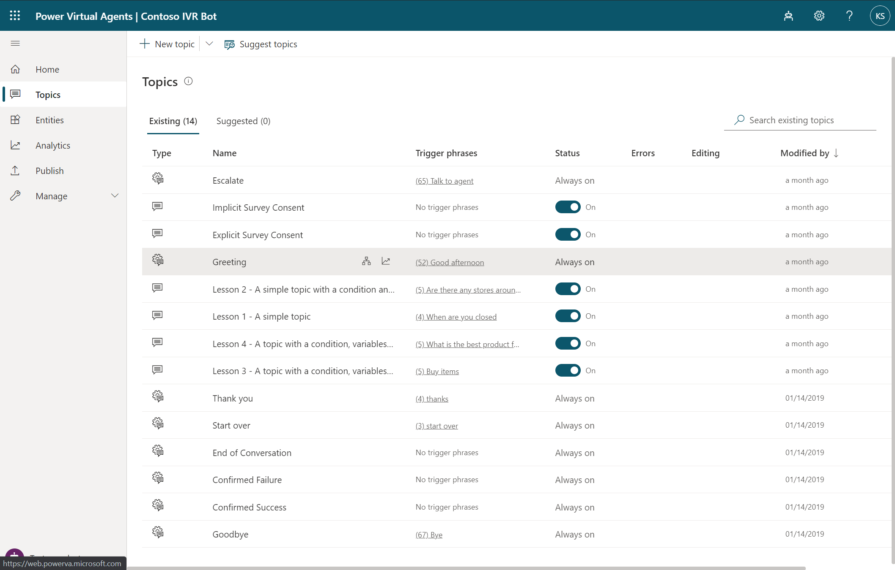
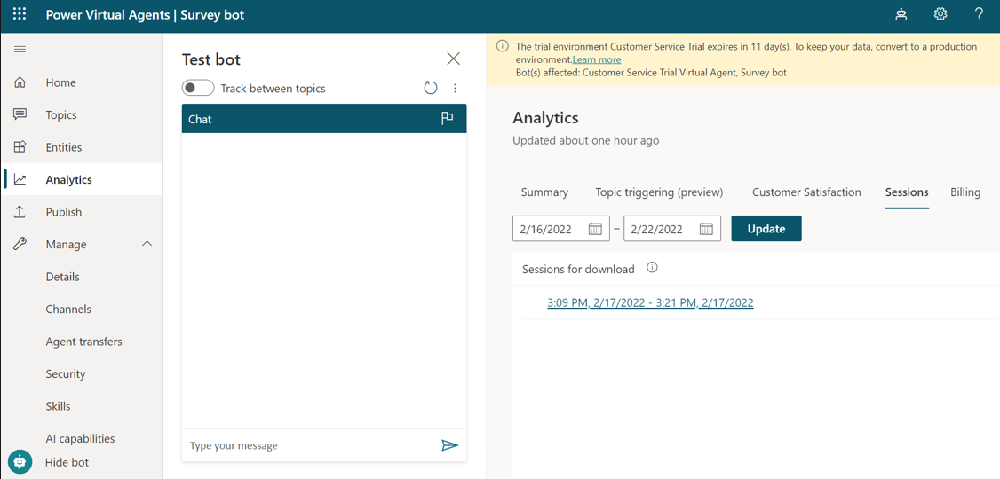

# Configure a post-call survey

[!INCLUDE[cc-use-with-omnichannel](../includes/cc-use-with-omnichannel.md)]

## Introduction

Post-call surveys help measure customer satisfaction in the contact center. Surveys are also an incentive for agents to provide high-quality service. You can configure the survey to take place immediately after the call so that customers can provide their feedback while the conversation is fresh on their minds.

You can obtain customer consent for post-call surveys as follows:

- **Automatic - implicit**: The IVR bot informs the customer about a post-call survey at the end of the call. 
    After the agent disconnects, the call is automatically transferred to a post-call survey bot.
- **Automatic - explicit**: The IVR bot asks the customer if they want to participate in a post-call survey. The consent is saved in a `va_SurveyConsent` Boolean variable. If the customer consents, the call is automatically transferred to the post-call survey bot at the end of the agent call. If the customer says no, the call ends when the bot hangs up.
- **Agent-initiated**: Towards the end of a call, the agent can ask the customer if they want to take a survey.
    If the customer says yes, the agent manually transfers the call to the survey bot.

> [!NOTE]
> We recommend that you have two bots if your organization wants to use Power Virtual Agents for both IVR and survey scenarios.

## Create a survey bot in Power Virtual Agents

Use either Power Virtual Agents (no-code or low-code experience) or Azure bot Service (pro-developer experience).

You can add messages or questions in the **Escalation** topic to obtain a customer consent for a post-call survey. Examples of the messages are as follows:

### Implicit survey

> [!div class="mx-imgBorder"]
> 

### Explicit survey

> [!div class="mx-imgBorder"]
> 

> [!div class="mx-imgBorder"]
> 

### Configure a survey bot

You can add messages or questions to a Power Virtual Agents IVR bot to create a post-call survey. A bot greets the customer when the call routed to the survey queue is answered. Examples of messages or questions configured in the **Greetings** topic for the bot to greet the customer are as follows:

> [!NOTE]
> We recommend that you have two bots if your organization wants to use Power Virtual Agents for both IVR and survey scenarios.

> [!div class="mx-imgBorder"]
> 

> [!div class="mx-imgBorder"]
> 

> [!TIP]
> The bot author can use Power Automate to implement custom business logic to decide who receives a survey (for example, the bot may decide to survey someone random, VIP customers, and so forth)

## Connect your bot to Omnichannel for Customer Service

- Configure your Power Virtual Agents bot. Perform the steps in [Configure handoff to Omnichannel for Customer Service](/power-virtual-agents/configuration-hand-off-omnichannel#configure-hand-off-in-the-power-virtual-agents-app) and [Integrate a Power Virtual Agents bot](configure-bot-virtual-agent.md).
- Configure your Azure bot. More information: [Integrate an Azure bot](configure-bot.md)

## Enable post-call survey in phone number settings
> [!Note]
> Enabling the post-call survey feature isn't required for the human agent initiated scenario.

To route the customer to the Power Voice Agent survey bot automatically after the agent hangs up, perform the following steps:

1. In Customer Service admin center or Omnichannel admin center, select your voice workstream, and then select **Edit** next to the pencil icon to modify the settings.
2. Under **Language**, scroll to the bottom of the dialog, and then toggle **Post-call survey** to **On**.
3. From the dropdown menu, select the survey bot.
4. Select **Confirm**.

## Set up human agent initiated survey

To enable agent initiated feedback, create a queue where the only agent is the survey bot user.

   > [!div class="mx-imgBorder"]
   > 

### Try out the human agent initiated survey

Transfer the call to the survey queue.

   > [!div class="mx-imgBorder"]
   > 

When answered, this sends the user to the bot's greeting topic.

   > [!div class="mx-imgBorder"]
   > 

## View Survey Results

You can view the survey results on the **Analytics > Sessions** tab.

   > [!div class="mx-imgBorder"]
   > 

### See also

[Introduction to the voice channel](voice-channel.md)  
[Outbound calling](voice-channel-outbound-calling.md)  
[Route incoming calls to agents](voice-channel-route-queues.md)  
[Integrate an Azure bot](configure-bot.md)  

[!INCLUDE[footer-include](../includes/footer-banner.md)]
