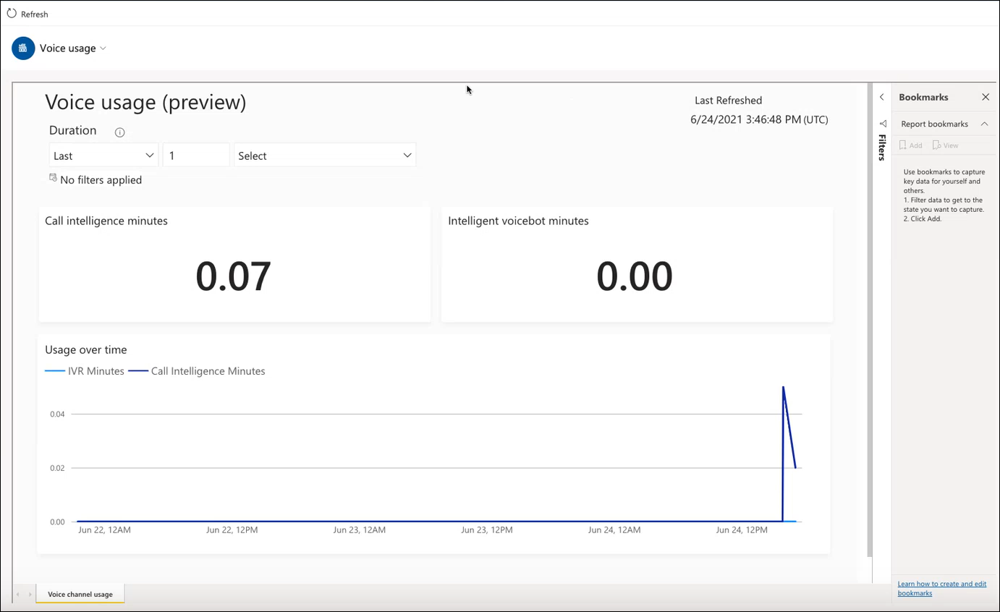

# Preview: View voice calls usage

[!INCLUDE[cc-use-with-omnichannel](../includes/cc-use-with-omnichannel.md)]

> [!IMPORTANT]
> [!INCLUDE[cc-preview-feature](../includes/cc-preview-feature.md)]
>
> [!INCLUDE[cc-preview-features-definition](../includes/cc-preview-features-definition.md)]
>
> [!INCLUDE[cc-preview-features-expect-changes](../includes/cc-preview-features-expect-changes.md)]
>
> [!INCLUDE[cc-preview-features-no-ms-support](../includes/cc-preview-features-no-ms-support.md)]
>
> [!INCLUDE[cc-preview-features-send-us-feedback](../includes/cc-preview-features-send-us-feedback.md)]

## Introduction

The Voice usage report lets Omnichannel administrators view a Power BI report in Omnichannel admin center that helps them to get insights about how many call intelligence minutes and intelligent voicebot minutes from voice quota have been consumed.

## Prerequisites

The voice channel should be configured and in use for the report to display data.

## View the voice usage report

To view the voice usage report, go to the Omnichannel admin center app, and in the site map, under **Insights**, select **Voice usage (Preview)**.

> 

The following table explains the metrics.

|Metric|Description|
|--------|------|
|Call intelligence minutes|Number of minutes of calls where call transcription is generated. Number is rounded down to a while number.  |
|Intelligent voicebot minutes|Number of minutes used by voicebot. Number is rounded down to a whole number.|
|Usage over time|Overtime trending of call intelligence minutes and intelligent voicebot minutes. |
|||

### Slice metrics by time

The Duration option lets you filter the report details and affects all metrics in the report.

### See also

[Overview of voice channel in Omnichannel for Customer Service](voice-channel.md)  