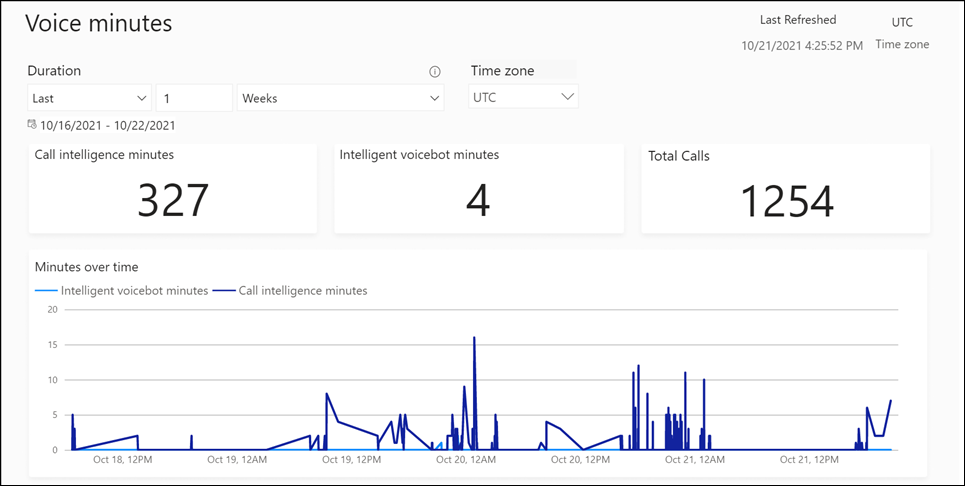

# View minutes used in voice calls

[!INCLUDE[cc-use-with-omnichannel](../includes/cc-use-with-omnichannel.md)]

## Introduction

The Voice minutes report lets Omnichannel administrators view a Power BI report in Omnichannel admin center that helps them to get insights about how many call intelligence minutes and intelligent voicebot minutes from the voice quota have been consumed.

## Prerequisites

- The voice channel should be configured and in use for the report to display data.
- The Omnichannel administrator role for accessing the report.

## View the Voice minutes report

To view the Voice minutes report, do one of the following steps:

- In the site map of Customer Service admin center, select **Insights**, and in **Admin reports**, select **View report** for **Voice minutes**. 
- In the site map of Omnichannel admin center, in **Insights**, select **Voice minutes**.

> 

The following table contains the metrics.

|Metric|Description|
|--------|------|
|Call intelligence minutes| Number of minutes of calls for which call transcription is generated. Number is rounded to a whole number.  |
|Intelligent voicebot minutes|Number of minutes used by voicebot. Number is rounded to a whole number.|
|Total Calls|Number of calls that consumed the minutes.|
|Minutes over time|Overtime trending of call intelligence minutes and intelligent voicebot minutes. |
|||

### View the IVR transcripts

The **Voice details** table in the report provides the following information.

|Attribute|Description|
|----|----|
|Date| Date when the conversation is logged.|
|Conversation ID |Identifier of the conversation record.|
|Type|Type of call, either "Call intelligence" or "Intelligence voicebot". |
|Start|Time when the recording of the minutes starts.|
|End|Time when the recording of the minutes stops.|
|Duration|Total number of minutes consumed for the current row.|
|Phone number|Agent phone number used in the call.|
|Workstream| Workstream through which the call was handled.|
|Call direction| Indicates whether the call was an "Incoming" or "Outgoing" one.|
|||

### Slice metrics by time and time zone

The **Duration** option lets you filter the report details and affects all metrics in the report. More information: [Slice metrics by time](intraday-insights-dashboard.md#slice-metrics-by-time)

The **Time zone** option lets you filter the report for the selected time zone.

### See also

[Overview of voice channel in Omnichannel for Customer Service](voice-channel.md)  
[Intraday conversation insights](intraday-conversation-insights.md)  
