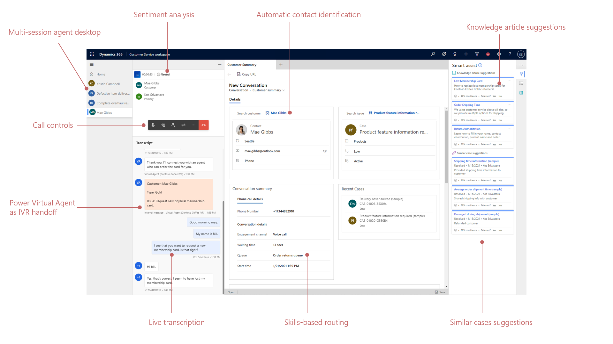

# Introduction to the Voice channel 

Enable customer service representatives to communicate with customers on the phone to resolve issues with the voice channel in Dynamics 365 Customer Service. While many customers increasingly use chat, SMS text messages, and social media to engage and request support from organizations, phone calls continue to be an important communication channel. With the voice channel, Omnichannel provides agents with the ability to receive inbound and make outbound PSTN calls through a native calling experience in Dynamics 365, with real time AI-powered features such as live call transcription, sentiment analysis and AI-based Suggestions working out of the box to boost agent productivity. Omnichannel also provides a rich set of analytics and insights, including AI-driven topic clustering and call insights.

> [!VIDEO 
https://www.microsoft.com/en-us/videoplayer/embed/RE4G43k]

## Why choose the voice channel

### Native

The voice channel is built, owned, and operated completely by Microsoft. This means it is an all-in-one customer service solution without fragmentation or manual data integration required, and a faster time to value by enabling a quick and easy deployment of a voice channel for their business. In addition, the voice channel is built on Microsoft Azure Communication Services with the scale and reliability of the calling platform that powers Microsoft Teams worldwide today. Providing organizations with a choice of telephony delivered directly by Microsoft 

### Built alongside existing omnichannel capabilities

The voice channel is another channel to engage customers alongside existing other channels (Chat, SMS, social media) so it plugs into existing workflows and processes. This means the solution provides a single view of the customer that empowers agents to provide personalized service across all channels, and true omnichannel analytics and insights for agents and supervisors alike. 

that participates throughout the stack, i.e. Power Virtual Agent for IVR, Unified Routing for ACD, connected agent and supervisor experiences, connected reporting.

Customer service organizations will find that voice communication works well with 

Typically, customer service organizations must manually integrate standalone telephony and CRM solutions, which result in fragmented experiences for agents and customers across engagement channels. Ultimately, these stitched-together solutions from multiple providers are not only complex to roll out and maintain but create data silos with disconnected insights of customer interactions and agent performance across channels. The addition of the voice channel enables Customer Service to offer businesses a solution that minimizes failure points caused by custom-built, complex integrations, and maximizes the ability to create better customer and agent experiences. This single, holistic solution also makes it easier to scale to meet changing business needs.

Even with the rise of digital channels and self-service, telephony remains a critical channel for contact centers to provide customer support. Most CRM players lack native telephony and only support integrations with telephony providers, also known as CCaaS (Contact Center as a Service) players, through “at the glass” CTI (softphones) widgets. As telephony follows CRM to the cloud, customers are looking to simplify their combined solution. 
extending our current assets, such as Power Virtual Agent, Intelligent Routing and conversation canvas, we can offer a telephony solution directly within Dynamics OC.

Microsoft’s Omnichannel for Customer Service allows us to escalate web chat conversations to voice and video calls, this is a great feature when conversations become complex and a chat conversation is simply more long winded than a voice call.

ensuring consistent, personalized, and connected support across all channels of engagement

### Common data framework

This end-to-end solution unifies all points of customer interaction data, enabling businesses to simplify and streamline their processes, gain instant insights into trends, and deliver faster resolution from AI-driven assistance

need 10 different systems 
- disconnected channels
- disconnected data

### Differentiating AI

This end-to-end solution unifies all points of customer interaction data, enabling businesses to simplify and streamline their processes, gain instant insights into trends, and deliver faster resolution from AI-driven assistance—all while ensuring your data remains secure and compliant, backed by the trusted Microsoft cloud.

We should bring to bear the best demonstrations of real-time and historical voice intelligence from Microsoft. As more CRM companies follow this trend to integrate channels and voice, the use of the data to create insights will be a big differentiator. 

Leverage built-in AI to resolve issues faster with tools like call transcriptions and sentiment analysis 

Speech-based self-service: NLU-powered IVRs and speech-enabled virtual agents by connecting the telephony channel to Power Virtual Agent for intuitive self-service and seamless elevation to agent-service. PVA bots will be built once and deployed across messaging and voice channels alike. 

### Reliability and scalability

reliability of the calling platform that powers Microsoft Teams worldwide today
The voice channel in Dynamics is built on the same secure, planet-scale platform used by Microsoft Teams

- Built on Microsoft Azure Communication Services 

all while ensuring your data remains secure and compliant, backed by the trusted Microsoft cloud.

## Key capabilities of the voice channel

Take a look at some of the key capabilties that makes the voice channel great for customer service representatives and customers receiving help. 

| Solution | Capability |
| --- | --- |
| Agent experience |  <ul><li>Call controls: Mute, Hold, End</li><li>Music on hold</li><li>Integrated customer and case history lookup</li><li>Notes and knowledge search</li></ul>  |
| Calling and routing  | <ul><li>Ability to handle and distribute incoming calls, Automatic Call Distribution (Routing)</li><li>Ability to make outbound calls</li><li>Transfer to external phone number</li><li>Phone number procurement and management</li><li>Skills-based Assignment</li></ul> |
| AI | <ul><li>Real-time sentiment analysis</li><li>Real-time transcription</li><li>Real-time translation</li><li>Real-time smart assist suggestions</li><li>No-code Virtual Agent as IVR</li></ul> |
| Supervisor experience | <ul><li>Consulting and transferring</li><li>Monitoring and barging</li><li>Ability to record and manage phone calls</li><li>Operations management through supervisor dashboards</li></ul> |
| Customer experience  | <ul><li>Post-call Survey</li><li>Scheduled Callbacks</li><li>Music on hold</li></ul> |

## Agent experience using the Voice channel

Agents receive incoming voice calls the same way they receive other customer requests from channels like SMS and social media. 

A new support session is created when the voice call is accepted. 

> [!div class="mx-imgBorder"]
> 

[Agent experience using the voice channel in Dynamics 365 Customer Service](https://microsoft.sharepoint.com/:v:/t/CRMHOME/ua/EcxIBAEagJdKtkFer7rhItYBZJl_iNg-vtinvyAtaPeq3Q?e=W1tbR7)

## Next steps

1. [Install and set up](voice-channel-install.md)
2. [Make and receive your first phone call](voice-channel-first-call.md)
3. [Using the agent desktop for voice](voice-channel-agent-experience.md)

### See also

[Blog: New voice channel streamlines omnichannel customer experiences](https://cloudblogs.microsoft.com/dynamics365/bdm/2020/09/23/new-voice-channel-streamlines-omnichannel-customer-experiences/)

