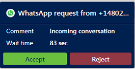
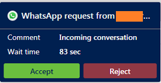

# Use WhatsApp channel

[!INCLUDE[cc-use-with-omnichannel](../includes/cc-use-with-omnichannel.md)]

## WhatsApp channel overview

When you sign in to Omnichannel for Customer Service, you can see your work items in Omnichannel Agent Dashboard. To learn more, see [View agent dashboard and agent conversations (work items)](oc-agent-dashboard.md).

## Prerequisite

Make sure your administrator has configured a WhatsApp channel through Twilio.

### Incoming WhatsApp notification

You'll receive a notification when a customer requests a WhatsApp conversation. Accepting the WhatsApp request starts a session and you'll see the communication panel in which you can exchange messages with the customer.

**Unauthenticated customer incoming notification**

> [!div class=mx-imgBorder]
> 

**Authenticated customer incoming notification**

> [!div class=mx-imgBorder]
> 

In Omnichannel for Customer Service, you can:

- [View customer information on Active Conversation form ](oc-customer-summary.md)
- [View communication panel](oc-conversation-control.md)
- [Use call options and visual engagement in live chat](call-options-visual-engagement.md)
- [Monitor real-time customer sentiment](oc-monitor-real-time-customer-sentiment-sessions.md)
- [Manage sessions](oc-manage-sessions.md)
- [Manage applications](oc-manage-applications.md)
- Use productivity tools
    - [Use agent scripts](oc-agent-scripts.md)
    - [View Smart assist cards](oc-smart-assist.md)
    - [Use productivity pane](productivity-pane.md)
- [Create a record](oc-create-record.md)
- [Search, link, and unlink a record](oc-search-link-unlink-record.md)
- [Search for and share knowledge articles](oc-search-knowledge-articles.md)
- [Take notes specific to conversation](oc-take-notes.md)
- [Understand conversation states](oc-conversation-state.md)
- [Manage presence status](oc-manage-presence-status.md)
- [Search for transcripts](oc-search-transcipts.md)
- [View conversation and session forms](oc-view-activity-types.md)
- [View active conversation for an incoming conversation request](oc-view-customer-summary-incoming-conversation-request.md)
- [Search for transcripts](oc-search-transcipts.md)

## WhatsApp message type and 24 hours session rule

- **Session messages**: According to WhatsApp, session messages are incoming messages from a customer, or outgoing responses to the incoming messages, within 24 hours. A messaging session starts when you receive a message from a customer. It lasts for 24 hours from the most recently received message. Session messages do not need to follow a template, and can include media attachments.

- **24 hours session rule**: A messaging session starts when you receive a message from a customer or reply to an incoming message from a customer. When the customer sends a message, you have 24 hours to reply to the customer from the time you received it. However, after 24 hours, if you try to send a message to the customer, an error is displayed: **This conversation has exceeded the 24 hour limit to respond to the customer.**

### See also

[Configure a WhatsApp channel](configure-whatsapp-channel.md)

[!INCLUDE[footer-include](../includes/footer-banner.md)]
