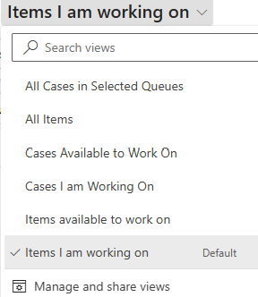
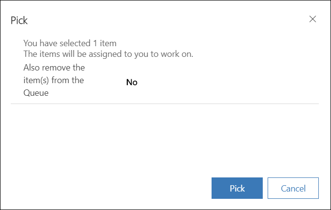

# Work with queues

Use queues to organize, prioritize, and monitor the progress of your work. In Dynamics 365 Customer Service, queues are containers used to store anything that needs to be completed or requires an action, for example completing a task or closing a case. To know more about creating and managing queues, see [Create and manage queues](set-up-queues-manage-activities-cases.md).

## Find the queue item
Use the view list and queue list to filter and find items in queues.

1. Go to **Service** > **Queues**.
2. Select a view, and then select a filter to see the items you want.

    

3. From the **All items** drop-down, select the pin icon to pin the view that you want to appear on your dashboard.

## Find all items in queues

1. To see all cases from a selected queue, in the view list, select **All Items in Selected Queues**.

2. In the queue list, choose one of the following options to filter cases based on queues:
   - \<Individual queues>
   - All Queues
   - All Public Queues
   - Queues I'm a member of

## Find cases that are available to work on

1. To see only the cases no one else is working on, in the view list, select **Cases Available to Work On**
2. In the queue list, choose one of the following options to filter cases based on queues:

   - \<Individual queues>
   - All Queues
   - All Public Queues
   - Queues I'm a member of

## Find cases that you're working on

1. To see only the cases that you are currently working on, in the view list, select **Cases I'm Working On**.
2. In the queue list, choose one of the following options to filter cases based on queues:

   - \<Individual queues>
   - All Queues
   - All Public Queues
   - Queues I'm a member of

## Find items available to work on

1. To see only items (activities and cases) that no one else is working on, in the view list, select **Items available to work on**.
2. In the queue list, choose one of the following options to filter cases based on queues:

   - \<Individual queues>
   - All Queues
   - All Public Queues
   - Queues I'm a member of

## Find items that you are working on

1. To see only items that you're currently working on, in the view list, select **Items I am working on**.
2. In the queue list, choose one of the following options to filter cases based on queues:

   - \<Individual queues>
   - All Queues
   - All Public Queues
   - Queues I'm a member of

## Pick an item to work on

1. Select **Service**.
2. Select **Queues**.
3. Select a view from the System Views menu.
4. Select the queues from the menu.
5. Select an item in the queue. Select the check box next to the item title.
6. Select **Pick** from the command menu. The Pick dialog box appears.
   > 

7. Optionally, select **No** to change it to **Yes** if you want item from the queue.
8. Select **Pick**. The item is assigned to you and removed from the queue if you had selected yes in the previous step.

## Release an item or case that you’re working on so someone else can pick it up  
  
1. In the **View** list, select one of the views that show the items or cases you’re working on.  
  
2. Select the case or item that you want to release, and on the command bar select **Release**.  
  
   When you release an item, your name is removed from the **Worked By** field, and the item is no longer assigned to you; it’s assigned to the queue owner.

Route an activity or case to another queue or assign to a different user or team  
  
1. Select the case that you want to move to another queue, and on the command bar select **Route**.  
  
2. To move an activity or case to a different queue, select **Route**, and select a queue.  

    -OR-

    To assign the activity or case to another user or team to work on, select **User/Team**, and select the user or team. When you assign the activity or case to someone else to work on, the **Worked By** field is set to that user or team. You also have the option to remove the item from the queue.

## Remove an activity or case from a queue  
  
1.  In the **View** list, select one of the views that show the items you want to remove.  
  
2.  Select the activity or case, and on the command bar, select **Remove**.
 
## Assign an activity to a user or queue

If you want another person in your organization to work on an activity, you can assign the activity to that person or move it to another queue.  
  
## Assign to another user or team  
  
1. In the left pane, go to **Activities**.  
  
2. In the list of activities, select the activity you want, and on the command bar, select **More Commands** , and then select **Assign**.    
  
3. In the **Assign to another user or team** field, select **Lookup**, and select the user or team you want to assign the activity to.  
  
    If you don’t see the user or team you are looking for, select **Lookup**, and then select **Look Up More Records**. From the **Look for** drop-down list, select **User** or **Team**. In the **Search** box, type the name, select the search button, and then select the name to select it. select **Add**.  
  
4. Select **Assign**.  
  
## Add to a queue  
  
1. In the left pane, go to **Activities**.  
  
2. In the list of activities, select the activity you want, select **More Commands**  on the command bar, and then select **Add to Queue**.
  
3. In the **Queue** field, select **Lookup**, select the queue you want to route the activity to, and then select **Add**.

### See also

[Work with cases](customer-service-hub-user-guide-create-a-case.md)  

[!INCLUDE[footer-include](../includes/footer-banner.md)]