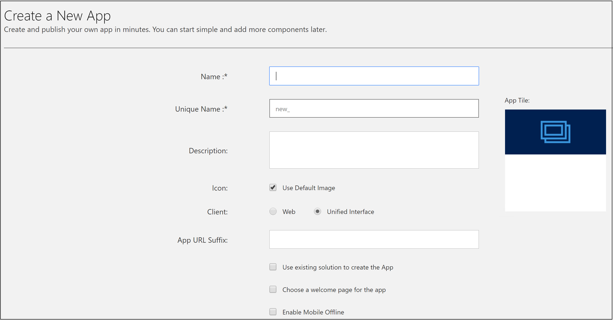

# About Unified Interface in Dynamics 365 Customer Engagement (on-premises) 

Unified Interface uses responsive web design principles to provide an optimal viewing and interaction experience for any screen size, device, or orientation. Unified Interface brings all the rich experiences to any client that you are using; whether you are on a browser, tablet, or phone, you will be able to consume similar experiences. Some examples: 

> - Similar form experiences to update and view your records.
> - Interactive dashboards across all devices to view your information and drill into it. 
> - Reference Panel is now available to be used with all entities supported in Unified Interface. 
> - We now support right-to-left (RTL) languages.
> - All experiences on Unified Interface have accessibility improvements. 

## Enable Unified Interface in Dynamics 365 Customer Engagement (on-premises) 

1. Go to **Settings** > **Administration** > **System Settings** > **General tab**.
2. Set the **Use the new Unified Interface only (recommended)** to **Yes.**
3. Select **OK**.

[Jim, delete or modify the following]

## Capabilities available in Unified Interface with Customer Engagement (on-premises), version 9.x 

Most of the core functionalities of sales and customer service have moved to the Unified Interface client. 

### Dashboards and charts

You can access all the system and user dashboards from within your Unified Interface apps. The interactive dashboards are now available for all record types with richer interactive dashboard capabilities. 

### Enhanced user experience

If users work on core record types like Activities, Accounts, Contacts, Leads, Opportunities and Cases, you'll be able to move them to the Unified Interface client. 

They will have familiar capabilities on Unified Interface and will also discover productivity enhancements with the introduction of some enhanced capabilities. 

**Timeline control** - The timeline view helps you collaborate with your team by tracking customer communication in a record on a single page in an easy to read view. You can see everything from posts and voice attachments, to emails and notes. It provides a quick way to see the entire communication thread. 

**Business process enhancement** - The business process flow has been improved by the docking mechanism. You can dock the business process stage on your screen to help you stay focused on the task at hand in your business process flow. This is especially useful when the stage of the process has complex steps to complete. 

**Reference panel** - Use the reference panel for apps built on Unified Interface like Customer Service Hub. The reference panel is a great way to get work done without clicking away from the screen you are on. You can look up other things like knowledge base articles within the context of the record you are viewing. 

**Navigation** - The new menu options let you swiftly navigate the different apps in the system. It provides quick access to recently viewed records and pinned favorites. 

**Reflow** - The app also scales by reflowing the components on the screen. The responsive design adapts to your environment based on screen size, so the more available space that you have the more information can be displayed. 

### Focused Experience
You can scope the user experience based on the jobs they need to accomplish. Users can have single or multiple apps based on their requirements and can easily switch between apps as needed. 

### Rich controls 
Unified interface is a metadata driven experience. All controls experiences are built on the control framework that is extensible and provides a uniform experience across clients. The app display reflows to the viewport size the user is working in. 

## Accessing Unified Interface apps on browsers

On browsers, you can access the installed Unified Interface and web apps by selecting **Settings** > **Application** > **My Apps**. 

## Accessing Unified Interface apps on phone and tablets
Unified interface apps are the only apps supported on phones and tablets for Customer Engagement (on-premises), version 9.x. When a user logs into the above org, they will only see the Unified Interface apps on their apps landing page. 

|  | |  |
|---------|---------|---------|
|On phone       |    |On tablet      |

## Create a new Unified Interface app
In case you have requirements to create your own experience on Unified Interface, you can create an app using the app designer. More information: [Create or edit an app by using the app designer](../customize/create-edit-app.md)

## Capabilities not yet on Unified Interface

There are certain capabilities that continue to be unavailable in the Unified Interface:

-	Custom styling of advanced chart properties (excluding colors and basic formatting)
-	Composite address control
-	Global notifications
-	Admin experiences
-	Editable grids on phones
-	Learning Path

## Read-only entities on Unified Interface

There are certain entities that are currently read-only on Unified Interface. Users will not be able to make changes to these entity records within an Unified Interface app.

> [!NOTE]
> Some entities are being deprecated. Check out [Important changes (deprecations) coming](https://docs.microsoft.com/dynamics365/get-started/whats-new/customer-engagement/important-changes-coming#contracts-contract-line-items-and-contract-templates-entities-are-deprecated).

The following are entities that are currently read-only in Unified Interface:

- Connection Role
- KnowledgeArticleViews
- KnowledgeBaseRecord
- SharePointDocument
- SharePointSite
- SLA
- SLAKPIInstance
- Template
- Contract
- Contract Lines
- Contract Templates
- Case Resolution
- Service

[!INCLUDE[footer-include](../../../includes/footer-banner.md)]