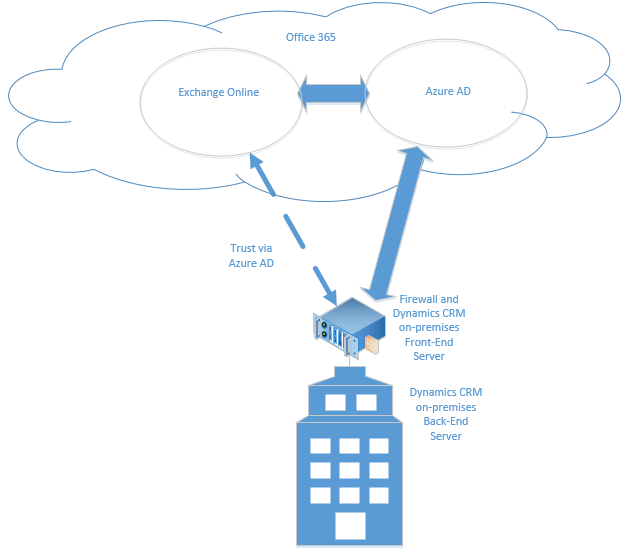

# Connect Dynamics 365 Customer Engagement (on-premises) to Exchange Online

::: moniker range="op-9-1"
[!INCLUDE [cc-use-advanced-settings](../includes/cc-use-advanced-settings.md)]
::: moniker-end

This topic describes how to configure server-based authentication between Dynamics 365 (on-premises) and Exchange Online. The diagram below illustrates the communication between Dynamics 365 (on-premises), Azure Active Directory, and Exchange Online.



## Permissions required
Microsoft Dynamics 365
- System Administrator security role.
- If you are using a self-signed certificate for evaluation purposes, you must have local Administrators group membership on the computer where Microsoft Dynamics 365 Server is running.
- The account that you use to sign in to the CRM deployment servers must have full local administrator rights.

Exchange Online
- Office 365 Global Administrators membership. This is required for administrative-level access to the Office 365 subscription and to run the Microsoft AzurePowerShell cmdlets.

> [!IMPORTANT]
> In this deployment, the Dynamics 365 administrator can approve mailboxes.

## Set up server-based authentication with Microsoft Dynamics 365 and Exchange Online

Follow the steps in the order provided to set up Dynamics 365 (on-premises) with Exchange Online.

> [!IMPORTANT]
> The steps described here must be completed in the order provided. If a task is not completed, such as a Windows PowerShell command that returns an error message, the issue must be resolved before you continue to the next command, task, or step.

### Verify prerequisites
Before you configure Dynamics 365 (on-premises) and Exchange Online for server-based authentication, the following prerequisites must be met:
- The Dynamics 365 (on-premises) deployment must already be configured and available through the Internet. More information: [Configure IFD for Dynamics 365 Customer Engagement (on-premises)](../deploy/configure-ifd-for-dynamics-365.md)
- Microsoft Dynamics 365 Hybrid Connector. The Microsoft Dynamics 365 Hybrid Connector is a free connector that lets you use server-based authentication with Microsoft Dynamics 365 (on-premises) and Exchange Online. More information: [Microsoft Dynamics 365 Hybrid Connector](https://admin.microsoft.com/Signup/Signup.aspx?OfferId=2d11d538-945d-48c6-b609-a5ce54ce7b18&pc=76ac7a4d-8346-4419-959c-d3896e89b3c9)
- An x509 digital certificate issued by a trusted certificate authority that will be used to authenticate between Dynamics 365 (on-premises) and Exchange Online. If you are evaluating server-based authentication, you can use a self-signed certificate.
- Verify that all servers that run the Asynchronous Processing Service have the certificate that is used for Server-to-Server authentication.
- Verify that the account that runs the Asynchronous Processing Service has read access for the certificate.

The following software features are required to run the Windows PowerShell cmdlets described in this topic:
- [Microsoft Online Services Sign-In Assistant for IT Professionals Beta](https://www.microsoft.com/download/details.aspx?id=39267)
- [Azure Active Directory Module for Windows PowerShell (64-bit version)](/powershell/azure/active-directory/install-msonlinev1?view=azureadps-1.0)

### Configure server-based authentication
1. On the Microsoft Dynamics 365 Server where the deployment tools server role is running, start the Azure Active Directory Module for Windows PowerShell.
2. Prepare the certificate.

   Change the directory to the location of the CertificateReconfiguration.ps1 file (by default it is C:\Program Files\Microsoft Dynamics CRM\Tool).

```powershell
$CertificateScriptWithCommand = “.\CertificateReconfiguration.ps1 -certificateFile c:\Personalcertfile.pfx -password personal_certfile_password -updateCrm -certificateType S2STokenIssuer -serviceAccount contoso\CRMAsyncService -storeFindType FindBySubjectDistinguishedName”
Invoke-Expression -command $CertificateScriptWithCommand
```

3. Prepare the Windows PowerShell session.

   The following cmdlets enable the computer to receive remote commands and add Office 365 modules to the Windows PowerShell session. For more information about these cmdlets see [Windows PowerShell Core Cmdlets](/powershell/module/Microsoft.PowerShell.Core/?view=powershell-5.1).

```powershell
Enable-PSRemoting -force
New-PSSession
Install-Module MSOnline
Install-Module MSOnlineExt
Import-Module MSOnline -force
Import-Module MSOnlineExt -force
```

4. Connect to Office 365.

   When you run the Connect-MsolService command, you must provide a valid Microsoft account that has Office 365 Global Administrator membership for the Exchange Online license that is required.
   For detailed information about each of the Azure Active Directory PowerShell commands listed here, see [MSDN: Manage Azure AD using Windows PowerShell](/previous-versions/azure/jj151815(v=azure.100)).

```powershell
$msolcred = get-credential
connect-msolservice -credential $msolcred
```

5. Set the certificate.

```powershell
$STSCertificate = New-Object System.Security.Cryptography.X509Certificates.X509Certificate2 -ArgumentList c:\Personalcertfile.pfx, personal_certfile_password
$PFXCertificateBin = $STSCertificate.GetRawCertData()
$Certificate = New-Object System.Security.Cryptography.X509Certificates.X509Certificate2
$Certificate.Import(“c:\Personalcertfile.cer”)
$CERCertificateBin = $Certificate.GetRawCertData()
$CredentialValue = [System.Convert]::ToBase64String($CERCertificateBin)
```

6. Set the Azure Active Directory Service Principal Name (SPN) in Exchange Online.

   Replace *.contoso.com with the domain name where Microsoft Dynamics 365 Server is located.

```powershell
$RootDomain = “*.contoso.com”
$CRMAppId = "00000007-0000-0000-c000-000000000000" 
New-MsolServicePrincipalCredential -AppPrincipalId $CRMAppId -Type asymmetric -Usage Verify -Value $CredentialValue
$CRM = Get-MsolServicePrincipal -AppPrincipalId $CRMAppId
$ServicePrincipalName = $CRM.ServicePrincipalNames
$ServicePrincipalName.Remove("$CRMAppId/$RootDomain")
$ServicePrincipalName.Add("$CRMAppId/$RootDomain")
Set-MsolServicePrincipal -AppPrincipalId $CRMAppId -ServicePrincipalNames $ServicePrincipalName
```

7. Configure the Microsoft Dynamics 365 Server for server-based authentication with Exchange.

```powershell
Add-PSSnapin Microsoft.Crm.PowerShell 
$setting = New-Object "Microsoft.Xrm.Sdk.Deployment.ConfigurationEntity"
$setting.LogicalName = "ServerSettings"
$setting.Attributes = New-Object "Microsoft.Xrm.Sdk.Deployment.AttributeCollection"
$attribute1 = New-Object "System.Collections.Generic.KeyValuePair[String, Object]" ("S2SDefaultAuthorizationServerPrincipalId", "00000001-0000-0000-c000-000000000000")
$setting.Attributes.Add($attribute1)
$attribute2 = New-Object "System.Collections.Generic.KeyValuePair[String, Object]" ("S2SDefaultAuthorizationServerMetadataUrl", "https://accounts.accesscontrol.windows.net/metadata/json/1")
$setting.Attributes.Add($attribute2)
Set-CrmAdvancedSetting -Entity $setting
```

### Set the Exchange Online tenant ID

1. In the Azure Active Directory module for Windows PowerShell shell, run the following commands.

```powershell
$CRMContextId = (Get-MsolCompanyInformation).ObjectID
$CRMContextId
```

2. Copy the GUID that is displayed to the clipboard.

3. Update S2STenantId for the organization by running these commands, where OrganizationName is the unique name of the organization. 

```powershell
$organizationName = “OrganizationName”
$CRMContextId = “ExchangeOnlineTenantId”
$orgInfo = Get-CrmOrganization -Name $organizationName
$ID = $orgInfo.id 

    if($ID)
        {
          Set-CrmAdvancedSetting -ID $orgInfo.ID -configurationEntityName "Organization" -setting "S2STenantId" -value $CRMContextId
        }
```

### Error received during enable server-based authentication wizard
Error: Failed Authentication. This error can be returned when the certificate used for server-to-server authentication is missing or invalid. To resolve, update or install the certificate and try again.

## Create an email server profile
1. Go to **Settings** > **Email Configuration** > **Email Server Profiles**.
2. Select **New** > **Exchange Online (Hybrid)**.
3. For an Exchange email server profile, specify the following details.


|Fields  |Description  |
|---------|---------|
|Name     | Specify a meaningful name for the profile.        |
|Description     | Type a short description about the objective of the email server profile.        |
|Server Type     | Pre-populated with Exchange Online (Hybrid).        |
|Owner     | Pre-populated with the name of the owner of the email server profile.        |
|Use Default Tenant ID      |  If you've used the PowerShell commands above to set the Exchange Online tenant ID (recommended), select **Yes** to use that ID. If you set this to **No**, you must specify the Exchange Online tenant ID manually (not recommended!).       |
|Exchange Online Tenant ID     | If you've used the PowerShell commands above to set the Exchange Online tenant ID (recommended), the ID is pre-populated in this field.        |
|Auto Discover Server Location     |  Pre-populated with the Exchange Online URL. Select **Yes** (recommended), if you want to use the auto discover service to determine the server location. If you set this to **No**, you must specify the email server location manually.       |
|Incoming Server Location and Outgoing Server Location     |  If you select **No** in **Auto Discover Server Location**, enter a URL for **Incoming Server Location** and **Outgoing Server Location**.       |
|**Additional Settings**   |         |
|Process Email From    | Select a date and time. Email received after the date and time will be processed by server-side synchronization for all mailboxes associated with this profile. If you set a value less than the current date, the change will be applied to all newly associated mailboxes and their earlier processed emails will be pulled.        |
|Minimum Polling Intervals in Minutes    |         |
|Row12     | Type the minimum polling interval, in minutes, for mailboxes that are associated with this email server profile. The polling interval determines how often server-side synchronization polls your mailboxes for new email messages.         |
|Move Failed Emails to Undeliverable Folder    | To move the undelivered email to the Undeliverable folder, select **Yes**. If there’s an error in tracking email messages in Dynamics 365 as email activities, and if this option is set to **Yes**, the email message will be moved to the Undeliverable folder.         |

4. Select **Save**.
5. Select **Test Connection** and review the results. To diagnose issues, see the following section.

### Troubleshoot the Exchange Online (Hybrid) profile connection

If you’ve run **Test Connection** and have issues with the Exchange Online (Hybrid) profile connection, use the information in the **Test Connection** dialog box to diagnose and fix the connection. 

You can find information on recurring issues and other troubleshooting information in [Blog: Test and Enable Mailboxes in Microsoft Dynamics CRM 2015](https://blogs.msdn.com/b/crm/archive/2015/08/31/test-and-enable-mailboxes-in-microsoft-dynamics-crm-2015.aspx) and [Troubleshooting and monitoring server-side synchronization](../admin/troubleshooting-monitoring-server-side-synchronization.md).

## Configure default email processing and synchronization
Set server-side synchronization to be the default configuration method.

1. Go to **Settings** > **Email Configuration** > **Email Configuration Settings**.
2. Set the processing and synchronization fields as follows:
  - **Server Profile**: The profile you created in the above section.
  - **Incoming Email**: Server-Side Synchronization or Email Router
  - **Outgoing Email**: Server-Side Synchronization or Email Router
  - **Appointments, Contacts, and Tasks**: Server-Side Synchronization or Email Router

  > [!NOTE]
  > If your users primarily use Dynamics 365 for Outlook on their desktop computers, Microsoft Dynamics 365 for Outlook might be a better choice.

  If you leave the Email processing form unapproved user and queues at the default values (selected), you will need to approve emails and queues for user mailboxes as directed below in Approve Email.

  

3. Select **OK**.
 
## Configure mailboxes
To set mailboxes to use the default profile, you must first set the Server Profile and the delivery method for email, appointments, contacts, and tasks.

In addition to administrator permissions, you must have Read and Write privileges on the Mailbox entity to set the delivery method for the mailbox.

Select one of the following methods:


### Edit mailboxes to set the profile and delivery methods

1. Go to **Settings** > **Email Configuration** > **Mailboxes**.
2. Select **Active Mailboxes**.
3. Select the mailboxes that you want to configure, and then select **Edit**.
4. In the **Change Multiple Records** form, under **Synchronization Method**, set **Server Profile** to the Exchange Server profile you created earlier. 
5. Set **Incoming** and **OutgoingEmail** to **Server-Side Synchronization** or **Email Router**.
6. Set **Appointments**, **Contacts**, and **Tasks** to **Server-Side Synchronization**.

> [!NOTE]
> If your users primarily use Dynamics 365 for Outlook on their desktop computers, Microsoft Dynamics 365 for Outlook might be a better choice.

7. Select **Change**.
 
## Approve email
You need to approve each user mailbox or queue before that mailbox can process email. 
1. Go to **Settings** > **Email Configuration** > **Mailboxes**.
2. Select **Active Mailboxes**.
3. Select the mailboxes that you want to approve, and then select **More Commands (…)** > **Approve Email**.
4. Select **OK**. 

## Test configuration of mailboxes
1. Go to **Settings** > **Email Configuration** > **Mailboxes**.
2. Select **Active Mailboxes**.
3. Select the mailboxes you want to test, and then select **Test & Enable Mailboxes**.

This tests the incoming and outgoing email configuration of the selected mailboxes and enables them for email processing. If an error occurs in a mailbox, an alert is shown on the Alerts wall of the mailbox and the profile owner. Depending on the nature of the error, Microsoft Dynamics 365 tries to process the email again after some time or disables the mailbox for email processing. 

The result of the email configuration test is displayed in the **Incoming Email Status**, **Outgoing Email Status**, and **Appointments, Contacts, and Tasks Status** fields of a mailbox record. An alert is also generated when the configuration is successfully completed for a mailbox. This alert is shown to the mailbox owner.

> [!TIP]
> If you’re unable to synchronize contacts, appointments, and tasks for a mailbox, you may want to select the **Sync items with Exchange from this Dynamics 365 org only, even if Exchange was set to sync with a different org** check box. [Read more about this check box](../admin/when-would-want-use-check-box.md).


## Test email configuration for all mailboxes associated with an email server profile

1. Go to **Settings** > **Email Configuration** > **Email Server Profiles**.
2. Select the profile you created, and then select **Test & Enable Mailboxes**.

When you test the email configuration, an asynchronous job runs in the background. It may take a few minutes for the test to be completed. Microsoft Dynamics 365 tests the email configuration of all the mailboxes associated with the Exchange Server profile. For the mailboxes configured with server-side synchronization for synchronizing appointments, tasks, and contacts, it also checks to make sure they’re configured properly. 

> [!TIP]
> If you’re unable to synchronize contacts, appointments, and tasks for a mailbox, you may want to select the **Sync items with Exchange from this Dynamics 365 org only, even if Exchange was set to sync with a different org** check box. [Read more about this check box](../admin/when-would-want-use-check-box.md).

## See also
[Server-side synchronization](../admin/server-side-synchronization.md) </br>
[Troubleshooting and monitoring server-side synchronization](../admin/troubleshooting-monitoring-server-side-synchronization.md)


[!INCLUDE[footer-include](../../../includes/footer-banner.md)]