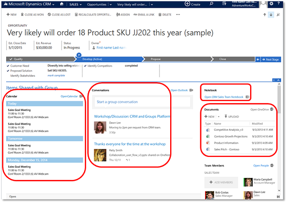

# Collaborate with your colleagues using Microsoft 365 Groups

[!INCLUDE[pn_office_365_groups](../includes/pn-office-365-groups.md)] are a shared workspace for email, conversations, files, and events where group members can collectively get stuff done.  
  
 You can use groups to collaborate with people across your company, even if they don't have access to Customer Engagement (on-premises). For example, you can create a group for your sales team and invite other [!INCLUDE[pn_Office_365](../includes/pn-office-365.md)] users to join the group, and then share documents, conversations, meeting notes, and [!INCLUDE[pn_onenote](../includes/pn-onenote.md)] information related to specific accounts or opportunities.  
  
 The groups solution works with any entities, even custom ones.  
  
> [!IMPORTANT]
> [!INCLUDE[cc_feature_requires_office_365](../includes/cc-feature-requires-office-365.md)]  
  
   
  
 Collaborate through meetings, conversations, notes, or documents.  
  
> [!NOTE]
>  Check out the following for a quick introduction to [!INCLUDE[pn_office_365_groups](../includes/pn-office-365-groups.md)]:  
> 
> -  Video: [Introducing Groups in Microsoft 365](https://go.microsoft.com/fwlink/p/?LinkID=723955).  
>   -   [Learn more about groups](https://support.office.com/article/Learn-more-about-groups-b565caa1-5c40-40ef-9915-60fdb2d97fa2?ct=t\(GS_SPO1_11_2015\)&ui=en-US&rs=en-US&ad=US).  
  
## Prerequisites  
  
- You need to have an [!INCLUDE[pn_Office_365](../includes/pn-office-365.md)] subscription which includes [!INCLUDE[pn_Exchange_Online](../includes/pn-exchange-online.md)] and [!INCLUDE[pn_sharepoint_online](../includes/pn-sharepoint-online.md)].  
  
- Before you can start using [!INCLUDE[pn_office_365_groups](../includes/pn-office-365-groups.md)], the groups solution needs to be deployed and turned on for your [!INCLUDE[pn_crm_shortest](../includes/pn-crm-shortest.md)] entities. For more information, see [Deploy Microsoft 365 Groups](../admin/deploy-office-365-groups.md).  
  
## Create or join a group  
  
1. Go to the record that you want to create a group for. For example, [!INCLUDE[proc_sales_accounts](../includes/proc-sales-accounts.md)]  
  
2. Choose an account.  
  
3. On the nav bar, choose the drop down menu next to the account name, and then select **Microsoft 365 Groups**.  
  
4. In the **Welcome to Microsoft 365 Groups for Dynamics 365 Customer Engagement (on-premises)!** section, select **Create Microsoft 365 Group** or search for an existing group to join.  
  
> [!NOTE]
> - As of November 2019, Office Groups with MIP (Microsoft Information Protection) sensitivity labels can't be created from Dynamics 365 (on-premises). You have to create the group outside of Dynamics 365 (on-premises). For more information see, [Learn more about creating new group with Sensitivity Label](https://docs.microsoft.com/microsoft-365/compliance/sensitivity-labels-teams-groups-sites#apply-a-sensitivity-label-to-a-new-group). Once this is done, add the link from Dynamics 365 (on-premises) by [joining the group](https://docs.microsoft.com/dynamics365/customerengagement/on-premises/basics/collaborate-with-colleagues-using-office-365-groups#create--or-join-a-group).
> - You can only connect to groups returned in search for which you are a member. Hover over the search results to see your status.  
>   - When you add team members to a project, they will be automatically added to the associated group.  
>   - You can associate existing groups to [!INCLUDE[pn_crm_shortest](../includes/pn-crm-shortest.md)] records. You don't need to create a new group to create an association.  
>   - When you delete a group, you'll receive a notification on the Welcome to Microsoft 365 Groups for Dynamics 365 Customer Engagement (on-premises) page so you can take the  appropriate action.  
  
## Join a meeting  
 Group meetings help all members coordinate their schedules. Everyone in the group automatically sees meeting invites and other events.  
  
-   Choose the meeting title to view meeting details.  
  
## Start a conversation  
 Having a group conversation is a way to communicate with group members. The conversations section displays each message, where you can read, reply to, and create new conversations.  
  
-   To start a new conversion, in the **Start a group conversion** box, type in your message.  
  
-   In the **Conversations** section choose a conversion to read and reply to it.  
  
## Add notes  
 Share notes with everyone in your group using the shared [!INCLUDE[pn_onenote](../includes/pn-onenote.md)] notebook. [!INCLUDE[pn_onenote](../includes/pn-onenote.md)] lets multiple people write in the same notebook, on the same page, at the same time, and it automatically merges everyone's changes.  
  
- In the **Notebook** section, choose the group's notebook. When [!INCLUDE[pn_onenote](../includes/pn-onenote.md)] opens, add your notes.  
  
## Share documents  
 When you create or upload a file in the group's [!INCLUDE[pn_onedrive_for_business](../includes/pn-onedrive-for-business.md)] page, it's automatically shared with all members of the group. When you add members to the group, they automatically get shared access to the files. By default, only group members have view and edit access to the files. When you create a group in [!INCLUDE[pn_dynamics_crm](../includes/pn-dynamics-crm.md)], it's set to private, so only the group members can see information about the group including files, conversations, or even the group itself.  
  
- To see the latest list of documents, refresh the list using by choosing the refresh icon.  
  
- To upload or manage all of your documents in [!INCLUDE[pn_onedrive_for_business](../includes/pn-onedrive-for-business.md)], select **Open [!INCLUDE[pn_onedrive](../includes/pn-onedrive.md)]**.  
  
## Use the Microsoft 365 Connectors for Groups  
 Use the [!INCLUDE[pn_Office_365](../includes/pn-office-365.md)] Connectors for Groups to connect new or existing [!INCLUDE[pn_office_365_groups](../includes/pn-office-365-groups.md)] with Customer Engagement (on-premises) so the group is notified when new activities are posted.  
  
 To set it up, see [Deploy Microsoft 365 Groups](../admin/deploy-office-365-groups.md).  
  

[!INCLUDE[footer-include](../../../includes/footer-banner.md)]