# Use Dynamics 365 for phones and tablets to run Dynamics 365 Customer Engagement (on-premises) apps

Use the Dynamics 365 for phones and Dynamics 365 for tablets mobile app to run Dynamics 365 Customer Engagement (on-premises) apps when you're on the go. With one download from your app store, you’ll automatically have access to all the apps you need for your role. 

> [!NOTE]
> There are separate mobile apps for:
>   - Dynamics 365 for phones and tablets app to run your customer engagement apps in Dynamics 365 (such as Dynamics 365 Sales, Dynamics 365 Customer Service, and Dynamics 365 Marketing): [Dynamics 365 for phones and tablets](https://docs.microsoft.com/dynamics365/mobile-app/user-guide-mobile-app)
>   - Power Apps mobile: [Run model-driven apps and canvas apps on Power Apps mobile](https://docs.microsoft.com/powerapps/mobile/run-powerapps-on-mobile)
>   - Dynamics 365 Field Service: [Field Service mobile app](https://go.microsoft.com/fwlink/?linkid=846157)
>   - Finance and Operations applications: [Finance and Operations mobile app](https://docs.microsoft.com/dynamics365/unified-operations/dev-itpro/mobile-apps/mobile-app-home-page) 

    
## Install the app from your device’s app store  
[!INCLUDE[proc_more_information](../includes/proc-more-information.md)] [Install Dynamics 365 for phones and tablets](https://docs.microsoft.com/dynamics365/mobile-app/install-dynamics-365-for-phones-and-tablets)    

## Sign in 

Sign in using your web address for the Dynamics 365 app and user name and password. If you need help with your sign-in information, contact your Dynamics 365 administrator. 

1. On the sign-in screen, select **Sign in with a web address instead**.

   > [!div class="mx-imgBorder"] 
   > . 

2. Enter the URL for your web address for the Dynamics 365 app that you use, and then select . 
3. Enter your user name and password.
4. From the list of apps that you have access to, select the app that you want to use.

   > [!div class="mx-imgBorder"] 
   > . 

### Sign out 

- From the navigation bar, select  > **User Information** > **Sign out**.

  > [!div class="mx-imgBorder"] 
  > 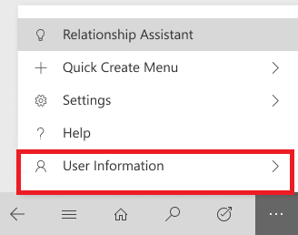
  
## Clear cache from the device

If you used the mobile app on a phone or tablet temporarily and want to remove all your cached data before giving the device to someone else, you need to reconfigure the app.

- From the nav bar, select   > **User Information** > **Reconfigure**. 

     > [!div class="mx-imgBorder"] 
     > 

Reconfiguring deletes data and metadata for the current organization from the cache, however do not rely on this as a security measure.

Make sure you use the **Reconfigure** option before you sign out. If you sign in to another organization but you wanted to delete data for the previous organization that you were logged into, then you will need to sign back into that organization and use the **Reconfigure** option to delete data and metadata for that organization from the cache. 
  
## Navigation

For phones, portrait mode is set as the default screen orientation. For tablets, landscape mode is set as the default. Screen orientation for phone and tablet apps cannot be changed. 

Use the navigation bar to get to your work area, create a new record, search, switch app, and more. 

  > [!div class="mx-imgBorder"] 
  > 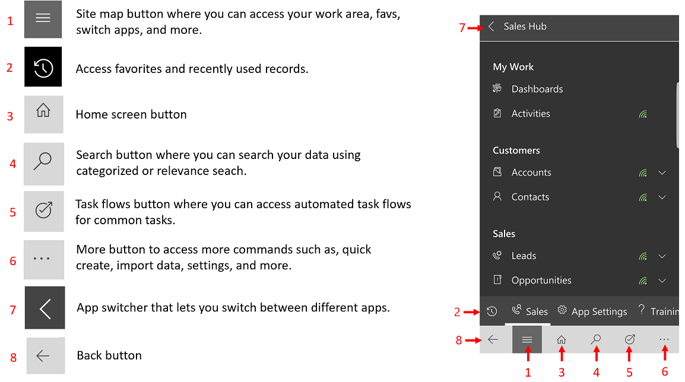

### Favorites and recently used records

The **Favorites** and **Recently Used** provides quick access to your records, views, or dashboards that you have recently used or pinned to favorites.

- To get to **Favorites** and **Recently Used**, select the site map button  > .

- To pin a record to favorites, from the list of **Recently Used** records, select the pin button next to the record that you want to add to favorites. This will move the record from  **Recently Used** to **Favorites**.

- To unpin an item from favorites, from the list of **Favorites**, select the pin button next to the record that you want to unpin.

   > [!div class="mx-imgBorder"] 
   > 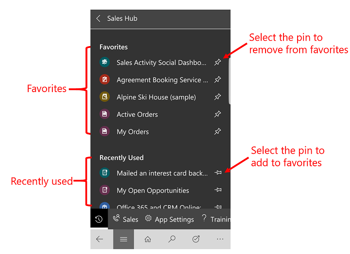

## Dashboards and charts

Dashboards give you an overview of valuable information. Select on the Home button  to view dashboards.

- To view a different dashboard, select the down arrow next to the name of the dashboard, and then select the dashboard that you want to view. 

  > [!div class="mx-imgBorder"] 
  > 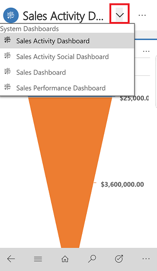
  
- To view a chart in the dashboard in full screen mode, select the Expand button .

   > [!div class="mx-imgBorder"] 
   > 
   
- To view records in chart or refresh the chart view, select  and then choose an  action: **Refresh** or **View Records**. 

   > [!div class="mx-imgBorder"] 
   > 

Charts give you a quick view of how you’re tracking to your goals. They’re interactive, so you can select an area of a chart to get more info.

- On the chart, select once to see a tooltip that provides quick info about that area of the chart.

- Select again on the same section to see a grid view with more details about the data in the chart.
  
   > [!div class="mx-imgBorder"] 
   >  
      
 
- To change the chart view to show a different breakdown of your data, select the down arrow next to the name of the chart, and then select the chart that you want to view.

  > [!div class="mx-imgBorder"] 
  > 

## Work with records

The **Quick create Menu** makes it fast and easy to add data into the system. 
    
1.  To create a new record, on the navigation bar select, the More button .

2.  Select **Quick Create Menu**.

    > [!div class="mx-imgBorder"] 
    > 

3. Select the type of activity or record you want to create. 

    > [!div class="mx-imgBorder"] 
    > 
    
4. Enter the required information for the record and then select **Save and Close**.

### Take action on record

Take action on a record without opening the record. 

1. Select the site map button , then select the record type that you want to update, such as, **Accounts**.

    > [!div class="mx-imgBorder"] 
    > 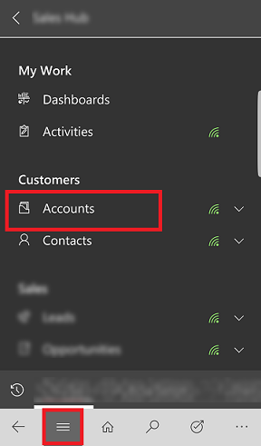.

2. From the list of records, select  on the record you want to update and then select an action such as **Assign**, **Deactivate** or **Delete**. 

    > [!div class="mx-imgBorder"] 
    > 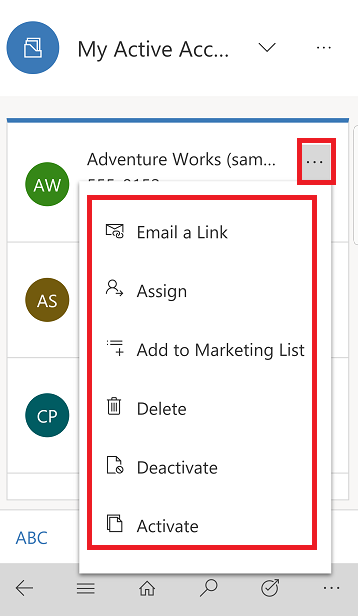.

## Add activities in the Timeline 

Activities are details that you add to a record which include things like notes, posts, task, send email, add phone call details, or set up appointments. These activities are added in the Timeline wall of a record and it keeps track of all your communications for the record in the Timeline section. The system automatically timestamps every activity and shows who created it. 

> [!NOTE]
> Recurring appointment activity is not supported on Dynamics 365 for phones app or when you run the model-driven apps web client on your mobile phone web browser. 

**Add an activity**

1. Select the site map button , then select the record type that you want to update, such as, **Accounts**. Then choose a record to open it.

    > [!div class="mx-imgBorder"] 
    > .

2. On the open record, next to **Summary** select  > **Timeline**.

    > [!div class="mx-imgBorder"] 
    > .

3. In the **Timeline** area, select the Add button  >, and then select the type of activity that you want to add.

    > [!div class="mx-imgBorder"] 
    >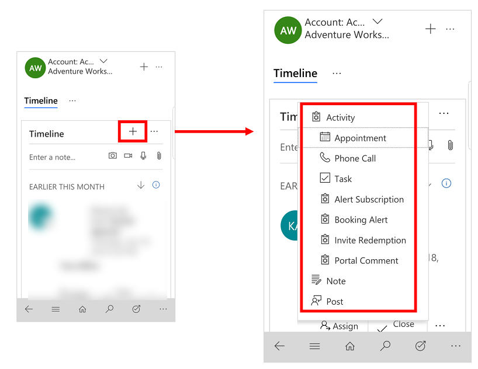

> [!NOTE]
> You can also add notes, attach photos, video, and attachments. 
 
   > [!div class="mx-imgBorder"] 
   >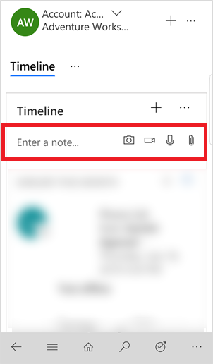

### Sort and filter the Timeline view

- Select  and select **Open Filter Pane** to filter the records in the timeline by record type or to refresh the Timeline.

- Select  to change the sort order for the records from ascending to descending and vice versa.

## Send an email or make a call

Call or send email to your customers easily from the mobile app. Open a customer record and select phone number in record to start a call, or select the email button to send an email.

   > [!div class="mx-imgBorder"] 
   > 

## Update an image for a record

To add a new image, open the record and select the current image for the record. Choose **Use Camera** to take a new picture or **Upload Image** to choose an existing image on your device. Then follow the prompts on your device to add the new image.

   > [!div class="mx-imgBorder"] 
   > 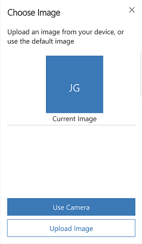

## Business process flow

Business process flows help you enter data consistently and follow the same steps every time you work with a record. As you work on a new record, the business process flow helps you see each step that you need to take to create the new record and fill out the required information according to your organizations business process.

  > [!div class="mx-imgBorder"] 
  > 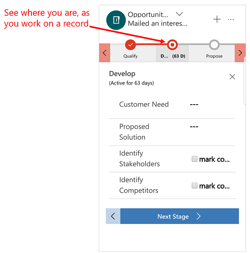

## Task Flows

Use Task Flows to complete common set of tasks. For example, if you need to perform a series of follow-up steps on a regular basis then select on the nav bar, select the Task Flow button . This will lead you through the entire task from start to finish so, you don't forget an important step.

  > [!div class="mx-imgBorder"] 
  > 

> [!NOTE]
>  Tasked based flows need to be turned on by your admin. [!INCLUDE[proc_more_information](../includes/proc-more-information.md)] [Create a mobile task flow](../customize/create-mobile-task-flow.md)

## Search for records

You can search for records across multiple entities by using Relevance search or Categorized search. Relevance search delivers fast and comprehensive results across multiple entities, in a single list, sorted by relevance. Categorized search returns search results grouped by entity types, such as accounts, contacts or leads.

Normally, Categorized search is the default search option. However, if Relevance search is enabled by your organization, it becomes the default search experience.   
  
### Normal quick find (Categorized search) 
  
- **Begins with**: Results include records that begin with a specific word. For example, if you want to search for “Alpine Ski House,” type **alp** in the search box; if you type **ski**, the record won’t show up.  
  
- **Wildcard**: For example, *ski or *ski\*  
  
### Relevance search
  
- **Search within**: Results include records that contain a field with all of the words in the search term.  The individual words can appear anywhere in the string and in any order.  For example, if you search for “Alpine Ski House,” you could find results for “I left the house today to go skiing in the Alpine Meadows,” since all of the search words appear somewhere in the string.  

### Switch between Relevance and Categorized search

If your organization has turned on both search options (Relevance and Categorized search), then you can switch between the two.

1. To switch between search types, on the nav bar, select the Search button .

2. At the top select the drop-down to switch between **Relevance Search** or **Categorized Search**.

    > [!div class="mx-imgBorder"] 
    > 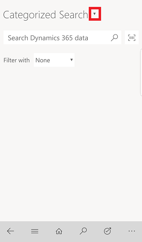

### Start a search  
  
1.  On the nav bar, select the Search button .
  
2.  Type your search words in the search box and then select Search button.  

### Search using the barcode scanner

Rather than manually typing a barcode number into a field, you can scan barcodes by using your device's camera. This makes it easy to capture info about inventory and other issues when you're out in the field. 

- To use the barcode scanner, when you are in search mode, select the Barcode Scanner button  and then follow the prompts on your device.

## Relationship Assistant

The relationship assistant is designed to deliver the most important and relevant information in relation to what you are doing right now. The assistant works by analyzing all of the data at its disposal and generating a collection of action cards, each of which includes a message summarizing what the card is about, plus a set of links for taking action. The assistant sorts the cards by priority and filters them for your current context.

The assistant reminds you of upcoming activities; it evaluates your communications and suggests when it might be time to reach out to a contact that’s been inactive for a while; it identifies email messages that may be waiting for a reply from you; it alerts you when an opportunity is nearing its close date; and much more.

The assistant draws your attention to your most important items and tasks, drawn from all areas of the app.

- To access the assistant, on the nav bar, select the More button   > **Relationship Assistant**.

    > [!div class="mx-imgBorder"] 
    > 
 

## Privacy notices  
[!INCLUDE[cc_privacy_crm_for_tablets](../includes/cc-privacy-crm-for-tablets.md)]
  

  
[!INCLUDE[cc_privacy_moca_user_content_and_location](../includes/cc-privacy-moca-user-content-and-location.md)]

