# Find your way around Dynamics 365 Customer Engagement (on-premises)

::: moniker range=">= op-9-1"

[!INCLUDE [applies-to-on-premises](../includes/applies-to-on-premises.md)] [Basic navigation in a model-driven app](/powerapps/user/navigation)

With Dynamics 365 Customer Engagement (on-premises), version 9.1 your system administrator has the option to enable the new Unified Interface which changes the look and feel of your app and how you navigate the app. This article explains how to use an app in both Unified Interface and Legacy Web Client.

For more information about Unified Interface, see [About Unified Interface in Dynamics 365 Customer Engagement (on-premises)](../admin/about-unified-interface.md

If you're system administrator hasn't enabled the new interface then you'll see the Legacy Web Client. The easiest way to know if you're using Unified Interface or the Legacy Web Client is to look at the site map. 

In Unified Interface the site map is on the left.

> [!div class="mx-imgBorder"]
> 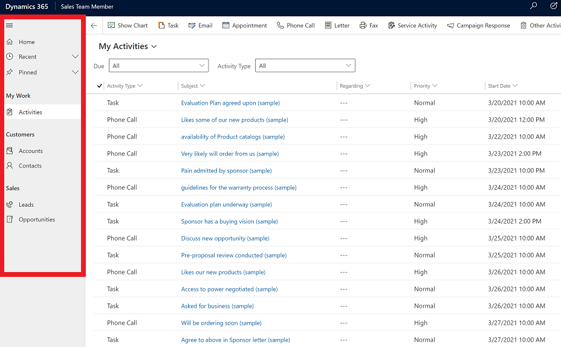

The site map in the Legacy Web Client is at the top.

> [!div class="mx-imgBorder"]
> 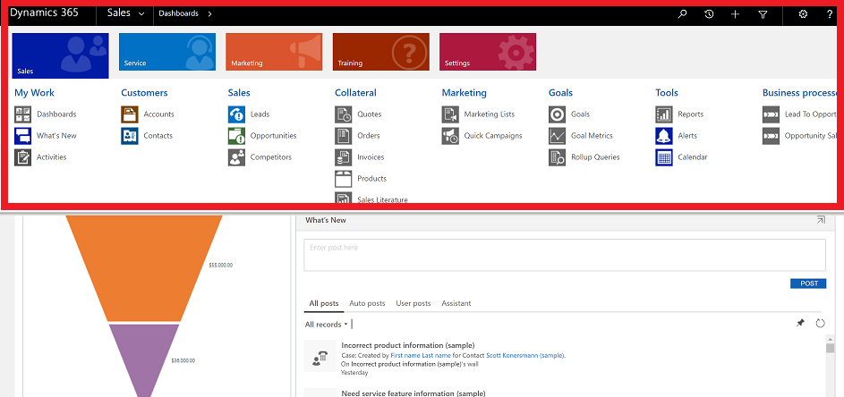

 
## Navigation in Unified Interface

Unified Interface provides a consistent and accessible user experience across devices—whether on a desktop, laptop, tablet, or phone. The apps scale by reflowing the components on the screen. The responsive design adapts to your environment based on screen size, so the more available space that you have, the more information can be displayed.

- *Apps* provide a collection of functionalities for accomplishing a specific class of activity, such as managing your accounts and contacts. Use the app-selector menu to navigate between the apps that are available to your organization.

- A *work area* is a subdivision of an app, dedicated to a specific feature. Each work area provides a targeted collection of entities for working in that area. In some cases, the same entity appears in more than one area (or even more than one app). The Contact and Account entities, for example, appear in a variety of apps and work areas. Use the work-area menu to navigate between work areas for your current app.

- *Entities* represent a specific type of data, such as a contacts and accounts. Entities use a structured data format, which defines the collection of fields available to the entity. Each entity consists of a collection of individual records. For example, for the Contact entity, each record describes a single person, and each record includes a collection of fields such as first name, last name, and email address. Entities normally present two views: a list view, which is typically a entity listing available records; and a form view, which shows all available data and settings for a single record. Use the side navigator to move between entities in your current work area.

### Move between apps

Use the app-selector menu to switch between apps.

1. Select the current app name.

   > [!div class="mx-imgBorder"]
   > 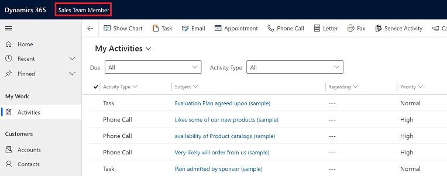

2. On the **Apps** page select an app. You will only see apps for your organization.

   > [!div class="mx-imgBorder"]
   > 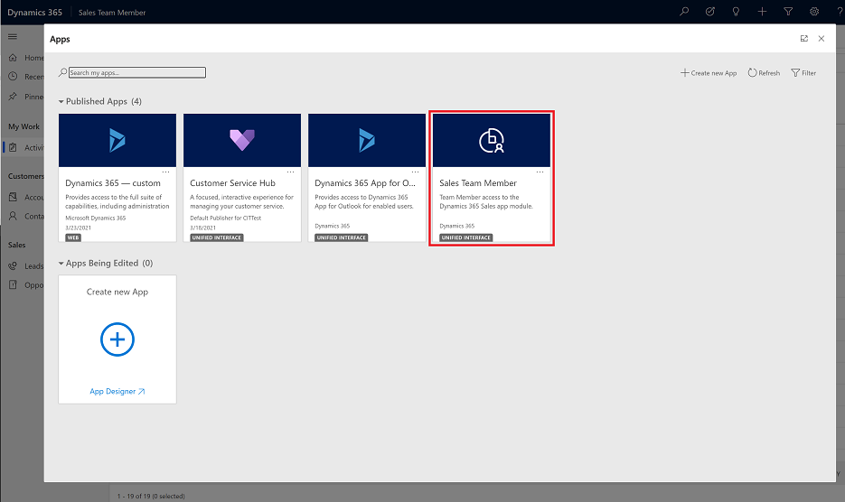

### Move between pages and records

It's easy to get around and get back to your favorite or most-used items. The following illustration shows the primary navigation elements.

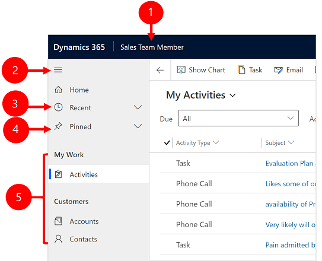  

Legend
  
1. **Click to change app**: Select the current app name to change to a different app. 
2. **Collapse/expand button**: Select this to collapse the navigator to allow more room for the main part of the page. If the navigator is already collapsed, select this button to expand it again. 
3. **Recent records**: Expand this entry to view a list of records you were recently using. Select a record here to open it. Select the push-pin icon next to a record listed here to add it to your favorites (pinned records).
4. **Favorite records**: Expand this entry to view and open your favorite (pinned) records. Use the **Recent records** list to add records here. Select the remove-pin icon next to a record listed here to remove it from this list.
5.  **Page navigation**: This area lists each entity and dashboard page available for the current work area. Select any entry here to open the named dashboard or list view for that entity.

### Go back 

Use the back button for form, view, and dashboard pages on the command bar to go back to the previous page.

To go back to the previous page, select the **Go back** button.

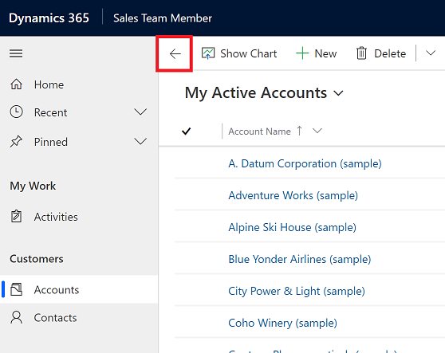 

### Working with list views

Usually, when you first open a entity, you'll see the list view, which shows a list of records belonging to that entity, formatted as a table. For example, if you open the **Products** entity, you'll see a list of accounts.

Legend:

1. **Go back**: Select to go back to the previous page.
2. **Select records**: Select one or more records by placing a check mark in this column. Depending on where you're working, you might be able to apply a single operation to all the selected records at once by using buttons in the command bar. Note, when you use the **Email a link** command on the command bar you can only select up to ten records to send via email. 
3. **Open a record**: Select any record in the list to open its record view, which shows all the details about the record. Usually you select from the **Name** field to open a record from the current entity. Some entities provide links to records from related entities in other fields (such as a related contact).
4. **Sort or filter the list**: Select to sort the list by values in that field or filter the list by values in that field. An arrow in the column heading indicates which column is being sorted and in which direction. 
5. **Open advanced filtering panel**: See which filters are applied to the current view and add or modify view filters.
6. **Command bar**: Use the commands in the command bar to operate on records in the list and perform related actions. Some commands (such as **Delete**) require that you first select one or more target records by placing a check mark in the leftmost column, while others operate on the entire list. You can export the list to an Excel workbook (possibly based on a template), open charts and dashboards, and more, depending on the type of records you're working with.
7. **Search this view**: Enter text in the search field to show only those records in the current view that contain your text.
8. **Jump bar and paging**: Select a letter to show only those records whose names start with that letter. If the list contains more records than can be shown on one page, use the paging arrows at the bottom of the list to move forward and backward through the pages.

### Working with record views

Record views show all the details about a single record and sometimes also provide special features for working with it. Usually you'll open a record view by selecting a record that appears in a list view, but you can also open a record view by following a link from a related record.

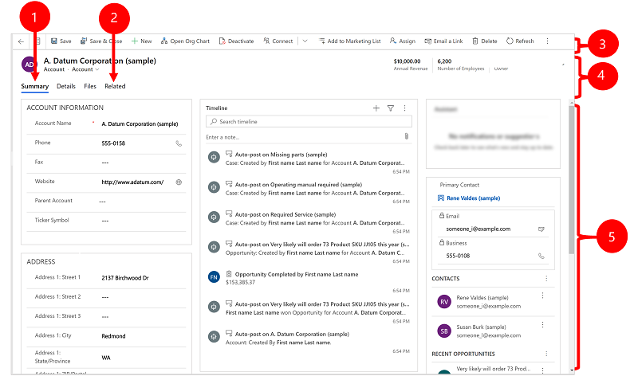

Legend:

1. **Tabs**: Most record views are divided into tabs. Each tab provides a collection of related fields from the record. When tabs are available, they're listed below the record name. Select any tab name to go to that tab. The current tab is shown underlined.
2. **Related**: Nearly all types of records show a **Related** tab after you've saved them at least once. This tab is actually a drop-down list that you can use to find other types of records that use or reference the displayed record. 
When you choose a entity name from the **Related** drop-down list, a new tab named for that entity opens, showing a list of all related records of that type. The **Related** tab remains available, and you can still use it to find other types of records that reference the current one.
3. **Command bar**: Use the commands in the command bar to operate on the current record or perform a task related to the record. The available commands vary based on the record type, but you can typically use the command bar to save your changes, delete the record, refresh the page, email a link to the record, reassign the record owner, or export the record by using a Word template.
4. **Heading bar**: Some record views display a few especially important fields in the heading bar, opposite the record name. These are typically fields that are fundamental to working with records of the current type (such as a record name or record owner).
5. **View and edit all field values**: In the main body of the record view, you'll find all of the fields related to the current tab, form view, and record type. Fields marked with a red asterisk are required, and you can't save the record without their having valid values. Fields marked with a blue plus sign are especially important or recommended, but aren't strictly required. Fields showing a lock icon are read-only and can't be edited.

### Record set navigation 

Navigate through multiple records by using preset views and queries. The record-focused navigation improves productivity by allowing users to jump from record to record in the list and easily navigate back without losing their working list.

The number of records that you see in the record set navigation pane is based on the number of records that your system administrator has defined for the subgrid.

1. To use record set navigation, open a page with a list of records.
2. Open a record and then select **Open Record Set**  and then select a record from the list. 

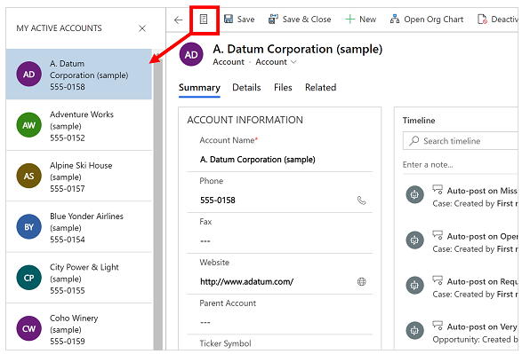   

### Reference panel

The reference panel is a great way to get work done without moving away from the screen you're on. You can look up other related items&mdash;such as reviews or reservations for a product&mdash;within the context of the record you're viewing, without having to navigate to other screens.

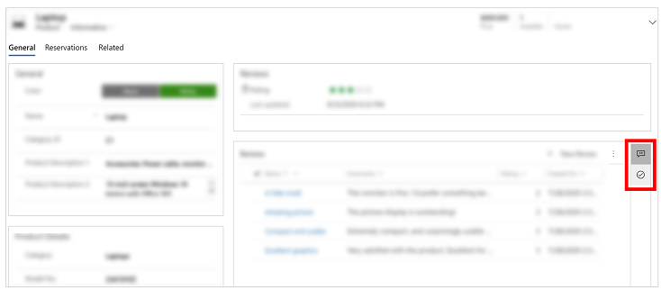

 Watch this video to learn more about the reference panel:

<iframe src="https://www.youtube.com/embed/ruAPEKY5vNc" frameborder="0" allowfullscreen=""></iframe>

### App message bar 

The app message bar shows three types of notifications: informational, warning, and error. 

When you select the error notification, it will take you to the field on the form where the error occurred.

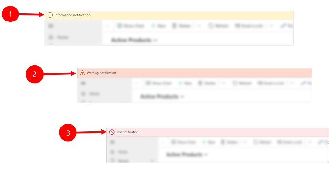   

Legend:

1. **Information notifications** : The notification is informational.
2. **Warning notifications** : The notification is a warning. 
3. **Error notifications** : The notification is an error. 

#### Multiple notification

If there is only one notification, you'll see a single line. If there are multiple notifications, you'll see chevron button. Select the chevron to view each message.

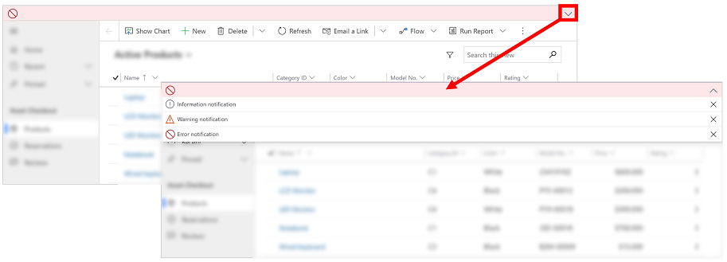

### Unified Interface navigation for specific apps

With Unified Interface for Customer Engagement (on-premises), navigation in app works the same as model-driven apps. Review the articles below to learn about basic navigation for a specific app.

- [Find your way around the Sales Hub app](../sales-enterprise/user-guide-learn-basics.md)
- [Find your way around the Customer Service Hub app](../customer-service/customer-service-hub-user-guide-basics.md#understand-the-site-map-navigation)

## Navigation in Legecy Web Client

When you open an app, you'll see tiles and icons (called a *sitemap*) for that app. Use the icons to access different types of information relevant to that role.  
  
 The following illustrations describe the sitemaps for the  Sales, Customer Service, and Customer Engagement (on-premises) – Custom apps.  
  
> [!NOTE]
>  Your Sales or Customer Service app sitemap may be different if your app has been customized.  
  
##### Sales app sitemap  
 ")  
  
 **1**. **Dashboards** collect all your most important data in one place. You can select from several dashboards for your role.  
  
 **2**. Monitor real-time updates in **What's New** on your dashboard. Stay current on fast-moving sales, customer projects, and marketing campaigns in your organization.  
  
 **3**. Keep track of tasks, email messages, appointments, phone calls, and more in **Activities**.  
  
 **4**. Keep track of companies you do business with in **Accounts**.  
  
 **5**. Store info about the people you work with in **Contacts**.  
  
 **6**. Use **Leads** to keep track of business prospects you haven't yet qualified through your sales process.  
  
 **7**. **Opportunities** are leads who are almost ready to buy.  
  
 **8**. Track your **Competitors** so you know their strengths and weaknesses.  
  
 **9**. Most sales begin with **Quotes**, which eventually become orders.  
  
 **10**. Create **Orders** when your customers are ready to buy.  
  
 **11**. When customers place orders, create **Invoices** to bill them for the upcoming sales.  
  
 **12**. **Products** are the backbone of the business. Sales reps use the products list to generate sales quotes, marketing campaigns, orders, and invoices.  
  
 **13**. Access sales information for your team in **Sales Literature**.  
  
 **14**. Create **Marketing Lists** to run your marketing campaigns.  
  
 **15**. Use **Quick Campaigns** to send an email blast to customers who fit a specific demographic profile.  
  
 **16**. Use **Goals** to keep track of your progress on achieving target revenue.  
  
 **17**. Goals require **Goal Metrics** (a number or a dollar amount), which determine how goals are measured.  
  
 **18**. Use **Rollup Queries** to gather data about a given goal, including all its related goals, in one view.  
  
 **19**. Dynamics 365 Customer Engagement (on-premises) comes with many built-in **Reports**. You can access and run them from here, or you can create your own reports.  
  
 **20**. **Alerts** shows system-wide alerts to let you know about issues such as problems with your mailbox.  
  
 **21**. The **Calendar** shows all your scheduled appointments. You can use rules when scheduling appointments.  
  
##### Customer service app sitemap  
   
  
 **1**. **Dashboards** collect all your most important data in one place. You can select from several dashboards for your role.  
  
 **2**. Keep track of tasks, email messages, appointments, phone calls, and more in **Activities**.  
  
 **3**. Keep track of companies you do business with in **Accounts**.  
  
 **4**. Store info about the people you work with in **Contacts**.  
  
 **5**. Use **Social Profiles** to track a contact's presence in social media.  
  
 **6**. Track your customer requests and issues in **Cases**.  
  
 **7**. Use the **Service Calendar** to view your organization's daily, weekly, and monthly schedule of appointments and service activities.  
  
 **8**. Check **Queues** to see the cases waiting for you to work on.  
  
 **9**. View the list of your company's **Products** when you're working on customer service cases.  
  
 **10**. Tracks the specifics of **Services** provided by your business.  
  
 **11**. Dynamics 365 Customer Engagement (on-premises) comes with many built-in **Reports**. You can access and run them from here, or you can create your own reports.  
  
 **12**. The **Calendar** shows all your scheduled appointments. You can use rules when scheduling appointments.  
  
##### Dynamics 365 Customer Engagement (on-premises)- Custom (Settings) sitemap  
  Settings sitemap")  
  
 **1**. Use **Business Management** to set a variety of business settings. For example, set fiscal year settings, or when your business is closed.  
  
 **2**. Speed up the creation of articles, email, email signatures, documents, contracts, and mail-merges by creating **Templates**.  
  
 **3**. Manage products for your **Product Catalog**. This is also where you create discount and price lists, and set up unit groups for products.  
  
 **4**. Use **Service Management** to set up queues, routing rules, entitlements, service schedule, holiday schedule, and more.  
  
 **5**. Use **Mobile Offline** to enable mobile offline synchronization, enable entities for mobile offline, create profiles, and add users to a profile.  
  
 **6**. See **Sync Errors** associated with mobile offline.  
  
 **7**. Use **Customizations** to make Dynamics 365 Customer Engagement (on-premises) work the way your business does: add or remove fields, create or customize forms, reports, views, dashboards, charts, and more.  
  
 **8**. It's a best practice to keep your customizations separate from the default solution. Create and manage your **Solutions** here.  
  
 **9**.  Go to the **Dynamics Marketplace** to find industry-specific apps on App Source.  
  
 **10**. The **Plug-In Trace Log** allows developers to use the iTracingService, and provides a way to see traces without requiring an error to occur to see the trace.  Use this item to see a grid of all the Plug-in Trace Logs per plug-in execution.  
  
 **11**. Use **Administration** for a variety of tasks such as adding and removing support for languages. This is also where you can access the System Settings dialog box where you set a variety of different settings.  
  
 **12**. Use **Security** to add users and specify their security roles. You can also set up teams and business units.  
  
 **13**. Use **Data Management** to turn sample data on or off, import data, set up duplicate detection rules, and more.  
  
 **14**. Several Dynamics 365 Customer Engagement (on-premises) features use **System Jobs** to perform tasks automatically, including workflows, import, and duplicate detection. Monitor your system jobs here.  
  
 **15**. Use **Document Management** to set up SharePoint integration. With SharePoint, your team can work together on the same documents. SharePoint integration is also required if you want to use other collaboration features like OneNote, OneDrive for Business, or Microsoft 365 Groups with Dynamics 365 Customer Engagement (on-premises).  
  
 **16**. Enable **Auditing** to track changes made to your business data.  
  
 **17**. Use **Email Configuration** to integrate Outlook or web mail systems with Dynamics 365 Customer Engagement (on-premises). You can also manage and monitor mailboxes from here.  
  
 **18**. Users can stay up-to-date on what's happening in your organization by using **Activity Feeds**. This is where you can administer them. But consider Yammer integration as an alternative to Activity Feeds.  
  
 **19**. Use **Activity Feeds Rules** to specify when posts will automatically be created for followed records.  
  
 **20**. Set up **Dynamics 365 for Outlook**, which is an Office add-on for Microsoft Outlook. With Dynamics 365 for Outlook, users can view Dynamics 365 Customer Engagement (on-premises) data from Outlook, and can track Outlook email and appointment records with a single click.  
  
 **21**. Set up **Relationship Insights** to continuously analyze a vast collection of data to help users better understand business relationships, evaluate their activities in relation to previous successes, and choose the best path forward.  
  
 **22**. Use **Processes** to create business process flows, workflows, dialogs, and actions.  
  
 **23**. The **Interactive Service Hub** includes rich dashboards and forms that pull key information together for service workers so they can get things done faster.  
  
 **24**. Go to **My apps** to see the list of apps you can access.  
  
##### Navigation bar buttons  
 The navigation bar in each app has the same buttons:  
  
  navigation bar buttons")  
  
 **1**.  Do a simple search for a record.  
  
 **2**.  Get back to your pinned  or most-recently-used records.  
  
 **3**.  Add a new record.  
  
 **4**.  Do an advanced search using filters, sorting, and criteria.  
  
 **5**.  Set personal options.  
  
 **6**.  Get in-context help (guided tasks, videos, eBooks, and topics).  
  
  

[!INCLUDE[footer-include](../../../includes/footer-banner.md)]

::: moniker-end

::: moniker range="< op-9-1"

[!INCLUDE [applies-to-on-premises](../includes/applies-to-on-premises.md)] [Basic navigation in a model-driven app](/powerapps/user/navigation)
 

 When you open an app, you'll see tiles and icons (called a *sitemap*) for that app. Use the icons to access different types of information relevant to that role.  
  
 The following illustrations describe the sitemaps for the  Sales, Customer Service, and Customer Engagement (on-premises) – Custom apps.  
  
> [!NOTE]
>  Your Sales or Customer Service app sitemap may be different if your app has been customized.  
  
##### Sales app sitemap  
 ")  
  
 **1**. **Dashboards** collect all your most important data in one place. You can select from several dashboards for your role.  
  
 **2**. Monitor real-time updates in **What's New** on your dashboard. Stay current on fast-moving sales, customer projects, and marketing campaigns in your organization.  
  
 **3**. Keep track of tasks, email messages, appointments, phone calls, and more in **Activities**.  
  
 **4**. Keep track of companies you do business with in **Accounts**.  
  
 **5**. Store info about the people you work with in **Contacts**.  
  
 **6**. Use **Leads** to keep track of business prospects you haven't yet qualified through your sales process.  
  
 **7**. **Opportunities** are leads who are almost ready to buy.  
  
 **8**. Track your **Competitors** so you know their strengths and weaknesses.  
  
 **9**. Most sales begin with **Quotes**, which eventually become orders.  
  
 **10**. Create **Orders** when your customers are ready to buy.  
  
 **11**. When customers place orders, create **Invoices** to bill them for the upcoming sales.  
  
 **12**. **Products** are the backbone of the business. Sales reps use the products list to generate sales quotes, marketing campaigns, orders, and invoices.  
  
 **13**. Access sales information for your team in **Sales Literature**.  
  
 **14**. Create **Marketing Lists** to run your marketing campaigns.  
  
 **15**. Use **Quick Campaigns** to send an email blast to customers who fit a specific demographic profile.  
  
 **16**. Use **Goals** to keep track of your progress on achieving target revenue.  
  
 **17**. Goals require **Goal Metrics** (a number or a dollar amount), which determine how goals are measured.  
  
 **18**. Use **Rollup Queries** to gather data about a given goal, including all its related goals, in one view.  
  
 **19**. Dynamics 365 Customer Engagement (on-premises) comes with many built-in **Reports**. You can access and run them from here, or you can create your own reports.  
  
 **20**. **Alerts** shows system-wide alerts to let you know about issues such as problems with your mailbox.  
  
 **21**. The **Calendar** shows all your scheduled appointments. You can use rules when scheduling appointments.  
  
##### Customer service app sitemap  
   
  
 **1**. **Dashboards** collect all your most important data in one place. You can select from several dashboards for your role.  
  
 **2**. Keep track of tasks, email messages, appointments, phone calls, and more in **Activities**.  
  
 **3**. Keep track of companies you do business with in **Accounts**.  
  
 **4**. Store info about the people you work with in **Contacts**.  
  
 **5**. Use **Social Profiles** to track a contact's presence in social media.  
  
 **6**. Track your customer requests and issues in **Cases**.  
  
 **7**. Use the **Service Calendar** to view your organization's daily, weekly, and monthly schedule of appointments and service activities.  
  
 **8**. Check **Queues** to see the cases waiting for you to work on.  
  
 **9**. View the list of your company's **Products** when you're working on customer service cases.  
  
 **10**. Tracks the specifics of **Services** provided by your business.  
  
 **11**. Dynamics 365 Customer Engagement (on-premises) comes with many built-in **Reports**. You can access and run them from here, or you can create your own reports.  
  
 **12**. The **Calendar** shows all your scheduled appointments. You can use rules when scheduling appointments.  
  
##### Dynamics 365 Customer Engagement (on-premises)- Custom (Settings) sitemap  
  Settings sitemap")  
  
 **1**. Use **Business Management** to set a variety of business settings. For example, set fiscal year settings, or when your business is closed.  
  
 **2**. Speed up the creation of articles, email, email signatures, documents, contracts, and mail-merges by creating **Templates**.  
  
 **3**. Manage products for your **Product Catalog**. This is also where you create discount and price lists, and set up unit groups for products.  
  
 **4**. Use **Service Management** to set up queues, routing rules, entitlements, service schedule, holiday schedule, and more.  
  
 **5**. Use **Mobile Offline** to enable mobile offline synchronization, enable entities for mobile offline, create profiles, and add users to a profile.  
  
 **6**. See **Sync Errors** associated with mobile offline.  
  
 **7**. Use **Customizations** to make Dynamics 365 Customer Engagement (on-premises) work the way your business does: add or remove fields, create or customize forms, reports, views, dashboards, charts, and more.  
  
 **8**. It's a best practice to keep your customizations separate from the default solution. Create and manage your **Solutions** here.  
  
 **9**.  Go to the **Dynamics Marketplace** to find industry-specific apps on App Source.  
  
 **10**. The **Plug-In Trace Log** allows developers to use the iTracingService, and provides a way to see traces without requiring an error to occur to see the trace.  Use this item to see a grid of all the Plug-in Trace Logs per plug-in execution.  
  
 **11**. Use **Administration** for a variety of tasks such as adding and removing support for languages. This is also where you can access the System Settings dialog box where you set a variety of different settings.  
  
 **12**. Use **Security** to add users and specify their security roles. You can also set up teams and business units.  
  
 **13**. Use **Data Management** to turn sample data on or off, import data, set up duplicate detection rules, and more.  
  
 **14**. Several Dynamics 365 Customer Engagement (on-premises) features use **System Jobs** to perform tasks automatically, including workflows, import, and duplicate detection. Monitor your system jobs here.  
  
 **15**. Use **Document Management** to set up SharePoint integration. With SharePoint, your team can work together on the same documents. SharePoint integration is also required if you want to use other collaboration features like OneNote, OneDrive for Business, or Microsoft 365 Groups with Dynamics 365 Customer Engagement (on-premises).  
  
 **16**. Enable **Auditing** to track changes made to your business data.  
  
 **17**. Use **Email Configuration** to integrate Outlook or web mail systems with Dynamics 365 Customer Engagement (on-premises). You can also manage and monitor mailboxes from here.  
  
 **18**. Users can stay up-to-date on what's happening in your organization by using **Activity Feeds**. This is where you can administer them. But consider Yammer integration as an alternative to Activity Feeds.  
  
 **19**. Use **Activity Feeds Rules** to specify when posts will automatically be created for followed records.  
  
 **20**. Set up **Dynamics 365 for Outlook**, which is an Office add-on for Microsoft Outlook. With Dynamics 365 for Outlook, users can view Dynamics 365 Customer Engagement (on-premises) data from Outlook, and can track Outlook email and appointment records with a single click.  
  
 **21**. Set up **Relationship Insights** to continuously analyze a vast collection of data to help users better understand business relationships, evaluate their activities in relation to previous successes, and choose the best path forward.  
  
 **22**. Use **Processes** to create business process flows, workflows, dialogs, and actions.  
  
 **23**. The **Interactive Service Hub** includes rich dashboards and forms that pull key information together for service workers so they can get things done faster.  
  
 **24**. Go to **My apps** to see the list of apps you can access.  
  
##### Navigation bar buttons  
 The navigation bar in each app has the same buttons:  
  
  navigation bar buttons")  
  
 **1**.  Do a simple search for a record.  
  
 **2**.  Get back to your pinned  or most-recently-used records.  
  
 **3**.  Add a new record.  
  
 **4**.  Do an advanced search using filters, sorting, and criteria.  
  
 **5**.  Set personal options.  
  
 **6**.  Get in-context help (guided tasks, videos, eBooks, and topics).  
  
  

[!INCLUDE[footer-include](../../../includes/footer-banner.md)]

::: moniker-end
