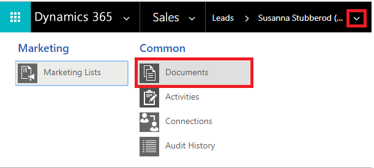
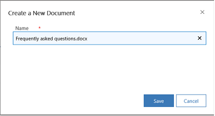
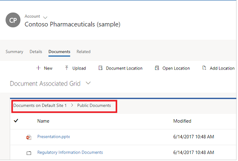
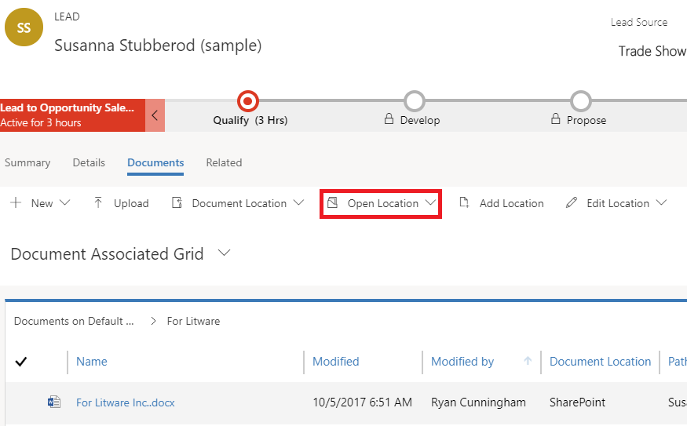
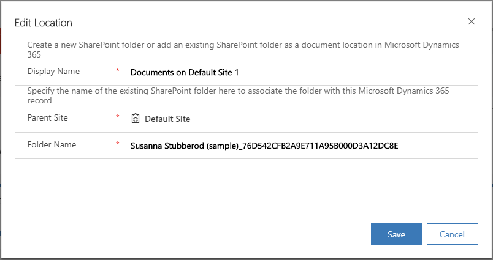
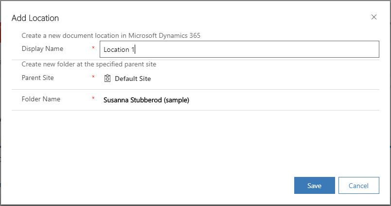

# Manage your SharePoint documents and document locations from Dynamics 365 Customer Engagement (on-premises).

::: moniker range=">= op-9-1"

[!INCLUDE [applies-to-unified-interface](../includes/applies-to-unified-interface.md)] [Collaborate using SharePoint](/powerapps/user/collaborate-using-sharepoint)

With Dynamics 365 Customer Engagement (on-premises), you can store your documents on [!INCLUDE[pn-sharepoint-short](../includes/pn-sharepoint-short.md)] and manage them from within your app.

The documents that you create in [!INCLUDE[pn-crm-shortest](../includes/pn-crm-shortest.md)] are stored on [!INCLUDE[pn-sharepoint-short](../includes/pn-sharepoint-short.md)], and are automatically synced to your desktop and mobile devices.

> [!Note]
> Before you can use [!INCLUDE[pn-sharepoint-short](../includes/pn-sharepoint-short.md)] to store the documents, it must be enabled by your system administrator.
> 
> [!Important]
> This feature requires that you have an [!INCLUDE[pn-office-365](../includes/pn-office-365.md)] subscription or a subscription to an online service such as [!INCLUDE[pn-sharepoint-short](../includes/pn-sharepoint-short.md)].

## What record types support document management?

By default, [!INCLUDE[pn-sharepoint-short](../includes/pn-sharepoint-short.md)] is enabled for the following entities:

-   Account

-   Article

-   Category

-   Knowledge Article

-   Lead

-   Opportunity

-   Quote

-   Product

-   Sales Literature

## Where do you access the documents from?

For record types that support document management, open the record, select the **Related** tab, and then select **Documents**.

  

## What happens when you navigate to the Documents tab first time?

When [!INCLUDE[pn-sharepoint-short](../includes/pn-sharepoint-short.md)] is enabled, for record types that support document management, a default document location (folder) is automatically created on [!INCLUDE[pn-sharepoint-short](../includes/pn-sharepoint-short.md)] the first time you go to the **Documents** tab. The name of the document location is in the following format: &lt;record\_name&gt;\_&lt;record\_id&gt;.

By default, the location is set to Documents on Default Site 1.

## View existing SharePoint documents

### Open the Document Associated grid in a web app

1. Go to the record for which you want to view the associated documents. For example, select **Sales** > **Leads**.

2. In the web app, on the command bar, select the arrow besides the record name, and select **Documents**.

   

### Open the Document Associated grid in a mobile-optimized app

1. Select the site map , and then select **Opportunities**

2. Select the **Related** tab, and then select **Documents**.

   
  
   [!INCLUDE[pn-crm-shortest](../includes/pn-crm-shortest.md)] organizes documents in a consolidated view.

3. Select **Document Location** to filter the document list. Select from the available document locations.

## Create a new document

To create a new [!INCLUDE[pn-sharepoint-short](../includes/pn-sharepoint-short.md)] document in [!INCLUDE[pn-crm-shortest](../includes/pn-crm-shortest.md)]:

1. Go to the record you want to create the document for, and select the **Documents** tab.

2. Navigate to the document location and folder where you want to create this new document.

3. Select **New**, and then choose a document type such as [!INCLUDE[cc-microsoft](../includes/cc-microsoft.md)] Word, [!INCLUDE[cc-microsoft](../includes/cc-microsoft.md)] [!INCLUDE[pn-excel-short](../includes/pn-excel-short.md)], [!INCLUDE[cc-microsoft](../includes/cc-microsoft.md)] [!INCLUDE[pn-ms-powerpoint](../includes/pn-ms-powerpoint.md)], or [!INCLUDE[pn-onenote](../includes/pn-onenote.md)].

   You can also create a folder from here.

4. In the **Create a New Document dialog** box, enter a document or folder name.

     

5. Select **Save**.

   The document is created in the folder of the current document location you're in.

   If you create a folder, you'll be able to see a folder hierarchy at the top of Documents list. 
 
     

   Select on the folder name to navigate between the folders.

## Upload a document

To upload existing document to [!INCLUDE[pn-sharepoint-short](../includes/pn-sharepoint-short.md)] from [!INCLUDE[pn-ms-dyn-365-for-sales](../includes/pn-ms-dyn-365-for-sales.md)]:

1. Go to the record you want to create the document for, and select the **Documents** tab.

2. Select **Upload.**

3. Choose the file you want to upload. You can choose only one file at a time.

   The document is created in the folder of the current document location you're in.

   > [!Note]
   > You can upload a file of up to 50 MB. If your internet connection is slow, you might get an error while uploading large files.

4. If files with the same name exist in [!INCLUDE[pn-sharepoint-short](../includes/pn-sharepoint-short.md)], select whether you want to overwrite the files.

5. Select **OK**.

## Manage SharePoint locations

[//]: # (What does "In the **Documents** list" refer to?)
You can create new or edit existing [!INCLUDE[pn-sharepoint-short](../includes/pn-sharepoint-short.md)] locations from [!INCLUDE[pn-ms-dyn-365-for-sales](../includes/pn-ms-dyn-365-for-sales.md)].

In the **Documents** list

1. To open the location, on the command bar, select **Open Location**, and then select the location.

     

2. To edit the location, on the command bar, select **Edit Location** &gt; &lt;location name&gt;.

 

  The **Edit Location** dialog box appears.

    

3. The display name, parent site, and folder name are automatically populated. Enter details about the new location, and then select **Save**.

4. To add a location, on the command bar, select **Add Location**.

   The **Add Location** dialog box appears.

     

5. The display name, parent site, and folder name are automatically populated. Change the details if required, and then select **Save**.

## Actions on documents

When you select one or more documents in the Documents list, you can take the following other common [!INCLUDE[pn-sharepoint-short](../includes/pn-sharepoint-short.md)] actions on the documents:

-   Edit

-   Delete

-   Check in

-   Check out

-   Discard check out

-   Edit properties

[!INCLUDE[footer-include](../../../includes/footer-banner.md)]

::: moniker-end

::: moniker range="< op-9-1"

[!INCLUDE [applies-to-on-premises](../includes/applies-to-on-premises.md)] [Collaborate using SharePoint](/powerapps/user/collaborate-using-sharepoint)

With Dynamics 365 Customer Engagement (on-premises), you can store your documents on [!INCLUDE[pn-sharepoint-short](../includes/pn-sharepoint-short.md)] and manage them from within your app.

The documents that you create in [!INCLUDE[pn-crm-shortest](../includes/pn-crm-shortest.md)] are stored on [!INCLUDE[pn-sharepoint-short](../includes/pn-sharepoint-short.md)], and are automatically synced to your desktop and mobile devices.

> [!Note]
> Before you can use [!INCLUDE[pn-sharepoint-short](../includes/pn-sharepoint-short.md)] to store the documents, it must be enabled by your system administrator.
> 
> [!Important]
> This feature requires that you have an [!INCLUDE[pn-office-365](../includes/pn-office-365.md)] subscription or a subscription to an online service such as [!INCLUDE[pn-sharepoint-short](../includes/pn-sharepoint-short.md)].

## What record types support document management?

By default, [!INCLUDE[pn-sharepoint-short](../includes/pn-sharepoint-short.md)] is enabled for the following entities:

-   Account

-   Article

-   Category

-   Knowledge Article

-   Lead

-   Opportunity

-   Quote

-   Product

-   Sales Literature

## Where do you access the documents from?

For record types that support document management, open the record, select the **Related** tab, and then select **Documents**.

  

## What happens when you navigate to the Documents tab first time?

When [!INCLUDE[pn-sharepoint-short](../includes/pn-sharepoint-short.md)] is enabled, for record types that support document management, a default document location (folder) is automatically created on [!INCLUDE[pn-sharepoint-short](../includes/pn-sharepoint-short.md)] the first time you go to the **Documents** tab. The name of the document location is in the following format: &lt;record\_name&gt;\_&lt;record\_id&gt;.

By default, the location is set to Documents on Default Site 1.

## View existing SharePoint documents

### Open the Document Associated grid in a web app

1. Go to the record for which you want to view the associated documents. For example, select **Sales** > **Leads**.

2. In the web app, on the command bar, select the arrow besides the record name, and select **Documents**.

   

### Open the Document Associated grid in a mobile-optimized app

1. Select the site map , and then select **Opportunities**

2. Select the **Related** tab, and then select **Documents**.

   
  
   [!INCLUDE[pn-crm-shortest](../includes/pn-crm-shortest.md)] organizes documents in a consolidated view.

3. Select **Document Location** to filter the document list. Select from the available document locations.

## Create a new document

To create a new [!INCLUDE[pn-sharepoint-short](../includes/pn-sharepoint-short.md)] document in [!INCLUDE[pn-crm-shortest](../includes/pn-crm-shortest.md)]:

1. Go to the record you want to create the document for, and select the **Documents** tab.

2. Navigate to the document location and folder where you want to create this new document.

3. Select **New**, and then choose a document type such as [!INCLUDE[cc-microsoft](../includes/cc-microsoft.md)] Word, [!INCLUDE[cc-microsoft](../includes/cc-microsoft.md)] [!INCLUDE[pn-excel-short](../includes/pn-excel-short.md)], [!INCLUDE[cc-microsoft](../includes/cc-microsoft.md)] [!INCLUDE[pn-ms-powerpoint](../includes/pn-ms-powerpoint.md)], or [!INCLUDE[pn-onenote](../includes/pn-onenote.md)].

   You can also create a folder from here.

4. In the **Create a New Document dialog** box, enter a document or folder name.

     

5. Select **Save**.

   The document is created in the folder of the current document location you're in.

   If you create a folder, you'll be able to see a folder hierarchy at the top of Documents list. 
 
     

   Select on the folder name to navigate between the folders.

## Upload a document

To upload existing document to [!INCLUDE[pn-sharepoint-short](../includes/pn-sharepoint-short.md)] from [!INCLUDE[pn-ms-dyn-365-for-sales](../includes/pn-ms-dyn-365-for-sales.md)]:

1. Go to the record you want to create the document for, and select the **Documents** tab.

2. Select **Upload.**

3. Choose the file you want to upload. You can choose only one file at a time.

   The document is created in the folder of the current document location you're in.

   > [!Note]
   > You can upload a file of up to 50 MB. If your internet connection is slow, you might get an error while uploading large files.

4. If files with the same name exist in [!INCLUDE[pn-sharepoint-short](../includes/pn-sharepoint-short.md)], select whether you want to overwrite the files.

5. Select **OK**.

## Manage SharePoint locations

[//]: # (What does "In the **Documents** list" refer to?)
You can create new or edit existing [!INCLUDE[pn-sharepoint-short](../includes/pn-sharepoint-short.md)] locations from [!INCLUDE[pn-ms-dyn-365-for-sales](../includes/pn-ms-dyn-365-for-sales.md)].

In the **Documents** list

1. To open the location, on the command bar, select **Open Location**, and then select the location.

     

2. To edit the location, on the command bar, select **Edit Location** &gt; &lt;location name&gt;.

 

  The **Edit Location** dialog box appears.

    

3. The display name, parent site, and folder name are automatically populated. Enter details about the new location, and then select **Save**.

4. To add a location, on the command bar, select **Add Location**.

   The **Add Location** dialog box appears.

     

5. The display name, parent site, and folder name are automatically populated. Change the details if required, and then select **Save**.

## Actions on documents

When you select one or more documents in the Documents list, you can take the following other common [!INCLUDE[pn-sharepoint-short](../includes/pn-sharepoint-short.md)] actions on the documents:

-   Edit

-   Delete

-   Check in

-   Check out

-   Discard check out

-   Edit properties

[!INCLUDE[footer-include](../../../includes/footer-banner.md)]

::: moniker-end
