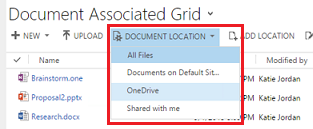

# Use OneDrive for Business to manage your private documents

::: moniker range=">= op-9-1"

[!INCLUDE [applies-to-unified-interface](../includes/applies-to-unified-interface.md)] [Use OneDrive for Business](/powerapps/user/one-drive)

With Customer Engagement (on-prem), you can use the right storage option for the right situation. For example, store your private documents using the new [!INCLUDE[pn_onedrive_for_business](../includes/pn-onedrive-for-business.md)] option. For collaborative storage, you can use [!INCLUDE[pn_office_365_groups](../includes/pn-office-365-groups.md)], and for public documents use [!INCLUDE[pn_SharePoint_short](../includes/pn-sharepoint-short.md)].  
  
 You might use [!INCLUDE[pn_onedrive_for_business](../includes/pn-onedrive-for-business.md)] to start and work on a document privately such as for a draft sales pitch. When the draft is far enough along, move it to an [!INCLUDE[pn_Office_365](../includes/pn-office-365.md)] group for team collaboration. You have lots of storage space (1 TB or more) with [!INCLUDE[pn_onedrive_for_business](../includes/pn-onedrive-for-business.md)] and documents stored there are automatically synced to your desktop and mobile devices. For example, if you put a presentation in [!INCLUDE[pn_crm_shortest](../includes/pn-crm-shortest.md)] that's stored on [!INCLUDE[pn_onedrive](../includes/pn-onedrive.md)] linked with an opportunity, that presentation is synced to all devices running [!INCLUDE[pn_onedrive](../includes/pn-onedrive.md)].  
  
> [!TIP]
>  Check out the following video: [Find information fast with Dynamics 365 Customer Engagement (on-premises) (2:39)](https://go.microsoft.com/fwlink/p/?linkid=837816).  
  
 Before you can use [!INCLUDE[pn_onedrive_for_business](../includes/pn-onedrive-for-business.md)], it must be enabled by your system administrator. For more information, see:  
  
  
-   [Enable OneDrive for Business](../admin/connect-onedrive-business.md)  
  
> [!IMPORTANT]
> [!INCLUDE[cc_feature_requires_office_365](../includes/cc-feature-requires-office-365.md)]  
  
## The first time you view your documents  
 After [!INCLUDE[pn_onedrive_for_business](../includes/pn-onedrive-for-business.md)] is enabled, you'll see the following dialog box when you go to a document list to view documents in [!INCLUDE[pn_crm_shortest](../includes/pn-crm-shortest.md)] and upload a file to [!INCLUDE[pn_onedrive](../includes/pn-onedrive.md)] or change the document location to [!INCLUDE[pn_onedrive](../includes/pn-onedrive.md)].  
  
   
  
 Select **Change folder location** to pick a new location to store [!INCLUDE[pn_onedrive](../includes/pn-onedrive.md)] documents or select **Continue** to accept the default folder location: \CRM  
  
## View existing OneDrive documents  
 Open a view with a document grid.  
  
 For example,  
  
1. Select **Sales** > **Opportunities**  
  
2. Choose an opportunity from the drop-down menu, and then select **Documents**.  
  
     
  
   [!INCLUDE[pn_crm_shortest](../includes/pn-crm-shortest.md)] now organizes documents in a consolidated view.  
  
     
  
   Documents stored in [!INCLUDE[pn_SharePoint_short](../includes/pn-sharepoint-short.md)] and [!INCLUDE[pn_onedrive](../includes/pn-onedrive.md)] are viewed in one list.  
  
   Select **Document Location** to filter the document list.  
  
     
  
   Select a location as described in the following table.  
  
|                            Document Location                             |                                                            Description                                                            |
|--------------------------------------------------------------------------|-----------------------------------------------------------------------------------------------------------------------------------|
|                                All files                                 |          All document locations associated with this [!INCLUDE[pn_crm_shortest](../includes/pn-crm-shortest.md)] record           |
| [!INCLUDE[pn_SharePoint_short](../includes/pn-sharepoint-short.md)] site |             Documents stored in your default [!INCLUDE[pn_SharePoint_short](../includes/pn-sharepoint-short.md)] site             |
|           [!INCLUDE[pn_onedrive](../includes/pn-onedrive.md)]            |                 Documents stored in [!INCLUDE[pn_onedrive_for_business](../includes/pn-onedrive-for-business.md)]                 |
|                              Shared with me                              | Documents others shared with you that are associated with this [!INCLUDE[pn_crm_shortest](../includes/pn-crm-shortest.md)] record |
  
## Create a new document  
 To create a new [!INCLUDE[pn_SharePoint_short](../includes/pn-sharepoint-short.md)] or [!INCLUDE[pn_onedrive](../includes/pn-onedrive.md)] document in [!INCLUDE[pn_crm_shortest](../includes/pn-crm-shortest.md)]:  
  
1. Open a view with a document grid.  
  
2. Select New  and then choose a document type such as [!INCLUDE[pn_MS_Powerpoint](../includes/pn-ms-powerpoint.md)] or [!INCLUDE[pn_ms_Word_short](../includes/pn-ms-word-short.md)].  
  
3. Enter a document name, choose a location, and then select **Save**.  
  
   The document is created and opened in the [!INCLUDE[pn_Office_365](../includes/pn-office-365.md)] Online application.  
  
## Change your OneDrive folder settings  
 You can change the location of your [!INCLUDE[pn_onedrive](../includes/pn-onedrive.md)] documents and rename the folder used for [!INCLUDE[pn_onedrive](../includes/pn-onedrive.md)].  
  
1. Select **Settings** > **Document Management** > **OneDrive for Business Folder Settings**  
  
2. Enter a new location for [!INCLUDE[pn_crm_shortest](../includes/pn-crm-shortest.md)] to store [!INCLUDE[pn_onedrive](../includes/pn-onedrive.md)] files, and then select **OK**.  
  
> [!NOTE]
>  The [!INCLUDE[pn_onedrive](../includes/pn-onedrive.md)] folder is renamed and all the existing files will now be associated with the new folder.  
  
## Considerations  
 Be aware of the following regarding [!INCLUDE[pn_onedrive_for_business](../includes/pn-onedrive-for-business.md)] in [!INCLUDE[pn_crm_shortest](../includes/pn-crm-shortest.md)].  
  
- [!INCLUDE[pn_onedrive](../includes/pn-onedrive.md)] storage folders are created in the user's current [!INCLUDE[pn_crm_shortest](../includes/pn-crm-shortest.md)] language. If the language changes, new folders will be created in the new language. Old folders will remain in the previous language.  
  
- Folders aren't supported. Documents in shared folders won't appear in the document grid.  
  
- There may be a delay between when the documents are shared in [!INCLUDE[pn_onedrive](../includes/pn-onedrive.md)] and when they're available to other users.  
  
### See also  
 [What is OneDrive for Business?](https://support.office.com/article/What-is-OneDrive-for-Business-187f90af-056f-47c0-9656-cc0ddca7fdc2)   

[!INCLUDE[footer-include](../../../includes/footer-banner.md)]

::: moniker-end

::: moniker range="< op-9-1"

[!INCLUDE [applies-to-on-premises](../includes/applies-to-on-premises.md)] [Use OneDrive for Business](/powerapps/user/one-drive)

With Customer Engagement (on-prem), you can use the right storage option for the right situation. For example, store your private documents using the new [!INCLUDE[pn_onedrive_for_business](../includes/pn-onedrive-for-business.md)] option. For collaborative storage, you can use [!INCLUDE[pn_office_365_groups](../includes/pn-office-365-groups.md)], and for public documents use [!INCLUDE[pn_SharePoint_short](../includes/pn-sharepoint-short.md)].  
  
 You might use [!INCLUDE[pn_onedrive_for_business](../includes/pn-onedrive-for-business.md)] to start and work on a document privately such as for a draft sales pitch. When the draft is far enough along, move it to an [!INCLUDE[pn_Office_365](../includes/pn-office-365.md)] group for team collaboration. You have lots of storage space (1 TB or more) with [!INCLUDE[pn_onedrive_for_business](../includes/pn-onedrive-for-business.md)] and documents stored there are automatically synced to your desktop and mobile devices. For example, if you put a presentation in [!INCLUDE[pn_crm_shortest](../includes/pn-crm-shortest.md)] that's stored on [!INCLUDE[pn_onedrive](../includes/pn-onedrive.md)] linked with an opportunity, that presentation is synced to all devices running [!INCLUDE[pn_onedrive](../includes/pn-onedrive.md)].  
  
> [!TIP]
>  Check out the following video: [Find information fast with Dynamics 365 Customer Engagement (on-premises) (2:39)](https://go.microsoft.com/fwlink/p/?linkid=837816).  
  
 Before you can use [!INCLUDE[pn_onedrive_for_business](../includes/pn-onedrive-for-business.md)], it must be enabled by your system administrator. For more information, see:  
  
  
-   [Enable OneDrive for Business](../admin/connect-onedrive-business.md)  
  
> [!IMPORTANT]
> [!INCLUDE[cc_feature_requires_office_365](../includes/cc-feature-requires-office-365.md)]  
  
## The first time you view your documents  
 After [!INCLUDE[pn_onedrive_for_business](../includes/pn-onedrive-for-business.md)] is enabled, you'll see the following dialog box when you go to a document list to view documents in [!INCLUDE[pn_crm_shortest](../includes/pn-crm-shortest.md)] and upload a file to [!INCLUDE[pn_onedrive](../includes/pn-onedrive.md)] or change the document location to [!INCLUDE[pn_onedrive](../includes/pn-onedrive.md)].  
  
   
  
 Select **Change folder location** to pick a new location to store [!INCLUDE[pn_onedrive](../includes/pn-onedrive.md)] documents or select **Continue** to accept the default folder location: \CRM  
  
## View existing OneDrive documents  
 Open a view with a document grid.  
  
 For example,  
  
1. Select **Sales** > **Opportunities**  
  
2. Choose an opportunity from the drop-down menu, and then select **Documents**.  
  
     
  
   [!INCLUDE[pn_crm_shortest](../includes/pn-crm-shortest.md)] now organizes documents in a consolidated view.  
  
     
  
   Documents stored in [!INCLUDE[pn_SharePoint_short](../includes/pn-sharepoint-short.md)] and [!INCLUDE[pn_onedrive](../includes/pn-onedrive.md)] are viewed in one list.  
  
   Select **Document Location** to filter the document list.  
  
     
  
   Select a location as described in the following table.  
  
|                            Document Location                             |                                                            Description                                                            |
|--------------------------------------------------------------------------|-----------------------------------------------------------------------------------------------------------------------------------|
|                                All files                                 |          All document locations associated with this [!INCLUDE[pn_crm_shortest](../includes/pn-crm-shortest.md)] record           |
| [!INCLUDE[pn_SharePoint_short](../includes/pn-sharepoint-short.md)] site |             Documents stored in your default [!INCLUDE[pn_SharePoint_short](../includes/pn-sharepoint-short.md)] site             |
|           [!INCLUDE[pn_onedrive](../includes/pn-onedrive.md)]            |                 Documents stored in [!INCLUDE[pn_onedrive_for_business](../includes/pn-onedrive-for-business.md)]                 |
|                              Shared with me                              | Documents others shared with you that are associated with this [!INCLUDE[pn_crm_shortest](../includes/pn-crm-shortest.md)] record |
  
## Create a new document  
 To create a new [!INCLUDE[pn_SharePoint_short](../includes/pn-sharepoint-short.md)] or [!INCLUDE[pn_onedrive](../includes/pn-onedrive.md)] document in [!INCLUDE[pn_crm_shortest](../includes/pn-crm-shortest.md)]:  
  
1. Open a view with a document grid.  
  
2. Select New  and then choose a document type such as [!INCLUDE[pn_MS_Powerpoint](../includes/pn-ms-powerpoint.md)] or [!INCLUDE[pn_ms_Word_short](../includes/pn-ms-word-short.md)].  
  
3. Enter a document name, choose a location, and then select **Save**.  
  
   The document is created and opened in the [!INCLUDE[pn_Office_365](../includes/pn-office-365.md)] Online application.  
  
## Change your OneDrive folder settings  
 You can change the location of your [!INCLUDE[pn_onedrive](../includes/pn-onedrive.md)] documents and rename the folder used for [!INCLUDE[pn_onedrive](../includes/pn-onedrive.md)].  
  
1. Select **Settings** > **Document Management** > **OneDrive for Business Folder Settings**  
  
2. Enter a new location for [!INCLUDE[pn_crm_shortest](../includes/pn-crm-shortest.md)] to store [!INCLUDE[pn_onedrive](../includes/pn-onedrive.md)] files, and then select **OK**.  
  
> [!NOTE]
>  The [!INCLUDE[pn_onedrive](../includes/pn-onedrive.md)] folder is renamed and all the existing files will now be associated with the new folder.  
  
## Considerations  
 Be aware of the following regarding [!INCLUDE[pn_onedrive_for_business](../includes/pn-onedrive-for-business.md)] in [!INCLUDE[pn_crm_shortest](../includes/pn-crm-shortest.md)].  
  
- [!INCLUDE[pn_onedrive](../includes/pn-onedrive.md)] storage folders are created in the user's current [!INCLUDE[pn_crm_shortest](../includes/pn-crm-shortest.md)] language. If the language changes, new folders will be created in the new language. Old folders will remain in the previous language.  
  
- Folders aren't supported. Documents in shared folders won't appear in the document grid.  
  
- There may be a delay between when the documents are shared in [!INCLUDE[pn_onedrive](../includes/pn-onedrive.md)] and when they're available to other users.  
  
### See also  
 [What is OneDrive for Business?](https://support.office.com/article/What-is-OneDrive-for-Business-187f90af-056f-47c0-9656-cc0ddca7fdc2)   

[!INCLUDE[footer-include](../../../includes/footer-banner.md)]

::: moniker-end
