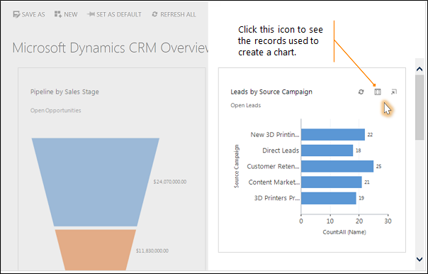
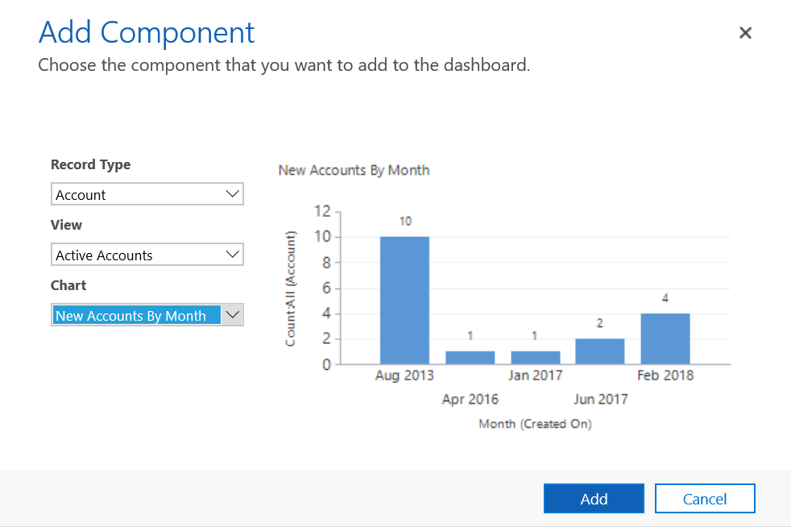
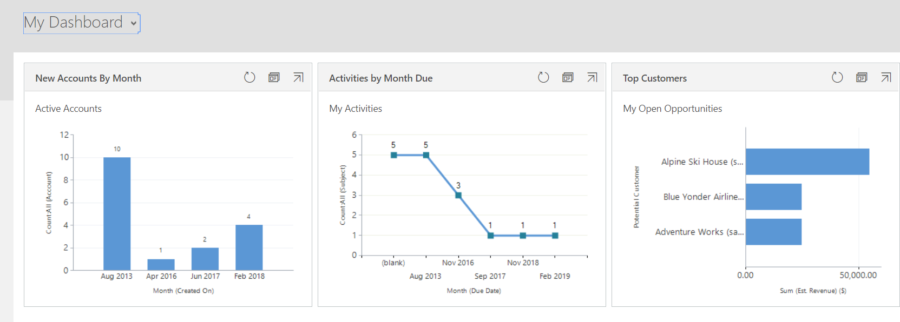

# Start your day with a dashboard

[!INCLUDE [applies-to-on-premises](../includes/applies-to-on-premises.md)] [Track your progress with dashboards and charts](/powerapps/user/track-your-progress-with-dashboard-and-charts)

Each time you sign in to the system you'll see a dashboard, which gives you easy-to-read charts and graphs that help you see how you and your team are doing with key metrics (also known as key performance indicators, or KPIs).  
  
## Choose from different dashboard layouts  
 The system comes with several dashboard layouts tailored for your role. For example, on the Sales Activity Dashboard, you'll see the status of open opportunities in the pipeline, progress toward goals, open leads and opportunities, the Sales Leaderboard, and your activities.  
  
- To see a different dashboard layout, select the down arrow next to the name of the dashboard, and then select the layout you want.  
  
  > [!div class="mx-imgBorder"] 
  > ")  
  
## Choose a default dashboard  
 When your system is set up, the system administrator picks a default dashboard layout that everyone sees when they first sign in. If you want to see a different dashboard, you can override the system-wide default.  
  
- Display the dashboard you want, and then select **Set as Default** at the top of the screen.  
  
  > [!div class="mx-imgBorder"] 
  > ")  
  
## Drill in to chart data  
 You can view the list of the records used to calculate the metrics shown in a chart.  
  
- Point to the chart, and then select the **Drill in** button . (You won't see the button until you point to the chart.)  
  
    
  
## Change a chart  
 You can try out different types of charts, and see how your data looks when you use different fields for the calculations, right from within the dashboard layout.  
  
- On a dashboard, select the segment of the chart you want to view as a different type of chart. For example, select a segment of a pie chart or bar graph.  
  
- From the drop-down, select a different field to use for the calculations.  
  
   > [!div class="mx-imgBorder"] 
   > ")  

## Create a personal dashboard
1. From the **Sales**, **Service**, or **Marketing** area, select **Dashboards**. 
2. Select **New**, and then select **Dynamics 365 Dashboard**. 
3. Select the layout that you want, such as the **3-Column Regular Dashboard**, and then select **Create**. 

    > [!div class="mx-imgBorder"] 
    > 

4. To add a chart, select the tile where you want the chart and then on the toolbar select **Chart**. 

5. Select a chart from the list, such as **New Accounts By Month**, and then select **Add**. To create your own chart, see [Create or edit a chart](create-edit-chart.md).

    > [!div class="mx-imgBorder"] 
    > 
    
6. Repeat the steps to add additional charts on to your dashboard. You can also add the following components on a dashboard tile. 
    - List. Display a view on a tile of the dashboard.
    - Web resource. Web resources are virtual files stored in the system. Each web resource has a unique name that can be used in a URL to retrieve the file. More information: [Create or edit web resources to extend an app](../customize/create-edit-web-resources.md)  
    - Iframe. Used to display the contents from another website. More information: [Use IFRAME and web resource controls on a form](../developer/use-iframe-and-web-resource-controls-on-a-form.md) 

  7. Enter a name for your dashboard, select **Save**, and then select **Close**. 

     Your dashboard is displayed in the **Dashboards** area where you can share or assign it to another user or team. You can also set it as your default dashboard. 

     > [!div class="mx-imgBorder"] 
     >  

[!INCLUDE[footer-include](../../../includes/footer-banner.md)]