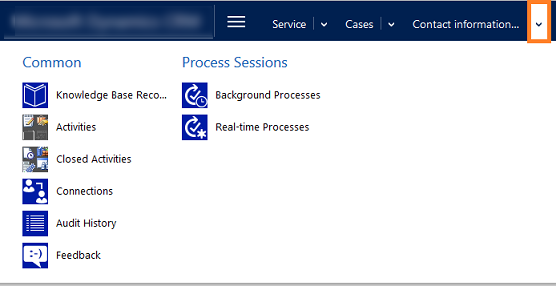

# Submit feedback or ratings for information stored in your system

To improve customer satisfaction, tracking customer feedback for the products and services that your organization offers is very important. You can now add feedback or ratings to records for any entity that is enabled for feedback.  
  
 For example, if the  Case entity is enabled for feedback, you can capture feedback on the support experience the customer received for the case. When several customers are rating a record, the ratings can be consolidated for each record through a custom rollup field. In a sales scenario, you can enable the Product entity for feedback to capture users' feedback on the products you sell.  
  
 A system administrator or customizer can enable an entity for feedback. If you want to capture feedback for any specific entity, talk to your system administrator or customizer. 
 
## Add feedback  
 You can add feedback to any record by using the associated list of records. Or, you can ask your system administrator or customizer to add a sub grid to the entity form.  
  
 The steps in this topic explain how to add feedback to a case record. You can navigate to the record you want to add feedback to.  
  
1. Go to **Service** > **Cases**.  
  
2. Open the case record you want to add the feedback to.  
  
3. On the nav bar, select the arrow next to the record name, and then select **Feedback**.  
  
     
  
4. On the Action toolbar, select **Add New Feedback**.  
  
 
5. Fill in the information:  
  
   - **Title**. Type a descriptive  title for the feedback. For example, if the feedback is about customer satisfaction, type that.  
  
   - **Source**. Select whether the feedback is internal or from a portal. If you've received the feedback from a phone call, you can select **Internal**.  
  
        You system administrator or customizer can customize the Source field to add more values, as needed.  
  
   - **Comments**. Type any feedback comments that you want.  
  
   - **Rating**. Type a number to specify how useful the related record is. For example, if you are tracking the customer satisfaction for a case, and you want to rate it a 2 on a scale of 1 - 10, type 2.  
  
   - **Minimum Rating Value** and **Maximum Rating Value**. Specify a minimum and maximum rating to define a feedback rating scale. For example, if you want to give a rating of 2  on a scale of 1 - 10, type 1 as the minimum rating and 10 as the maximum rating.  
  
   - **Created by (Contact)**. If you're creating feedback on behalf of a customer contact, select the contact here.  
  
        The **Created By** and **Closed By** fields are automatically populated with the user who creates or deactivates the feedback record.  
  
   - **Normalized Rating**. Normalizes the rating down to a 0 - 1 scale. The normalized rating is calculated based on the following formula: (Rating - Minimum Rating)/ (Maximum Rating - Minimum Rating).  
  
6. After you're done, select **Save & Close**.  
  

[!INCLUDE[footer-include](../../../includes/footer-banner.md)]