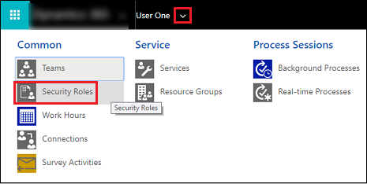

# View your user profile  

::: moniker range=">= op-9-1"

[!INCLUDE [applies-to-unified-interface](../includes/applies-to-unified-interface.md)] [View your user profile](/powerapps/user/view-your-user-profile)

Your user profile displays useful information about you to your entire organization; for example, your contact information, your organization, and your security role. Depending on your security role, you may be able to make changes to your user profile.  
  
1. On the upper-right corner of the screen, select the **Settings** button  > **Options**.  
 
2.  Scroll down to the very bottom of the **Set Personal Options** dialog box, and then choose **View your user information**.  
  
3.  To check your security role, on the nav bar, select the down arrow  next to your name, and then select **Security Roles**.  

    
  
4.  To view other profile information, such as Work Hours, Connections, and Services, on the nav bar, choose the down arrow  next to your name.  
  

[!INCLUDE[footer-include](../../../includes/footer-banner.md)]

::: moniker-end

::: moniker range="< op-9-1"

[!INCLUDE [applies-to-on-premises](../includes/applies-to-on-premises.md)] [View your user profile](/powerapps/user/view-your-user-profile)

Your user profile displays useful information about you to your entire organization; for example, your contact information, your organization, and your security role. Depending on your security role, you may be able to make changes to your user profile.  
  
1. On the upper-right corner of the screen, select the **Settings** button  > **Options**.  
 
2.  Scroll down to the very bottom of the **Set Personal Options** dialog box, and then choose **View your user information**.  
  
3.  To check your security role, on the nav bar, select the down arrow  next to your name, and then select **Security Roles**.  

    
  
4.  To view other profile information, such as Work Hours, Connections, and Services, on the nav bar, choose the down arrow  next to your name.  
  

[!INCLUDE[footer-include](../../../includes/footer-banner.md)]

::: moniker-end
