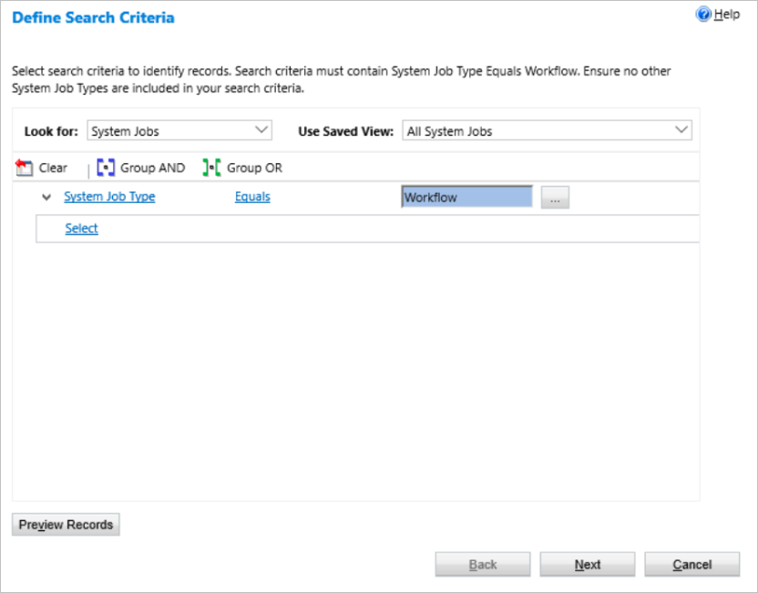

# Sync bulk operations on async workflow jobs

You can now use bulk operations to quickly perform operations on multiple job simultaneously. Here's an overview of the operations and what they do.

Operation|Description
----|-----
Bulk cancel|Cancels all jobs you select.
Bulk resume|Resumes all jobs you select.
Bulk pause|Pauses all jobs you select.

## Bulk operations

Follow these steps to access all bulk operations:

1. Select **Settings**.
1. Select **System Jobs**.

    

1. Select **More Actions**.
1. Notice all bulk operations on the menu.

    

The **Define Search Criteria** screen launches. 

## Select items for bulk operations

Before your bulk operation runs, you must select the jobs on which the operation runs. 

1. On the **Define Search Criteria** screen, make the selections that define the jobs on which you want to run the bulk operation. Here's an example to get you started: 

   

   >[!IMPORTANT]
   > You must set **System Job Type** Equals **Workflow** conditions before advancing because bulk operations are only available for asynchronous workflows. 

   >[!TIP]
   > The bulk operations engine excludes workflows for SLAs, routing rules, and record creation rules automatically.

1. Select **Next**.
1. On the **Select Options** screen, provide a **Name** for your operation, and then select **Immediately** for the **Sync bulk operation job start time**.

   

   >[!NOTE]
   >Bulk operations are synchronous so **Immediately** is the only option for the job start time.

1. Select **Next**.
   The **Review Sync Bulk Operation Details** screen displays.
1. Review the settings for the job and then select **Submit** if all looks good to you.

## Use the SDK to run bulk operations

The SDK now contains the **SyncBulkOperationRequest** and **SyncBulkOperationResponse** request and response messages. Use **SyncBulkOperationRequest** to perform any of the sync operations--**cancel**, **resume**, and **pause**. 

1. **SyncBulkOperationRequest** inherits from  **OrganizationRequest** and contains all its fields, plus two new fields:

   Name|Description
   ----|-----
   QuerySet| It's exactly like the QuerySet field used in [BulkDeleteRequest](/previous-versions/dynamicscrm-2016/developers-guide/gg326451%28v%3dcrm.8%29)
   OperationType| This is an integer 0, 1, or 2 that represents the operation types of pause, resume, and cancel, respectively.

1. SyncBulkOperationResponse has one the **Result** field, which is an an integer that represents the number of records the operation affected.

>[IMPORTANT]
>As in the user interface, the query set must include  asyncoperation.operationtype = 10 (workflows).

## Best practices

1.	**Maintenance and not mitigation**: Use this tool to regularly maintain your jobs. The tool may take significant time to operate on job counts in the range of tens of thousands.
1.	**When to run**: Since operations can take significant time and resources, consider running these operations outside of business hours. The browser window remains busy until the job completes.
1.	**Batch and Limit sizes**: The operations run in batches (default 500) for a maximum number of records (default 10000). These are defined in the Organization DB under OrganizationBase as SyncBulkOperationBatchSize and SyncBulkOperationMaxLimit. These values have been selected as the default based numerous studies on how many operations can be done without breaking the Async Service. Generally, higher numbers are not advised.
1.	**Async Service Health**: If the Async Service is already exhibiting degradation (slowness, failures, etc.), seek customer support.

[!INCLUDE[footer-include](../../../includes/footer-banner.md)]