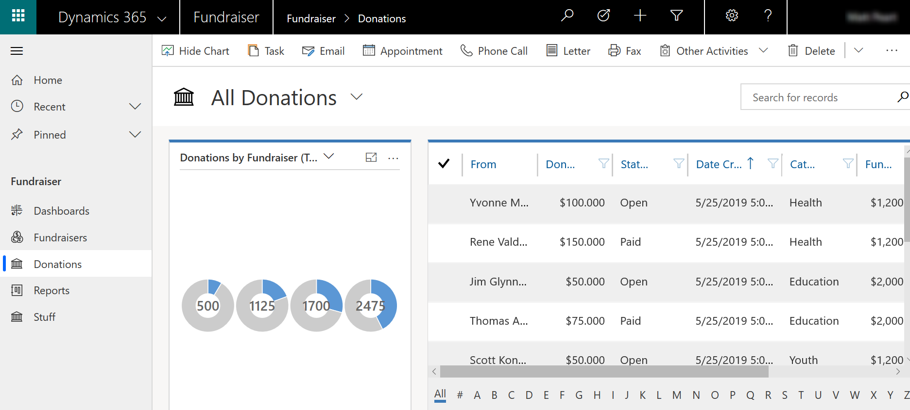
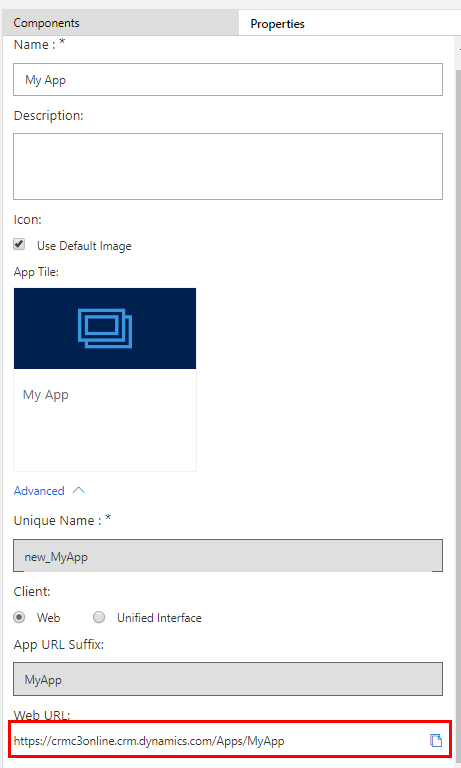

# Create or edit an app by using the app designer

[!INCLUDE [applies-to-on-premises](../includes/applies-to-on-premises.md)] [Create a model-driven app by using the app designer](/powerapps/maker/model-driven-apps/create-edit-app)

Create single-entity or multiple-entity apps quickly by using the tile-based app designer. Create once and run your app on large screen devices. 
> [!div class="mx-imgBorder"] 
>  

As well as mobile devices.  
> [!div class="mx-imgBorder"] 
> 

  
## Prerequisites
[!INCLUDE[proc_permissions_system_admin_and_customizer](../includes/proc-permissions-system-admin-and-customizer.md)] <!--Specifically, any user with the following privileges can also create  apps:  Create, Read, and Write privileges for the App entity, Read and Write privileges for the Customizations entity, Read privileges for the Solution entity  -->
  
   

## Create an app  

1. From Dynamics 365 Customer Engagement (on-premises) go to **Settings** > **My Apps**, and select **Create  new App**. Alternatively, in the **Apps** area of solution explorer select **New**. Enter the following details on the **Create a New App** page:  
  
   - **Name**: Enter a unique name for the app.  
  
   - **Unique Name**: The unique name is automatically populated based on the app name that you specify. It is prefixed with a publisher prefix. You can change the part of the unique name that's editable. The unique name can only contain English characters and numbers.  
  
       > [!NOTE]
       >  The publisher prefix is the text that's added to any entity or field created for a solution that has this publisher. More information: [Change the solution publisher prefix for the default publisher](change-solution-publisher-prefix.md)  
  
   - **Description**: Type a short description of what the app is or does.  
  
   - **Icon**: By default, the **Use Default App** thumbnail check box is checked. To select a different web resource as an icon for the app, clear the check box, and then select an icon from the drop-down list. This icon will be displayed on the preview tile of the app.  
   
   - **Client**: Choose the client type. 
      - **Web**. This is the classic web client. This client is not suitable for mobile devices.
      - **Unified Interface**. This client offers a new user experience that uses responsive web design principles to provide an optimal viewing and interaction experience for any screen size, device, or orientation. More information: [About Unified Interface](../admin/about-unified-interface.md)
   
   - **App URL Suffix**. By default, the URL suffix is the app **Unique Name** without the prefix, such as *www.contoso.com/sales/Apps/MyApp*. You can enter a different URL suffix if you want to create an easy-to-remember URL for the app. 
  
   - **Use existing solution to create the App**: Select this option to create the app from a list of installed solutions. When you select this option, **Done** switches to **Next** on the header. If you select **Next**, the **Create app from existing solution** page opens. From the **Select Solution** drop-down list, select a solution from which you want to create the app. If any site map is available for the selected solution, the **Select Sitemap** drop-down list will appear. Select the site map, and then select **Done**.

     > [!NOTE]
     > By selecting **Default Solution** when you add a site map, the components that are associated with that site map are automatically added to the app.  

      

   - **Choose a welcome page**: This option allows you to select from the web resources available in your organization. The welcome pages you create can contain information that's useful to users, such as links to videos, upgrade instructions, or getting started information. The welcome page is displayed when an app is opened. Users can select **Do not show this Welcome Screen next time** on the welcome page to disable the page so it doesn’t appear the next time the app starts. More information about how to create a web resource, such as an HTML file that you can use as a welcome page: [Create and edit web resources to extend the web application](create-edit-web-resources.md)  
      
     To edit app properties later, go to the **Properties** tab in the app designer. [!INCLUDE[proc_more_information](../includes/proc-more-information.md)] [Manage app properties](../customize/manage-app-properties.md)  
  
     > [!NOTE]
     >  You can't change the unique name and app URL suffix on the **Properties** tab.  
  
   - **Enable Mobile Offline**: Mobile offline allows users to run you app in offline mode to interact with their data while they're not connected to the internet. To use this feature, a Dynamics 365 administrator will need to set up mobile offline for the organization. More information:  [Set up mobile offline synchronization to allow users to work in offline mode on their mobile device](../../../mobile-app/setup-mobile-offline-for-admin.md)

2. Select **Done** or&mdash;if you selected **Use an existing solution to create the App**&mdash;select **Next** to choose from the available solutions that were imported in the organization.  
  
    A new app is created and is shown in **Draft** status. You'll see the app designer canvas for the new app.  
  
3. Define the sitemap. The sitemap determines how users will navigate your app. Select  to open the site map designer. More information: [Create a site map for an app using the site map designer](create-site-map-app.md)

   > [!div class="mx-imgBorder"] 
   >     

4. Add components or edit existing components. Components include entities and related items, such as forms, views, charts, dashboards, and business process flows. [!INCLUDE[proc_more_information](../includes/proc-more-information.md)] [Add or edit app components](../customize/add-edit-app-components.md)  
  
   > [!div class="mx-imgBorder"] 
   >    

   

5. Share the app with users. More information: [Manage access to apps by using security roles](manage-access-apps-security-roles.md)

## Edit an app  
  
1. From Dynamics 365 Customer Engagement (on-premises) go to **Settings** > **My Apps**, select **...** on the app you want, and then select **Open in App Designer**. Alternatively, go to the **Apps** area of solution explorer and select the app that you want to edit.  

   > [!div class="mx-imgBorder"] 
   >    

2. Add or edit components to the app, as required. [!INCLUDE[proc_more_information](../includes/proc-more-information.md)] [Add or edit app components](../customize/add-edit-app-components.md)  

   

## Run an app

App users can run published apps from Dynamics 365 Customer Engagement (on-premises) by going to **Settings** > **My Apps**, and then select the app they want. 

> [!TIP]
> If there are several apps available, search for the app by typing in the search box.
 
Customizers and app designers can also copy and share the app URL from the **Properties** tab in app designer. More information: [Manage app properties in the app designer](manage-app-properties.md)

> [!div class="mx-imgBorder"] 
>    

### See also  
 [Add or edit app components](add-edit-app-components.md)    
 [Design custom business apps by using the app designer](design-custom-business-apps-using-app-designer.md)

[!INCLUDE[footer-include](../../../includes/footer-banner.md)]