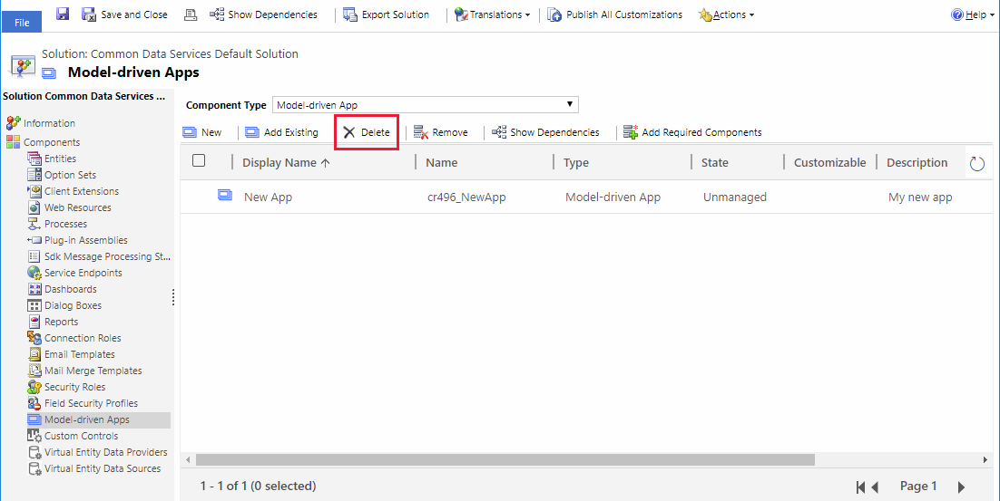

# Export, import, or remove an app

[!INCLUDE [applies-to-on-premises](../includes/applies-to-on-premises.md)] [Export solutions](/powerapps/maker/common-data-service/export-solutions)

App created in Dynamics 365 Customer Engagement (on-premises) are distributed as solution components. After you have created an app, you can make it available for other organizations to use by packaging the app into a solution and then exporting it into a zip file. After the solution (.zip file) is successfully imported by the organization, the packaged app is available for use.

[!INCLUDE[proc_more_information](../includes/proc-more-information.md)] [Solutions overview](../customize/solutions-overview.md).
  
## Export an app  
 Export an app into a solution when you want other organizations to use it. The process of exporting a solution includes:  

1. [Create a solution](../customize/create-solution.md).
2. [Add apps to the solution](../customize/import-update-upgrade-solution.md).
3. [Export the solution to a zip file](../customize/import-update-upgrade-solution.md).

	> [!NOTE]
	> When you export an app by using a solution, the app URL is not exported.

Now you can share the created solution zip file with other organizations to import and use the app.
  
## Import an app  
When you receive the solution zip file which contains the app that you want to import, open the solutions component page and import the solution. When the solution has been successfully imported, your organization will be ready to use the app.

[!INCLUDE[proc_more_information](../includes/proc-more-information.md)] [Import, update, and export solutions](../customize/import-update-upgrade-solution.md).  
  
## Remove (delete) an app  
Remove apps that are obsolete in your organization.

1. In your [!INCLUDE[pn_crm_shortest](../includes/pn-crm-shortest.md)] instance, go to **Settings** > **Customizations** > **Customize the system**.
2. In the solution window, under **Components**, select **Model-driven Apps**.
3. Select the app that you want to delete, and then select **Delete** on the command bar.

   > [!div class="mx-imgBorder"] 
   > 

4. In the confirmation message that appears, select **Delete**.

   The app is deleted from your instance.
  
If the component has dependencies (such as relationships), you must remove the dependencies before you can delete the app. To see the dependencies of an app, select the app, and then select **Show Dependencies** on the command bar.

> [!NOTE]
> When you delete the app, we recommend that you delete its associated site map. If you do not delete the associated site map, the site map designer displays an error the first time you try to create another app with the same name. However, you can ignore the error, and the error will not appear when you try to create the app again. 

### See also  
 [Design custom business apps by using the app designer](design-custom-business-apps-using-app-designer.md)

[!INCLUDE[footer-include](../../../includes/footer-banner.md)]