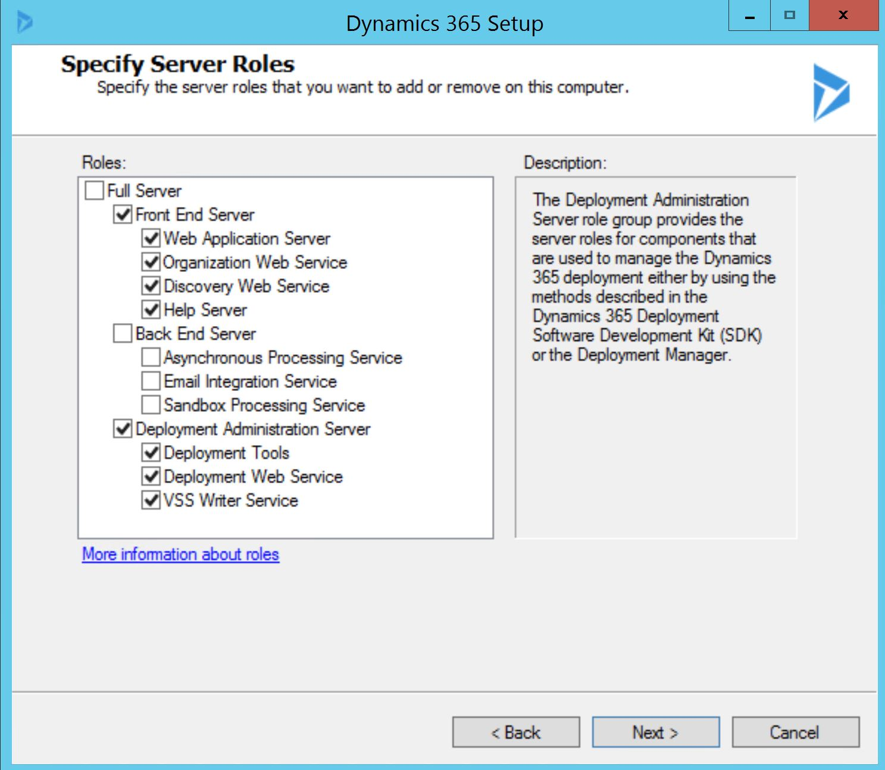

# Install Dynamics 365 Server Front End Server and Back End Server roles

The following procedure installs [!INCLUDE[pn_microsoftcrm](../includes/pn-microsoftcrm.md)] [!INCLUDE[Front_End_Server](../includes/front-end-server.md)] and [!INCLUDE[Back_End_Server](../includes/back-end-server.md)] roles on two separate servers that do not already have [!INCLUDE[pn_microsoftcrm_server](../includes/pn-microsoftcrm-server.md)]  installed. We recommend this configuration instead of a single Full Server deployment because it helps improve security and performance by isolating specific [!INCLUDE[pn_microsoftcrm_server](../includes/pn-microsoftcrm-server.md)] services on each computer. As part of this procedure, the [!INCLUDE [pn-crm-reporting-extensions-server-side](../includes/pn-crm-reporting-extensions-server-side.md)] are installed on the server where the [!INCLUDE[Back_End_Server](../includes/back-end-server.md)] roles are installed, and the [!INCLUDE[pn_Deployment_Tools](../includes/pn-deployment-tools.md)] are installed on the server where the [!INCLUDE[Front_End_Server](../includes/front-end-server.md)] roles are installed. <!-- [!INCLUDE[proc_more_information](../includes/proc-more-information.md)] [Dynamics 365 Server roles](microsoft-dynamics-365-server-roles.md)  -->
  
 A back-end and front-end deployment configuration requires two separate computers running [!INCLUDE[pn_Windows_Server](../includes/pn-windows-server.md)]. This example uses two computers that are named *CRMbackend* and *CRMfrontend*.  
  
> [!IMPORTANT]
>  After Setup is complete, you must either import or create at least one organization to be able to connect a client to the [!INCLUDE[pn_microsoftcrm](../includes/pn-microsoftcrm.md)] deployment. You can do this by using [!INCLUDE[pn_PowerShell](../includes/pn-powershell.md)] or [!INCLUDE[pn_deploymentmanager](../includes/pn-deploymentmanager.md)]. More information: [New-CrmOrganization](https://docs.microsoft.com/powershell/module/microsoft.crm.powershell/new-crmorganization?view=dynamics365ce-ps)  
  
 In this example, the [!INCLUDE[Back_End_Server](../includes/back-end-server.md)] role will be installed before the [!INCLUDE[Front_End_Server](../includes/front-end-server.md)] role.  
  
  
## Install Back End Server role  
On the computer named *CRMbackend*, complete the following procedure.  
  
1.  Meet all requirements specified in [Dynamics 365 Customer Engagement (on-premises) system requirements and required components](system-requirements-required-technologies.md).  
  
2.  Log on to the domain as a user who has administrator-level privileges where [!INCLUDE[pn_microsoftcrm_server](../includes/pn-microsoftcrm-server.md)] will be installed and who is a member of the Administrators group on the local computer. You cannot install the application as a member from a trusted domain.  
  
3.  Locate the [!INCLUDE[pn_microsoftcrm_server](../includes/pn-microsoftcrm-server.md)] installation files. You can find the [!INCLUDE[pn_microsoftcrm_server](../includes/pn-microsoftcrm-server.md)] download packages on the [Microsoft Download Center](https://go.microsoft.com/fwlink/?linkid=2025342).  
  
4.  In the folder where the [!INCLUDE[pn_microsoftcrm_server](../includes/pn-microsoftcrm-server.md)] files are located, move to the Server\amd64 folder, and then double-click **SetupServer.exe**.  
  
5.  On the **Welcome to Microsoft Dynamics 365 Server Setup** page, we recommend that you select **Get updates for Microsoft Dynamics 365 Customer Engagement (on-premises)**, to make sure that Setup has the most recent installation files. Select **Next**.  
  
6.  On the **Product Key Information** page, type your product key in the **Product key** boxes, and then select **Next**.  
  
7.  On the **License Agreement** page, review the information and if you accept the license agreement, select **I accept this license agreement**, and then select **I Accept**.  
  
8.  If Setup detects that components are missing, the **Install Required Components** page appears.  
  
    -   If you have already installed the required components, this page will not appear.  
  
    -   If you have not installed the required components listed, you can install them now. Select **Install**. When the components are installed, the status column will change from **Not Installed** to **Installed**, and you can select **Next** to continue.  
  
    > [!NOTE]
    >  If you are prompted to restart the computer, do so, and then start Setup again.  
  
9. On the **Select Installation Location** page, accept the default location or enter a different file installation location, and then select **Next**.  
  
10. On the **Specify Server roles** page, select all the Back End Server roles. Leave the rest blank.  
  
     
  
11. On the **Specify Deployment Options** page, in the **Enter or select the name of the computer that is running SQL Server to use with the deployment** box, type or select the instance of [!INCLUDE[pn_MS_SQL_Server](../includes/pn-ms-sql-server.md)] that will be used to store the [!INCLUDE[pn_microsoftcrm](../includes/pn-microsoftcrm.md)] database (MSCRM_CONFIG).  
  
12. On the **Select the Organizational Unit** page, select **Browse** to display your [!INCLUDE[pn_Active_Directory](../includes/pn-active-directory.md)] structure. Select the organizational unit where you want to add security groups, select **OK**, and then select **Next**.  
  
13. On the **Specify Service Accounts** page, select the security accounts for the [!INCLUDE[pn_microsoftcrm](../includes/pn-microsoftcrm.md)] services, and then select **Next**.  
  
     The services are described below. <!-- For more information about the service accounts required to run these services, see [Minimum permissions required for Microsoft Dynamics 365 Customer Engagement (on-premises) Setup and services](security-considerations-for-microsoft-dynamics-365.md#BKMK_MinimumPermissions). --> 
  
    -   **[!INCLUDE[pn_Sandbox_Processing_Service](../includes/pn-sandbox-processing-service.md)].** Enables an isolated environment to allow for the execution of custom code, such as plug-ins. This isolated environment reduces the possibility of custom code affecting the operation of the organizations in the [!INCLUDE[pn_microsoftcrm](../includes/pn-microsoftcrm.md)] deployment.  
  
    -   **Asynchronous Processing Service.** Processes queued asynchronous events, such as bulk email or data import.  
  
    -   **Monitoring Service.** This service will be installed with any [!INCLUDE[pn_microsoftcrm_server](../includes/pn-microsoftcrm-server.md)] role installation to monitor [!INCLUDE[pn_microsoftcrm](../includes/pn-microsoftcrm.md)] server roles that are running on the local computer.  
  
     <!--    [!INCLUDE[proc_more_information](../includes/proc-more-information.md)] [Available individual server roles](microsoft-dynamics-365-server-roles.md#BKMK_AvailableIndividual)  -->
  
     For each service, we recommend that you select a low-privilege domain user account that is dedicated to running these services and is not used for any other purpose. Additionally, the user account that is used to run a [!INCLUDE[pn_microsoftcrm](../includes/pn-microsoftcrm.md)] service cannot be a [!INCLUDE[pn_microsoftcrm](../includes/pn-microsoftcrm.md)] user. The domain account must be a member of the Domain Users group. Additionally, if the [!INCLUDE[pn_Asynchronous_Service](../includes/pn-asynchronous-service.md)] and [!INCLUDE[pn_Sandbox_Processing_Service](../includes/pn-sandbox-processing-service.md)] roles are installed, such as in a Full Server or a [!INCLUDE[Back_End_Server](../includes/back-end-server.md)] installation, the domain account must be a member of the Performance Log Users security group.  
  
14. On the **Select Microsoft Update Preference** page, select whether you want to use [!INCLUDE[pn_Microsoft_Update](../includes/pn-microsoft-update.md)] for checking for updates for your Microsoft products, and select **Next**. We recommend that you use [!INCLUDE[pn_Microsoft_Update](../includes/pn-microsoft-update.md)] to check for updates because this helps keep your computer up-to-date and secure.  For more information about the legal terms and privacy with [!INCLUDE[pn_Microsoft_Update](../includes/pn-microsoft-update.md)] licensing, see [Windows Update FAQ](https://go.microsoft.com/fwlink/p/?LinkID=196513).  
  
15. The **System Checks** page appears. This page is a summary of all requirements and recommendations for a successful installation. Errors must be resolved before installation can continue. If no errors, or only warnings, appear, you can continue with the installation. To do this, select **Next**.  
  
16. The **Service Disruption Warning** page appears. This page lists all services that will be stopped or restarted during Setup.  
  
17. Review the **Ready to Install Microsoft Dynamics 365 Customer Engagement (on-premises)** page, and then select **Back** to correct any warnings. When you are ready to continue, select **Install**.  
  
18. When the Setup program is finished, select **Finish**.  
  
19. Run [!INCLUDE[pn_Microsoft_Dynamics_CRM_Reporting_Extensions_Setup](../includes/pn-microsoft-dynamics-crm-reporting-extensions-setup.md)]. [!INCLUDE[proc_more_information](../includes/proc-more-information.md)] [Install Microsoft Dynamics 365 Customer Engagement (on-premises) Reporting Extensions](install-microsoft-dynamics-365-reporting-extensions.md)  
  
    > [!IMPORTANT]
    >  [!INCLUDE[pn_crm_report_ext_SRS_short](../includes/pn-crm-report-ext-srs-short.md)] are required to complete the [!INCLUDE[Front_End_Server](../includes/front-end-server.md)] and [!INCLUDE[Back_End_Server](../includes/back-end-server.md)] deployment of [!INCLUDE[pn_microsoftcrm_server](../includes/pn-microsoftcrm-server.md)].  
  
20. When the [!INCLUDE[pn_Microsoft_Dynamics_CRM_Reporting_Extensions_Setup](../includes/pn-microsoft-dynamics-crm-reporting-extensions-setup.md)] has finished, complete the next procedure to install the [!INCLUDE[Front_End_Server](../includes/front-end-server.md)] role. 
  
  
## Install Front End Server role  
 On the computer named *CRMfrontend*, follow these steps.  
  
1.  Log on to the domain as a user who has administrator-level privileges where [!INCLUDE[pn_microsoftcrm_server](../includes/pn-microsoftcrm-server.md)] will be installed and who is a member of the Administrators group on the local computer. You cannot install the application as a member from a trusted domain.  
  
2.  In the folder where the [!INCLUDE[pn_microsoftcrm_server](../includes/pn-microsoftcrm-server.md)] files are located, move to the Server\amd64 folder, and then double-click **SetupServer.exe**.  
  
3.  On the **Welcome to Microsoft Dynamics 365 Customer Engagement (on-premises) Setup** page, we recommend that you select **Get updates for Microsoft Dynamics 365 Customer Engagement (on-premises)**, to make sure that Setup has the most recent installation files. Select **Next**.  
  
4.  On the **Product Key Information** page, type your product key in the **Product key** boxes, and then select **Next**.  
  
5.  On the **License Agreement** page, review the information and, if you accept the license agreement, select **I accept this license agreement**, and then select **I Accept**.  
  
6.  If Setup detects that components are missing, the **Install Required Components** page appears.  
  
    -   If you have already installed the required components, this page will not appear.  
  
    -   If you have not installed the required components listed, you can install them now. Select **Install**. When the components are installed, the status column will change from **Not Installed** to **Installed**, and you can select **Next** to continue.  
  
    > [!NOTE]
    >  If you are prompted to restart the computer, do so, and then start Setup again.  
  
7.  On the **Select Installation Location** page, accept the default location or enter a different file installation location, and then select **Next**.  
  
8.  On the **Specify Server roles** page, select all the [!INCLUDE[Front_End_Server](../includes/front-end-server.md)] and Deployment Administration Server roles. Leave the rest blank.  
  
       
  
9. On the **Specify Deployment Options** page, select **Connect to, and if necessary, upgrade an existing deployment**, and then in the **Enter or select the name of the computer that is running SQL Server to use with the deployment** box, type or select the instance of [!INCLUDE[pn_SQL_Server_short](../includes/pn-sql-server-short.md)] that you entered previously, and then select **Next**.  
  
10. On the **Select the Organizational Unit** page, select **Browse** to display your [!INCLUDE[pn_Active_Directory](../includes/pn-active-directory.md)] structure. Select the location where you want the organizational unit installed, select **OK**, and then select **Next**. We recommend that you select the same organization unit that you selected in the previous step.  
  
11. On the **Specify Service Accounts** page, select the security accounts for the [!INCLUDE[pn_microsoftcrm](../includes/pn-microsoftcrm.md)] services, and then select **Next**.  
  
     The services are described below. <!-- For more information see [Minimum permissions required for Microsoft Dynamics 365 Customer Engagement (on-premises) Setup and services](security-considerations-for-microsoft-dynamics-365.md#BKMK_MinimumPermissions). --> 
  
    -   **Application Service.** This service runs the [!INCLUDE[pn_microsoftcrm](../includes/pn-microsoftcrm.md)] web application that is used to connect users to Dynamics 365 Customer Engagement (on-premises) data.  
  
    -   **[!INCLUDE[pn_Deployment_Web_Service](../includes/pn-deployment-web-service.md)].** Publishes the web service that provides the deployment interface described in the [Developer Guide for Dynamics 365 Customer Engagement (on-premises)](/dynamics365/customer-engagement/developer/developer-guide), such as those used to create an organization or manage the list of Deployment Administrators for the [!INCLUDE[pn_microsoftcrm](../includes/pn-microsoftcrm.md)] deployment.  
  
        > [!IMPORTANT]
        >  For each service, we recommend that you select a low-privilege domain user account that is dedicated to running these services and is not used for any other purpose. Additionally, the user account that is used to run a [!INCLUDE[pn_microsoftcrm](../includes/pn-microsoftcrm.md)] service cannot be a [!INCLUDE[pn_microsoftcrm](../includes/pn-microsoftcrm.md)] user. This domain account must be a member of the Domain Users group.  
        >   
        >  If you select to run the [!INCLUDE[pn_ASP.NET_short](../includes/pn-asp-net-short.md)] service under a domain user account that is not a domain administrator or a local administrator, you must set a local security policy after you install [!INCLUDE[pn_microsoftcrm_server](../includes/pn-microsoftcrm-server.md)] for the [!INCLUDE[pn_ASP.NET_short](../includes/pn-asp-net-short.md)] service to work correctly. Also, depending on the password policies that you have implemented for your organization, the password for the user may expire. [!INCLUDE[proc_more_information](../includes/proc-more-information.md)] [How to use the ASP.NET utility to encrypt credentials and session state connection strings](https://go.microsoft.com/fwlink/p/?linkid=53266)  
  
    -   **VSS Writer Service.** The [!INCLUDE[pn_microsoftcrm](../includes/pn-microsoftcrm.md)] VSS Writer Service provides an interface to back up and restore [!INCLUDE[pn_microsoftcrm](../includes/pn-microsoftcrm.md)] data by using the [!INCLUDE[pn_Windows_Server](../includes/pn-windows-server.md)] Volume Shadow Copy Service (VSS) infrastructure.  
  
    -   **Monitoring Service.** This service will be installed with any [!INCLUDE[pn_microsoftcrm_server](../includes/pn-microsoftcrm-server.md)] role installation to assist in event monitoring.  
  
12. On the **Select a Web Site** page, select **Create a new Web site** or select **Select a Web Site** and select a website from the list. By default, Setup will use the default website.  
  
    > [!IMPORTANT]
    >  We strongly recommend that you verify the status of the existing website before you specify Setup to use an existing website. We also strongly recommend that the website you select is configured for Transport Layer Security (TLS). For more information see the [!INCLUDE[pn_iis](../includes/pn-iis.md)] documentation. During the installation, Setup can bind the [!INCLUDE[pn_microsoftcrm](../includes/pn-microsoftcrm.md)] application to the HTTPS website. If you select a network port other than a default port, ensure that the firewall does not block the port.  
  
     When you select the **Create a new Web site** option, Setup creates a new website for [!INCLUDE[pn_microsoftcrm](../includes/pn-microsoftcrm.md)]. You can specify the following option:  
  
    -   **Port Number**. Type the [!INCLUDE[pn_TCP](../includes/pn-tcp.md)] port number that [!INCLUDE[pn_microsoftcrm](../includes/pn-microsoftcrm.md)] clients will use to connect to the [!INCLUDE[pn_microsoftcrm_server](../includes/pn-microsoftcrm-server.md)]. The default port number is 5555.  
  
13. Select **Next**.  
  
14. On the **Specify E-mail Router Settings** page, in the **E-mail Router server name** box, type the name of the computer where the [!INCLUDE[pn_emailrouter](../includes/pn-emailrouter.md)] will be installed. This computer will route [!INCLUDE[pn_microsoftcrm](../includes/pn-microsoftcrm.md)] email messages. If you are not going to install the [!INCLUDE[pn_emailrouter](../includes/pn-emailrouter.md)] (recommended), you can leave this box blank. However, if you install the [!INCLUDE[pn_emailrouter](../includes/pn-emailrouter.md)] later, you must add the computer where the [!INCLUDE[pn_emailrouter](../includes/pn-emailrouter.md)] service is running when you use Local System, or if you use a domain user account, the account, to the PrivUserGroup security group. Select **Next**.  
  
15. On the **Select Microsoft Update Preference** page, select whether you want to use [!INCLUDE[pn_Microsoft_Update](../includes/pn-microsoft-update.md)] for checking for updates for your Microsoft products, and select **Next**. We recommend that you use [!INCLUDE[pn_Microsoft_Update](../includes/pn-microsoft-update.md)] to check for updates because this helps keep your computer up-to-date and secure.  
  
16. The **System Checks** page appears. This page is a summary of all requirements and recommendations for a successful installation. Errors must be resolved before installation can continue. If no errors, or only warnings, appear, you can continue with the installation. To do this, Select **Next**.  
  
17. The **Service Disruption Warning** page appears. This page lists all services that will be stopped or restarted during Setup. Select **Next**.
  
18. Review the **Ready to Install Microsoft Dynamics 365 Customer Engagement (on-premises)** page, and then select **Back** to make changes. When you are ready to continue, select **Install**.  
  
19. When the Setup program is finished, select **Finish**.  
  

## Create the Microsoft Dynamics 365 Customer Engagement (on-premises) organization  
 After [!INCLUDE[pn_Microsoft_Dynamics_CRM_Server_Setup](../includes/pn-microsoft-dynamics-crm-server-setup.md)] program is finished installing the [!INCLUDE[Back_End_Server](../includes/back-end-server.md)], [!INCLUDE[Front_End_Server](../includes/front-end-server.md)], [!INCLUDE[pn_Deployment_Administration_Server](../includes/pn-deployment-administration-server.md)] roles, and [!INCLUDE [pn-crm-reporting-extensions-server-side](../includes/pn-crm-reporting-extensions-server-side.md)], you must create at least one organization to make the deployment available for users.  
  
 To create an organization, on the computer named *CRMfrontend* where the [!INCLUDE[pn_Deployment_Administration_Server](../includes/pn-deployment-administration-server.md)] role is installed, run the [New-CrmOrganization](https://docs.microsoft.com/powershell/module/microsoft.crm.powershell/new-crmorganization?view=dynamics365ce-ps) [!INCLUDE[pn_PowerShell](../includes/pn-powershell.md)] command. Alternatively, you can use [!INCLUDE[pn_deploymentmanager](../includes/pn-deploymentmanager.md)].  
  
 If you have a Dynamics 365 Customer Engagement (on-premises) (8.2) deployment, you can import the organization databases into the new deployment. Imported databases will be upgraded during the operation. To import an organization, on the computer named *CRMfrontend* where the [!INCLUDE[pn_Deployment_Administration_Server](../includes/pn-deployment-administration-server.md)] role is installed, run the [Import-CrmOrganization](https://docs.microsoft.com/powershell/module/microsoft.crm.powershell/import-crmorganization?view=dynamics365ce-ps) [!INCLUDE[pn_PowerShell](../includes/pn-powershell.md)] command. Alternatively, you can use [!INCLUDE[pn_deploymentmanager](../includes/pn-deploymentmanager.md)].  
  
## See also  
 [Microsoft Dynamics 365 Server installation](microsoft-dynamics-365-server-installation.md)   
 [Install Microsoft Dynamics 365 Customer Engagement (on-premises) Full Server role on a server without Microsoft Dynamics 365 Customer Engagement (on-premises) installed](install-full-server-role-on-server.md)

[!INCLUDE[footer-include](../../../includes/footer-banner.md)]