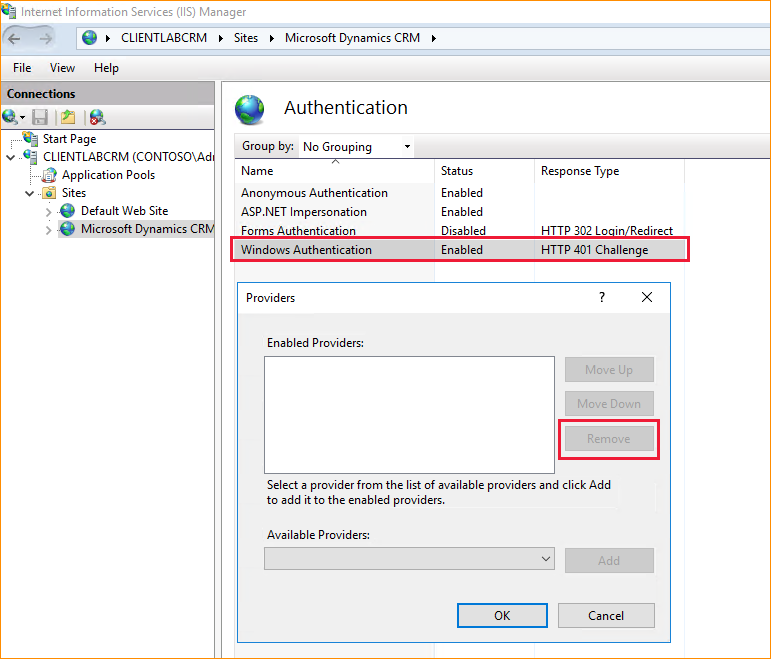

# Post-installation and configuration guidelines for Microsoft Dynamics 365


This section describes several of the tasks that the [!INCLUDE[pn_microsoftcrm](../includes/pn-microsoftcrm.md)] administrator should consider after the [!INCLUDE[pn_microsoftcrm_server](../includes/pn-microsoftcrm-server.md)] application is installed. This section isn’t meant to be an exhaustive resource used to configure deployments. Instead, use this section as a guideline to determine what best practices to implement and features to configure, based on your organization's needs.  
  
<a name="BKMK_copy_encr_key"></a>   
## Copy your organization encryption key  
 All new and upgraded organizations use data encryption that uses an encryption key to secure data such as user passwords for email mailboxes and [!INCLUDE[pn_yammer](../includes/pn-yammer.md)] accounts. This encryption key may be required to use [!INCLUDE[pn_microsoftcrm](../includes/pn-microsoftcrm.md)] after a redeployment or failure recovery. We strongly recommend that you make a copy of the encryption key and save it to a secure location. [!INCLUDE[proc_more_information](../includes/proc-more-information.md)][Copy your organization data encryption key](../admin/data-encryption.md#copy-your-organization-data-encryption-key)  
  
<a name="BKMK_MakeMicrosoft"></a>   
## Make Dynamics 365 client-to-server network communications more secure  
 With any network design, it is important to consider the security of your organization's client-to-server communications. When making necessary decisions that can help protect data, we recommend that you understand the following information about [!INCLUDE[pn_microsoftcrm](../includes/pn-microsoftcrm.md)] network communication and about the technology options that are available that provide more secure data transmissions.  
  
 If you installed [!INCLUDE[pn_microsoftcrm](../includes/pn-microsoftcrm.md)] or upgraded a [!INCLUDE[pn_microsoftcrm_server](../includes/pn-microsoftcrm-server.md)] that isn’t already configured for HTTPS, [!INCLUDE[pn_microsoftcrm](../includes/pn-microsoftcrm.md)] client-to-server communications are not encrypted. When using a website that supports only HTTP, information from [!INCLUDE[pn_crm_shortest](../includes/pn-crm-shortest.md)] clients is transmitted in clear text and, therefore, possibly vulnerable to malicious intent, such as "man-in-the-middle" type attacks that could compromise content by adding scripts to perform harmful actions.  
  
### Configuring Dynamics 365 for HTTPS  
 Configuring a site for HTTPS will cause a disruption in the [!INCLUDE[pn_microsoftcrm](../includes/pn-microsoftcrm.md)] application so plan the configuration when there will be minimal disruption to users. The high-level steps for configuring [!INCLUDE[pn_microsoftcrm](../includes/pn-microsoftcrm.md)] for HTTPS are as follows:  
  
1.  In [!INCLUDE[pn_Deployment_Manager_long](../includes/pn-deployment-manager-long.md)], disable the server where the [!INCLUDE[pn_Web_Application_Server](../includes/pn-web-application-server.md)], [!INCLUDE[pn_Organization_Web_Service](../includes/pn-organization-web-service.md)], [!INCLUDE[pn_Discovery_Web_Service](../includes/pn-discovery-web-service.md)], and [!INCLUDE[pn_Deployment_Web_Service](../includes/pn-deployment-web-service.md)] roles are running. If this is a Full Server deployment, all server roles are running on the same computer. For information about how to disable a server, see [!INCLUDE[pn_microsoftcrm](../includes/pn-microsoftcrm.md)][!INCLUDE[pn_Deployment_Manager_Help](../includes/pn-deployment-manager-help.md)].  
  
2.  Configure the website where the [!INCLUDE[pn_Web_Application_Server](../includes/pn-web-application-server.md)] role is installed to use HTTPS. For more information about how to do this, see Internet Information Services (IIS) Help.  
  
3.  Set the binding in [!INCLUDE[pn_deploymentmanager](../includes/pn-deploymentmanager.md)]. This is done on the **Web Address** tab of the **Properties** page for the deployment. For more information about how change the bindings see [Microsoft Dynamics 365 deployment properties](microsoft-dynamics-365-deployment-properties.md).  
  
4.  If you want to make other [!INCLUDE[pn_crm_shortest](../includes/pn-crm-shortest.md)] services more secure and [!INCLUDE[pn_microsoftcrm](../includes/pn-microsoftcrm.md)] is installed by using separate server roles, repeat the previous steps for the additional server roles.  
  
<a name="BKMK_configure_IFD"></a>   
## Configure a Dynamics 365 Internet-facing deployment  
 After all [!INCLUDE[pn_microsoftcrm_server](../includes/pn-microsoftcrm-server.md)] roles are installed, you can configure the deployment so that remote users can connect to the application through the Internet. To do this, start [!INCLUDE[cc_Rule_Deployment_manager_short](../includes/cc-rule-deployment-manager-short.md)] and complete the [!INCLUDE[pn_Configure_Claims-based_Wizard](../includes/pn-configure-claims-based-wizard.md)] followed by the [!INCLUDE[pn_Internet_Facing_Deployment_Configuration_Wizard](../includes/pn-internet-facing-deployment-configuration-wizard.md)]. Alternatively, you can complete these tasks using [!INCLUDE[pn_PowerShell](../includes/pn-powershell.md)]. More information: [Overview of Dynamics 365 Customer Engagement (on-premises) PowerShell](/powershell/dynamics365/customer-engagement/overview?view=dynamics365ce-ps)  
  
> [!IMPORTANT]
>  For [!INCLUDE[pn_moca_full](../includes/pn-moca-full.md)] to successfully connect to a new deployment of [!INCLUDE[pn_microsoftcrm_server](../includes/pn-microsoftcrm-server.md)], you must run a Repair of the [!INCLUDE[pn_microsoftcrm_server](../includes/pn-microsoftcrm-server.md)] application on the server running [!INCLUDE[pn_iis](../includes/pn-iis.md)] where the [!INCLUDE[pn_Web_Application_Server](../includes/pn-web-application-server.md)] role is installed *after* the [!INCLUDE[pn_Internet_Facing_Deployment_Configuration_Wizard](../includes/pn-internet-facing-deployment-configuration-wizard.md)] is successfully completed. <!-- [!INCLUDE[proc_more_information](../includes/proc-more-information.md)][Uninstall, change, or repair Microsoft Dynamics 365 Server](uninstall-change-repair-dynamics-365-server.md)  -->
 <!--  
 For more information about configuring [!INCLUDE[pn_microsoftcrm](../includes/pn-microsoftcrm.md)] for claims-based authentication, see [Configure IFD for Microsoft Dynamics 365](configure-ifd-for-dynamics-365.md).  -->
  
<a name="BKMK_AddRemove"></a>   
## Add or remove sample data  
 Sample data is available to help you become familiar with how [!INCLUDE[pn_microsoftcrm](../includes/pn-microsoftcrm.md)] works. By using sample data, work with records and see how they relate to each other, how data displays in charts, and see what information is in reports.  
  
 Sample data can be added or removed from within the [!INCLUDE[pn_crm_shortest](../includes/pn-crm-shortest.md)] application. [!INCLUDE[proc_more_information](../includes/proc-more-information.md)][Add or remove sample data](/dynamics365/customer-engagement/admin/add-remove-sample-data)  
  
<a name="config_guidelines"></a>   
## Complete the configuration tasks for new organizations  
 After you've completed installing [!INCLUDE[pn_microsoftcrm](../includes/pn-microsoftcrm.md)], but before the business users in your organization start using it, there are some basic tasks that you, as the [!INCLUDE[pn_crm_shortest](../includes/pn-crm-shortest.md)] administrator, should complete. These tasks include defining business units and security roles, adding users, and importing data.  
  
 [!INCLUDE[proc_more_information](../includes/proc-more-information.md)] [Set up a Dynamics 365 organization](../admin/set-up-a-dynamics-365-organization.md)  
  
<a name="install_solution"></a>   
## Import apps and solutions   
  Sales and Field Service apps are available to you. More information: [Available apps for Dynamics 365 Customer Engagement (on-premises)](available-apps.md)

  Use solutions to extend functionality and the user interface. Customizers and developers distribute their work as solutions. Organizations use [!INCLUDE[pn_microsoftcrm](../includes/pn-microsoftcrm.md)] to import the solution. Find a solution in the [Microsoft AppSource](https://appsource.microsoft.com/).  
  
> [!IMPORTANT]
>  Importing a solution or publishing customizations can interfere with normal system operation. We recommend that you schedule solution imports when it’s least disruptive to users.  
  
 For more information about how to import a solution, see [Import, update, and export a solution](/dynamics365/customer-engagement/customize/import-update-export-solutions).  
  
<a name="BKMK_WS2012R2"></a>   
## Configure Windows Server for Dynamics 365 Customer Engagement (on-premises) applications that use OAuth  
 The following information describes how to configure Windows Server with AD FS to support [!INCLUDE[pn_crm_shortest](../includes/pn-crm-shortest.md)] applications such as [!INCLUDE[pn_Mobile_Express_short](../includes/pn-mobile-express-short.md)], [!INCLUDE[pn_moca_full](../includes/pn-moca-full.md)],  [!INCLUDE[pn_crm_for_outlook_short](../includes/pn-crm-for-outlook-short.md)], [!INCLUDE[pn_netbreeze_long](../includes/pn-netbreeze-long.md)], or other [!INCLUDE[pn_dynamics_crm](../includes/pn-dynamics-crm.md)] applications that need OAuth support.  

<!--   
> [!NOTE]
>  -   There are a few issues that were present when configuring [!INCLUDE[pn_adfs_short](../includes/pn-adfs-short.md)] 2.0 and 2.1 that are no longer needed for [!INCLUDE[pn_adfs_short](../includes/pn-adfs-short.md)] 2.2. For example, with 2.0/2.1 you had to configure the MEX endpoint using a script or obtain a hotfix. This isn’t needed with [!INCLUDE[pn_adfs_short](../includes/pn-adfs-short.md)] 2.2. In addition, [!INCLUDE[pn_adfs_short](../includes/pn-adfs-short.md)] 2.2 adds the rule “Pass through all UPN Claims” in the [!INCLUDE[pn_Active_Directory](../includes/pn-active-directory.md)] claim provider trust by default, so the extra step to add the rule is no longer required.  -->
<!-- > -   To register [!INCLUDE[pn_netbreeze_long](../includes/pn-netbreeze-long.md)],  see [Set up the connection between Dynamics CRM and Social Engagement](https://go.microsoft.com/fwlink/p/?LinkId=733269).  -->
  
### Enable forms authentication  
 By default, forms authentication is disabled in the intranet zone. You must enable forms authentication by following these steps:  
  
1.  Log on to the [!INCLUDE[pn_adfs_short](../includes/pn-adfs-short.md)] server as an administrator.  
  
2.  Open the ADFS management wizard.  
  
3.  Select **Authentication Policies** > **Primary Authentication** > **Global Settings** > **Authentication Methods** > **Edit**.  
  
4.  Select (check) **Form Based Authentication** on the **Intranet** tab.  
  
### Configure the OAuth provider  
 Follow these steps to configure the OAuth provider in [!INCLUDE[pn_microsoftcrm](../includes/pn-microsoftcrm.md)]:  
  
1.  Log on to the [!INCLUDE[pn_microsoftcrm](../includes/pn-microsoftcrm.md)] server as an administrator.  
  
2. Add the [!INCLUDE[pn_crm_shortest](../includes/pn-crm-shortest.md)][!INCLUDE[pn_PowerShell](../includes/pn-powershell.md)] snap-in (Microsoft.Crm.PowerShell.dll). [!INCLUDE[proc_more_information](../includes/proc-more-information.md)] [Administer the deployment using Windows PowerShell](https://technet.microsoft.com/library/dn531202.aspx)  
  
   ```powershell  
   Add-PSSnapin Microsoft.Crm.PowerShell  
   ```  
  
3. Enter the following [!INCLUDE[pn_PowerShell](../includes/pn-powershell.md)] commands.  
  
   ```powershell  
  
   $ClaimsSettings = Get-CrmSetting -SettingType OAuthClaimsSettings  
   $ClaimsSettings.Enabled = $true  
   Set-CrmSetting -Setting $ClaimsSettings  
  
   ```  
  
### Register the client apps  
 The client apps must be registered with [!INCLUDE[pn_adfs_short](../includes/pn-adfs-short.md)].  
  
1.  Log on to the [!INCLUDE[pn_adfs_short](../includes/pn-adfs-short.md)] server as administrator.  
  
2.  In a [!INCLUDE[pn_PowerShell_short](../includes/pn-powershell-short.md)] window, execute the following commands to register each application that is applicable to your deployment.  
  
     [!INCLUDE[pn_crm_2016_shortest](../includes/pn-crm-2016-shortest.md)] mobile apps for [!INCLUDE[tn_Apple_iphone](../includes/tn-apple-iphone.md)], [!INCLUDE[tn_android](../includes/tn-android.md)], and [!INCLUDE[pn_ms_Windows_short](../includes/pn-ms-windows-short.md)].  
  
    ```powershell  
    Add-AdfsClient -ClientId ce9f9f18-dd0c-473e-b9b2-47812435e20d -Name "Microsoft Dynamics CRM for tablets and phones" -RedirectUri ms-app://s-1-15-2-2572088110-3042588940-2540752943-3284303419-1153817965-2476348055-1136196650/, ms-app://s-1-15-2-1485522525-4007745683-1678507804-3543888355-3439506781-4236676907-2823480090/, ms-app://s-1-15-2-3781685839-595683736-4186486933-3776895550-3781372410-1732083807-672102751/, ms-app://s-1-15-2-3389625500-1882683294-3356428533-41441597-3367762655-213450099-2845559172/, ms-auth-dynamicsxrm://com.microsoft.dynamics,ms-auth-dynamicsxrm://com.microsoft.dynamics.iphone.moca,ms-auth-dynamicsxrm://com.microsoft.dynamics.ipad.good,msauth://code/ms-auth-dynamicsxrm%3A%2F%2Fcom.microsoft.dynamics,msauth://code/ms-auth-dynamicsxrm%3A%2F%2Fcom.microsoft.dynamics.iphone.moca,msauth://code/ms-auth-dynamicsxrm%3A%2F%2Fcom.microsoft.dynamics.ipad.good,msauth://com.microsoft.crm.crmtablet/v%2BXU%2FN%2FCMC1uRVXXA5ol43%2BT75s%3D,msauth://com.microsoft.crm.crmphone/v%2BXU%2FN%2FCMC1uRVXXA5ol43%2BT75s%3D, urn:ietf:wg:oauth:2.0:oob  
    ```  
  
     [!INCLUDE[pn_crm_2016_outlook_shortest](../includes/pn-crm-2016-outlook-shortest.md)].  
  
    ```powershell  
    Add-AdfsClient -ClientId  2f29638c-34d4-4cf2-a16a-7caf612cee15  -Name "Dynamics CRM Outlook Client" -RedirectUri app://6BC88131-F2F5-4C86-90E1-3B710C5E308C/  
    ```  
  
     [!INCLUDE[pn_unified_service_desk](../includes/pn-unified-service-desk.md)] client.  
  
    ```powershell  
    Add-AdfsClient -ClientId  4906f920-9f94-4f14-98aa-8456dd5f78a8  -Name "Dynamics 365 Unified Service Desk" -RedirectUri app://41889de4-3fe1-41ab-bcff-d6f0a6900264/  
    ```  
  
     [!INCLUDE[pn_microsoftcrm](../includes/pn-microsoftcrm.md)] developer tools.  
  
    ```powershell  
    Add-AdfsClient -ClientId  2ad88395-b77d-4561-9441-d0e40824f9bc  -Name "Dynamics 365 Development Tools" -RedirectUri app://5d3e90d6-aa8e-48a8-8f2c-58b45cc67315/  
    ```  
  
3.  To register the [!INCLUDE[pn_crm_app_for_outlook_short](../includes/pn-crm-app-for-outlook-short.md)], in [!INCLUDE[pn_crm_op_edition](../includes/pn-crm-op-edition.md)], go to **Settings** > **Dynamics 365 App for Outlook** and register the app there.  
  
### Additional steps for clients unable to connect to the Dynamics 365 Server via IFD
If clients experience issues connecting through the IFD after you have registered them, follow each step here to resolve the issue. 

#### Remove site authentication providers
1. On the Dynamics 365 Server where the web application server role is running, open Internet Information Services (IIS) Manager. 
2. In the left pane, under the organization name, expand **Sites**, and then select **Microsoft Dynamics CRM**. 
3. Expand the **XRMServices** folder, and then select **2011**. 
4. Double-click **Authentication** in the middle pane.
5. Right-click **Windows Authentication**, and then select **Enable**.
6. Right-click **Windows Authentication**, and select **Providers**. For each provider in the list, select the provider, and then select **Remove**. 
7. After all providers are removed, right-click **Windows Authentication**, and then select **Disable**.

   

Repeat the previous steps to remove all Windows Authentication providers from the **nga** and **AppWebServices** site folders. 

#### Disable integrated windows authentication to prevent client authentication prompts 
1. On the AD FS server, open AD FS Management. 
2. Select **Authentication Policies** on the left pane.
3. In the middle pane, in **Global Settings**, locate **Authentication Methods** and then select **Edit**. 
4. Clear **Windows Authentication** if it is checked, and then select **OK**.

   
   
#### Grant application permission when using Windows Server 2016 AD FS 
On the AD FS server, run the following command in a Windows PowerShell console. This is required if you use Windows Server 2016 AD FS.

```powershell
Grant-AdfsApplicationPermission -ClientRoleIdentifier "<client_id/org_id>" -ServerRoleIdentifier "<org_auth_url>"
```

> [!IMPORTANT]
> Make sure org_auth_url is complete and accurate URL. Also, you must include the trailing forward slash /. <br />
> For example:  
> ```powershell 
> Grant-AdfsApplicationPermission -ClientRoleIdentifier "806e5da7-0600-e611-80bf-6c3be5b27d7a" -ServerRoleIdentifier https://auth.contoso.com:444/ 
> ```
> To display the authentication URL, run this PowerShell command: 
> ```powershell
>  Get-ADFSRelyingPartyTrust 
> ```

#### Restart AD FS
On the AD FS server, run the following PowerShell commands to force AD FS to restart.
```powershell
net stop adfssrv 
net start adfssrv
```

#### Enable Device Registration Service (DRS) on the federation server
To make sure that devices can connect to your deployment, follow the instructions in this topic: [Configure a federation server with Device Registration Service](https://docs.microsoft.com/windows-server/identity/ad-fs/deployment/configure-a-federation-server-with-device-registration-service). 

<a name="BKMK_usertrain"></a>   
## User training and adoption  
 [!INCLUDE[proc_more_information](../includes/proc-more-information.md)] [Training and Adoption Kit for Microsoft Dynamics 365](https://go.microsoft.com/fwlink/p/?LinkId=386503)  
  
## See also  
 [Installing on-premises Dynamics 365](installing-on-premises-dynamics-365.md)   
 [Operating Microsoft Dynamics 365](operating-microsoft-dynamics-365.md)


[!INCLUDE[footer-include](../../../includes/footer-banner.md)]