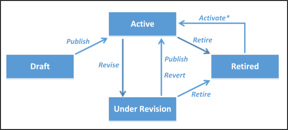

# Publish, revise, revert, retire, and activate products (product lifecycle)

By default, a product record is in the **Draft** state when you create it, and isn’t available for your sales agents. The record becomes available to your sales agents only when you publish it, which changes the state of the record to **Active**. For products that aren’t associated with a product family, that is, products that don’t have a parent product family record, you can create them directly in an **Active** state by setting the **Organization.CreateProductsWithoutParentInActiveState** attribute to `1` (true). By default, this attribute is set to `0` (false) for a fresh installation of Dynamics 365 Customer Engagement (on-premises) and to `1` (true) if you’re upgrading from a previous version of Dynamics 365 Customer Engagement (on-premises) to ensure compatibility for your applications working with the previous version of Dynamics 365 where the product records were created in an **Active** state.  
  
 You can also use the **Sales** tab in the system settings area in Dynamics 365 Customer Engagement (on-premises) or [!INCLUDE[pn_microsoft_dynamics_crm_for_outlook](../includes/pn-microsoft-dynamics-crm-for-outlook.md)] to specify whether products are created in an active state. [!INCLUDE[proc_more_information](../includes/proc-more-information.md)] [Manage product catalog configuration](https://technet.microsoft.com/library/dn832125.aspx)  
  
 Furthermore, you can revise, revert, retire, and activate your product records to maintain your product catalog as per your business requirements. The following illustration shows the state transitions of a product when you perform various operations on a product record in Dynamics 365 Customer Engagement (on-premises).  
  
   
  
 ***Activate\\**** : The activate operation is applicable for certain type of product records only. [!INCLUDE[proc_more_information](../includes/proc-more-information.md)] [Activate a product or kit record](publish-revise-revert-retire-activate-products.md#Activate)  
  
<a name="Publish"></a>   
## Publish a product family, product, or bundle  
 Use the <xref:Microsoft.Crm.Sdk.Messages.SetStateRequest> message to publish an individual product family, product, or bundle record. In this case, the state of the target record changes from **Draft** to **Active**. A child product or bundle record under a product family record can be published only if the parent product family record is published (in the **Active** state). You cannot publish multiple product family, product, or bundle records at once.  
  
 Use the <xref:Microsoft.Crm.Sdk.Messages.PublishProductHierarchyRequest> message to publish a product family hierarchy including the child products and bundles. You can use this message only with a product family record. The state of the target product family record and all the child product or bundle records changes from **Draft** to **Active**.  
  
 The following code sample demonstrates how you can publish an individual product family, product, or bundle record.  
  
```csharp  
SetStateRequest publishRequest = new SetStateRequest  
{  
   EntityMoniker = new EntityReference(Product.EntityLogicalName, _productId),  
   State = new OptionSetValue((int)ProductState.Active),  
   Status = new OptionSetValue(1)  
};              
_serviceProxy.Execute(publishRequest);  
```  
  
 The following code sample demonstrates how you can publish a product family, including its child records.  
  
```csharp  
PublishProductHierarchyRequest publishRequest = new PublishProductHierarchyRequest  
{  
   Target = new EntityReference(Product.EntityLogicalName, _productFamilyId)  
};  
_serviceProxy.Execute(publishRequest);  
  
```  
  
 For the complete sample code, see [Sample: Create and publish products](sample-create-publish-products.md).  
  
> [!IMPORTANT]
>  For the product or bundle records that aren’t associated with a product family, you must publish them individually after creating or editing them to make them available to your sales agents. For product or bundle records associated with a product family, use the <xref:Microsoft.Crm.Sdk.Messages.PublishProductHierarchyRequest> message on the parent product family record to publish multiple child product or bundle records, along with the parent product family record, at once.  
> 
>  Also, for products that aren’t associated with a product family, you can create them directly in an **Active** state by setting the **Organization.CreateProductsWithoutParentInActiveState** attribute to `1` (true). Alternately, use the **Sales** tab in the system settings area in Dynamics 365 Customer Engagement (on-premises) or [!INCLUDE[pn_microsoft_dynamics_crm_for_outlook](../includes/pn-microsoft-dynamics-crm-for-outlook.md)] to specify whether products not associated with product families are created in an active state. [!INCLUDE[proc_more_information](../includes/proc-more-information.md)] [Configure product catalog information](https://go.microsoft.com/fwlink/p/?LinkId=512492)  
  
<a name="Revise"></a>   
## Revise a product family, product, or bundle  
 Use the <xref:Microsoft.Crm.Sdk.Messages.SetStateRequest> message to revise a product family, product, or bundle record.  
  
- When invoked for a product family record, it revises the product family and its child records.  
  
- When invoked for a product or a bundle record, it revises the individual record only.  
  
  The state of the target record changes from **Active** to **Under Revision**.  
  
  After the product properties (attributes) are updated, the target record must to be published for the changes to reflect. On publishing, the state of the target record changes from **Under Revision** to **Active**.  
  
> [!NOTE]
>  When you revise a product and change the properties, Dynamics 365 Customer Engagement (on-premises) internally creates a new version of the product and copies the product details from the existing product to the newer version. The new product version has all the details including price lists, product relationships, and properties. The opportunities created with the older version of the product can continue to refer to the older version of the product. The opportunities that are created after the product is revised or retired will refer to the current (newer) product version.  
  
<a name="Revert"></a>   
## Revert a product family, product, or bundle  
 Use the <xref:Microsoft.Crm.Sdk.Messages.RevertProductRequest> message to revert a product family, product, or bundle record to its last **Active** state. All the product property (attribute) changes done to the record since it was last published (**Active** state) will be lost.  
  
- When invoked for a product family record, it reverts the product family and its child records to their last **Active** state, and all the changes done to the product properties of the records since they were last published will be lost.  
  
- When invoked for a product or a bundle record, it reverts the individual product or bundle record to its last **Active** state, and all the changes done to the product properties of the record since it was last published will be lost.  
  
  The state of the target record changes from **Under Revision** to **Active**.  
  
  The following code sample demonstrates how to revert a product record.  
  
```csharp  
RevertProductRequest revertReq = new RevertProductRequest  
{  
   Target = new EntityReference(Product.EntityLogicalName, _productId)  
};  
RevertProductResponse reverted = (RevertProductResponse)_serviceProxy.Execute(revertReq);  
```  
  
<a name="Retire"></a>   
## Retire a product family, product, or bundle  
 Use the <xref:Microsoft.Crm.Sdk.Messages.SetStateRequest> message to retire a product family, product, or bundle record.  
  
- When invoked for a product family record, it retires the entire product family hierarchy.  
  
- When invoked for a product or a bundle record, it retires the individual record only.  
  
  The state of the target record changes to **Retired**.  
  
> [!NOTE]
>  You can’t retire a product that is part of a published (**Active**) bundle. Also, you can’t add a retired product to a bundle or can’t add a product to a retired bundle.  
  
<a name="Activate"></a>   
## Activate a product or kit record  
 Use the <xref:Microsoft.Crm.Sdk.Messages.SetStateRequest> message to activate only the following types of record:  
  
- A retired product record that does not have a parent record.  
  
- A retired kit record.  
  
  The state of the target record changes from **Retired** to **Active**.  
  
> [!NOTE]
>  You can’t activate a retired product family or a retired bundle record.  
  
### See also  
 [Manage Product Pricing](product-pricing-methods.md)   
 [Create and manage product families, products and bundles](create-manage-product-families-products-bundles-product-properties.md)   
 [Product catalog entities](product-catalog-entities.md)


[!INCLUDE[footer-include](../../../includes/footer-banner.md)]