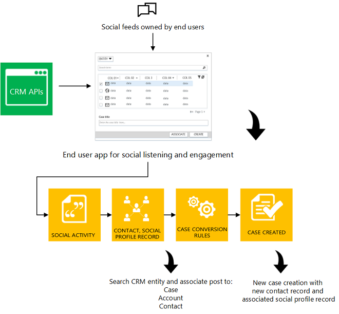

# Social entities

Use [!INCLUDE[pn_microsoftcrm](../includes/pn-microsoftcrm.md)] social care generic framework to route the social data that you obtain from various social channels into your [!INCLUDE[pn_crm_shortest](../includes/pn-crm-shortest.md)] system. Social care framework provides the general interface, data model, and necessary APIs for integrating social listening applications like Facebook and Twitter with [!INCLUDE[pn_microsoftcrm](../includes/pn-microsoftcrm.md)] to track social messages and profile data. Using social care framework, third party systems can push social data feed containing posts from the social channels to [!INCLUDE[pn_microsoftcrm](../includes/pn-microsoftcrm.md)] and can associate a social post with an existing [!INCLUDE[pn_crm_shortest](../includes/pn-crm-shortest.md)] record.  
  
 Social care framework offers following capabilities:  
  
- Social Activity to track Social posts in [!INCLUDE[pn_crm_shortest](../includes/pn-crm-shortest.md)]  
  
- Social Profile to track a contact’s presence in social media  
  
- Rule driven manual and automated Case creation and attribute values in [!INCLUDE[pn_crm_shortest](../includes/pn-crm-shortest.md)]. [!INCLUDE[proc_more_information](../includes/proc-more-information.md)] [Automatically create cases from email or social monitoring](https://go.microsoft.com/fwlink/p/?LinkId=393464).  
  
  You can use this framework to automatically convert social posts to case, create social profiles and contact records for the author of the posts in [!INCLUDE[pn_microsoftcrm](../includes/pn-microsoftcrm.md)], search existing records, and associate social posts and profiles to them. You can configure watch lists with keywords, #tags, @mentions to identify the social buzz around your brand, product or service on social channels like Twitter or Facebook. Then, associate the watch list with a [!INCLUDE[pn_microsoftcrm](../includes/pn-microsoftcrm.md)] queue, which is set up to automatically create cases from social posts. [!INCLUDE[proc_more_information](../includes/proc-more-information.md)] [Automatically create cases from email or social monitoring](https://go.microsoft.com/fwlink/p/?LinkId=393464).  
  
    
  
  Social care framework enhances the existing email to case settings to enable the automated case creation when a social activity is delivered to a queue. The external system or user can recognize the scope of the social care feed (for example, Post ID, corresponding [!INCLUDE[pn_crm_shortest](../includes/pn-crm-shortest.md)] record, attributes corresponding to the [!INCLUDE[pn_crm_shortest](../includes/pn-crm-shortest.md)] record), and target the update on the [!INCLUDE[pn_crm_shortest](../includes/pn-crm-shortest.md)] record and its attributes using the [!INCLUDE[pn_crm_shortest](../includes/pn-crm-shortest.md)] Create, Retrieve, Update, and Delete operations on an entity API method delivered through the Web API of [!INCLUDE[pn_microsoftcrm](../includes/pn-microsoftcrm.md)].  
  
  [!INCLUDE[pn_microsoftcrm](../includes/pn-microsoftcrm.md)] allows external services to connect to it, but won’t call into any external service and connect to it. The primary recipients of social data are [SocialActivity Entity](entities/socialactivity.md) and [SocialProfile Entity](entities/socialprofile.md), which are compliant with the changes in the social data.  
  
  The data model and API used in social care framework provides the developers an opportunity to extend and customize the sample app to meet their business scenario. You can download the sample app based on [!INCLUDE[pn_crm_shortest](../includes/pn-crm-shortest.md)] APIs to get visibility into [!INCLUDE[pn_microsoftcrm](../includes/pn-microsoftcrm.md)]. [!INCLUDE[proc_more_information](../includes/proc-more-information.md)] [Sample Application Using Microsoft Dynamics CRM Social Care Framework](https://msdn.microsoft.com/library/dn744885.aspx).  
  
## In This Section  
 [SocialActivity Entity](entities/socialactivity.md)  
  
 [SocialProfile Entity](entities/socialprofile.md)  
  
## Related Sections  
 [Model Your Business Data](model-business-data.md)  
  
 [Sample Application Using Microsoft Dynamics CRM Social Care Framework](https://msdn.microsoft.com/library/dn744885.aspx)

[!INCLUDE[footer-include](../../../includes/footer-banner.md)]