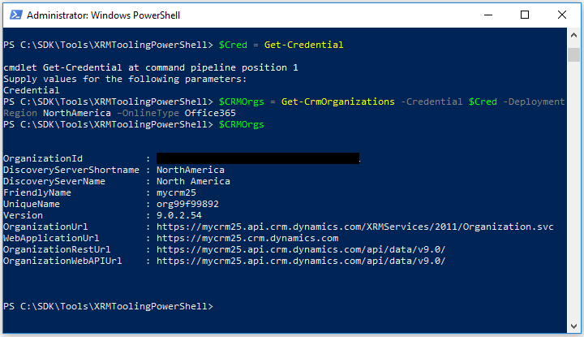

# Use PowerShell cmdlets for XRM tooling to connect to Dynamics 365 Customer Engagement (on-premises)

XRM tooling provides you with the following Windows PowerShell cmdlets that you can use to connect to Dynamics 365 Customer Engagement (on-premises) and retrieve organizations that the current user has access to: `Get-CrmConnection` and `Get-CrmOrganizations`.  

> [!NOTE]
> The PowerShell cmdlets documentation that is applicable to Dataverse users is now available in the Power Apps documentation at: [Use PowerShell cmdlets in XRM tooling to connect to Dataverse](/powerapps/developer/common-data-service/xrm-tooling/use-powershell-cmdlets-xrm-tooling-connect)
  
<a name="Prereq"></a> 

## Prerequisites  
  
- To use the XRM tooling cmdlets, you need PowerShell version 3.0 or later. To check the version, open a PowerShell window and run the following command: `$Host`  
  
- Set the execution policy to run the signed PowerShell scripts. To do so, open a PowerShell window as an administrator and run the following command: `Set-ExecutionPolicy -ExecutionPolicy RemoteSigned`  
  
<a name="register"></a>

## Acquire the Microsoft.Xrm.Tooling.CrmConnector.PowerShell cmdlet  

Before you can use the PowerShell cmdlet, you have to install them. The XRM tooling PowerShell cmdlets are available on the PowerShell Gallery [here](https://www.powershellgallery.com/packages/Microsoft.Xrm.Tooling.CrmConnector.PowerShell). To download and install the cmdlet
  
Open PowerShell or PowerShell ISE in admin mode, and run the following command:

   ```powershell
  Install-Module -Name Microsoft.Xrm.Tooling.CrmConnector.PowerShell
   ```  
If you installed the module in the past, you can update it with the following command:

   ```powershell
  Update-Module -Name Microsoft.Xrm.Tooling.CrmConnector.PowerShell
   ```
    
You’re now ready to use the PowerShell cmdlet. To list the cmdlets that you registered, run the following command in the PowerShell window:  
  
   ```powershell
  Get-Help “Crm”  
   ```  

<a name="RetrieveOrgs"></a>   

## Use the cmdlet to retrieve organizations from Dynamics 365 Customer Engagement (on-premises)

 Use the `Get-CrmOrganizations` cmdlet to retrieve the organizations that you have access to.  
  
1. Provide your credentials to connect to your  Dynamics 365 Customer Engagement (on-premises) instance. Running the following command will prompt you to type your user name and password to connect to the  Dynamics 365 Customer Engagement (on-premises) instance, and it will be stored in the `$Cred` variable.  
  
     ```powershell
    $Cred = Get-Credential  
     ```  

2. Use the following command to retrieve your organizations, and store the information in the `$CRMOrgs` variable:
  
   - If you’re connecting to the Dynamics 365 Server:  
  
     ```powershell  
     $CRMOrgs = Get-CrmOrganizations –ServerUrl https://<CRM_Server_Host> –Credential $Cred  
     ```      
  
   - If you’re connecting to the  Dynamics 365 Server using the claims-based authentication against the specified Home realm:  
  
     ```powershell  
     $CRMOrgs = Get-CrmOrganizations –ServerUrl https://<CRM_Server_Host> –Credential $Cred –HomRealmURL https://<Identity_Provider_Address>  
     ```  
  
3. Your supplied credentials are validated when you run the command in step 2. On successful execution of the command, type the following command, and press ENTER to display the organizations that you have access to:  
  
   ```powershell  
   $CRMOrgs  
   ```  
   > [!div class="mx-imgBorder"]
   >   
  
   > [!TIP]
   > You can use the variable that was used to store the retrieved  Dynamics 365 Customer Engagement (on-premises) organizations (in this case `$CRMOrgs`) with the `Get-CrmConnection` cmdlet to connect to  Dynamics 365 Customer Engagement (on-premises). To specify the org name, use the following command: `$CRMOrgs.UniqueName`.  
   >
   >  If there is more than one organization value stored in the `$CRMOrgs` variable, you can refer to the `nth` organization using the following command: `$CRMOrgs[n-1]`. For example, to refer to the unique name of the second organization in the `$CRMOrgs` variable, use the following command: `$CRMOrgs[1].UniqueName`. 
  
<a name="ConnecttoCRM"></a>
   
## Use the cmdlet to connect to Dynamics 365 Customer Engagement (on-premises)

 Use the `Get-CrmConnection` cmdlet to connect to a  Dynamics 365 Customer Engagement (on-premises) instance. The cmdlet lets you either use the XRM tooling common login control to specify your credentials and connect to  Dynamics 365 Customer Engagement (on-premises) or lets you specify your credentials as inline parameters. [!INCLUDE[proc_more_information](../../includes/proc-more-information.md)] [Use the XRM Tooling common login control](/powerapps/developer/common-data-service/xrm-tooling/use-xrm-tooling-common-login-control-client-applications)

> [!IMPORTANT]
> Before using the `Get-CrmConnection` cmdlet, ensure that you use the following command to enforce usage of TLS 1.2 by PowerShell to connect to your  Dynamics 365 Customer Engagement (on-premises) instance:<br/>
> `[System.Net.ServicePointManager]::SecurityProtocol = [System.Net.SecurityProtocolType]::Tls12`<br/>
> More information about TLS 1.2 requirement for Customer Engagement connection: [Blog Post: Updates coming to Dynamics 365 Customer Engagement (on-premises) connection security](https://blogs.msdn.microsoft.com/crm/2017/09/28/updates-coming-to-dynamics-365-customer-engagement-connection-security/)   
  
### Connect to  Dynamics 365 Customer Engagement (on-premises) by using the common login control  
  
1. If you want to use the common login control to provide your credentials to connect to  Dynamics 365 Customer Engagement (on-premises), use the following command. The connection information is stored in the `$CRMConn` variable so that you can use it later.  
  
   ```powershell  
   $CRMConn = Get-CrmConnection -InteractiveMode  
   ```  
  
2. The **LoginControl** dialog box appears. Provide your credentials to connect to your instance, and click **Login**.  
  
### Connect to Dynamics 365 Customer Engagement (on-premises) by specifying credentials inline  
  
1. To connect to Dynamics 365 Customer Engagement (on-premises), use the following commands. Note that these commands use the `$Cred` variable created earlier to store the credential while retrieving the organizations. The connection information is stored in the `$CRMConn` variable:
  
   - If you’re connecting to the Dynamics 365 Server:  
  
     ```powershell  
     $CRMConn = Get-CrmConnection –ServerUrl https://<CRM_Server_Host> -Credential $Cred -OrganizationName <OrgName>  
     ```
  
   - If you’re connecting to the Dynamics 365 Server using the claims-based authentication against the specified Home realm:  
  
     ```powershell  
     $CRMConn = Get-CrmConnection –ServerUrl https://<CRM_Server_Host> -Credential $Cred -OrganizationName <OrgName> –HomRealmURL https://<Identity_Provider_Address>  
     ```  
  
   > [!NOTE]
   > For the `OrganizationName` parameter in all the preceding commands, you can either specify the organization unique name or friendly name. You can also use the organization unique name or friendly name that you retrieved using the `Get-CrmOrganizations` cmdlet and stored in the `$CRMOrgs` variable. For example, you can use `$CRMOrgs[x].UniqueName` or `$CRMOrgs[x].FriendlyName`.  
  
2. Your supplied credentials are validated when you run the command in step 1. On successful execution of the cmdlet, type the following command, and press ENTER to display the connection information and status:  
  
   ```powershell  
   $CRMConn  
   ```  
  
   > [!div class="mx-imgBorder"]
   >   
  
### See also

[Use XRM Tooling API to connect to Dataverse](/powerapps/developer/common-data-service/xrm-tooling/use-crmserviceclient-constructors-connect)<br />
[Build Windows client applications using the XRM tools](/powerapps/developer/common-data-service/xrm-tooling/build-windows-client-applications-xrm-tools)<br /> 
[Blog: PowerShell module for performing data operations and manipulating user and system settings in Dynamics 365 Customer Engagement (on-premises)](https://blogs.msdn.com/b/crm/archive/2015/09/25/powershell-module-for-performing-data-operations-and-manipulating-user-and-system-settings-in-crm.aspx)


[!INCLUDE[footer-include](../../../../includes/footer-banner.md)]