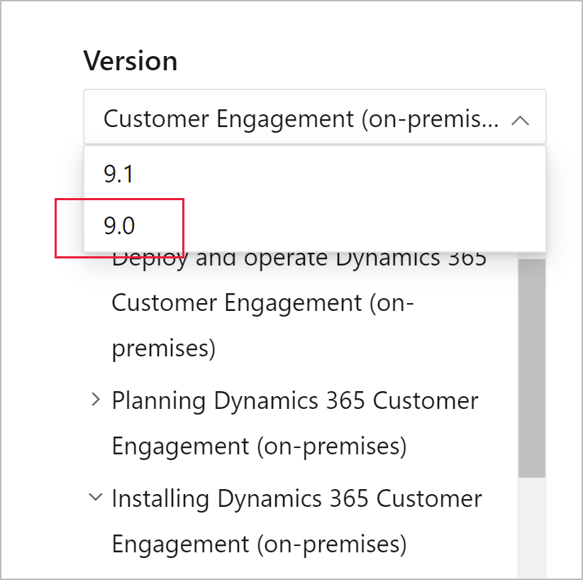

This article doesn't apply to the Dynamics 365 Customer Engagement (on-premises), version 9.1 update. 
- For information about the update, see [Update Dynamics 365 Customer Engagement (on-premises)](../deploy/update-to-v91.md).
- For information about this topic for Dynamics 365 Customer Engagement (on-premises), version 9.0, select the version located above the left navigation pane.

   
