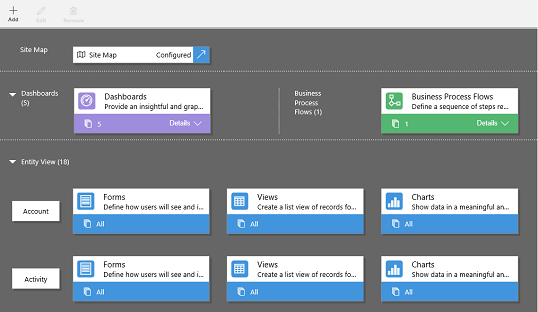
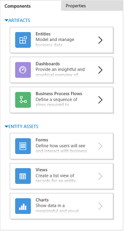
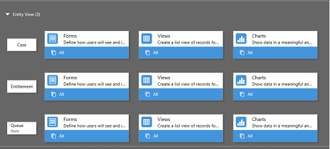
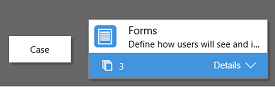
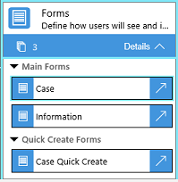

# Add or edit app components in the app designer

[!INCLUDE[cc-applies-to-update-9-0-0](../includes/cc_applies_to_update_9_0_0.md)]

An app is composed of various components. There are two types of components that you can add to an app: artifacts and entity assets. In the context of the app designer, entities, dashboard, and business process flows are all artifacts of an app. All assets of an entity - like forms, views, and charts - called entity assets.  
  
 The app designer refers to existing  metadata in the default solution. It also allows you to create components like forms, views, and charts.  
  
## App designer layout  
 The app designer has two main areas. On the left side is the canvas where you add app components.  
  
   
  
 On the right side   are tabs that you'll use to select components and set component properties.  
  
   
  
 On the canvas, you’ll see areas for site map, business process flow, dashboard, and entities. When you select a dashboard or business process flow or configure a site map,  the app designer automatically adds the entities that are used in these components to the canvas. Once you have the entities in place, all you need to do is select each entity, and add the required entity assets like the forms, view, and charts to it.  
  
## Add an artifact (entity, dashboard, or business process flow)  
 When you add a dashboard or business process flow to an app, the entities they use are automatically added to the app. When you add an entity, the tiles for its assets are automatically added. There are two ways you can add artifacts to the designer canvas: by using the **Add** button  on the command bar or by using the tiles in the **Components** tab.  
  
 Here are the steps for adding a dashboard to the app.  Use the same steps to add a business process flow or entity.  
  
1.  On the app designer canvas, click the **Dashboards** tile.  
  
     On the app designer canvas, the right pane shows you dashboards that are available in the default solution.  
  
    > [!TIP]
    >  Alternatively, you can also do one of the following:  
    >   
    > - Click the **Add** button , and select **Dashboards**.  
    > - On the **Components** tab, under **Artifacts**, click **Dashboards**.  
  
2.  In the **search** box, type a few keywords for the dashboard name you're looking for.  
  
     The dashboard list will be filtered to show results that match your keywords.  
  
3.  If you want your users to use only selected dashboards, select the check box for the dashboards you want to add. Those dashboards will be added to the Dashboard tile on the app designer canvas. The dashboard tile also shows a count of the number of dashboards added to the app. If you don't select a dashboard, all dashboards are available to  users when they use the app, and instead of the dashboard count, "All" is shown.  
  
     All entities the dashboard uses are also added to the **Entity View**  area. For example, if you add the Customer Service Manager dashboard, the Case, Entitlement, and Queue Item entities are added to the Entity View area. For each entity, tiles for its assets are also added. You can use these  tiles to add forms, views, and charts. [!INCLUDE[proc_more_information](../includes/proc-more-information.md)] [Add entity assets (forms, views, or charts)](../customize/add-edit-app-components.md#bkmk_AddEntityAssets)  
  
   
  
4.  If the dashboard you want doesn't exist in the default solution, create a dashboard by clicking **Create New** on the **Components** tab on the right side.  
  
   
  
     The dashboard designer opens. [!INCLUDE[proc_more_information](../includes/proc-more-information.md)] [Create and edit dashboards](../customize/create-edit-dashboards.md)  
  
    > [!NOTE]
    > - When you're adding a business process flow or entity, the **Create New** option opens the corresponding designer. To learn more about creating business process flows or entities, see [Create a business process flow](../customize/create-business-process-flow.md) and [Create and edit entities](../customize/create-edit-entities.md).  
    > - When you're adding a dashboard, you can only reference system and custom dashboards (except the interactive dashboards) that are  listed in the Dashboards node in the solution explorer.  
  
5.  When you're done adding artifacts, on the command bar, click **Save**.  
  
   
## Add entity assets (forms, views, or charts)  
 With the artifacts in place, you can start adding entity assets like forms, views, and charts to the app.  
  
 This section describes the steps for adding a form to the app. Use the same steps to add a view or chart to the app.  
  
1.  On the app designer canvas, click the **Forms** tile for the entity you want to add a form to.  
  
     On the app designer canvas, the entire row for the  entity is selected.  On the right side, you'll see all existing forms for the selected entity.  
  
    > [!NOTE]
    >  Alternatively, you can also do one of the following:  
    >   
    > - Click the **Add** button, and then select **Forms**.  
    > - On the **Components** tab, under **Entity Assets**, click **Forms**.  
  
    > [!TIP]
    >  For all entities selected for the app, a **More Options** button  appears in the **Select Entities** list of the **Components** tab. To add all assets for the selected entity, click the **More Options** button, and then click **Add All Assets**.  
  
2.  If you want your app users to use only selected forms, select the check boxes for the forms you want to add. The forms define how users will see and interact with data in the app.  
  
     The form tile of the selected entity will show  the number of forms added.  
  
   
  
     If a form, view, chart, dashboard, or business process flow isn't selected, it won't be added to the app designer,   but all entities that are in the default [!INCLUDE[pn_crm_shortest](../includes/pn-crm-shortest.md)] solution are available to app users while using the app.  This helps users create apps quickly when they need to work with all available components—there's no need to select each component during app design.  
  
    > [!NOTE]
    >  For the app to run, each entity that you add must have at least one active form. If you've selected multiple forms, the first active form  that appears in the default solution will be used when users run the app.  
  
3.  If you want to add a new  form that's not available in the list, click **Create New**.  
  
     In the drop-down, select the type of form you want to create.  
  
    > [!NOTE]
    >  The drop-down is available only when you're adding forms. It isn't available for views and charts.  
  
     The form designer opens. [!INCLUDE[proc_more_information](../includes/proc-more-information.md)] [Create and design forms](../customize/create-design-forms.md)  
  
     When you're adding a view or a chart, the **Create New** option opens the corresponding designer. To learn more about creating views or charts, see [Create and edit views](../customize/create-edit-views.md) and [Create or edit a system chart](../customize/create-edit-system-chart.md)  
  
    > [!NOTE]
    >  When you're adding a view, you can reference only public views that are listed under the **Views** node in the solution explorer.  
  
4.  Click **Details** to expand the tile  and see a list of forms that have been added.  
  
   
  
5.  Repeat these steps to add entity views and charts to the app.  
  
6.  Click **Save**.  
  
## Edit or remove artifacts  
  
-   To edit a dashboard or a business process flow, click **Details** in the corresponding tile, and then click the dashboard or business process flow that you want to edit. On the command bar, click **Edit** or click the **Open the \<Component> Designer** button .  
  
     The designer for the selected artifact opens.  
  
-   To remove a dashboard or a business process flow, click **Details** in the corresponding tile, and then click the dashboard or business process flow that you want to remove. On the command bar, click **Remove**.  
  
-   To edit or remove an entity, click the entity tile, and then on the command bar, click **Edit** or **Remove**.  When you edit an entity, the solution explorer opens, where you can make changes to the entity.  
  
     Alternatively, to remove a component,, select the dashboard or business process flow, or entity tile. The **Component** tab shows the corresponding dashboards or business process flows or entities that are referenced (added)  in the app designer. Clear the check boxes for the artifact you want to remove from the designer.  
  
    > [!NOTE]
    >  When you make any changes to an entity  - like changing an entity display name or description - the changes don't appear in the app designer unless the changes are published in the solution explorer.  
  
## Edit or remove entity assets  
  
### Edit entity assets  
  
1.  Click **Details** on the form, view, or chart tile you want to edit.  
  
2.  Click the form, view, or chart that you want to edit.  
  
3.  On the command bar, click **Edit** or click the **Open the \<Component> Designer** button  .  
  
### Remove entity assets  
  
1.  Click **Details** on the form, view, or chart tile that you want to remove.  
  
2.  Click the form, view, or chart that you want to remove.  
  
3.  On the command bar, click **Remove**.  
  
 Alternatively, select the form, view, or chart tile. The **Component** tab shows the corresponding forms or views or charts that are referenced (added)  in the app designer. Clear the check boxes for the assets you want to remove from the designer.  
  
### See also  
 [Create a site map for an app](../customize/create-site-map-app.md)   
 [Publish an app](../customize/publish-an-app.md)
