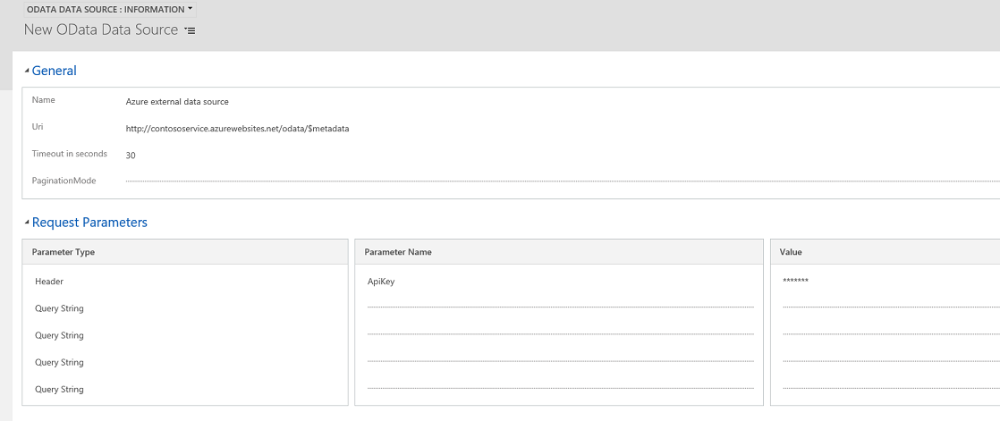

# Create and edit virtual entities that contain data from an external data source
Virtual entities are a custom entity in [!INCLUDE[pn_crm_shortest](../includes/pn-crm-shortest.md)] that have fields containing data from an external data source. Virtual entities appear in [!INCLUDE[pn_crm_shortest](../includes/pn-crm-shortest.md)] to users as regular [!INCLUDE[pn_crm_shortest](../includes/pn-crm-shortest.md)] entity records, but contain data that is sourced from an external database, such as an [!INCLUDE[pn_Azure_SQL_Database_long](../includes/pn-azure-sql-database-long.md)]. Records based on virtual entities are available in all [!INCLUDE[pn_crm_shortest](../includes/pn-crm-shortest.md)] clients including custom clients developed using the [!INCLUDE[pn_sdk](../includes/pn-sdk.md)].  
  
 In the past, to integrate the disparate data sources you would need to create a connector to move data or develop a custom plug-in, either client or server-side. However, with virtual entities you can connect directly with an external data source  at runtime so that specific data from the external data source is available in [!INCLUDE[pn_crm_shortest](../includes/pn-crm-shortest.md)], without the need for data replication.  
  
   
  
   
## Virtual entity benefits  
  
-   Developers can implement plugins to read external data using the [!INCLUDE[pn_sdk](../includes/pn-sdk.md)] and [!INCLUDE[pn_crm_shortest](../includes/pn-crm-shortest.md)] Plug-in Registration tool.  
  
-   System customizers use the [!INCLUDE[pn_crm_shortest](../includes/pn-crm-shortest.md)] customer engagement app to configure the data source record and create virtual entities that are used to access external data without writing any code.  
  
-   End users work with the records created by the virtual entity to view the data in fields, grids, search results, and Fetch XML-based reports and dashboards.  
  
Virtual entities are made up of three main components, a *data provider*, a *data source* record, and a *virtual entity*. The data provider consists of plug-ins and a data source entity. The data source is an entity record in [!INCLUDE[pn_crm_shortest](../includes/pn-crm-shortest.md)], which includes metadata that represents the schema of the connection parameters. Each virtual entity references a data source in the entity definition.  
  
[!INCLUDE[pn_crm_shortest](../includes/pn-crm-shortest.md)] includes an OData data provider that you can use to connect with an OData v4 web service that accesses the external data. An Azure Cosmos DB data provider is also available from [AppSource](https://appsource.microsoft.com/).  
  
Alternatively, developers can build their own data providers. Data providers are installed in [!INCLUDE[pn_crm_shortest](../includes/pn-crm-shortest.md)] as a solution. [!INCLUDE[proc_more_information](../includes/proc-more-information.md)] [Get started with virtual entities](https://go.microsoft.com/fwlink/?linkid=851057)  
  
   
## Considerations when you use virtual entities  
 Virtual entities have these restrictions.  
  
-   All data contained within a virtual entity record is read-only.  
  
-   Virtual entities don't support auditing.  
  
-   Virtual entities don't support change tracking.  Therefore, you can't use records that are based on a virtual entity for triggering business processes, workflows,  or to use to replicate to [!INCLUDE[pn_Azure_SQL_Database_long](../includes/pn-azure-sql-database-long.md)] using the [!INCLUDE[cc_Data_Export_Service](../includes/cc-data-export-service.md)].  
  
-   Virtual entity fields can't be used in rollups or calculated fields.  
  
-   A virtual entity can't be an activity type of entity.  
  
-   Virtual entities don’t support queues, knowledge management, SLAs, duplicate detection, change tracking, or mobile offline  capability.  
  
-   Virtual entities don't support the row-level [!INCLUDE[pn_crm_shortest](../includes/pn-crm-shortest.md)] security model. We recommend that you implement your own security model for the external data source.  
  
-   You can't enable field security on a field that contains virtual entity data.  
  
-   Can't be enabled for Relevance Search.  
  
-   We recommend that you target a single data source when you use virtual entities in Advanced Finds. For example, we don't recommend you create an  Advanced Find that ultimately creates a join between [!INCLUDE[pn_crm_shortest](../includes/pn-crm-shortest.md)] native data and the virtual entity external data.  
  
-   Can't be used with Portals for Dynamics 365 web portal solutions.  
  
-   N:N relationships between virtual entities aren't supported.  
  
-   External key references in [!INCLUDE[pn_crm_shortest](../includes/pn-crm-shortest.md)] must be globally unique identifiers (GUID).  
  
   
## Add a data source to use for virtual entities  
 This procedure shows you how to use the out-of-box OData data provider to use as the data source. Alternatively, developers can create a custom plug-in to use as the data provider. [!INCLUDE[proc_more_information](../includes/proc-more-information.md)] [Get started with virtual entities](https://docs.microsoft.com/dynamics365/#pivot=developer&panel=developer_sales)  
  
1.  Go to **Settings** > **Administration** > **Virtual Entity Data Sources**.  
  
2.  On the actions toolbar, click **New**.  
  
3.  On the Select  Data Provider dialog box, select from the following data sources, and then click **OK**.  
  
    - **OData Data Provider**. [!INCLUDE[pn_crm_2016_shortest](../includes/pn-crm-2016-shortest.md)] includes an Odata v4 data provider that can be used to connect to data sources that support the OData v4 open standard.  
  
    -   *Custom data provider*. If you've imported a data  provider plug-in, the data provider will appear here. [!INCLUDE[proc_more_information](../includes/proc-more-information.md)] [Get started with virtual entities](https://docs.microsoft.com/dynamics365/#pivot=developer&panel=developer_sales)  
  
4.  On the New Data Source properties page, complete the following fields, and then save the record.  
  
    - **Name**. Type a name that describes the data source.  
  
    - **Uri**. If you are using the OData data provider, enter the uri for the OData web service. For example, if you are using the OData provider to connect to a web service hosted in Azure, the URI can look similar to *http://contosodataservice.azurewebsites.net/odata/*.  
  
    - **Timeout in seconds**. Enter the number of seconds to wait for a response from the web service before quitting a data operation. For example, enter 30 to wait a maximum of thirty seconds before quitting the request.  
  
    - **Request Parameters**. Optionally, you can add custom header or query string parameters used to connect to the OData web service, such as authentication parameters to the external service. Click **Query String** to toggle between header and query string parameter and value. Up to 10 header or query strings can be added.  
  
   
  
   
## Create a virtual entity  
  
> [!NOTE]
>  Before you can create a virtual entity you need to configure at least one data source. [!INCLUDE[proc_more_information](../includes/proc-more-information.md)] [Add a data source to use for virtual entities](#AddDataSource)  
  
1.  Go to **Settings** > **Customizations** > **Customize the System**.  
  
2.  In the solution explorer, create a new entity. To do this, click **Entities** in the left navigation pane, and then click **New**.  
  
    > [!NOTE]
    >  You cannot convert an existing custom or out-of-box entity into a virtual entity.  
  
3.  On the **General** tab of the **Entity Definition**, click **Virtual Entity**, and then in the **Data Source** drop down list, select the data source that you want.  
  
   
  
4.  On the Entity Definition, complete the following required fields.  
  
    - **External Name**.  If you are using the OData Data Provider, enter the name of the entity the is used as a singular  reference to the entity in the metadata definition XML.  
  
    - **External Collection Name**. If you are using the OData Data Provider, enter the name of the entity the is used as a plural  reference to the entity in the metadata definition XML.  
  
     Here's an example of a virtual entity named *Movie* that uses a Azure Cosmos DB data provider to access document files.  
  
   
  
    > [!IMPORTANT]
    >  Several options, such as Access Teams, Queues, and quick create,  aren't available with virtual entities. [!INCLUDE[proc_more_information](../includes/proc-more-information.md)] [Considerations when you use virtual entities](#considerations)  
  
     Complete the additional required and optional properties, such as display and plural names, as necessary. For more information about these properties, see [Create and edit entities](../customize/create-edit-entities.md).  
  
5.  Create and add one or more fields for the virtual entity. In addition to the standard field properties required to create a custom field, these optional properties are available for each custom field you create for a virtual entity.  
  
    - **Data Source Secret**. If the data the field will display is encrypted of if it has sensitive data, set **Data Source Secret** to **Yes**.  
  
    - **External Name**. This is typically the unique name to identify the data  you want to display in the field.  
  
    > [!NOTE]
    >  If the field type you create is OptionSet, the following additional fields are available.  
    >   
    > - **External Type Name**. This property maps to the external name of the set of values in the external service for the option set.  Typically, this can be an enum or name of a string value class. The External Type Name can be used when a fully qualified name is required.  For example, as the *Type Name* with OData where parameters in a query need the fully qualified name, such as [*Type Name*].[*Value*].  
    > - **External Value**. This property maps to the corresponding value in the external data source for the option set item.  This value entered is used to determine which option set item to display in [!INCLUDE[pn_crm_shortest](../includes/pn-crm-shortest.md)].  
  
     Complete the additional properties as necessary. For more information about these properties, see [Create and edit fields](../customize/create-edit-fields.md).  
  
6.  Click **Save and Close** on the **Field** properties page.  
  
7.  On the solution explorer toolbar, click **Save**.  
  
8.  On the solution explorer toolbar, click **Publish**.  
  
9. Close solution explorer.  
  
### See also  
 [Create and edit entities](../customize/create-edit-entities.md)   
 [Create and edit fields](../customize/create-edit-fields.md)
