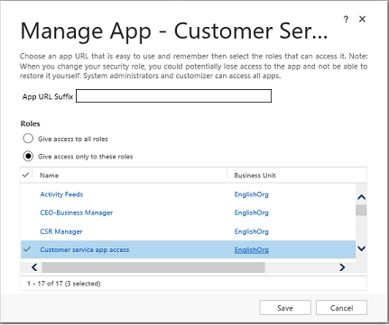

# Manage access to apps by using security roles

 [!INCLUDE [cc-applies-to-powerapps-and-update-9-0-0](../includes/cc-applies-to-powerapps-and-update-9-0-0.md)]

You can choose what users see and access from the **My Apps** page or the [!INCLUDE[pn_crm_shortest](../includes/pn-crm-shortest.md)] home page by giving app access to specific security roles. Users will have access to apps based on the security roles they're assigned to.  
  
1.  Go to **Settings** > **My Apps**.  
  
2.  In the lower-right corner of the app tile you want to manage access for, select **More options** (**...**), and then select **Manage Roles**.  
  
3.  Enter the following in the **Manage Roles** dialog box:  
  
    a. **App URL Suffix**: The URL you chose while creating the app is shown here by default. You can enter another app URL suffix, if you want to create an easy-to-remember URL for the app. This is optional. [!INCLUDE[proc_more_information](../includes/proc-more-information.md)] [Create or edit an app](../customize/create-edit-app.md).
    
    You cannot export or import the app URL suffix through a solution at this time. 
    
    b. **Roles**: Choose whether you want to give app access to all security roles or selected roles. If you choose **Give access only to these roles**, select the specific security roles.  

      

    c. Select **Save**.  
  
4.  Refresh the **My Apps** page.  
  
5.  Go to the **Apps Being Edited** view, and publish the app again.  
  
### See also  
 [Design custom business apps by using the app designer](design-custom-business-apps-using-app-designer.md)
