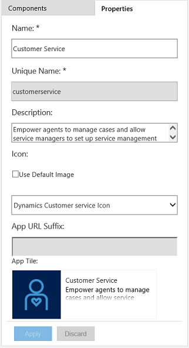

# Manage app properties in the app designer

[!INCLUDE[cc-applies-to-update-9-0-0](../includes/cc_applies_to_update_9_0_0.md)]

App properties define important details about the app, like its title or URL. You define app properties when you create an app. If you want to change those properties later, you can do that in the app designer.  
  
1.  In the app designer, on the right side, click the **Properties** tab.  
  
   
  
2.  Change the information, as required:  
  
    - **Name**. Enter a unique and meaningful name for the app.  
  
    - **Description**. Type a short description of what the app is.  
  
    - **Icon**. By default, the **Use Default App** check box is selected. To select a different web resource as an icon for the app, clear the check box, and then select an icon from the drop-down list. This icon is displayed on the app's preview tile.  
  
3.  Click **Apply** to save the changes.  
  
     To discard all changes made since the time the properties were last saved, click **Discard**.  
  
    > [!NOTE]
    >  You can't change the **Unique Name** and **App URL Suffix** from here. You can change the app URL in the **Manage App** dialog box. [!INCLUDE[proc_more_information](../includes/proc-more-information.md)] [Manage access to apps with security roles](../customize/manage-access-apps-security-roles.md)  
  
### See also  
 [Create or edit an app](../customize/create-edit-app.md)
