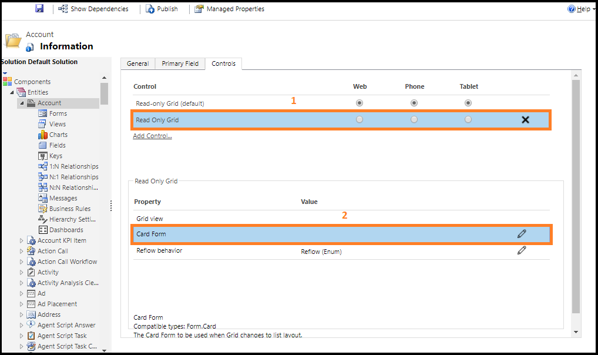

# Specify properties for Unified Interface apps

The grid control is responsive. As the size of the container decreases—for example, on phones and smaller viewports—the grid is transformed into a list. As a system customizer, if you’re working with a Unified Interface application in [!INCLUDE[pn-crm-online](../includes/pn-crm-online.md)] Customer Engagement, you can configure the following properties for custom grids and lists:

- **Read Only Grid:** Specifies how a grid should reflow to different screen sizes.
- **Card Form:** Use a card form for lists instead of the default list template. Card forms provide more information for list items than the default list template.

The grid control is responsive. As the size of the container decreases—for example, on phones and smaller viewports—the grid is transformed into a list.

## Read Only Grid
This property allows you to configure the following features: 
- Allow a grid to reflow into a list on small displays such as mobile.
- Specify the rendering mode as grid-only or list-only. 

### Set the Read Only Grid property

1. Go to **Settings** > **Customizations** > **Customize the System**.
2. In the **Entities** pane, select the appropriate entity (such as **Account** or **Contact**), and then on the **Controls** tab, select **Add Control**.

    

3. Select **Read Only Grid** from the list of controls, and then choose **Add**.

    The control is added to the list of available controls.
   
    
    
4. Select the devices (**Web**, **Phone**, or **Tablet**) for which you want to make the grid read-only.

    

5.	Save and publish the changes. 

## Card Form
You can use the Card Form property to show list items instead of the default list template. Card forms provide more information for list items than the default list template does.

### Set the Card Form property
1. Go to **Settings** > **Customizations** > **Customize the System**.
2. In the **Entities** pane, select the appropriate entity (such as **Account** or **Contact**) and then on the **Controls** tab, select **Add Control**.
3.	From the list of controls, select **Read Only Grid**, and then choose **Add**.

    The control is added to the list of available controls.
4. Select **Read Only Grid**, and then choose the pencil icon next to **Card Form**.

    

5.	Select the **Entity** and **Card Form** types.

    

6. Choose **OK**.
7. Save and publish the changes.

## Conditional image
You can display a custom icon instead of a value in a list and establish the logic used to select them based on a column’s values by using JavaScript. For more information about conditional images, see [Display custom icons instead of values in list views](display-custom-icons-instead.md).