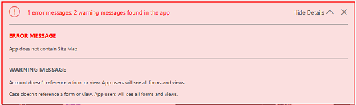
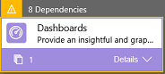

# Validate an app using the app designer
Validate an app to check for asset dependencies that are required for the app to work, but aren't yet added to the app.  
  
 For example, you've added a Customer Service Performance dashboard to the app, which uses charts like Case Mix (By Priority) or Case Resolution Trend (By Day) that you haven't added. When you validate this app, you'll get a list of all missing, required assets.  
  
 When you validate the app, the app designer canvas shows you details about the assets that are missing.  
  
1.  In the app designer, click **Validate**.  
  
     A notification bar appears and shows you if the app has any errors or warnings. The notification bar shows warnings in cases like when an entity has no forms or views, or the app doesn’t contain any components. An error may appear if a site map isn't configured for the app. You can publish an app without addressing warnings, but  errors must be fixed before you can publish.  
  
   
  
     The app designer also shows a warning symbol with the number of dependencies on each artifact or asset tile that is missing a required asset.  
  
   
  
2.  To add the required assets, on the right side, click the **Required** tab. The **Required** tab is visible when there's at least one required asset missing in the app.  
  
     The tab shows a list of required components.  
  
   
  
3.  Select the assets that you want to add, and then click **Add Dependencies**. When you add a required asset, the count  on the tile to which you've added the asset decreases.  
  
    > [!NOTE]
    >  If there's a common required asset  across various app components, for example, a form is required for a dashboard and an entity, and you add that asset only once from the Dashboard dependency tree, the dependency count will decrease on just the Dashboard tile, but not on the Entity tile. However, the dependency will be resolved for both.  
    >   
    >  Click the **Get Latest Dependencies** button  or click **Validate** again to get the latest set of dependencies. You'll only see these buttons after you save your app.  
  
     Click **Hide Dependencies** if you don't want to add the suggested required components. Any unresolved warnings will appear again when you open the app in app designer and click **Validate** or click the **Get Latest Dependencies** button .  
  
    > [!NOTE]
    >  If you hide dependencies now, and want to export this app later, all of these dependencies will appear again.  
  
### See also  
 [Add or edit app components](../customize/add-edit-app-components.md)   
 [Publish an app](../customize/publish-an-app.md)
