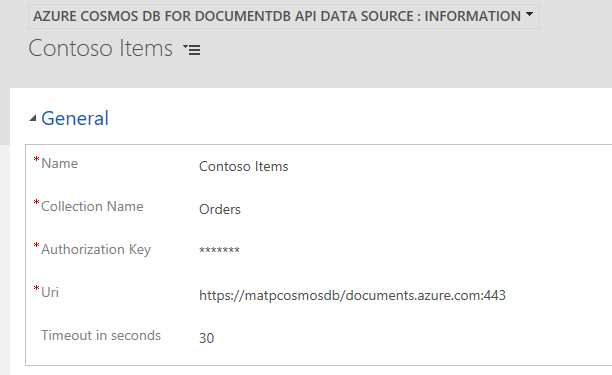

# Preview feature: Azure Cosmos DB for DocumentDB API Data Provider requirements

This topic describes the requirements for the Azure Cosmos DB for DocumentDB API Data Provider as well as how to configure and recommended best practices when you use the Azure Cosmos DB for DocumentDB API Data Provider with [!INCLUDE [pn-crm-shortest](../includes/pn-crm-shortest.md)] virtual entities. Azure Cosmos DB is Microsoft's globally distributed, multi-model database.

## Requirements

- Azure subscription that includes Azure Cosmos DB.
- An Azure Cosmos DB DocumentDB API collection.
- The Azure Cosmos DB database type should be a SQL. 

## Data type mapping

Suppose you have a Azure Cosmos DB document in a collection named *Orders* that has the following JSON structure.

This table indicates the data type mappings for the DocumentDB API document in the *Orders* collection with [!INCLUDE [pn-crm-shortest](../includes/pn-crm-shortest.md)] data types.

|DocumentDB Data  | [!INCLUDE [pn-crm-shortest](../includes/pn-crm-shortest.md)] Data Type  |
|---------|---------|
|id     |     Primary Key    |
|name     | Single Line of Text        |
|quantity     | Whole Number        |
|orderid     | Single line of text        |
|ordertype     |  Option Set       |
|amount     | Decimal Number or Currency        |
|delivered     | Two Options        |
|datetimeoffset     | Date and Time        |

> [!NOTE]
> - Attributes with an underscore (_) prefix are generated by the DocumentDB API.
> - Attributes that are missing in the DocumentDB API document and are mapped in [!INCLUDE [pn-crm-shortest](../includes/pn-crm-shortest.md)] as **Business Required** will cause a runtime error.
> - For more information about using dates in DocumentDB API, see [Working with Dates in Azure DocumentDB](https://azure.microsoft.com/blog/working-with-dates-in-azure-documentdb-4/).

## Supported query filtering

Query filtering supports the following operators. 

- Comparison operators:<,>,<=, >=,!=
- Logical operators: and, or 
- Set operators: in, not in
- String operators: like, contains, begins with, ends with

> [!NOTE]
> Usage of the like operator is translated to the equivalent contains/begins with/ends with operators. The  DocumentDB API does not support pattern arguments as described in the topic [Like (Transact-SQL)](https://docs.microsoft.com/sql/t-sql/language-elements/like-transact-sql). The Azure Cosmos DB for DocumentDB API Data Provider can translate the single special case Like(‘[aA]%’) to BeginsWith(‘a’) OR BeginsWith(‘A’). Notice that string comparison in the DocumentDB API is case sensitive.

##Install and configure the Azure Cosmos DB for DocumentDB API Data Provider

1. Go to AppSource and add the application to your [!INCLUDE [pn-crm-9-0-0-online](../includes/pn-crm-9-0-0-online.md)] or later instance.
2. After the solution is installed, sign in to the [!INCLUDE [pn-crm-shortest](../includes/pn-crm-shortest.md)] instance and go to **Settings** > **Administration** > **Virtual Entity Data Sources**.
3. On the Actions toolbar click **NEW**, and in the **Select Data Provider** dialog box select **Azure Cosmos DB for DocumentDB API Data Provider**, and then click **OK**.

1. Enter the following information, and then click **SAVE & CLOSE**.
  - **Name**. Type a name that describes the data source.
  - **Collection Name**. The name of the Azure Cosmos DB database collection containing the data you want to surface in a virtual entity.  
  - **Authorization Key**. The primary or secondary key for the Azure Cosmos DB account. You can find the key from the Azure admin portal under the **Keys** setting under your Azure Cosmos DB account.
  - **Uri**. The URI of the resource group where the Azure Cosmos DB collection is located. The URI is formed similar to https://contoso/documents.azure.com:443. You can find the URI from the Azure admin portal under the Keys setting for the Azure Cosmos DB account. 
  - **Timeout in seconds**. Enter the number of seconds to wait for a response from the Azure Cosmos DB service before a data request time-out. For example, enter 30 to wait a maximum of thirty seconds before a time-out occurs. The default timeout is 120 seconds.

c

## Best practices and limitations

- Azure Cosmos DB databases do not require a schema, however the data within the Azure Cosmos DB must be structured using a known schema. 
- Although the Azure Cosmos DB for DocumentDB API Data Provider implements query translation of projection, filtering, and sorting operators, it does not support join operations.
- You can only filter by a single column with DocumentDB API.

## See also

[Create and edit virtual entities that contain data from an external data source](create-edit-virtual-entities.md)
