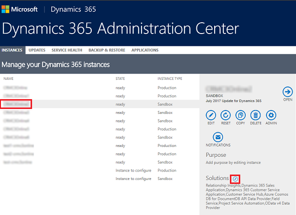
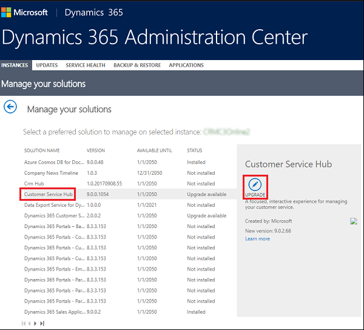

# Add Channel Integration Framework (CIF) solution as a dependent solution

Third party channel providers can add Channel Integration Framework (CIF) solution as a dependent solution to use CIF's capabilites in the solutions they develop for Dynamics 365. This doc illustrates how users can install, update and delete a CIF solution as a dependent solution.

## Add Channel Integration Framework solution as a dependent solution  

1. Add the Channel Integration Framework application to your Dynamics 365 instance that has an unmanaged dependent solution(say solution "X") installed. More information: [Get Channel Integration Framework](get-channel-integration-framework.md).

2. Login to your Dynamics 365 instance and go to **Settings** > **Solutions**.

3. From the list of solutions, click on "X" solution to open it.

4. In the window that opens up, select **Model Driven App** from the left panel.

5. Select **Channel Integration Framework** and click **OK**.

6. Click on **Publish all customizations**.

7. Close the solution window.

8. Export the solution.
<!--
## Update a CIF solution

1. Sign in to [https://portal.office.com](https://portal.office.com) with your Global administrator or [!INCLUDE[pn_crm_shortest](../../includes/pn-crm-shortest.md)] System Administrator credentials.  
  
2. Select **Admin centers** > **Dynamics 365**  
  
3. Select the **Instances** tab.  
  
4. Select the instance with the solution to update, and then select **Manage your solutions** .  
  
   

5. Select the solution you want to update, and then select **Upgrade**.  
  
   

6. Proceed through **Terms of service** to accept the terms and start the upgrade. 
-->
## Remove Channel Integration Framework solution as a dependent solution
  
1. [!INCLUDE[proc_permissions_system_admin_and_customizer](../../includes/proc-permissions-system-admin-and-customizer.md)]  
  
2. Sign in to [!INCLUDE[pn_crm_shortest](../../includes/pn-crm-shortest.md)].  
  
3. Select **Settings** > **Solutions**.  
  
4. Select solution 'X'.

5. In thwindow that opens, select **Channel Integration Framework** solution.

6. Click on **Delete**. Then, click on **Delete** button in the dialog box that opens to confirm that you want to remove CIF as a dependent solution.

## See Also

[Get Channel Integration Framework](get-channel-integration-framework.md)