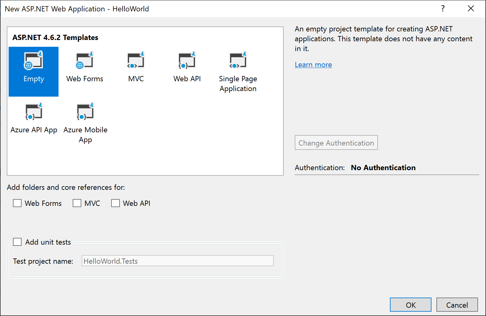
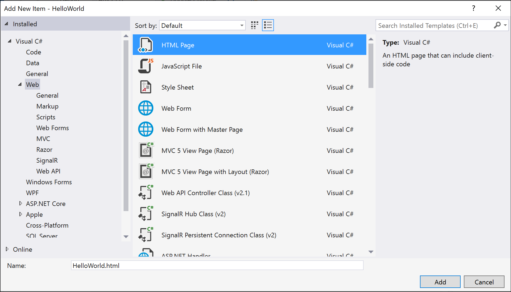
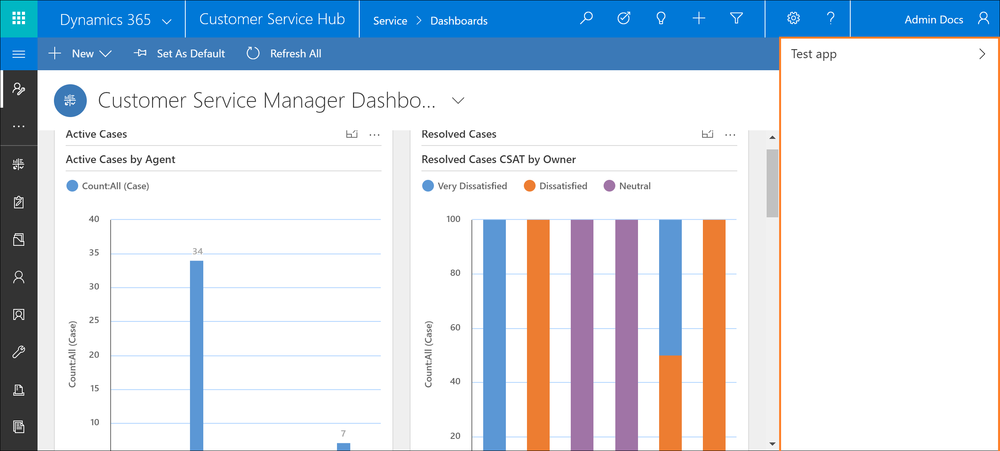

# Getting started with building a simple communication widget

In this tutorial we will demonstrate how to build a simple *Hello World!* communication widget that can be hosted on Channel Integration Framework(CIF).

## Create a simple *Hello World!* application

1. Open Visual Studio 2017, and click on **File** > **New** > **Project** to create a new project.
2. Select **ASP.NET Web Application(.NET Framework)** template for your project and add any name to it.<br />
")<br />
3. Now select **Empty** template for your application.<br />
<br />
4. Now we need to add an HTML file to our project. For that, right click on your project in the side panel. Then select **Add** > **New item**.<br />
<br />
5. Now copy the following code and add it into your HTML file.

```HTML
<!DOCTYPE html>
<html>
<head>
    <meta charset="utf-8" />
    <title>Dynamics 365 Channel Integration Framework| Simple Hello World widget</title>
</head>
<body>
    <p>Hello World!</p>
</body>
</html>
```
6. Now run this HTML file using Microsoft Edge or Google Chrome to test and debug.

## Publish and configure the widget 

1. To publish the above sample widget, follow the steps mentioned in [Publish sample app to Azure](sample-softphone-integration.md#bkmk_PublishToAzure). 
2. Then, to configure the widget in your Dynamics 365 instance follow the steps mentioned in [Configure sample app in Dynamics 365](sample-softphone-integration.md#bkmk_Configure).

Once all the above steps are completed, launch one of the Unified Interface apps that you selected while configuring the widget in CIF to see the communication widget in the side panel on the right side. To launch one of your selected Unified Interface apps, go to `https://[Organization URI]/apps`.

The published widget should look like this.<br />

<br />

## See also

[Host a communication widget and change its modes](host-communication-widget-change-modes.md)