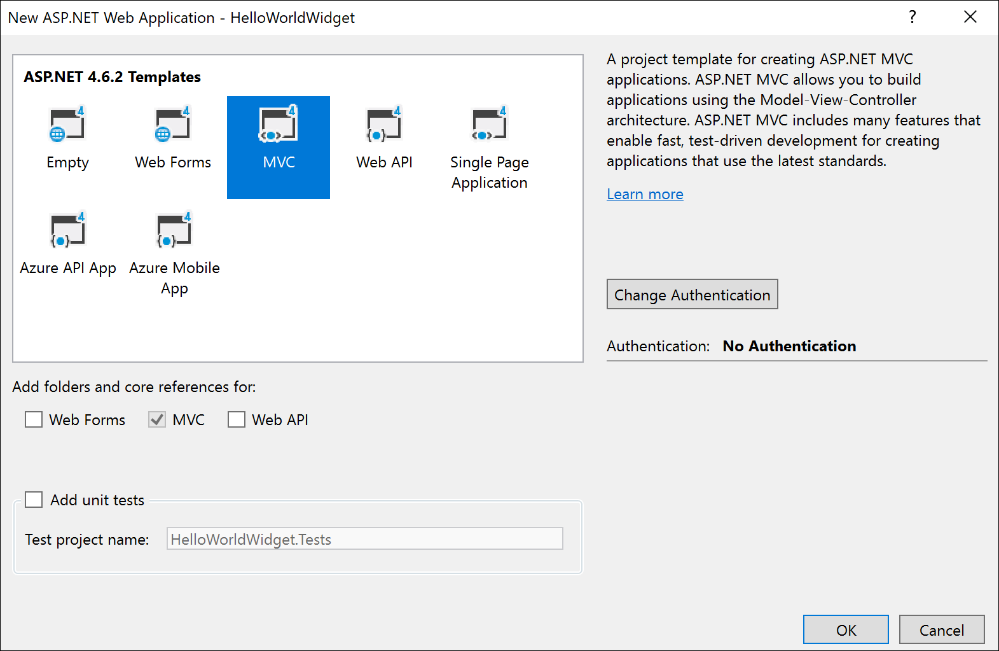
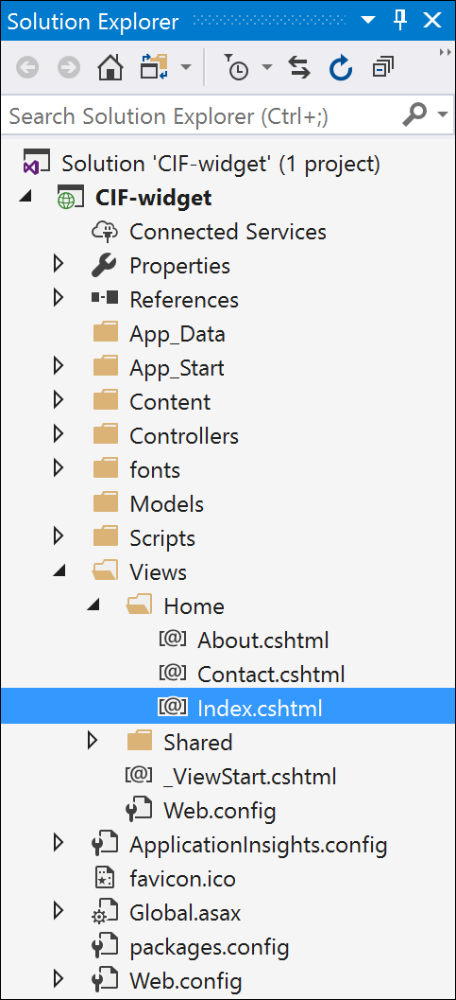

# Getting started with building a simple communication widget

In this tutorial we will demonstrate how to build a simple *Hello World!* communication widget that can be hosted on Channel Integration Framework(CIF).

## Pre-requisites

- Visual Studio 2017
- A valid Azure subscription is required to publish the sample app to Azure.

> [!Note]
> If you don't have an Azure subscription, create a [free account](https://azure.microsoft.com/free/).
 
## Create a simple *Hello World!* application

1. Open Visual Studio 2017, and click on **File** > **New** > **Project** to create a new project.

2. Select **ASP.NET Web Application(.NET Framework)** template for your project and add any name to it.<br />

")<br />

3. Now select **MVC** template for your application and make sure that authentication is set to **No Authentication**.<br />

<br />

You can choose any other template for your ASP.NET application.

4. Now see the files in the solution explorer. Expand **Views** > **Home**, and open **Index.cshtml** file.<br />

<br />

5. Now replace the HTML code in the **Index.cshtml** file with the code given below.

```HTML
<!DOCTYPE html>
<html>
<body>
    <br /><br />
    <p>Hello World!</p>
</body>
</html>
```
6. Now run this HTML file using Microsoft Edge or Google Chrome to test and debug.

The web page should look like this when you run it in your browser.

<br />

## Publish and configure the widget 

1. To publish the above sample widget, follow the steps mentioned in [Publish sample app to Azure](sample-softphone-integration.md#bkmk_PublishToAzure). You may also want to read this Azure tutorial on how to create and publish an ASP.NET web app in Azure: [Create an ASP.NET Framework web app in Azure](https://docs.microsoft.com/en-us/azure/app-service/app-service-web-get-started-dotnet-framework).

Once the wizard has published the app on Azure, it provides a Site URL using which you can use to access your hosted web app.<br />

<br />

When you click on the site URL, it opens the same web app that we saw earlier while debugging our web app in Visual Studio.

2. Then, to configure the widget in your Dynamics 365 instance follow the steps mentioned here: [Configure sample app in Dynamics 365](sample-softphone-integration.md#bkmk_Configure).

Once all the above steps are completed, launch one of the Unified Interface apps that you selected while configuring the widget in CIF to see the communication widget in the side panel on the right side. To launch one of your selected Unified Interface apps, go to `https://[Organization URI]/apps`.

The published widget should look like this.<br />

<br />

## See also

[Sample code for softphone integration](sample-softphone-integration.md)<br />
[Create an ASP.NET Framework web app in Azure](https://docs.microsoft.com/en-us/azure/app-service/app-service-web-get-started-dotnet-framework)<br />
[Frequently asked questions](faq-channel-integration-framework.md)