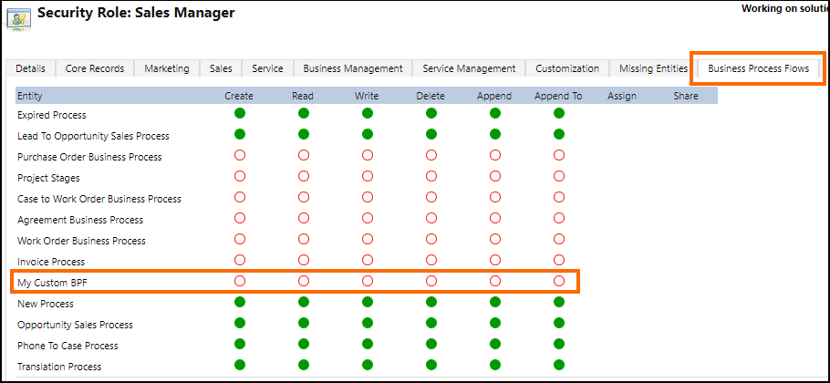

# Model business process flows

[!INCLUDE[](../includes/cc_applies_to_update_9_0_0.md)]

A *business process flow* lets you create more efficient and streamlined sales, service, and other business processes. Having high performing processes in place will help you to increase your win rates, improve customer satisfaction, and grow your revenue.  
  
 A business process flow creates a visualization of your business process by placing special controls at the top of the entity forms. Users are guided through various stages of sales, marketing, or service processes towards completion. Each process supports multiple stages and steps. You can add or remove steps, change the order of stages, or add new entities to the business process flow.  
  
 Different business process flow definitions can be associated with different roles and the instances can run concurrently against the same entity record. Users can switch between concurrent business process instances and resume their work at a current stage in the process. The new visual drag-and-drop process designer allows creating processes, such as business process flows and task flows, as well as business rules, using an intuitive graphical interface in [!INCLUDE[pn_dyn_365](../includes/pn-dyn-365.md)] Customer Engagement.  
  
 For detailed information about processes, see [Business Process Flows overview](../customize/business-process-flows-overview.md)  
  
<a name="BKMK_Implement"></a>   
## Server-side programmability support for business process flow
  
 A business process flow definition is stored in the `Workflow` entity. Business process flow is one of the categories of the process. Other process categories include action, workflow, and dialog. For more information, see [Dynamics 365 Process categories](process-categories.md).  Custom entities and entities that have updated UI forms can participate in the business process flow. The updated UI entities have the <xref:Microsoft.Xrm.Sdk.Metadata.EntityMetadata.IsAIRUpdated> property set to `true`. To enable an entity for the business process flow, set the <xref:Microsoft.Xrm.Sdk.Metadata.EntityMetadata.IsBusinessProcessEnabled> property to `true`.  
  
> [!IMPORTANT]
>  Enabling an entity for business process flow is a one way process. You can’t reverse it.  
  
-   [Define business process flow](#DefineBPF)  
  
-   [Activate business process flow](#ActivateBPF)

-   [Manage security for business process flows](#BPFSecurity)  
  
-   [Manage business process flow instances](#ManageBPF)

-   [Apply business process flow while creating an entity record](#ApplyBPF)  
  
<a name="DefineBPF"></a>   
### Define business process flow  
 Use the new visual business process flow designer in [!INCLUDE[pn_crm_shortest](../includes/pn-crm-shortest.md)] to define a business process flow. The `Workflow` entity stores a business process flow definition, and the following attribute values must be specified in the `Workflow` entity record for a business process flow: `name`, `category`, `businessprocesstype`, `primaryentity`, `uniquename`, and `xaml`.  For information about these attributes, see [Workflow Entity](entities/workflow.md). By default, a business process flow record is created in the `Draft` state.  
  
<a name="ActivateBPF"></a>   
### Activate business process flow  
 Before you can use the process flow, you have to activate it. To activate it, you must have the `prvActivateBusinessProcessFlow` privilege for the `Workflow` entity. Use the <xref:Microsoft.Xrm.Sdk.Messages.UpdateRequest> message to set the state of the `Workflow` entity record to `Activated`. [!INCLUDE[proc_more_information](../includes/proc-more-information.md)] [Perform specialized operations using Update](org-service/perform-specialized-operations-using-update.md)  
  
 Once you activate a business process flow definition (by changing the state of the corresponding `Workflow` entity record), a custom entity with the following name is automatically created to store the activated business process flow instances: "*\<activesolutionprefix>*_*\<uniquename>*".  
  
 For example, if you specified unique name of the business process flow definition as "myuniquebpf1" and are using the default publisher for your active solution, the name of the custom entity created for storing process instances will be "new_myuniquebpf1".  
  
 If the `uniquename` value isn't available for a business process flow definition, for example if the business process flow was imported as part of solution from an earlier version, the default name of the custom entity will be "*\<activesolutionprefix>*\_bpf\_*<GUID_BPF_Definition>*:  
  
> [!IMPORTANT]
>  The sample business process flow records available in [!INCLUDE[pn_dyn_365](../includes/pn-dyn-365.md)] use system entities to store the corresponding business process flow instance records. Couple of the sample business process flow entity records are [OpportunitySalesProcess Entity](entities/opportunitysalesprocess.md) and [LeadToOpportunitySalesProcess Entity](entities/leadtoopportunitysalesprocess.md).  
>   
>  However, any new business process flow definitions you create will use custom entities to store its instance records as explained earlier.  

<a name="BPFSecurity"></a>   
### Manage security for business process flows

The custom entity that is automatically created on activating a business process flow to store business process flow instances adheres to the standard security model as for any other custom entity in Customer Engagement. This implies that privileges granted on these entities define the runtime permissions for users for business process flows.

The custom business process flow entity has organization scope. The regular create, retrieve, update and delete privileges on this entity define the permission the user would have based on his/her assigned roles. By default, when the business process flow custom entity is created, only **System Administrator** and **System Customizer** security roles are granted access to it, and you must explicitly grant permissions to the new business process flow entity (for example, **My Custom BPF**) for other security roles as required.



<a name="ManageBPF"></a>   
### Manage business process flow instances  
 The custom entity that is automatically created on activating a business process flow definition stores all the process instances for the business process flow definition. The custom entity supports programmatic creation and management of records (process instances) using Web API and CRM 2011 endpoint. For example, if the name of the custom entity is "new_myuniquebpf1", you can use the following Web API query to retrieve all the records (process instances) in the custom entity:  
  
```
GET [Organization URI]/api/data/v9.0/new_myuniquebpf1s  
```  
  
 A process instance can have one of the following states: `Active`, `Finished`, or `Aborted`. 

> [!IMPORTANT]
> - This section provides information about programmatically managing various business process flow scenarios such as retrieving process instances for an entity record, retrieving active path and active stage for a process instance, and moving to next or previous stage. You must use the messages and appropriate business process flow entity/entities as described in this section to programmatically manage and automate your business process flows.
> - Manipulating process related attributes (such as **ProcessId**, **StageId**, and **TraversedPath**) on entities enabled for business process flows does not guarantee consistency of the business process flow state, and is not a supported scenario. The only exception to this is programmatically modifying the **ProcessId** attribute while creating an entity record to override the default application of the business process flow to the new record. More information: [Apply business process flow while creating an entity record](#ApplyBPF).
> - Switching to another process instance for an entity record is only supported through UI (client). Hence, you can no longer use the `SetProcess`  message (<xref href="Microsoft.Dynamics.CRM.SetProcess?text=SetProcess Action" /> or <xref:Microsoft.Crm.Sdk.Messages.SetProcessRequest>) to programmatically switch processes (set another business process flow as the active process instance) for the target entity record. 
  
 Use the `RetrieveProcessInstances` message (<xref href="Microsoft.Dynamics.CRM.RetrieveProcessInstances?text=RetrieveActivePath Function" /> or <xref:Microsoft.Crm.Sdk.Messages.RetrieveProcessInstancesRequest>) to retrieve all the business process flow instances for an entity record across all business process definitions. The business process flow instances returned for an entity are ordered based on the `modifiedon` attribute for the instance. For example, the most recently modified business process flow instance will be the *first*  record in the returned collection. The most recently modified business process flow instance is the one that is active on the UI  for an entity record.  
  
 The following sample code demonstrates how to retrieve business process flow instances for an entity record:  
  
```csharp  
// Verify the currently active BPF instance for the qualified Opportunity record
RetrieveProcessInstancesRequest procOpp1Req = new RetrieveProcessInstancesRequest
{
    EntityId = _opportunityId,
    EntityLogicalName = Opportunity.EntityLogicalName
};
RetrieveProcessInstancesResponse procOpp1Resp = (RetrieveProcessInstancesResponse)_serviceProxy.Execute(procOpp1Req);

// Declare variables to store values returned in response
Entity activeProcessInstance = null;

if (procOpp1Resp.Processes.Entities.Count > 0)
{
    activeProcessInstance = procOpp1Resp.Processes.Entities[0]; // First record is the active process instance
    _processOpp1Id = activeProcessInstance.Id; // Id of the active process instance, which will be used
                                               // later to retrieve the active path of the process instance
                                                
    Console.WriteLine("Current active process instance for the Opportunity record: '{0}'", activeProcessInstance["name"].ToString());
    _procInstanceLogicalName = activeProcessInstance["name"].ToString().Replace(" ", string.Empty).ToLower();
}
else
{
    Console.WriteLine("No process instances found for the opportunity record; aborting the sample.");
    Environment.Exit(1);
}  
```  
  
 The returned business process flow instance record for an entity record also stores the ID of the active stage in the `processstageid` attribute that can be used to find the active stage, and then move to the previous or next stage. To do so, you first need to find the active path of a business process flow instance and the stages available in the process flow instance using the `RetrieveActivePath` message (<xref href="Microsoft.Dynamics.CRM.RetrieveActivePath?text=RetrieveActivePath Function" /> or <xref:Microsoft.Crm.Sdk.Messages.RetrieveActivePathRequest>). The following sample code demonstrates how to retrieve the process stages in the active path for a business process flow instance and the active stage of the instance:  
  
```csharp  
// Retrieve the active stage ID of the active process instance
                    _activeStageId = new Guid(activeProcessInstance.Attributes["processstageid"].ToString());

// Retrieve the process stages in the active path of the current process instance
RetrieveActivePathRequest pathReq = new RetrieveActivePathRequest
{
    ProcessInstanceId = _processOpp1Id
};
RetrieveActivePathResponse pathResp = (RetrieveActivePathResponse)_serviceProxy.Execute(pathReq);
Console.WriteLine("\nRetrieved stages in the active path of the process instance:");

for (int i = 0; i<pathResp.ProcessStages.Entities.Count; i++)
{
    Console.WriteLine("\tStage {0}: {1} (StageId: {2})", i + 1,
    pathResp.ProcessStages.Entities[i].Attributes["stagename"], pathResp.ProcessStages.Entities[i].Attributes["processstageid"]);


    // Retrieve the active stage name and active stage position based on the activeStageId for the process instance
    if (pathResp.ProcessStages.Entities[i].Attributes["processstageid"].ToString() == _activeStageId.ToString())
    {
        _activeStageName = pathResp.ProcessStages.Entities[i].Attributes["stagename"].ToString();
_activeStagePosition = i;
    }
}

// Display the active stage name and Id
Console.WriteLine("\nActive stage for the process instance: '{0}' (StageID: {1})", _activeStageName, _activeStageId);  
```  
  
 Once you have the active stage and the active path information for a business process flow instance, you can use the information to move to a previous or next stage in the active path. Forward navigation of stages must be done in sequence, that is, you should only move forward to the next stage in the active path. The following sample code demonstrates how to move to the next stage for a business process flow instance:  
  
```csharp  
// Retrieve the stage ID of the next stage that you want to set as active
_activeStageId = (Guid) pathResp.ProcessStages.Entities[_activeStagePosition + 1].Attributes["processstageid"];

// Retrieve the process instance record to update its active stage
ColumnSet cols1 = new ColumnSet();
cols1.AddColumn("activestageid");
Entity retrievedProcessInstance = _serviceProxy.Retrieve(_procInstanceLogicalName, _processOpp1Id, cols1);

// Update the active stage to the next stage
retrievedProcessInstance["activestageid"] = new EntityReference(ProcessStage.EntityLogicalName, _activeStageId);
_serviceProxy.Update(retrievedProcessInstance);  
```  
  
 For the complete sample, see [Sample: Work with business process flows](sample-work-business-process-flows.md). 

<a name="ApplyBPF"></a>   
### Apply business process flow while creating an entity record

This section provides information about the default behavior for applying business process flows automatically to new entity records created in Customer Engagement, and how you can override it to apply a business process flow of your choice for new entity records.

By default, for an entity that has multiple business process flows defined for it, the system applies a business process flow to the new entity record using the following multi-step logic:
1. Identify all business process flows applicable to the new entity record  based on the **Workflow.PrimaryEntity** attribute of the business process flow definition records.
2. Identify the business process flow definitions that the current user has access to. For information about how access to a business process flow is determined and managed, see [Manage security for business process flows](#BPFSecurity) earlier in this topic.<br/>  
3. All business process flow definitions in the system are subject to a global order per entity. The order of the business process flow is stored in the **Workflow.ProcessOrder** attribute. The business process flow definitions for an entity are sorted based on this order, and the one with the least order value is picked.
4. Finally, if the entity record is created from a business app (app module), one more level of filtering is applied to pick the business process flow to be applied automatically to the new entity record. When working in an app, users can access only relevant entities, business process flows, views and forms that they have access to by virtue of the security roles assigned to the business app. 
    - If the business app does not contain any business process flow then business process flow is applied as explained until step 3.
    - If the business app has one or more business process flows then only the business process flows present in the app would be applicable. In this case, when the user is working within a business app context, the list of business process flows from step 3 are filtered further to the ones that are part of the business app that are present inside the app module, and are sorted based on the process order. 
    - If no business process flow is available in a business app for the entity or one that the user has access to then no business process flow is applied for the new entity record.

Starting with this release, you can override the default behavior of business process flows getting applied automatically to new entity records. To do so, set the **ProcessId** attribute of the entity to one of the following values while creating a new entity record:
- Set to **Guid.Empty** to skip setting a business process flow for new entity records. You might want to do that if you are bulk creating entity records, but don't want business process flow to to be applied to them.
- Set it to a specific business process flow entity (as an entity reference). In this case, the system will apply the specified business process flow instead of the default logic.

If you do not set a value for the **ProcessId** attribute while creating a new entity record, the system will apply the default logic as explained earlier.

> [!NOTE]
> Overriding the default behavior of business process flows getting applied automatically to new entity records is only supported programmatically. You cannot do this using the UI.

<a name="BKMK_clientSideScript"></a>   
## Client-side programmability support for business process flows  
 With [!INCLUDE[pn_dyn_365](../includes/pn-dyn-365.md)] there is a client-side object you can use to interact with business process flows in your form scripts. Business process flows trigger client-side events every time a process is either applied to a record, the stage is changed, or its status is changed to `Active`, `Finished`, or `Aborted`. More information: [formContext.data.process (Client API reference)](clientapi/reference/formcontext-data-process.md)  
  
<a name="BKMK_MaxSettings"></a>   
## Maximum number of processes, stages, and steps  
 Per entity, the default value for the maximum number of activated business process flows is 10. You can specify a different value by using the `Organization.MaximumActiveBusinessProcessFlowsAllowedPerEntity` attribute. However, if the value is greater than 10, you may see a decrease in your system’s performance when you switch processes or open a record that has an assigned business process flow. This may be especially noticeable if processes span multiple entities.  
  
 The following settings aren’t customizable:  
  
-   The maximum number of stages per entity in the process is 30.  
  
-   The maximum number of steps in each stage is 30.  
  
-   The maximum number of entities that can participate in the process flow is 5.  
  
### See also  
 [Video: Business Process in Microsoft Dynamics CRM 2015](http://youtu.be/DLcm2_W-pY8)   
 [Workflow categories](process-categories.md)   
 [Write Workflows to Automate Business Processes](automate-business-processes-customer-engagement.md)   
 [Create real-time workflows](create-real-time-workflows.md)   
 [Process Enablement with Microsoft Dynamics CRM 2013](http://download.microsoft.com/download/C/3/B/C3B46E35-9445-43B9-800B-474E022EE352/Process%20Enablement%20with%20Microsoft%20Dynamics%20CRM%202013.pdf)   
 [Create a new business process](http://go.microsoft.com/fwlink/p/?LinkId=512992)   
 [Assign a security role to a business process](http://go.microsoft.com/fwlink/p/?LinkId=512993)   
 [Guide staff through common tasks with processes](http://go.microsoft.com/fwlink/p/?LinkId=512994)   
 [Add ready-to-use business processes](http://go.microsoft.com/fwlink/p/?LinkID=323564)   
 [Business process flows](../customize/business-process-flows-overview.md)
